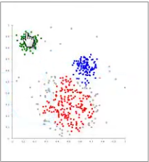

# Kmean
## `1.归类：`
   * 聚类属于非监督学习
   * 无类别标记
## `2.举例：`
   

## `3.K_mean算法`
    1.Cluster 中的经典算法，数据挖掘十大经典算法之一
   
    2.算法接受参数K; 然后将事先输入的N个数据对象划分为K个聚类以便使得获得的聚类满足：
        
        同一聚类中的相似度较高，而不同聚类中的相似度较小。
   
    3.算法思想：
   
        1.适当的选择C个类的初始中心；
        2.在第K次迭代中，对任意一个样本，求其到C各个中心的距离，将该样本归到距离最短的中心所在的类
        3.利用均值等方法，更新该类的中心值
        4.对于所有C个类的聚类中心，如果利用2.3.的迭代法更新后，值保持不变，则迭代结束，否则继续迭代
     
## `4.算法流程`
    输入： K，data[n]:
        1.选择K个初始中心点，例如：C[0] = data[0], C[1] = data[1], ...,C[k-1] = data[k-1]
        2.对于data[0]...data[n],分别与C[0]...C[K-1]比较，假设与C[i]距离最近，则该data就标记为i
        3.对于所有标记为i点，重新计算c[i](用求平均值的方法)
        4.重复2.3.直到所有C[i]的值变化小于给定阈值
        
## `5.算法优缺点`
    优点：速度快，简单
    缺点：最终结果和初始点的选择相关，容易陷入局部最优，需要知道K值（当不知道要分多少类的时候，就不好做聚类）
