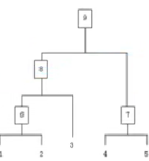

# `8.3聚类（hierarchical clustering），层次聚类`

    假设有n个待聚类样本，对于层次聚类来说，步骤：
        1.（初始化）把每个样本归为一类共n个类，计算每两个类之间的距离，也就是样本与样本之间的相似度；
        2.寻找各个类之间最近的两个类，把他们归为一类（这样类的总数就少了一个）
        3.重新计算这个类与各个旧类之间的相似度；
        4.重复2.3.直到所有样本点都归为一个类，结束
如图所示：

   
   
        整个聚类过程其实是建立了一棵树，在建立的过程中，可以在第二步上设立一个阈值，当最近的两个类的距离大于这个阈值，
    则认为迭代可以终止。另外关键的一步就是第三步，如何判断两个类之间的相似度。
        有一下几个方法：
        
            1.SinglelinKage:又叫nearest-neighbor，就是取两个类中距离最近的两个样本的距离作为这两个类的距离，
        也就是说，最近两个样本之间的距离越小，这两个类之间的相似程度就越大。容易造成一种叫做Chaining的效果，两个类
        明明从大局上看距离较远，但由于其中个别距离较近的点，就被合并在一起了，而且这样的合并之后Chaining效应会进一
        步扩大，最后会得到比较松散的cluster(群；簇；丛；串)
            
            2.ComplateLinkage:这个与SinglelinKage是两个相反的极端，取两个集合中最远的点作为两个集合的距离，
        其效果也是刚好相反，限制非常大，两个 cluster 即使已经非常近了，但是只要有不配合的点存在，就会顽固到底，老死
        不相合并。
            
            这两种相似度的定义方法，可以用在特定的场合，但是都是考虑了特定的数据。
            
            3.Average-linkage:取集合的平均数，来计算两个集合之间的距离。
            
            4.还有一种Average-linkage的变种，取中值，而不是取平均数，这样受到特殊点的影响就会进一步减少。