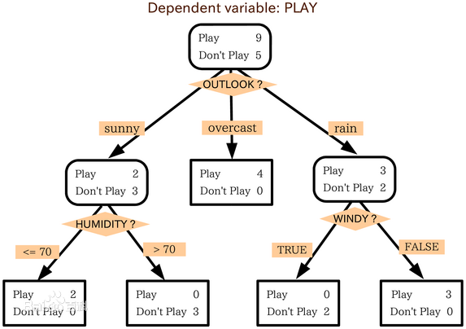
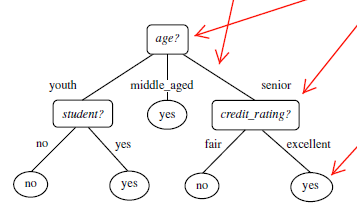

# 决策树 (Decision Tree)

> **核心思想**：通过树形结构模拟决策过程，每个内部节点表示对某个属性的测试，每个分支代表测试结果，叶节点表示分类结果。

## 1. 什么是决策树

决策树是一个类似于流程图的树结构：


- **内部结点**：表示在一个属性上的测试
- **分支**：代表一个属性输出
- **叶结点**：代表类或类分布
- **根结点**：树的最顶层

## 2. 机器学习中分类方法的评估指标

- **准确率** — 分类正确的比例
- **速度** — 训练和预测的速度
- **强壮性** — 对噪声和缺失值的容忍度
- **可规模性** — 处理大数据集的能力
- **可解释性** — 模型的直观理解程度

## 3. 构造决策树的基本算法

### 3.1 熵 (Entropy) 概念

1948年，香农提出了 **信息熵** 的概念：
- 信息量大小与不确定性直接相关
- 变量的不确定性越大，熵也就越大
- 用比特 (bit) 来衡量信息的多少


### 3.2 ID3 算法 (1970-1980, J.Ross. Quinlan)




**信息获取量 (Information Gain)**：
```
Gain(A) = Info(D) - Info_A(D)
```
通过属性 A 作为节点分类能获取多少信息。

#### 算法步骤：
1. 树以代表训练样本的单个结点开始
2. 如果样本都在同一个类，该结点成为树叶
3. 否则，使用信息增益选择能够最好地将样本分类的属性
4. 对该属性的每个已知值，创建一个分枝并划分样本
5. 递归地形成每个划分上的样本判定树
6. 停止条件：
   - 所有样本属于同一类
   - 没有剩余属性可进一步划分
   - 分枝没有样本

### 3.3 其他决策树算法

| 算法 | 提出者 | 属性选择度量 |
|------|--------|-------------|
| **ID3** | Quinlan | 信息增益 (Information Gain) |
| **C4.5** | Quinlan | 增益率 (Gain Ratio) |
| **CART** | Breiman et al. | Gini 指数 (Gini Index) |

**共同点**：都是贪心算法，自上而下 (Top-down approach)

### 3.4 如何处理连续性变量

连续属性必须进行离散化处理。

## 4. 树剪枝 (避免过拟合)

### 4.1 先剪枝
在树构建过程中提前停止分裂。

### 4.2 后剪枝
先构建完整的树，再剪掉不可靠的分支。

## 5. 决策树的优点

- ✅ 直观，便于理解，可解释性强
- ✅ 小规模数据集有效
- ✅ 不需要大量数据预处理

## 6. 决策树的缺点

- ❌ 处理连续变量不好
- ❌ 类别较多时，错误增加较快
- ❌ 可规模性一般
- ❌ 容易过拟合（需剪枝）

## 7. Python 实现 (scikit-learn)

### 安装必要的库
```bash
pip install scikit-learn numpy scipy matplotlib
# 可视化需要 Graphviz: http://www.graphviz.org/
```

### 示例代码
```python
from sklearn import tree
# 训练决策树模型
clf = tree.DecisionTreeClassifier()
clf = clf.fit(X_train, y_train)
# 预测
y_pred = clf.predict(X_test)
# 可视化 - 转化 dot 文件至 pdf
# dot -Tpdf iris.dot -o output.pdf
```

### 参考文档
- http://scikit-learn.org/stable/modules/tree.html

---

## 关联

- 与 [[SVM]] 的对比：决策树可解释性强但精度略低，SVM 精度高但可解释性差
- 与 [[Kmeans]] 的关联：决策树是监督学习，Kmeans 是无监督学习
- 与 [[神经网络基础]] 的关联：决策树适合结构化数据，神经网络适合非结构化数据
- 参见 [[层次聚类]] 了解不同类型的机器学习算法
