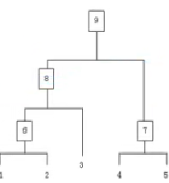

# 层次聚类 (Hierarchical Clustering)

> **核心思想**：通过构建层次树状结构（树状图）逐步合并（自底向上）或分裂（自顶向下）样本，最终形成聚类。

## 1. 算法步骤 (自底向上)

假设有 n 个待聚类样本：

1. **初始化**：把每个样本归为一类，共 n 个类，计算每两个类之间的距离
2. **合并**：寻找各个类之间最近的两个类，归为一类（类别总数减 1）
3. **更新距离**：重新计算新类与各旧类之间的相似度
4. **重复**：重复步骤 2-3，直到所有样本点都归为一个类

> 可以在步骤 2 中设定**阈值**，当最近两个类的距离大于阈值时终止迭代。

整个聚类过程本质上是建立了一棵树（**树状图 / Dendrogram**）。

## 2. 类间距离度量方法

### 2.1 Single Linkage (最近邻)
取两个类中**距离最近**的两个样本的距离作为类间距离。

- ⚡ 优点：能发现非凸形状的聚类
- ⚠️ 缺点：容易产生 **Chaining 效应** — 两个实际上距离较远的类因为个别近点而被合并

### 2.2 Complete Linkage (最远邻)
取两个集合中**最远**的点作为类间距离。

- ⚡ 优点：产生紧凑的聚类
- ⚠️ 缺点：对异常点敏感，限制很大

### 2.3 Average Linkage (平均距离)
取集合的**平均数**来计算两个集合之间的距离。

- 效果介于 Single 和 Complete 之间
- 受特殊点的影响较小

### 2.4 Median Linkage (中值距离)
取集合的**中位数**，而不是平均数。

- 受特殊点的影响进一步减少

## 3. 优缺点

### 优点
- ✅ **不需要指定 K 值** — 通过树状图可以灵活选择聚类层级
- ✅ 能发现层次化的聚类结构
- ✅ 适合任意形状的聚类
- ✅ 结果可视化好（树状图）

### 缺点
- ❌ 计算复杂度高（O(n³)）
- ❌ 不适合大规模数据集
- ❌ 合并操作不可撤销（一旦合并无法拆分）
- ❌ 对噪声和异常点敏感

## 4. 适用场景

- 基因序列分析
- 社交网络分析
- 文档层次分类
- 客户细分（需要层次结构时）

## 5. K-Means vs 层次聚类

| 特性 | K-Means | 层次聚类 |
|------|---------|---------|
| 是否需要指定 K | ✅ 需要 | ❌ 不需要 |
| 计算复杂度 | O(n) | O(n²) ~ O(n³) |
| 聚类形状 | 凸形 | 任意形状 |
| 可解释性 | 一般 | 好（树状图） |
| 大数据适用性 | ✅ 适用 | ❌ 不适用 |

---

## 关联

- 与 [[Kmeans]] 的对比：层次聚类不需要指定 K，但速度慢；Kmeans 需要指定 K，速度快
- 与 [[SVM]] 的关联：层次聚类是无监督学习，SVM 是监督学习
- 与 [[DecisionTree]] 的关联：决策树和层次聚类都产生树形结构，但目的不同
- 参见 [[神经网络基础]] 了解神经网络如何处理聚类任务
