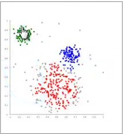

# K-Means 聚类

> **核心思想**：将 N 个数据对象划分为 K 个聚类，使同一聚类中的对象相似度较高，不同聚类中的对象相似度较小。

## 1. 归类

- **聚类 (Clustering)** 属于 **非监督学习 (Unsupervised Learning)**
- 数据 **无类别标记**，需要算法自动发现结构

## 2. K-Means 算法

K-Means 是 **Cluster 中的经典算法**，**数据挖掘十大经典算法之一**。

### 算法参数
- **K**: 要划分的聚类数量
- **data[n]**: N 个数据对象

### 算法思想
1. 适当选择 C 个类的初始中心
2. 在第 K 次迭代中，对任意一个样本，求其到 C 个中心的距离，将该样本归到距离最短的中心所在的类
3. 利用均值等方法，更新该类的中心值
4. 对于所有 C 个类的聚类中心，如果迭代更新后值保持不变，则迭代结束，否则继续迭代

### 算法流程
```
输入: K, data[n]

1. 选择 K 个初始中心点:
   C[0] = data[0], C[1] = data[1], ..., C[K-1] = data[K-1]

2. 对于 data[0]...data[n], 分别与 C[0]...C[K-1] 比较,
   假设与 C[i] 距离最近, 则该 data 标记为 i

3. 对于所有标记为 i 的点, 重新计算 C[i] (求平均值)

4. 重复 2-3 直到所有 C[i] 的值变化小于给定阈值
```

## 3. 优缺点

### 优点
- ✅ **速度快** — 计算简单，收敛快
- ✅ **简单易懂** — 算法直观，容易实现
- ✅ 适合大规模数据集

### 缺点
- ❌ **需要指定 K 值** — 不知道要分多少类时难以选择
- ❌ **初始中心敏感** — 最终结果和初始点的选择相关
- ❌ **容易陷入局部最优**
- ❌ 对噪声和异常点敏感
- ❌ 只适用于凸形聚类

## 4. 适用场景

- 客户分群 (Customer Segmentation)
- 图像压缩
- 文档聚类
- 异常检测
- 作为其他算法的预处理步骤



## 5. 与 KNN 的区别

| 特性 | K-Means | KNN |
|------|---------|-----|
| 学习类型 | **无监督学习** | **监督学习** |
| 目的 | 聚类 | 分类/回归 |
| 是否需要标签 | 不需要 | 需要 |
| K 的含义 | 聚类数 | 邻居数 |

---

## 关联

- 与 [[SVM]] 的关联：SVM 是监督学习，Kmeans 是无监督学习，但都依赖距离度量
- 与 [[层次聚类]] 的对比：Kmeans 需要指定 K，层次聚类不需要；Kmeans 速度更快
- 与 [[DecisionTree]] 的关联：决策树处理监督分类，Kmeans 处理无监督聚类
- 参见 [[神经网络基础]] 了解神经网络如何处理聚类和分类问题
