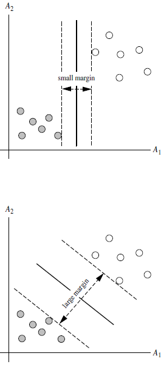
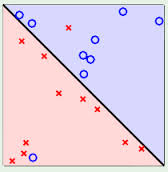
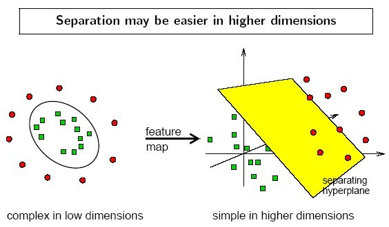
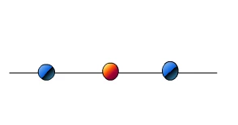
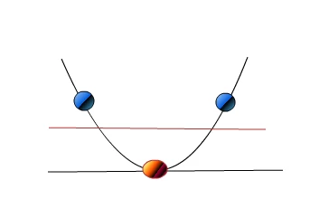

# 支持向量机 (SVM)

> **核心思想**：寻找一个能够最大化分类间隔 (Margin) 的超平面 (Hyperplane)，将不同类别的数据分开，并通过核技巧处理非线性可分问题。

## 1. 背景

- 最早由 **Vladimir N. Vapnik** 和 **Alexey Ya. Chervonenkis** 于 1963 年提出
- 目前的软间隔版本 (Soft Margin) 由 **Corinna Cortes** 和 **Vapnik** 于 1993 年提出，1995 年发表
- **深度学习 (2012) 出现之前**，SVM 被认为机器学习中最成功、表现最好的算法

## 2. 机器学习的一般框架

```
训练集 → 提取特征向量 → 分类器（决策树、KNN、SVM 等） → 得到结果
```

## 3. SVM 基本原理

### 3.1 核心概念
- SVM 寻找能区分两类的超平面，使边际 (margin) 最大
- **Margin**：超平面到两侧最近样本的距离之和
- 超平面到一侧最近点的距离等于到另一侧最近点的距离
- **支持向量 (Support Vectors)**：坐落在边际边界上的样本点

.svg.png)






### 3.2 线性可分 vs 线性不可分

- **线性可分 (Linearly Separable)**：存在一个超平面能将两类完全分开
- **线性不可分 (Linearly Inseparable)**：不存在这样的超平面

## 4. 数学定义

### 4.1 超平面方程
```
W·X + b = 0
```
- **W**: 权重向量 (weight vector)
- **X**: 训练实例
- **b**: 偏置 (bias)

### 4.2 分类决策
- 超平面右上方的点满足：`W·X + b > 0`
- 超平面左下方的点满足：`W·X + b < 0`

### 4.3 最大间隔
最大化边际距离 `2 / ||W||`，等价于最小化 `||W||`


### 4.4 决定边界 (Decision Boundary)
通过 KKT 条件和拉格朗日公式，最终分类决策边界表示为：
```
f(X) = Σ(α_i · y_i · X_i^T · X) + b_0
```
其中 `α_i` 和 `b_0` 由优化算法得出，只有支持向量的 `α_i` 不为 0。


## 5. SVM 算法特性

### 5.1 Soft Margin (软间隔)
- 引入松弛变量允许部分样本被错误分类
- 平衡最大化间隔和最小化分类错误

### 5.2 核心特性
1. **训练好的模型的算法复杂度由支持向量的个数决定**，而非数据维度 → 不容易过拟合
2. SVM 训练出来的模型完全依赖于支持向量，非支持向量点被去除后重复训练仍得到相同结果
3. 支持向量个数越小，模型越容易被泛化

## 6. 线性不可分与核技巧 (Kernel Trick)

### 6.1 解决思路
1. 利用非线性映射把原始数据转化到**更高维度**的空间
2. 在高维空间中找一个线性的超平面来处理








### 6.2 核函数 (Kernel Functions)
核函数用来取代计算非线性映射函数的内积，大幅降低计算复杂度：

| 核函数 | 公式 | 适用场景 |
|--------|------|---------|
| **多项式核** (Polynomial) | `K(x,y) = (x·y + 1)^h` | — |
| **高斯径向基核** (RBF) | `K(x,y) = exp(-||x-y||²/2σ²)` | 图像分类等 |
| **Sigmoid 核** | `K(x,y) = tanh(κx·y - δ)` | — |

### 6.3 核函数选择
- 根据先验知识选择，如图像分类通常使用 RBF
- 尝试不同的 kernel，根据结果准确度决定

## 7. 多类别分类

- 采用 **One-vs-Rest** 策略：对于每个类别，构建一个当前类与其他类的二类分类器

## 8. 应用实例：人脸识别

```python
from time import time
import logging
import matplotlib.pyplot as plt
from sklearn.cross_validation import train_test_split
from sklearn.datasets import fetch_lfw_people
from sklearn.grid_search import GridSearchCV
from sklearn.metrics import classification_report, confusion_matrix
from sklearn.decomposition import RandomizedPCA
from sklearn.svm import SVC

# 加载数据
lfw_people = fetch_lfw_people(min_faces_per_person=70, resize=0.4)
n_samples, h, w = lfw_people.images.shape
X = lfw_people.data
y = lfw_people.target
target_names = lfw_people.target_names

# 划分训练集和测试集
X_train, X_test, y_train, y_test = train_test_split(X, y, test_size=0.25)

# PCA 降维
n_components = 150
pca = RandomizedPCA(n_components=n_components, whiten=True).fit(X_train)
X_train_pca = pca.transform(X_train)
X_test_pca = pca.transform(X_test)

# SVM 分类器 + 网格搜索调参
param_grid = {'C': [1e3, 5e3, 1e4, 5e4, 1e5],
              'gamma': [0.0001, 0.0005, 0.001, 0.005, 0.01, 0.1]}
clf = GridSearchCV(SVC(kernel='rbf', class_weight='auto'), param_grid)
clf = clf.fit(X_train_pca, y_train)

# 预测评估
y_pred = clf.predict(X_test_pca)
print(classification_report(y_test, y_pred, target_names=target_names))
```

## 9. 优缺点

### 优点
- ✅ 高维空间表现优秀
- ✅ 不容易过拟合（由支持向量决定）
- ✅ 泛化能力强
- ✅ 可以处理非线性问题（核技巧）

### 缺点
- ❌ 对参数和核函数选择敏感
- ❌ 训练时间随样本量增加显著增长
- ❌ 不直接提供概率估计
- ❌ 对缺失数据敏感

## 10. 适用场景

- 文本分类
- 图像识别
- 生物信息学（如基因分类）
- 手写识别
- 人脸识别

---

## 关联

- 与 [[DecisionTree]] 的对比：SVM 精度高但可解释性差，决策树可解释性强
- 与 [[神经网络基础]] 的关联：SVM 是 2012 年前最成功的算法，深度学习兴起后逐渐被 NN 取代部分场景
- 与 [[Kmeans]] 的关联：SVM 是监督学习，Kmeans 是无监督学习；但 SVM 和 Kmeans 都依赖距离/相似度度量
- 参见 [[层次聚类]]
