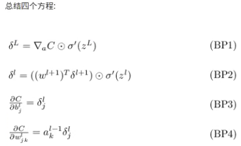
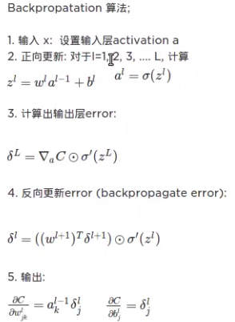
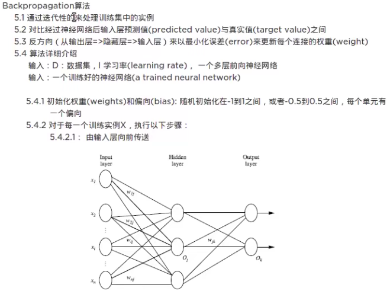
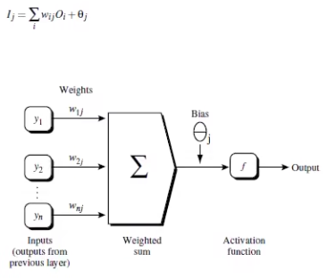
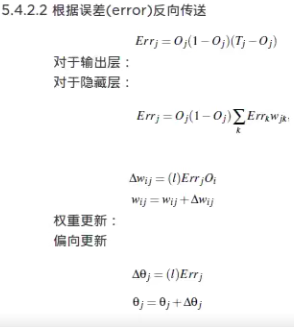
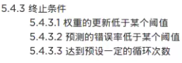
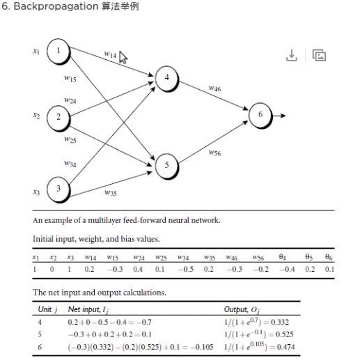
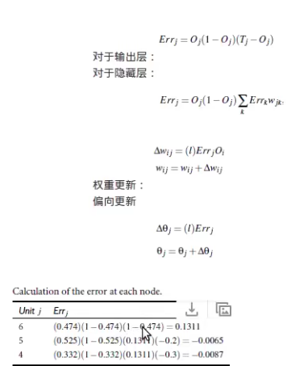
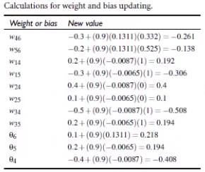

# 反向传播 (Backpropagation)

> **核心思想**：通过迭代性地处理训练集实例，对比神经网络输出层的预测值与真实值之间的误差，然后反方向（从输出层 → 隐藏层 → 输入层）以最小化误差来更新每个连接的权重。

## 1. 算法概述

- **Backpropagation** 是最著名的神经网络训练算法（1980 年）
- 被使用在**多层前向神经网络**上
- 通过迭代性地处理训练集中的实例来学习

## 2. 算法详细流程

### 输入
- **D**: 数据集
- **l**: 学习率 (learning rate)
- 一个多层前向神经网络

### 输出
- 一个训练好的神经网络 (a trained neural network)

### 步骤

#### 2.1 初始化
- **权重 (Weights)** 和 **偏向 (Bias)**: 随机初始化（-1 到 1 之间，或 -0.5 到 0.5 之间）
- 每个单元有一个偏向

#### 2.2 前向传播 (Forward Pass)
对于每一个训练实例 X：

1. 由输入层向前传送
2. 计算每层的加权和
3. 通过激活函数转换输出

数学表达：
```
I_j = Σ(w_ij · O_i) + θ_j    (加权求和)
O_j = 1 / (1 + e^(-I_j))     (Sigmoid 激活函数)
```

#### 2.3 反向传播 (Backward Pass)

**对于输出层**：
```
Err_j = O_j · (1 - O_j) · (T_j - O_j)
```
其中 T_j 是真实值，O_j 是预测值

**对于隐藏层**：
```
Err_j = O_j · (1 - O_j) · Σ(Err_k · w_jk)
```

**权重更新**：
```
Δw_ij = l · Err_j · O_i
w_ij = w_ij + Δw_ij
```

**偏向更新**：
```
Δθ_j = l · Err_j
θ_j = θ_j + Δθ_j
```

#### 2.4 终止条件
1. 权重的更新低于某个阈值
2. 预测的错误率低于某个阈值
3. 达到预设的循环次数

## 3. 数学解析


*反向传播的数学基础*

## 4. 算法流程


*算法流程概览*

### 详细流程图示






## 5. 手动计算举例




*通过手动例子理解反向传播的计算过程*

## 6. 优缺点

### 优点
- ✅ 理论清晰，数学基础坚实
- ✅ 能够训练多层神经网络
- ✅ 适合大规模数据

### 缺点
- ❌ 可能收敛到局部最优
- ❌ 对初始权重敏感
- ❌ 梯度消失问题（浅层网络梯度很小）
- ❌ 训练时间较长

## 7. 适用场景

- 所有神经网络的训练过程
- 模式识别
- 分类与回归问题

## 8. 参考实现

- Python 2.7：https://github.com/mnielsen/neural-networks-and-deep-learning.git
- Python 3.5：https://github.com/MichalDanielDobrzanski/DeepLearningPython35.git

---

## 关联

- [[神经网络基础]] 是反向传播的应用载体，两者密不可分
- 要理解反向传播，先熟悉 [[神经网络基础]] 中的前向传播结构
- 与 [[SVM]] 的对比：反向传播是神经网络的训练算法，SVM 是独立的分类器
- 参见传统机器学习算法：[[DecisionTree]]、[[Kmeans]]、[[层次聚类]]
