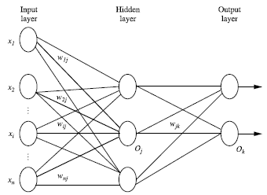
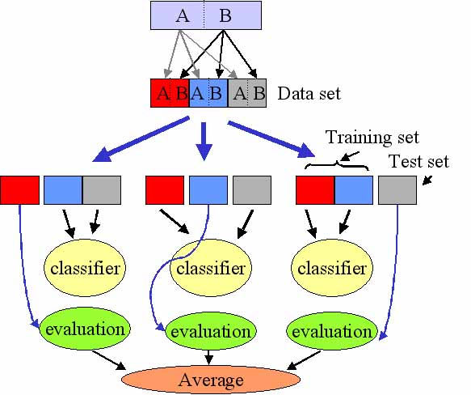

# 神经网络基础 (Neural Networks)

> **核心思想**：模仿人脑神经元的连接结构，通过多层非线性变换从数据中学习复杂模式，理论上只要有足够的隐藏层和训练数据，就可以模拟任何函数。

## 1. 背景

- 以人脑中的神经网络为启发，历史上出现过很多不同版本
- 最著名的算法是 1980 年的 **Backpropagation (反向传播)**

关于反向传播的详细内容见 [[反向传播]]。

## 2. 多层前向神经网络

多层前向神经网络由以下部分组成：

```
输入层 (Input Layer) → 隐藏层 (Hidden Layers) → 输出层 (Output Layers)
```

### 基本概念
- **每层由单元 (Units) 组成** — 也称为神经结点
- **输入层**：接收训练集的特征向量
- **隐藏层**：可以有一个或多个，提取中间特征
- **输出层**：输出最终的预测结果
- **权重 (Weight)**：连接结点的参数
- 一层的输出是下一层的输入

> **注意**：通常所说的"2 层神经网络"意味着 1 个隐藏层 + 1 个输出层，输入层不计入层数。



### 理论基础
- 一层中加权的求和，然后根据**非线性方程**转化输出
- 理论上，如果有足够多的隐藏层和足够大的训练集，可以模拟出任何方程

## 3. 设计神经网络结构

### 3.1 输入层设计
- 特征向量通常被**标准化 (Normalize)** 到 0 和 1 之间（为了加速学习过程）
- **离散型变量**可以被编码：每个输入单元对应一个特征值的可能取值
  - 特征值 A 可取 (a₀, a₁, a₂) → 使用 3 个输入单元
  - A=a₀ → 代表 a₀ 的单元值为 1，其他为 0

### 3.2 输出层设计
- 二分类问题：用 1 个输出单元表示（0 和 1 分别代表两类）
- 多分类问题：每个类别用一个输出单元表示

### 3.3 隐藏层设计
- 没有明确的规则来设计最好有多少个隐藏层
- 通过实验测试、误差分析和准确度来改进

### 3.4 交叉验证 (Cross-Validation)

**K-Fold Cross Validation**：将数据分成 K 份，轮流使用 K-1 份训练，1 份验证，评估模型稳定性。



## 4. 神经网络的应用

### 4.1 非线性激活函数 (Activation Functions)

**Sigmoid 函数 (S 曲线)** 用于激活函数：
- **双曲正切函数 (tanh)**：输出范围 [-1, 1]
- **逻辑函数 (Logistic)**：输出范围 [0, 1]

### 4.2 简单神经网络实现

```python
import numpy as np

def tanh(x):
    return np.tanh(x)

def tanh_deriv(x):
    return 1.0 - np.tanh(x) * np.tanh(x)

def logistic(x):
    return 1 / (1 + np.exp(-x))

def logistic_derivative(x):
    return logistic(x) * (1 - logistic(x))


class NeuralNetwork:
    def __init__(self, layers, activation='tanh'):
        """
        :param layers: A list containing the number of units in each layer.
        Should be at least two values
        :param activation: 'logistic' or 'tanh'
        """
        if activation == 'logistic':
            self.activation = logistic
            self.activation_deriv = logistic_derivative
        elif activation == 'tanh':
            self.activation = tanh
            self.activation_deriv = tanh_deriv

        self.weights = []
        for i in range(1, len(layers) - 1):
            self.weights.append(
                (2 * np.random.random((layers[i - 1] + 1, layers[i] + 1)) - 1) * 0.25)
            self.weights.append(
                (2 * np.random.random((layers[i] + 1, layers[i + 1])) - 1) * 0.25)

    def fit(self, X, y, learning_rate=0.2, epochs=10000):
        X = np.atleast_2d(X)
        temp = np.ones([X.shape[0], X.shape[1] + 1])
        temp[:, 0:-1] = X  # adding the bias unit to the input layer
        X = temp
        y = np.array(y)

        for k in range(epochs):
            i = np.random.randint(X.shape[0])
            a = [X[i]]

            for l in range(len(self.weights)):
                a.append(self.activation(
                    np.dot(a[l], self.weights[l])))
            error = y[i] - a[-1]
            deltas = [error * self.activation_deriv(a[-1])]

            # backpropagation
            for l in range(len(a) - 2, 0, -1):
                deltas.append(deltas[-1].dot(
                    self.weights[l].T) * self.activation_deriv(a[l]))
            deltas.reverse()
            for i in range(len(self.weights)):
                layer = np.atleast_2d(a[i])
                delta = np.atleast_2d(deltas[i])
                self.weights[i] += learning_rate * layer.T.dot(delta)

    def predict(self, x):
        x = np.array(x)
        temp = np.ones(x.shape[0] + 1)
        temp[0:-1] = x
        a = temp
        for l in range(0, len(self.weights)):
            a = self.activation(np.dot(a, self.weights[l]))
        return a
```

### 4.3 XOR 问题测试

```python
from NeuralNetwork import NeuralNetwork
import numpy as np

nn = NeuralNetwork([2, 2, 1], 'tanh')
X = np.array([[0, 0], [0, 1], [1, 0], [1, 1]])
y = np.array([0, 1, 1, 0])
nn.fit(X, y)
for i in [[0, 0], [0, 1], [1, 0], [1, 1]]:
    print(i, nn.predict(i))
```

### 4.4 手写数字识别

```python
import numpy as np
from sklearn.datasets import load_digits
from sklearn.metrics import confusion_matrix, classification_report
from sklearn.preprocessing import LabelBinarizer
from NeuralNetwork import NeuralNetwork
from sklearn.cross_validation import train_test_split

digits = load_digits()
X = digits.data
y = digits.target
X -= X.min()  # normalize to range 0-1
X /= X.max()

nn = NeuralNetwork([64, 100, 10], 'logistic')
X_train, X_test, y_train, y_test = train_test_split(X, y)
labels_train = LabelBinarizer().fit_transform(y_train)
labels_test = LabelBinarizer().fit_transform(y_test)

print("start fitting")
nn.fit(X_train, labels_train, epochs=3000)

predictions = []
for i in range(X_test.shape[0]):
    o = nn.predict(X_test[i])
    predictions.append(np.argmax(o))

print(confusion_matrix(y_test, predictions))
print(classification_report(y_test, predictions))
```

## 5. 优缺点

### 优点
- ✅ 可以模拟任意非线性函数（万能近似定理）
- ✅ 适合大规模数据，数据量越大效果越好
- ✅ 适用于图像、文本、语音等非结构化数据
- ✅ 特征自动提取，不需要手工特征工程

### 缺点
- ❌ 需要大量数据进行训练
- ❌ 训练时间长，计算资源需求高
- ❌ 可解释性差（"黑盒"模型）
- ❌ 容易过拟合，需要正则化
- ❌ 超参数多，调参困难

## 6. 适用场景

- 图像识别与分类
- 语音识别
- 自然语言处理
- 推荐系统
- 游戏 AI
- 自动驾驶

---

## 关联

- [[反向传播]] 是神经网络训练的核心算法
- 与 [[SVM]] 的对比：深度学习（2012）出现后，神经网络逐渐取代 SVM 成为主流，但 SVM 在小样本和高维数据上仍有优势
- 与 [[DecisionTree]] 的关联：神经网络适合非结构化数据，决策树适合结构化表格数据
- 与 [[Kmeans]] 的关联：神经网络可处理聚类任务（如自编码器），但与传统 Kmeans 无直接竞争关系
- 参见传统机器学习算法 [[SVM]]、[[DecisionTree]]、[[Kmeans]]、[[层次聚类]]
