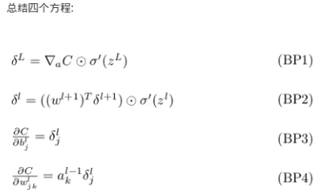
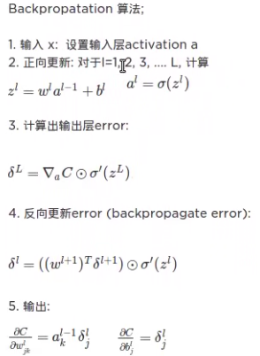
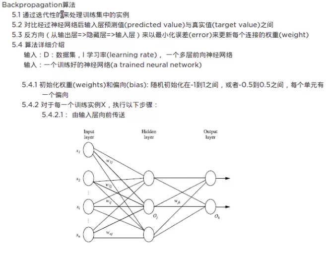
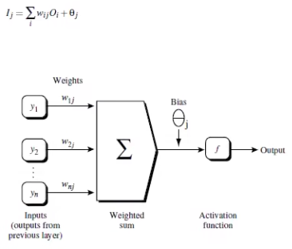
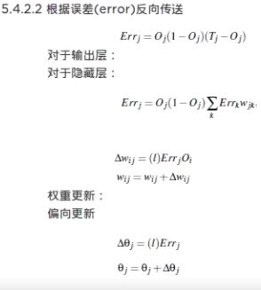
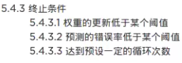
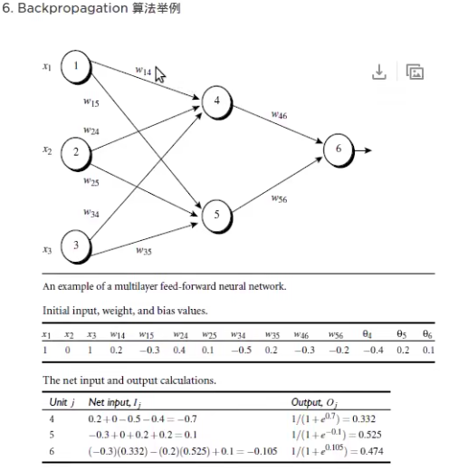
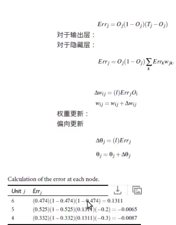
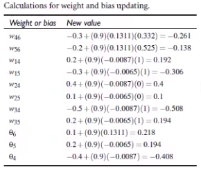

# 反向传播

### `数学解析：`

### `算法流程：`

### `详情介绍：`

### `手动计算举例：`

### `详细实现代码:`
    可以见 04_NN
    或者查看网络网上的代码:
        python2.7： https://github.com/mnielsen/neural-networks-and-deep-learning.git
        python3.5:  https://github.com/MichalDanielDobrzanski/DeepLearningPython35.git        