强化学习推荐图书项目:[项目名为:easy-lr, 书籍名为:蘑菇书](https://github.com/datawhalechina/easy-rl/tree/master)

## 一、什么是强化学习（Reinforcement Learning, RL）

**强化学习是一种机器学习范式**，核心思想是：
 👉 **让智能体（Agent）通过与环境（Environment）交互，在试错中学习如何做决策，以最大化长期奖励（Reward）。**

它通常由几个关键组成部分构成：

| 组成          | 含义                                           |
| ------------- | ---------------------------------------------- |
| Agent         | 做决策的主体，比如机器人、游戏AI、自动驾驶系统 |
| Environment   | Agent 所处的外部世界                           |
| State (状态)  | 当前环境情况                                   |
| Action (动作) | Agent 可执行的行为                             |
| Reward (奖励) | 环境对行为的反馈信号                           |
| Policy (策略) | 决策规则：在某状态下该做什么                   |

### 一个直观例子

假设训练一只小狗：

- 状态：小狗看到主人是否拿着食物
- 动作：坐下 / 乱跳
- 奖励：
  - 坐下 → 给零食（正奖励）
  - 乱跳 → 不理（负奖励）

小狗会逐渐学到：

> 在某些状态下执行某个动作 → 奖励更高 → 更可能再次执行

这就是强化学习的核心机制。

## 二、强化学习和其他机器学习的区别

强化学习和常见两种学习方式差别很大：

| 学习方式   | 数据来源     | 学习方式                 |
| ---------- | ------------ | ------------------------ |
| 监督学习   | 有标准答案   | 直接拟合输入到输出       |
| 无监督学习 | 没有标签     | 发现数据结构             |
| 强化学习   | 没有标准答案 | 通过奖励信号探索最优策略 |

例如：

- 图像分类 → 监督学习
- 聚类分析 → 无监督学习
- 下棋 / 游戏 / 机器人控制 → 强化学习

## 三、为什么需要强化学习

强化学习主要解决 **“序列决策问题”**，这是传统机器学习很难处理的。

### 1️⃣ 许多问题没有明确正确答案

比如：

- 自动驾驶如何规划路线
- 机器人如何行走
- 游戏 AI 如何取胜

这些问题：

- 没有标准标签
- 结果取决于连续决策

强化学习可以通过：

> 尝试 → 获得反馈 → 改进策略

### 2️⃣ 目标是长期收益，而不是单步正确

监督学习通常只关心当前预测是否正确。
 强化学习关注：

> 当前动作是否有利于未来整体收益最大化

例如下棋：

- 走一步可能暂时吃亏
- 但能为后面胜利铺路

### 3️⃣ 需要与环境交互

很多现实问题：

- 环境是动态的
- 数据不是固定数据集
- 必须通过行动收集数据

例如：

- 机器人学习抓取
- 推荐系统在线优化
- 游戏 AI 自我对弈

### 4️⃣ 适合复杂控制问题

强化学习擅长：

- 连续动作控制
- 多阶段决策
- 高维状态空间

## 四、为什么要对 LLM 用强化学习

大语言模型本身训练方式：

- **预训练**：用海量文本做自回归预测（监督学习），目标是预测下一个词
- **问题**：
  - 生成文本可能“正确但不符合人类偏好”
  - 可能出现不安全或不合适的回答
  - 难以对话、遵循指令、满足具体需求

强化学习的作用：

- 利用**人类反馈**调整模型策略
- 优化模型输出 **符合人类偏好或任务目标**
- 不依赖标准标签，而是通过“奖励信号”优化策略

## 五、LLM 的强化学习流程（RLHF）概览

整体流程可分为三步：

### **步骤 1：训练奖励模型（Reward Model, RM）**

1. 收集数据：
   - 人类标注者给模型生成的不同回答打分或排序
   - 例如：给两个回答 A 和 B，标注者选择哪个更好
2. 训练奖励模型：
   - 输入：模型生成的回答 + 上下文
   - 输出：一个“奖励分数”
   - RM 能预测哪种回答更符合人类偏好

> 奖励模型本质上把人类偏好转化为可量化的奖励函数

$$
R(\text{response})
$$

### **步骤 2：初始化策略模型（Policy Model）**

- 策略模型就是你想优化的 LLM
- 一般会用预训练模型（如 GPT、LLaMA 等）作为基础
- 目标：在给定上下文下生成回答，使奖励最大化

### **步骤 3：强化学习优化策略（Policy Optimization）**

## 六、LLM强化学习算法演进之路

$$
MC->TD->Q-Learning->DQN->PG->AC->TRPO->PPO->DPO->GRPO
$$

#### 其演进思路

```
第一阶段：值函数路线		 (MC → TD → Q-learning → DQN)		RL早期探索
	|					目标：👉 学 Q / V						|
	▼														   ▼
第二阶段：策略梯度路线		(PG → Actor-Critic → TRPO → PPO)	RL工业成熟
	|					目标：👉 稳定优化 policy				  |
	▼														   ▼
第三阶段：偏好学习时代		(PPO → DPO → GRPO)					Alignment范式革命  ->  GRPO时代 = LLM RL工程优化
						目标：👉 直接优化人类偏好
							 👉 减少 RL 复杂度
```

#### 演进方向

```
降低方差	   MC → TD → AC → GAE → GRPO
提升稳定性     PG → TRPO → PPO → KL 控制系列
降低训练复杂度  RLHF → DPO
```

#### 演化哲学

```
Value-based RL
        ↓
Policy Gradient RL
        ↓
Trust Region RL
        ↓
Preference Optimization
```

  ## 七、强化学习理论基础

### 1.0)马尔科夫链

首先我们需要明确，强化学习的任务是什么？

​	这用大白话说：就是我们希望用强化学习的方式，使某个**东西**获得**独立自主地完成某种任务**的能力。

而这个**东西，**我们称为**智能体**。而智能体学习和工作的地方，我们就称为**环境**。

> [!note]
>
> 所谓独立自主，就是智能体一旦启动，就不需要人指挥了。

如:

​	说扫地机器人打开开关，就不需要人类告诉机器人哪里有灰尘，哪里有垃圾，自己就会去清理了；

​	自动驾驶汽车在导航设置好之后，就不再需要司机去操作，汽车能够自己安全到达目的地。

但我们应该怎样才能让智能体学会技能呢？

和我们研究其他的问题一样，我们首先需要把问题抽象称为模型。我们才能在这个模型进行实验和探索后，再把结果运用到实际当中去。

**马可洛夫链**，就是对现实世界抽象的一个模型。因而马尔科夫链被广泛使用在各个领域，当然也包括我们讨论的强化学习领域。本专栏中提到的几乎所有的算法，都是基于马可洛夫链这个模型。我们必须了解问题是什么，才能更好解决问题。

在强化学习中，马尔科夫链的经典表达图例这样的。

 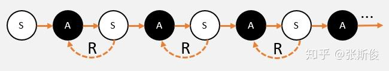

在马尔科夫链中，有三个重要的元素：S，A，R。我们分别来看一下，他们代表的是什么。然后大家就会明白，为什么马尔科夫链是一个很好很常用的模型。

#### <u>**S（state）状态，在图中用白色圈圈表示。**</u>

**状态**就是智能体**观察**到的当前环境的**部分或者全部特征**。

**举个例子：**

​	1. 无人驾驶汽车来到十字路口。和人类一样，它需要先“观察”这个路口的情况，再决定一下步的"动作"。

​	2. 无人驾驶汽车通过摄像头，可以观察到交通标志、交通信号灯等情况；通过雷达，可以探测到与其他汽车、行人的距离；通过导航系统，了解前方的路段是否通畅等等。这些被观察到的环境特征，就是无人驾驶汽车的**状态特征**， **[状态空间](https://zhida.zhihu.com/search?content_id=112401105&content_type=Article&match_order=1&q=状态空间&zhida_source=entity)**就是智能体能够观察到的特征数量。

**需要特别注意的是：**

​	环境的特征可能有许多，但只有智能体能够观察到的特征才算是状态。所以我们也用Observation（观察的英文）表示状态。

为什么要强调被观察呢？

1. 这提醒我们要给智能体最有用的特征；因为在实际工作中，输入特征往往是很“贵”的，无人驾驶汽车的摄像头，雷达通常都是很昂贵的。而无用的特征，例如是否有乘客在唱歌之类的，输入到自动驾驶系统，这无疑加重了学习的负担。所以，我们必须非常慎重地选择状态特征。
2. 提醒我们要注意观察的角度。假设我们学有所成，希望做一个智能体学习如何打德州扑克。你就会突然发现，这个状态很微妙。因为对于每位玩家，都只看到自己的牌和公关牌，所以观察到的状态都是不一样的。

但在新手期，我们会把重点放在算法中，大家在实际工作中留个心眼就好。

#### <u>**A（action）动作（用黑色圈圈表示）**</u>

动作其实不用解释，就是智能体做出的具体行为。

例如:

​	扫地机器人会移动，吸尘，甚至喷水。

​	无人驾驶汽车能够移动，加速，刹车，转弯等。

**[动作空间](https://zhida.zhihu.com/search?content_id=112401105&content_type=Article&match_order=1&q=动作空间&zhida_source=entity)**就是该智能体能够做出的动作数量。

举个例子：

​	智能体身处十字路口。那么我们的方向就有4个。也就是说，我们能做的动作，就是4个。我们称我们能做的动作的集合，称为动作空间

#### <u>**R（reward）[奖励](https://zhida.zhihu.com/search?content_id=112401105&content_type=Article&match_order=1&q=奖励&zhida_source=entity)**</u>

当我们在某个状态下，完成动作。环境就会给我们反馈，告诉我们这个动作的效果如何。这种效果的数值表达，就是**奖励**。

其实这里的reward翻译为“反馈”可能更合适一点。因为**反馈并不是完全正面的，也有负面。**（但为了和其他文献统一，方便大家学习，这里仍然写作“奖励”） 当奖励可以是正数，表示鼓励当前的行为；如果是负数负数，表示惩罚这种行为。当然也可以是0。 而奖励值的大小，表示鼓励的和惩罚的力度不同。

奖励在强化学习中，起到了很关键的作用，我们会以奖励作为引导，让智能体学习做能获得**最多奖励**的动作。

**例如：**

​	我需要训练机器人打乒乓球。机器人每次赢球，都可以加分；输球，就减分。这分数就表现了机器人的动作好坏。如果机器人希望获得更多的分数，就需要想办法赢球。

​	无人驾驶汽车如果成功到达目标地点，那么可以获得奖励；但如果闯红灯，那么就会被扣除大量的奖励作为惩罚。如果无人驾驶汽车希望获得更多的分数，那么就必须在遵守交通规则的情况下，成功到达目标地点。

**重点：**

​	奖励的设定是**主观**的，也就是说我们为了智能体更好地学习工作，自己定的。所以大家可以看到，很多时候我们会对奖励进行一定的修正，这也是加速智能体学习的方法之一。

**现在我们来总结一下马尔科夫链，其中也包含了强化学习的一般步骤：**

1. 智能体在环境中，观察到状态(S)；
2. 状态(S)被输入到智能体，智能体经过计算，选择动作(A);
3. 动作(A)使智能体进入另外一个状态(S)，并返回奖励(R)给智能体。
4. 智能体根据返回，调整自己的[策略](https://zhida.zhihu.com/search?content_id=112401105&content_type=Article&match_order=1&q=策略&zhida_source=entity)。 重复以上步骤，一步一步创造马尔科夫链。

所以你看，强化学习跟教孩子是一个道理: 孩子做了好事，必须给奖励；孩子做错事了，必须惩罚。就这么简单！

#### 马可洛夫‘链’,真的是链吗?

**从现在向过去看:**

​	是一条确定的路径。先是什么状态, 触发了什么动作, 到达了什么新的状态,获得了什么奖励

**从现在向未来看:**

​	并不是一条路径，而是充满了各种“不确定性”。不应该叫做‘**链**’而应该叫马可洛夫‘**树**’

​	马尔科夫链之所以是我们现在看到的一条链条。是因为我们站在现在，往**后**看，所以是一条确定的路径。但如果我们往**前**看，就并不是一条路径，而是充满了各种“不确定性”。

这就像我们从家里到公司上班，中间有若干种上班的方式。现在你从家里出门，走过了两个路口，到了公交车站。 这时候往后看，从家到公交车站这一路，只能有一条路径。虽然你可以走其他路到公交车站，但这是你走过的路，已经确定下来了，所以路径只有一条；但如果往前看，从公交车坐车到公司，还有很多种方式到达，向前展开的是各种不确定性。

**不确定的原因:**

不确定性来自两个方面：

​	1.智能体的行动选择（策略）。

​	2.环境的不确定性。

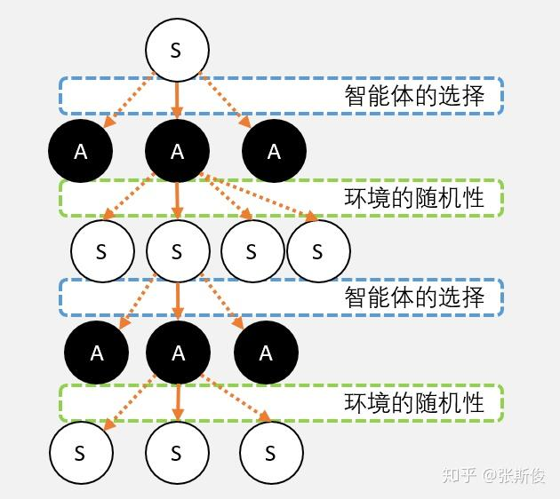

马可洛夫告诉我们： 

​	当智能体从一个状态S，选择动作A，会进入另外一个状态S'；同时，也会给智能体奖励R。 奖励既有正，也有负。正代表我们鼓励智能体在这个状态下继续这么做；负得话代表我们并不希望智能体这么做。 在强化学习中，我们会用奖励R作为智能体学习的引导，期望智能体获得尽可能多的奖励。

但更多的时候，我们并不能单纯通过R来衡量一个动作的好坏。来看下面一个例子：

​	假设，10天之后进行期末考试，我们今天有两个选择： 

​		放弃吧，我们玩游戏！我们每天可以获得+1心情值； 

​		决心努力一搏，我们开始学习吧！每天我们-2心情值。

​	从这10天看，我们肯定是选择【1.玩游戏】。因为10天后，我们虽然考试没过，但至少收获10天的快乐。

​	但事实上，我们再看远一点： - 因为挂科，接受老师怒吼攻击！心情值马上减5； - 父母因为我考得好成绩，给了更多的零用钱。心情值加200点。

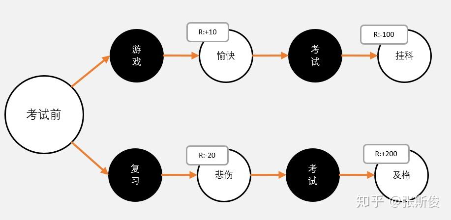

所以，假设我们能预知未来，我们一定会选择【2.去复习】

因此，我们必须用长远的眼光来看待问题。我们要把未来的奖励也计算到当前状态下，再进行决策。

#### 更复杂得未来

但在实际情况中，比我们刚才想想要复杂得多。

我们之前说过，未来是充满不确定性的，不确定性既包含在我们的策略，也包含在环境之中。

也就是说，即使我现在努力学习，我也不能100%保证我我一定考得好成绩。即使有好成绩，父母也不一定会给我更多零用钱。但即使挂科了，老师也不一定大发雷霆。

嗯，好吧。那看上去还是应该及时行乐，选择打游戏！

嗯，学渣永远是学渣，而你的学霸朋友（如果有的话），会先让你算一下：

我们把当前状况再理一下： 

​	 10天后考试，玩游戏1天，心情+1；复习1天，心情-2。10天后，玩游戏心情+10，复习心情-20。

​	 不复习，100%挂科，被老师怒吼：-5点心情

​	  复习，10%挂科，同样被老师怒吼：-5点心情；

​	  80%不挂科，努力终于有回报：+10点心情；

​	  10%不挂科，且得到父母的零用钱 心情暴击+200点。

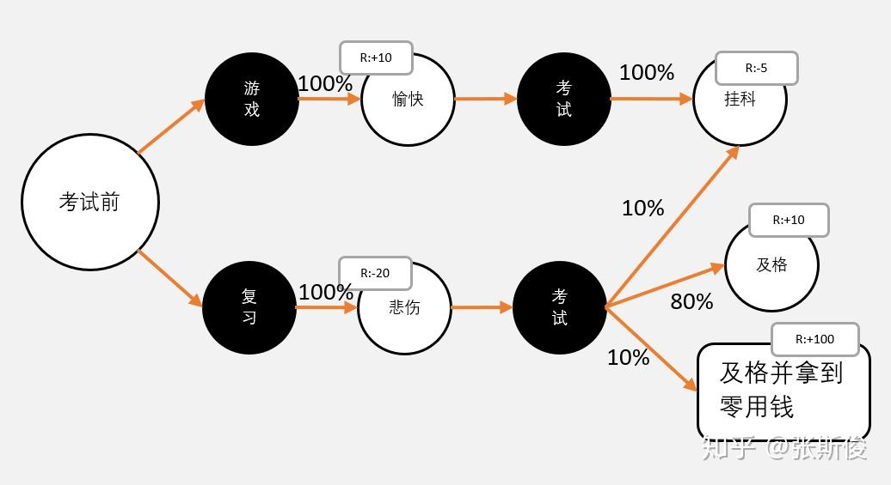

#### 到底复习还是不复习呢?使用数学期望来分析这个问题:

| 抉择次数 | 是否复习        | 结果     | 心情值 | 总计 |
| -------- | --------------- | -------- | ------ | ---- |
| 100      | 否,玩,心情+10   | 挂科-5   | 500    | 500  |
| 10       | 是,复习,心情-10 | 挂科-5   | -250   |      |
| 80       | 是,复习,心情-10 | 及格+10  | -800   | 750  |
| 100      | 是,复习,心情-10 | 优秀+100 | 1800   |      |

所以复习比不复习的数学期望更高

#### Q和V的意义

所以我们在做决策的时候，需要把眼光放远点，把未来的价值换到当前，才能做出选择。

为了方便，我们希望可以有一种方法衡量我做出每种选择价值。这样，我只要看一下标记，以后的事情我也不用理了，我选择那个动作价值更大，就选那个动作就可以了。

也就是说，我们让复习和游戏都有一个标记，这个标记描述了这个动作的价值： - 游戏 +500 - 复习 +750

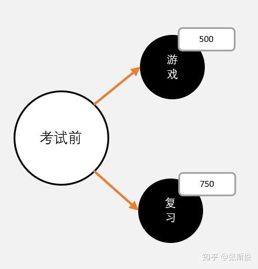

**Q值**:

​	评估**动作**的价值，它代表了智能体选择这个动作后，一直到最终状态**奖励总和**的**期望**

**V值**：

​	评估**状态**的价值, 它代表了智能体在这个状态下，一直到最终状态的**奖励总和**的**期望**。

​	价值越高，表示我从**当前状态**到**最终状态**能获得的**平均奖励**将会越高。因为智能体的目标数是获取尽可能多的奖励，所以智能体在当前状态，只需要选择价值高的动作就可以了。

​	对于Q值和V值的定义非常非常重要。对QV的清晰理解，是理解强化学习中几乎所有算法的基础。为此，我们不妨再用“影分身”大法再梳理一遍。

#### V值的定义

上面的定义理解起来好难，我们用“影分身”大法，理解起来就容易多了

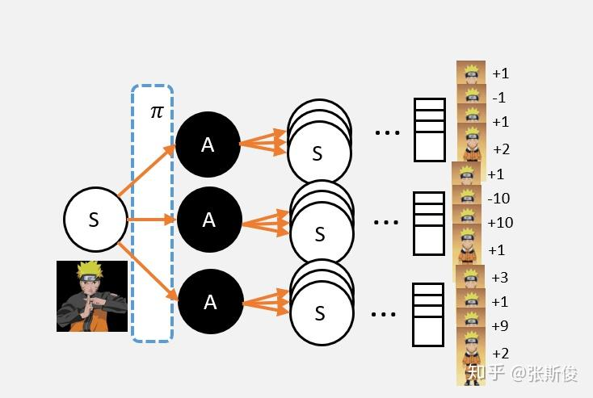

假设现在需要求某状态S的V值，那么我们可以这样：

1. 我们从S点出发，并影分身出若干个自己;
2. 每个分身按照当前的**策略** 选择行为;
3. 每个分身一直走到最终状态，并计算一路上获得的所有**奖励总和**;
4. 我们计算每个影分身获得的**平均值**,这个平均值就是我们要求的V值。

用大白话总结就是：从某个状态，按照策略 ，走到最终状态很多很多次；最终获得奖励总和的平均值，就是V值。

**【敲黑板】** 1. 从V值的计算，我们可以知道，V值代表了这个状态的今后能获得奖励的期望。从这个状态出发，到达最终状态，平均而言能拿到多少奖励。所以我们轻易比较两个状态的价值。 2. V值跟我们选择的策略有很大的关系。 我们看这样一个简化的例子，从S出发，只有两种选择，A1，A2；从A1，A2只有一条路径到最终状态，获得总奖励分别为10和20.

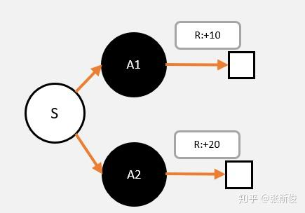

现在我们假设策略 采用平均策略[A1:50%,A2:50%]，根据用影分身(如果是学霸直接求期望)，那么我们可以求得V值为15


现在我们改变策略[A1:60%,A2:40%]，那么我们可以求得V值为14，变少了！


所以大家看到，**V值是会根据不同的策略有所变化的！**

#### Q值的定义

如果大家已经了解V值的定义，那么理解Q值也不会有什么困难。Q值和V值的概念是一致的，都是衡量在马可洛夫树上某一个节点的价值。只不过V值衡量的是状态节点的价值，而Q值衡量的是动作节点的价值。

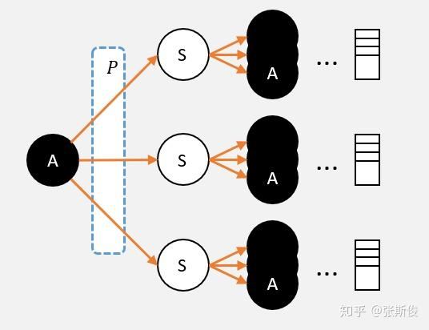

和V值一样，我们也可以用影分身来理解Q值。

现在我们需要计算，某个状态S0下的一个动作A的Q值： 

​	我们就可以从A这个节点出发，使用影分身之术； 

​	每个影分身走到最终状态,并记录所获得的奖励；

​	 求取所有影分身获得奖励的平均值，这个平均值就是我们需要求的Q值。

用大白话总结就是：从某个状态选取动作A，走到最终状态很多很多次；最终获得奖励总和的平均值，就是Q值。

**【敲黑板】** 与V值不同，Q值和策略并没有直接相关，而与环境的状态转移概率相关，而环境的状态转移概率是不变的。

#### V值和Q值关系

总结一下，从以上的定义，我们可以知道Q值和V值的意义相通的： 1. 都是马可洛夫树上的节点； 2. 价值评价的方式是一样的： - 从当前节点出发 - 一直走到最终节点 - 所有的奖励的期望值

所以，聪明的同学已经知道，其实Q和V之间是可以相互换算的。

#### 从Q到V

我们先来看看，怎样用Q值算V值。

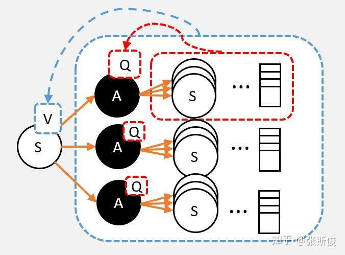

从定义出发，我们要求的V值，就是从状态S出发，到最终获取的所获得的奖励总和的期望值。也就是蓝色框部分。

S状态下有若干个动作，每个动作的Q值，就是从这个动作之后所获得的奖励总和的期望值。也就是红色框部分。

假设我们已经计算出每个动作的Q值，那么在计算V值的时候就不需要一直走到最终状态了，只需要走到动作节点，看一下每个动作节点的Q值，根据策略 ，计算Q的期望就是V值了。

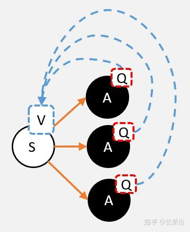

更正式的公式如下：

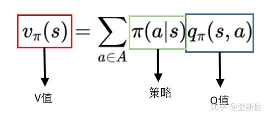

大白话就是：一个状态的V值，就是这个状态下的所有动作的Q值，在策略 下的期望。

#### 从V到Q

现在我们换个角度，看一下怎样从V换算成Q值。

道理还是一样，就是用Q就是V的期望！而且这里不需要关注策略，这里是环境的状态转移概率决定的。

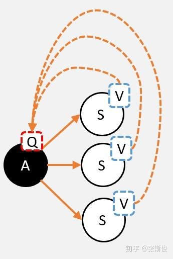

对，但还差点东西。

**敲黑板:**

当我们选择A，并转移到新的状态时，就能获得奖励，我们必须把这个**奖励也算上！**

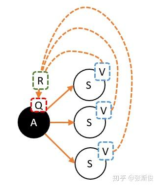

更正式的公式如下：

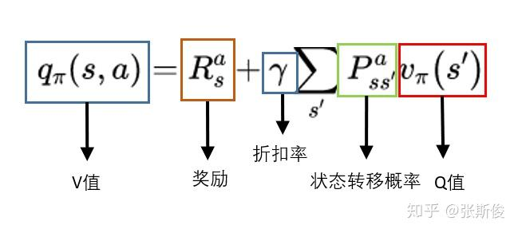

> **[折扣率](https://zhida.zhihu.com/search?content_id=112463530&content_type=Article&match_order=1&q=折扣率&zhida_source=entity)** 在强化学习中，有某些参数是人为**主观**制定。这些参数并不能推导，但在实际应用中却能解决问题，所以我们称这些参数为**超参数**，而折扣率就是一个超参数。 与金融产品说的贴现率是类似的。我们计算Q值，目的就是把未来很多步奖励，折算到当前节点。但未来n步的奖励的10点奖励，与当前的10点奖励是否完全等价呢？未必。所以我们人为地给未来的奖励一定的折扣，例如：0.9,0.8，然后在计算到当前的Q值。

现在我们知道如何从V到Q，从Q到V了。但实际应用中，我们更多会从V到V。

但其实从V到V也是很简单的。把公式代进去就可以了。

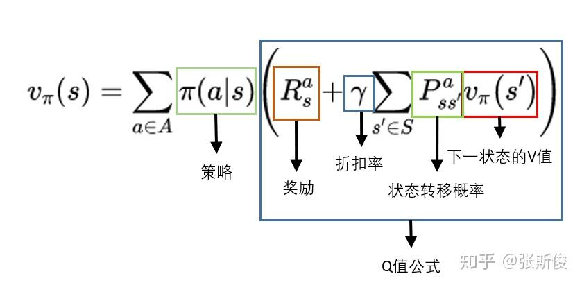

#### 总结

1. 比起记住公式，其实我们更应该注意Q值和V值的意义：他们就像一个路牌一样，告诉我们从马可洛夫树的一个节点出发，下面所有节点的收获的期望值。也就是假设从这个节点开始，走许多许多次，最终获取的奖励的平均值。
2. V就是子节点的Q的期望！但要注意V值和策略相关。
3. Q就是子节点的V的期望！但要注意，记得把R计算在内。

大家有没有发现，在这一节中，计算某一个节点的Q值和V值，需要许多次试验，取其中的平均值。但实际上，我们不但需要求一个节点的值，而是求所有节点的值。如果我们每一个节点都用同样的方法，消耗必然会很大。所以人们发明了许多方式去计算Q值和V值，基于价值计算的算法就是围绕Q和V展开的。

  - Q值： 代表智能体选择某个动作后，一直到最终状态奖励总和的期望， **Q值评价动作**。
  - V值：代表智能体在这个状态下，一直到最终状态的奖励总和的期望，**V值评价状态**。

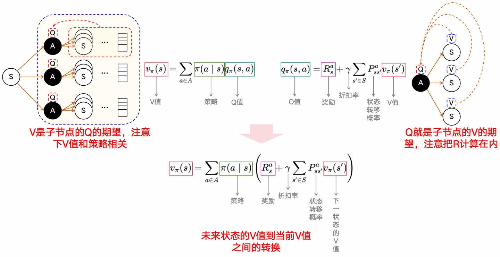

  图1-1解：Q到V，V到Q，V到V之间的转换——强化学习的理论核心，建议常看常新，参考：https://zhuanlan.zhihu.com/p/109498587

  如何在不知道真实环境分布的情况下估算Q值/V值/选择最佳的动作，已经诞生了多种方法，大体归纳为基于价值、基于策略两种，两种方法的对比见下图1-2：

  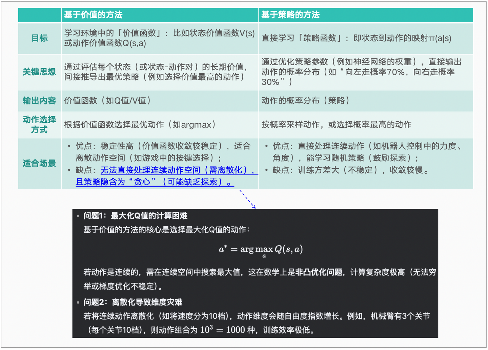

  图1-2：基于价值的方法 vs 基于策略的方法

  ### **1.1）基于价值的方法**

  代表：MC（Monte-Carlo，[蒙特卡洛](https://zhida.zhihu.com/search?content_id=253212236&content_type=Article&match_order=1&q=蒙特卡洛&zhida_source=entity)）方法、TD（Temporal-Difference，[时序差分](https://zhida.zhihu.com/search?content_id=253212236&content_type=Article&match_order=1&q=时序差分&zhida_source=entity)，基于TD的变体包括SARSA、Q-learning、DQN）

  - **MC方法**
    - **思路：**通过样本回合（episode，也叫trajectory，即轨迹）的完全体验来估计状态值函数V(s)。具体来说，它使用从一个状态开始到回合结束的真实收益来进行估计。
    - **缺点：**算法要求采样必须走到最终状态；面对巨大的状态空间，小概率能到达最终状态。

  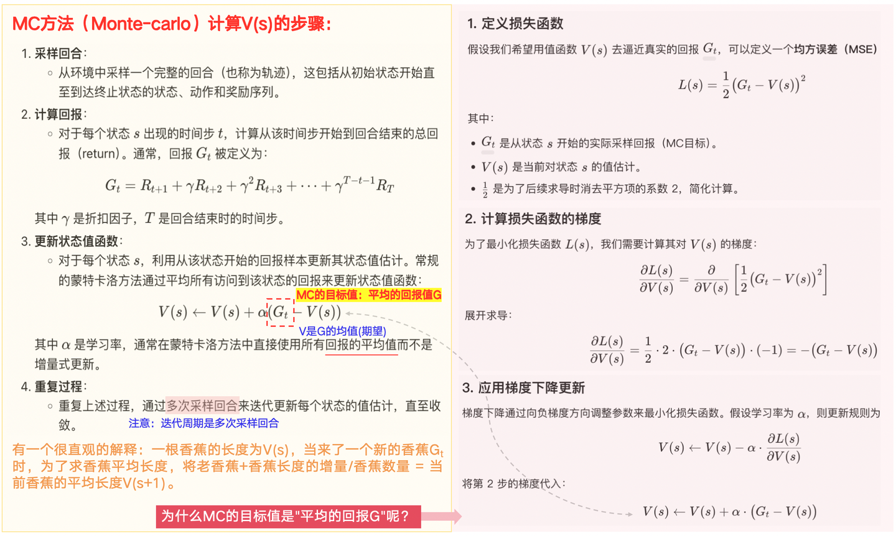

  图1-3：MC（Monte-Carlo）方法

  - **TD方法**
    - **思路：**不必等待一个完整的回合结束才能进行更新，而是可以在每个时间步进行增量更新。
    - **延展方法：**SARSA、Q-learning、DQN。

  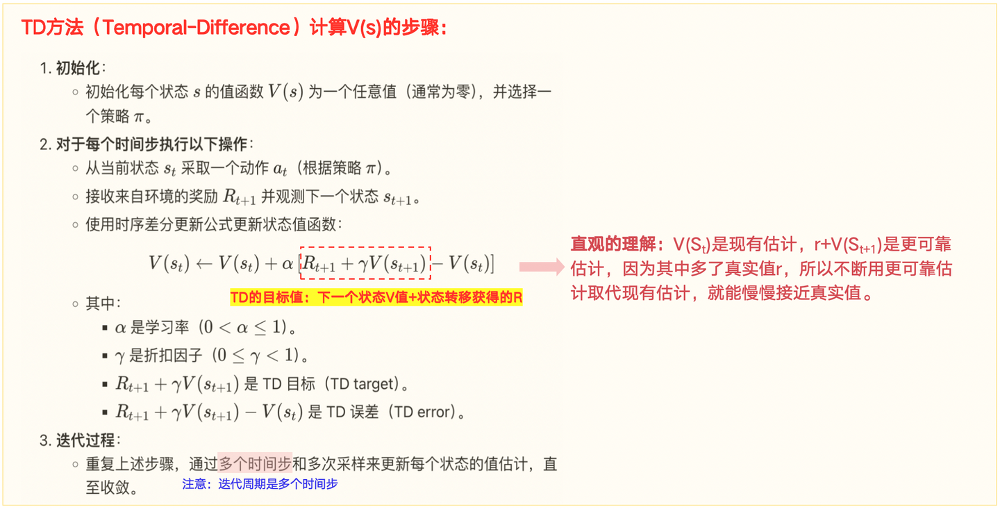

  图1-4：TD（Temporal-Difference）方法

  - **TD方法的变体之——SARSA（State-Action-Reward-State-Action）**
    - **思路：**SARSA算法更新的是状态-动作价值函数（Q值），通过五元组（当前状态S、当前动作A、收到的奖励R、下一个状态S’、下一个动作A’）来进行学习。SARSA被称为“on-policy”算法，因为它更新的Q值是基于当前策略选择的动作。
  - **TD方法的变体之——Q-learning**
    - **思路：**采用Q表（Q-table）来存储状态-动作对的价值。通过不断更新Q表来学习一个最优策略，使得Agent能够在环境中最大化累积奖励。这是一种“off-policy”算法，即更新Q值时不依赖于当前执行的策略。它使用贪心策略来更新Q值，即选择下一个状态中的最大Q值进行更新。Q表是一个二维表格，其中：行代表环境中的所有可能状态s；列代表在每个状态下所有可能的动作a；表中的每个元素 Q(s,a)表示在状态s采取动作a后的预期累积奖励。
    - **缺点：**它只能解决离散的、有限状态、有限动作空间的任务。
    - **选取action的策略——greedy-epsilon（又叫ε-greedy）**：即以概率1−ε选择当前已知的最优动作（即利用）。这通常是基于当前的Q值或策略评估选出的动作。以概率ε随机选择一个动作（即探索），以确保算法有机会尝试不同的动作，可能发现更优的策略。其实从下图中Q-learning的公式就可以看出，即形式如Q=(1-α)Q+αG=Q+α(G-Q)。

  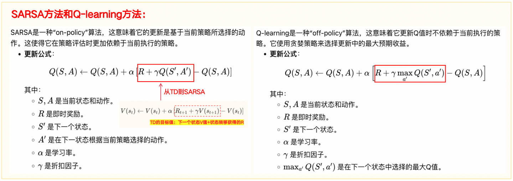

  图1-5：SARSA和Q-learning方法公式对比【左）SARSA方法的公式=TD的公式+替换V为Q；右）Q-learning方法公式】

  - **Q-learning方法的改进版本之——DQN（Deep Q-Network）**
    - **思路：**使用神经网络解决Q-learning中**状态不连续**的问题。在DQN中，Q值函数不是用表格存储，而是用神经网络来近似。神经网络Q(s,a;θ)参数化Q值函数，其中θ是神经网络的参数。计算细节包括：经验回放（Experience Replay）、目标网络（Target Network）、损失函数（Loss）等，如下图。
    - **缺点：**无法处理动作连续的场景，即DQN的输出层节点数等于离散动作的数量，若动作连续，输出层需无限多个节点，这显然不可行。

  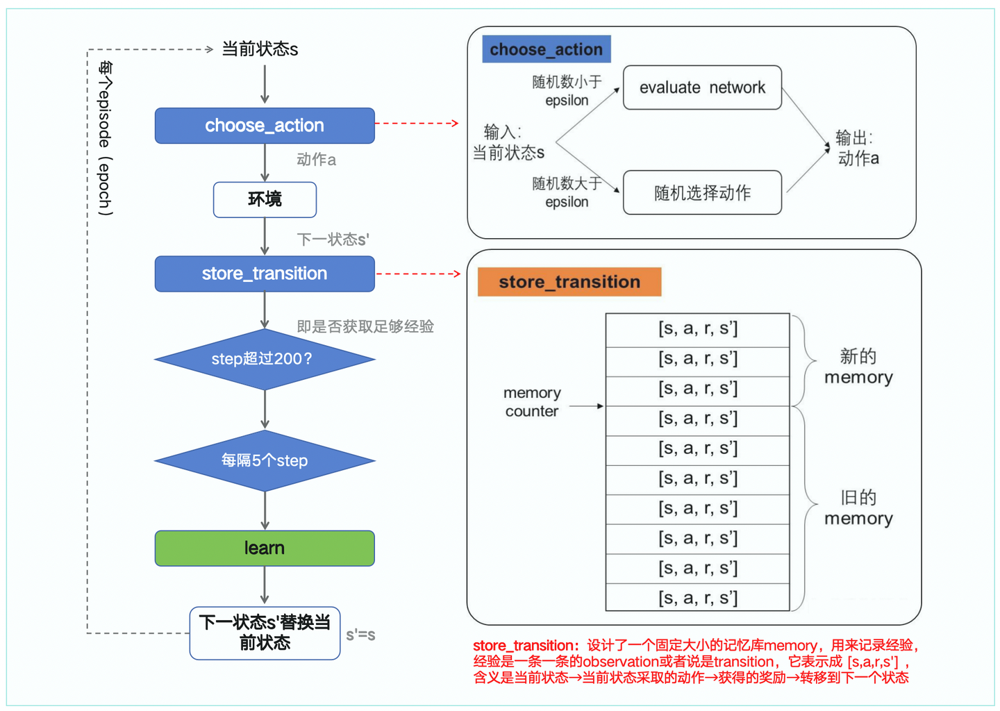

  图1-6：DQN的算法流程——选择动作+存储经验

  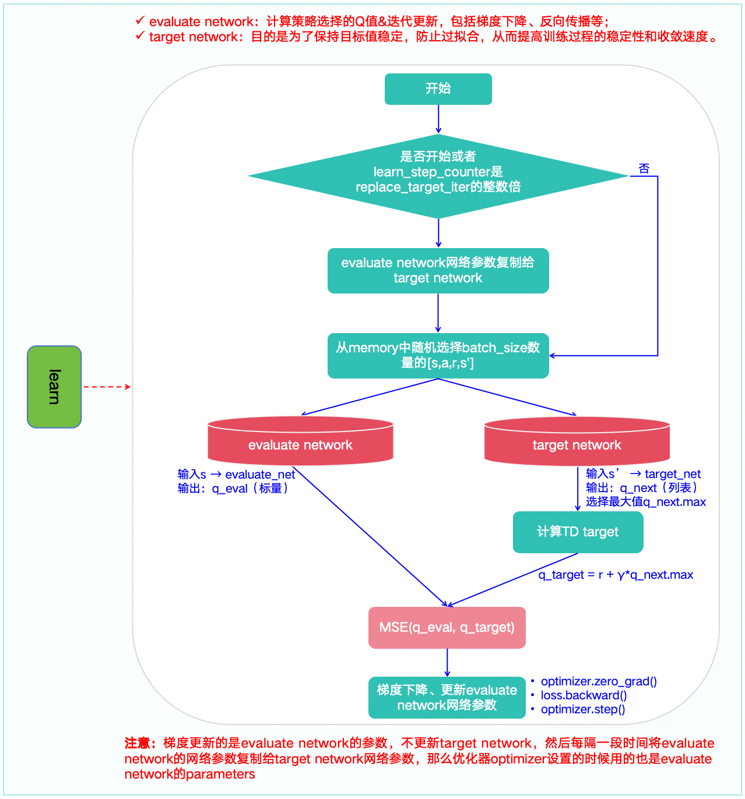

  图1-7：DQN的算法流程——训练流程。注：一开始记忆库memory中没有经验，也没有训练evaluate network，积累了一定数量的经验之后，再开始训练evaluate network。

  DQN代码学习：[https://github.com/louisnino/RLcode/blob/master/tutorial_DQN.py](https://link.zhihu.com/?target=https%3A//github.com/louisnino/RLcode/blob/master/tutorial_DQN.py)

  ### **1.2）基于策略的方法**

  代表：PG（Policy Gradient，策略梯度，这里特指[REINFORCE算法](https://zhida.zhihu.com/search?content_id=253212236&content_type=Article&match_order=1&q=REINFORCE算法&zhida_source=entity)）、AC、PPO（Proximal Policy Optimization，近端策略优化）

  - **PG方法（这里特指REINFORCE算法）**
    - **思路：**利用reward奖励直接对选择行为的可能性进行增强和减弱，好的行为会被增加下一次被选中的概率，不好的行为会被减弱下次被选中的概率。
    - **缺点：**数据使用效率低（每次收集的数据只用一次就丢弃了，即on-policy）；采用蒙特卡洛的思想，每次要走到最后，太慢了。

  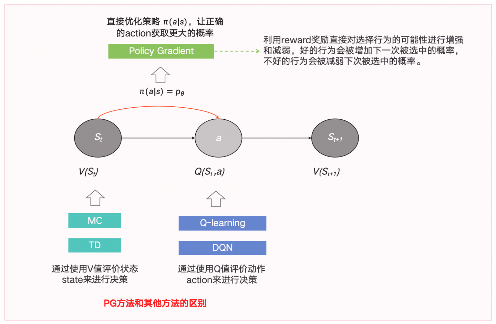

  图1-8：PG和前面几种方法的区别

  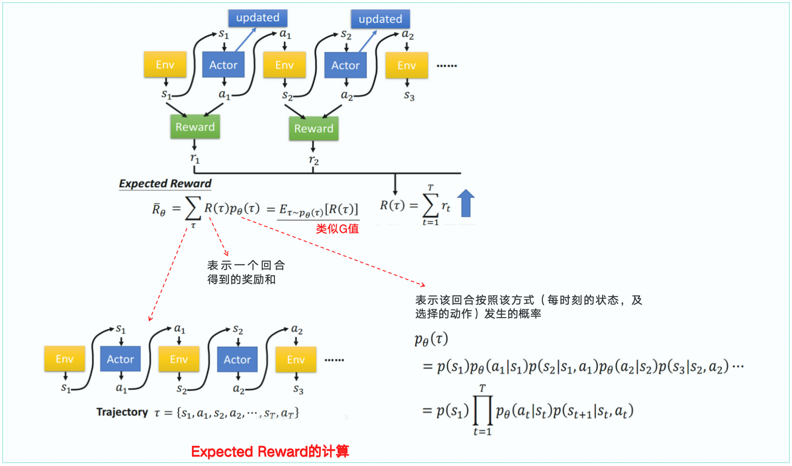

  图1-9：PG中期望Reward的计算

  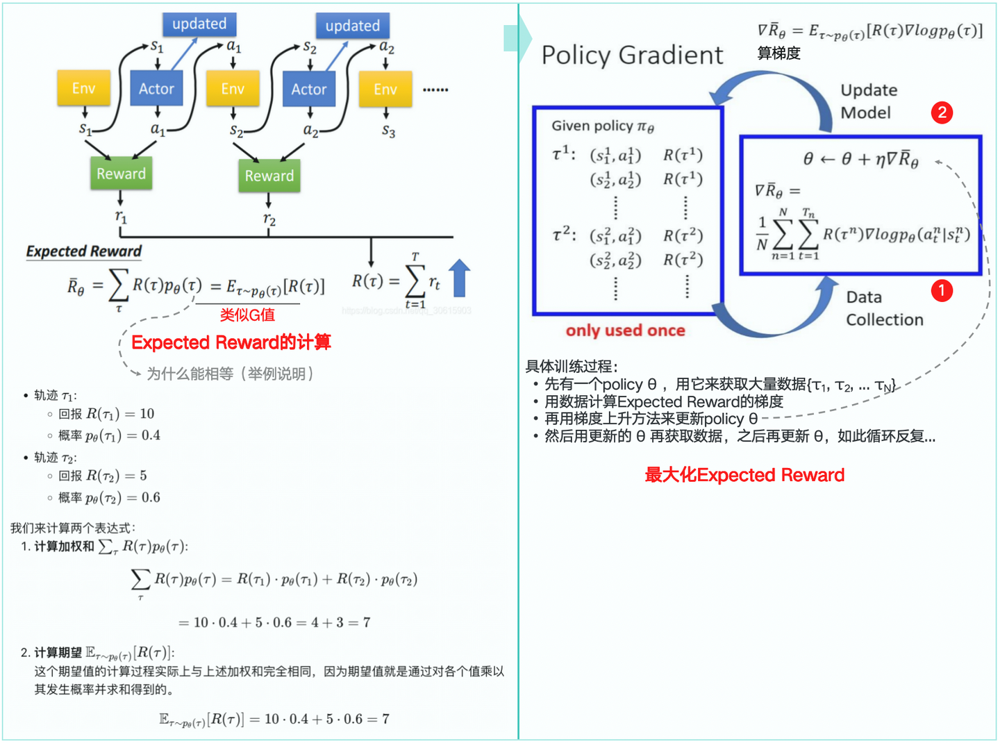

  图1-10：PG中最大化期望Reward的计算

  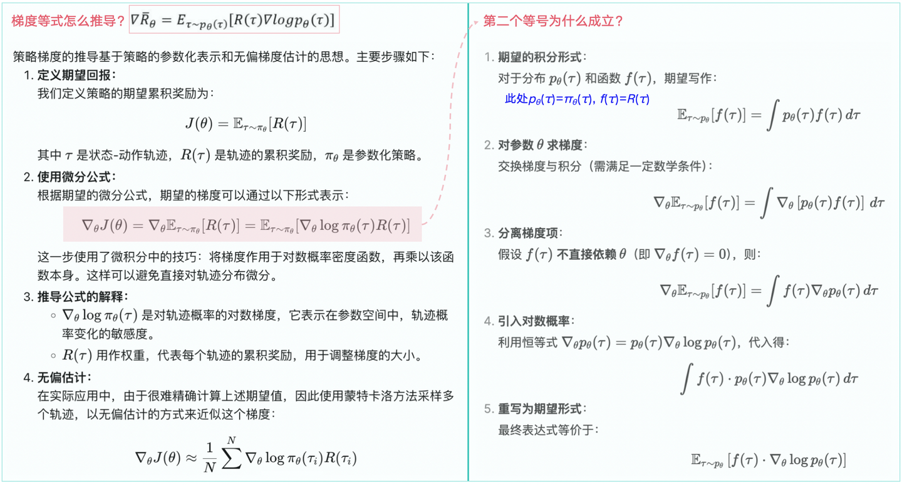

  图1-11：PG中最大化期望Reward的计算-梯度计算细节推导

  PG代码见[https://github.com/louisnino/RLcode/blob/master/tutorial_PG.py](https://link.zhihu.com/?target=https%3A//github.com/louisnino/RLcode/blob/master/tutorial_PG.py)，其执行逻辑梳理如下：

  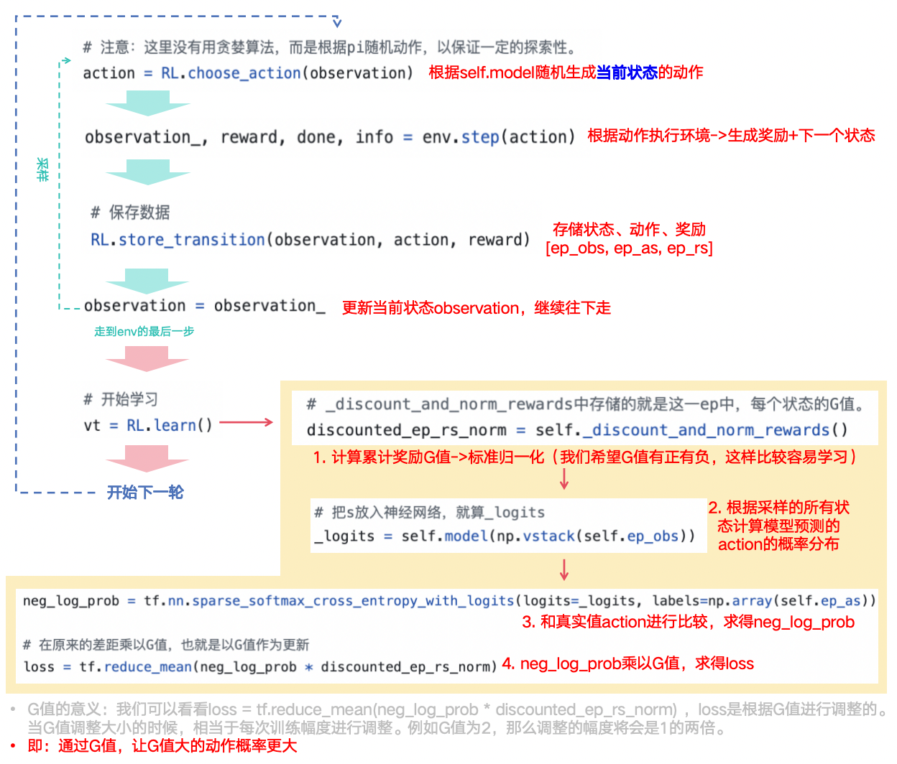

  图1-12：PG代码执行逻辑

  - **Actor-Critic（AC）方法**
    - **思路：**为了解决PG中采用蒙特卡洛必须走到最后的状态才计算G值，改为TD的思路。但是，PG需要计算G值，那么在TD中，我们应该怎样估算每一步的Q值呢？即神经网络。**AC采用两个神经网络：Actor网络负责对网络输入状态S输出策略&选择动作，Critic网络负责计算每个动作的分数。**
    - **缺点：**策略更新过大；训练过程震荡严重，收敛速度慢。

  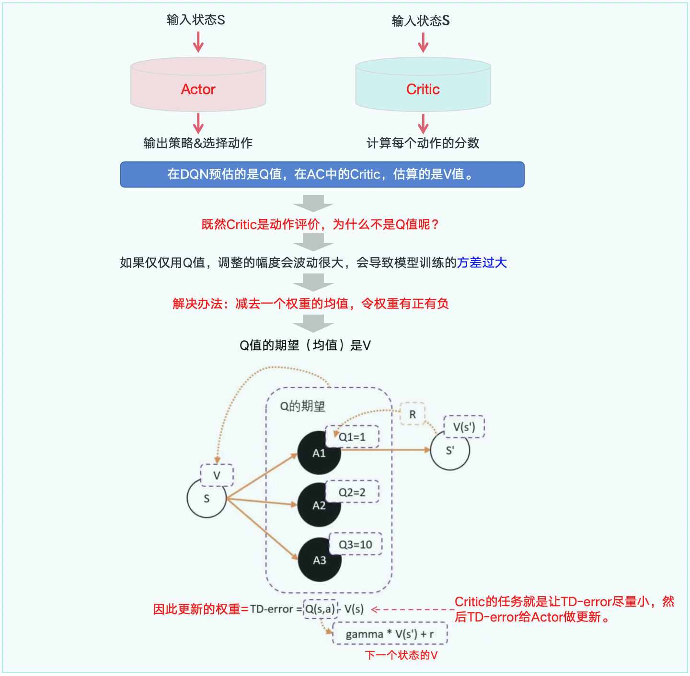

  图1-13：AC算法的由来

  AC代码学习见[https://github.com/louisnino/RLcode/blob/master/tutorial_AC.py](https://link.zhihu.com/?target=https%3A//github.com/louisnino/RLcode/blob/master/tutorial_AC.py)，其执行逻辑梳理如下：

  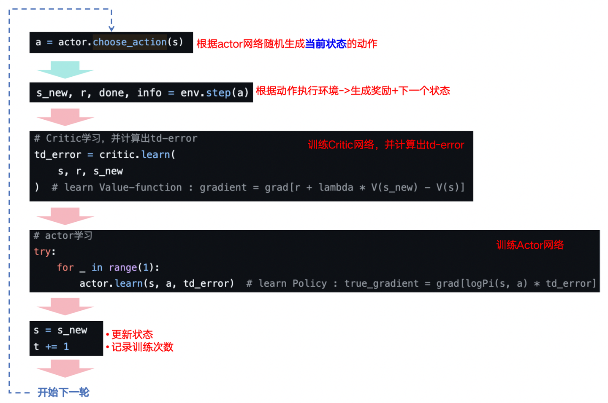

  图1-14：AC代码执行逻辑

  - **PPO方法**
    - **概念：从离散问题到连续问题**
      - 用AC来解决连续型控制问题。方法是输入avg（均值）和var（方差），构造一个正态分布来表示策略。
        - avg：平均数，也就是整个正态分布的中轴线，avg的变化，表示整个图像向左右移动。
        - var：方差，当var越大，图像越扁平；var约小，图像越突出，而最大值所在的位置，就是中轴线。
      - 如何实现：神经网络可以直接输出avg和var，就能获得整个策略的概率密度函数。
    - **概念：两种策略**
      - 行为策略：不是当前策略，用于产出数据。
      - 目标策略：会更新的策略，是需要被优化的策略。
      - 如果两个策略是同一个策略，那么称为On Policy=在线策略；如果不是同一个策略，那么称为Off Policy=离线策略。
    - **概率：重要性采样（Important-sampling**）
      - 目标：用行为策略获取的数据，能够更新目标策略，把AC从在线策略，变成离线策略。
      - 含义：目标策略出现动作a的概率 除以 行为策略出现a的概率。
    - **概念：N步更新**
      - 之前的TD叫做TD(0)，而N步更新为TD(n)，可以看成TD(0)其实是TD(n)的一种特殊情况。
      - 实际上我们只需要计算最后的V(s')，根据这个估算的V(s'), 我们反推经过的所有state的V值。这个其实和PG估算G的过程是一样的，只不过我们并不需要走到最后，而是中途截断，用网络估算。

  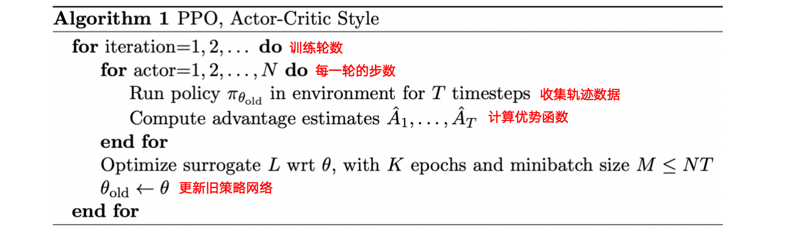

  表1-1：PPO给出的算法流程

  PPO代码学习见[https://github.com/louisnino/RLcode/blob/master/tutorial_PPO.py](https://link.zhihu.com/?target=https%3A//github.com/louisnino/RLcode/blob/master/tutorial_PPO.py)，其执行逻辑梳理如下：

  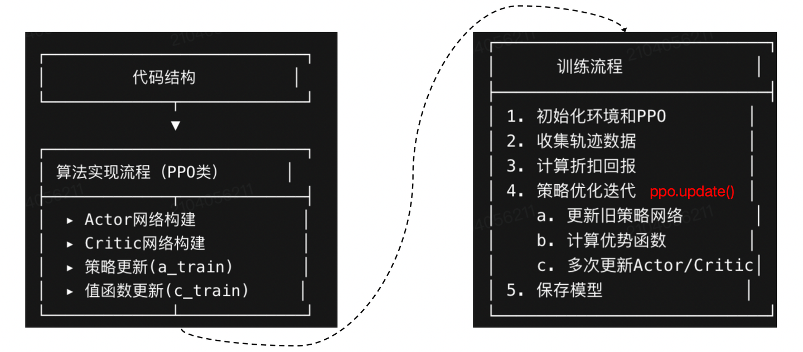

  图1-15：整体代码流程

  训练流程的1-4步代码解读分别见下面四幅图：

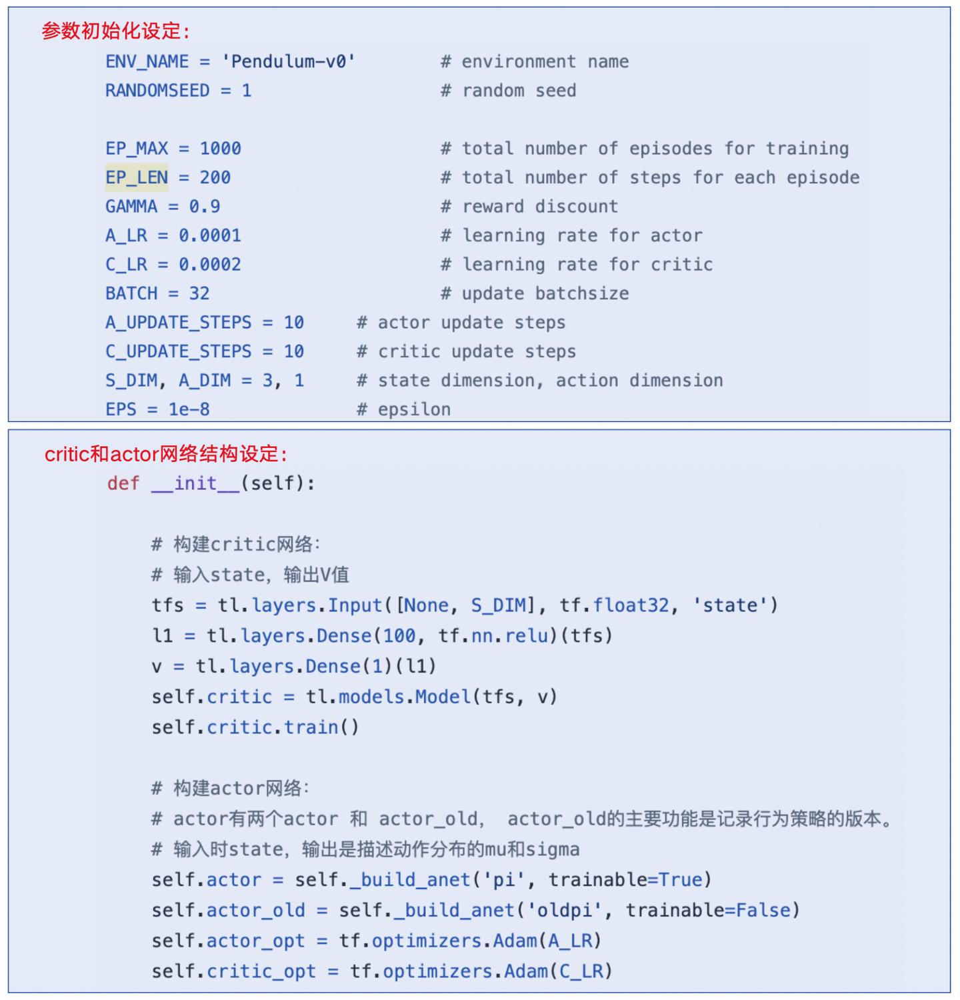

  图1-16：PPO代码1-初始化环境和PPO

  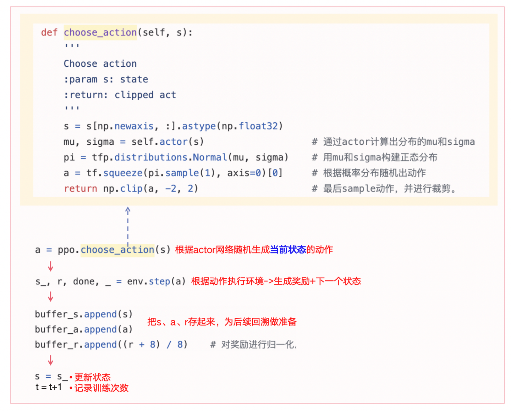

  图1-17：PPO代码2-收集轨迹数据

  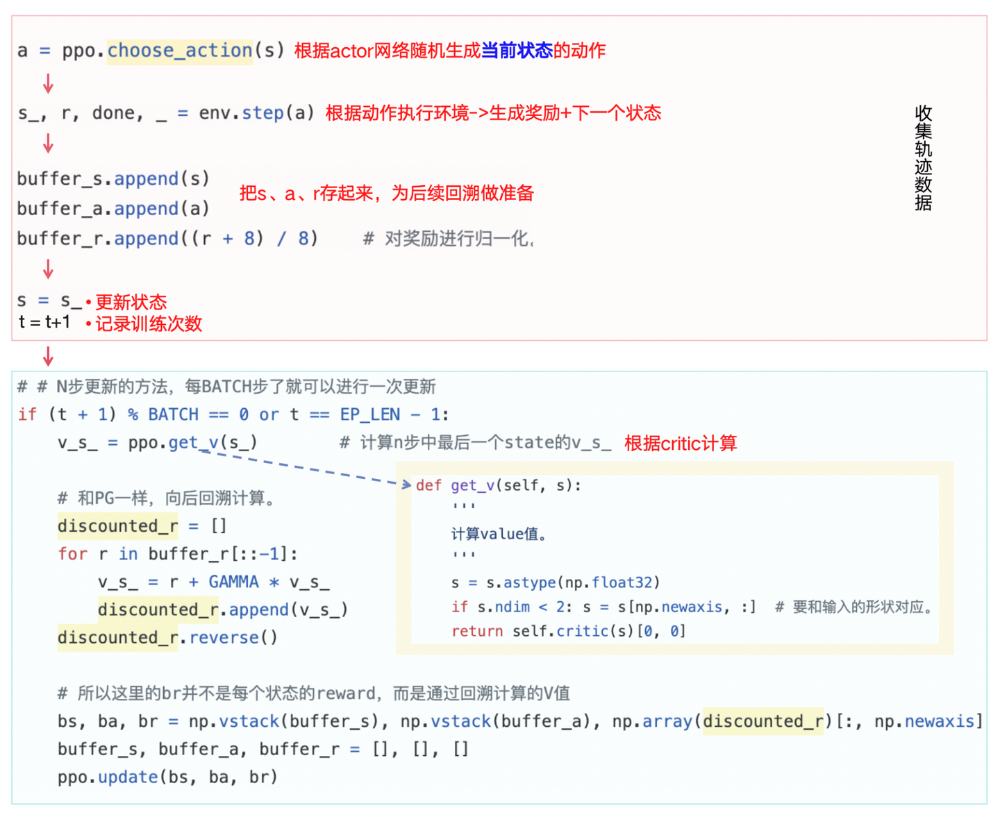

  图1-18：PPO代码3-计算折扣回报+策略迭代入口

  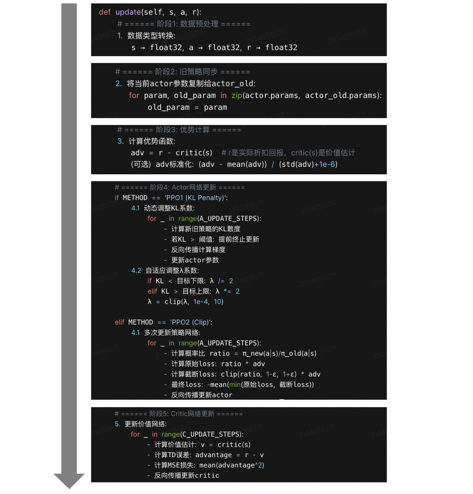

  图1-19：PPO代码4-策略迭代优化细节（即ppo.update()细节）

  快速背诵：收（收集轨迹数据）、计（计算折扣回报）、策（策略迭代优化）

  ### **1.3）PG->AC->TRPO->PPO->DPO方法演进公式对比**

  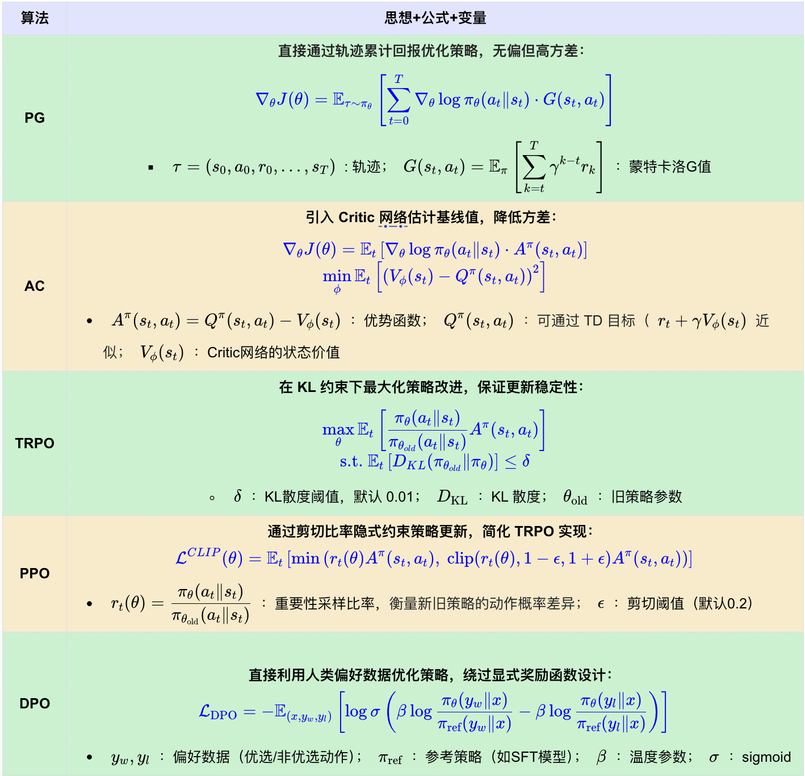

  表1-2：PG到AC到TRPO到PPO到DPO演进公式对比

  ## 八、LLM的PPO模型

  首先，看下PPO算法的四个模型：

  | 模型名        | 解释&目标                                                    |
  | ------------- | ------------------------------------------------------------ |
  | Actor模型     | 解释：待训练的策略模型 目标：生成/采样Experience数据。       |
  | Reference模型 | 解释：通常为初始的Actor模型； 目标：防止"Actor模型在训练过程中学习的分布"走偏。 |
  | Critic模型    | 解释：待训练的判别模型（或称为价值模型）； 目标：对每个状态打分，有时用Reward模型热启。 |
  | Reward模型    | 解释：通常指ORM（Outcome Reward Model）； 目标：对生成的结果打分。 |

  需要采样经验（Experience）数据的原因：

  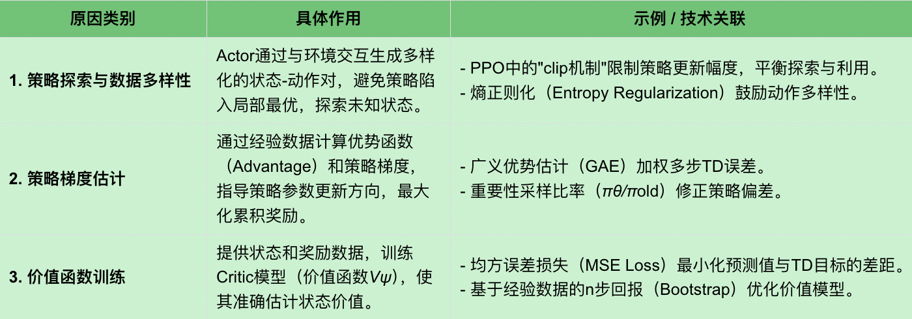

  表2-1：采样经验数据的各种原因

  LLM中实际使用的公式：

  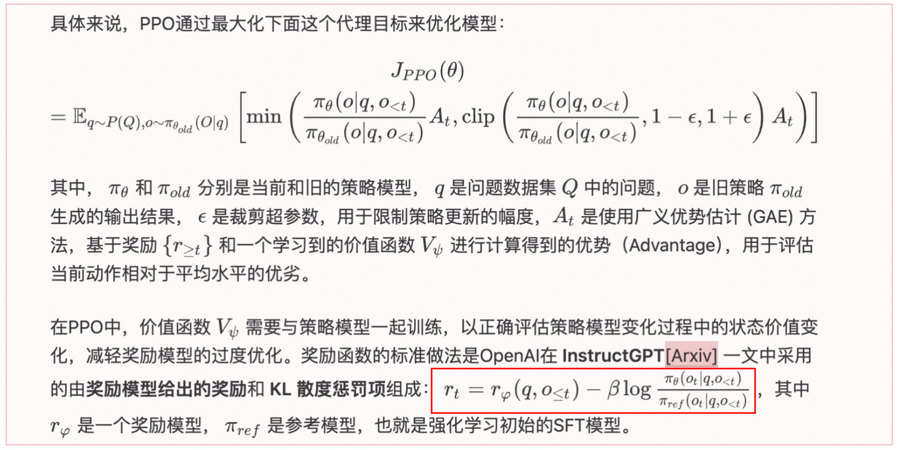

  图2-1：LLM中PPO的公式

  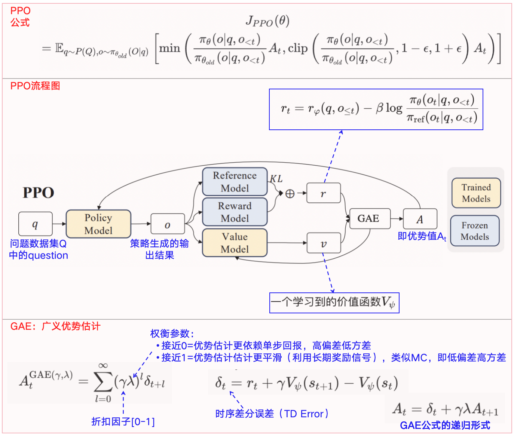

  图2-2：LLM的PPO流程图解（流程来自Deepseek论文的图）

  > 这里在附加解释下为何lamda=1，GAE的计算是无偏的，见下图2-3（由左到右）。

  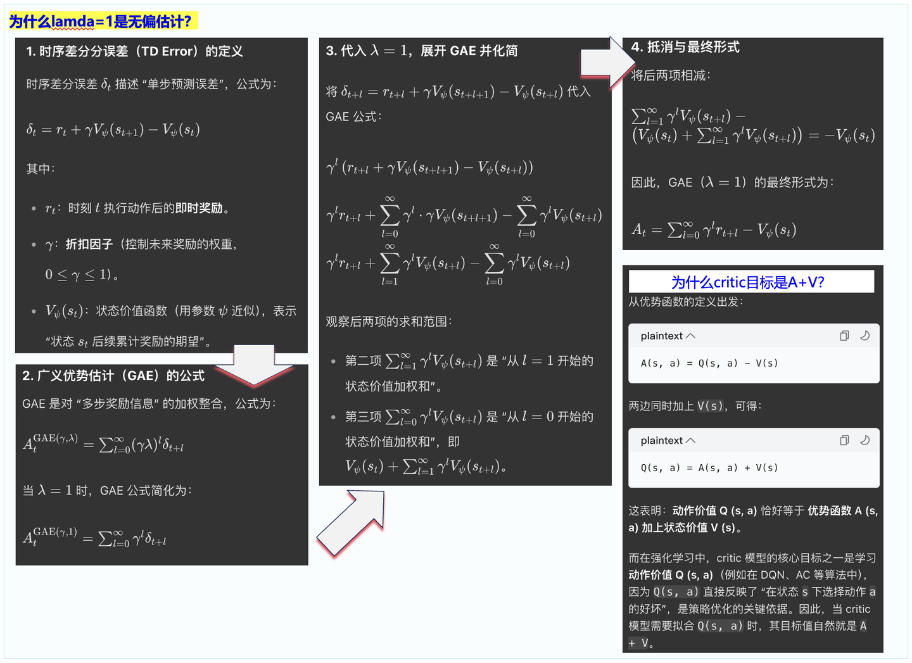

  图2-3：PPO里面lamda=1为何是无偏估计

  > 另外，这里也补充下算完GAE之后，critic模型的目标值（Return）是什么？见下图2-4（由上到下）。

  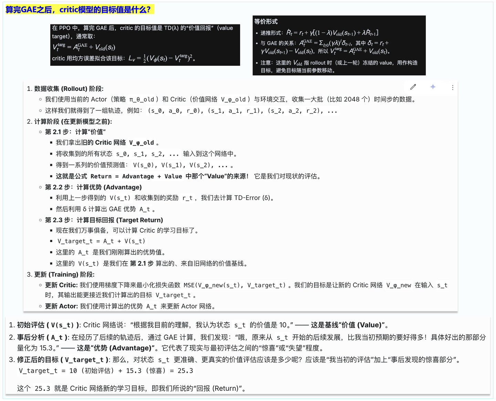

  图2-4：算完GAE之后，critic模型的目标值（Return）是什么？

  代码参考：Open_RLHF库的[PPO实战](https://link.zhihu.com/?target=https%3A//github.com/OpenRLHF/OpenRLHF/blob/main/openrlhf/trainer/ppo_trainer.py)、trl库实现的[ppo_trainer.py](https://link.zhihu.com/?target=https%3A//github.com/huggingface/trl/blob/main/trl/trainer/ppo_trainer.py)，本人梳理的代码实际计算流程如下图：

  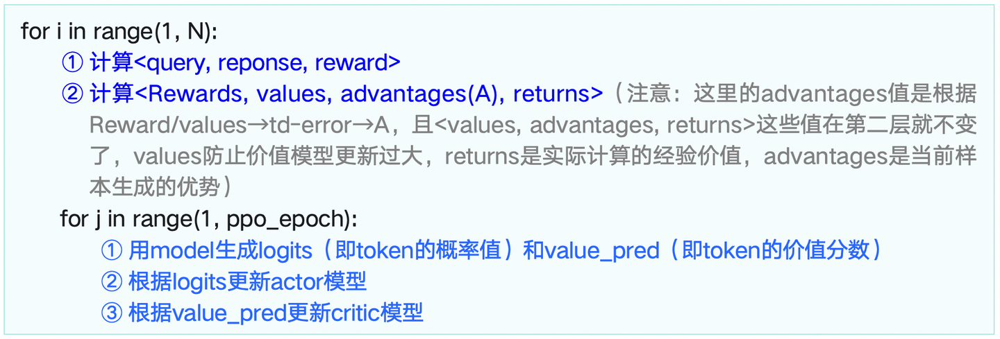

  图2-4：代码实际计算流程简图

  ## 九、LLM的DPO（Direct Preference Optimization）模型

#### 一、先理解：LLM 为什么需要 DPO

训练大模型最标准工业 Pipeline 表达：

```
1 预训练 (Pretraining)
        ↓
2 SFT (Instruction tuning)
        ↓
3 偏好对齐 (RLHF / DPO)
        ↓
4 安全强化 (Safety tuning)
        ↓
5 评测 (Evaluation)
        ↓
6 蒸馏 / 压缩
        ↓
7 部署 & 持续训练
```

**⭐ 如果从“能力来源”角度理解**

其实可以记一个更本质的划分：

​	**预训练决定：**

​		👉 模型会不会思考

​	**SFT决定：**

​		👉 模型会不会按指令说话

​	**Alignment决定：**

​		👉 模型说的话是不是人类喜欢

​	**Safety决定：**

​		👉 模型会不会乱说危险内容

​	**Distillation决定：**

​		👉 模型能不能落地应用

#### 二、RLHF（基于价值的方法）到底在干嘛

可以把 RLHF 想成：

👉 训练一个“裁判模型”（Reward Model）

**举个现实比喻**

你在训练一个写作文的学生：

1. 学生写两篇作文
2. 老师选一篇更好
3. 你训练一个“自动评分系统”
4. 再用评分系统指导学生写作

**数学上就是**

```
先学一个 Reward 函数 R(x,y)
再最大化 R
```

**但这里有几个大问题**

**❌ 问题 1：奖励模型容易学歪**

奖励模型其实是：

👉 用有限人类偏好数据拟合一个函数

但它只是**近似**

结果可能出现：

**reward hacking（奖励作弊）**

模型学会：

- 不是写更好答案
- 而是写奖励模型喜欢的答案

**❌ 问题 2：训练很复杂**

RLHF要：

1. 训练 Reward model
2. 再做 RL（PPO）
3. 训练非常不稳定

PPO本身：

- 参数多
- 调参困难
- 容易崩

**❌ 问题 3：RL很容易偏离原始模型**

PPO如果没控制好：

👉 模型会忘掉语言能力

所以还要加：

```
KL penalty
```

（强制模型别跑太远）

#### 三、DPO 出现的核心思想

DPO = Direct Preference Optimization

👉 **直接用偏好训练模型**
👉 **完全不需要奖励模型**
👉 **完全不需要RL**

可以理解成：

👉 把 RLHF 变成一个普通监督学习问题

#### 四、DPO 在做什么（通俗解释）

人类通常给的数据是：

```
同一个问题：
A答案（好）
B答案（差）
```

DPO的目标非常直观：

👉 让模型更倾向生成 A
👉 少生成 B

**换句话说**

DPO直接优化：

```
模型(A)概率 > 模型(B)概率
```

非常像：

👉 排序学习（ranking）

#### 五、为什么 DPO 能替代价值方法（核心数学直觉）

这是关键点。

RLHF其实目标是：

```
最大化 期望奖励
同时限制不要偏离原模型
```

写成公式就是：

```
max  E[R] - β KL
```

而论文证明：

👉 这个优化问题
👉 可以转化为一个二分类损失

结果得到：

```
log π(A) - log π(B)
```

也就是说：

👉 RL问题被数学推导成一个普通loss

这就是 DPO 牛的地方。

#### 六、DPO 为什么更强（真正原因）

下面是最核心的几点：

✅ 1、没有奖励模型误差

RLHF链路：

```
人类 → 奖励模型 → RL
```

误差会层层放大。

DPO：

```
人类偏好 → 直接优化LLM
```

👉 少了一层近似
👉 信息更干净

这点通常是最大优势。

✅ 2、训练稳定很多

PPO训练特点：

- 高方差
- 很容易 collapse
- 非常吃超参

DPO：

👉 就是交叉熵 + ranking loss
👉 和普通 SFT 一样稳定

工业界非常喜欢这点。

✅ 3、计算成本低

RLHF需要：

- 训练 reward model
- 多轮 sampling
- PPO rollout

DPO：

👉 一次前向计算就行
👉 基本和 SFT 成本接近

✅ 4、避免 reward hacking

RLHF：

模型只需要骗过奖励模型

DPO：

模型必须：

👉 直接拟合人类偏好排序

作弊空间小很多。

✅ 5、理论上更一致

DPO直接优化：

👉 偏好概率分布

RLHF：

👉 先学奖励函数再优化

属于间接目标。

#### 七、再用一个更直觉的生活比喻

**RLHF = 训练一个中间裁判**

就像：

你想选好歌手

你先训练一个“评委AI”
 然后用评委AI选歌手

问题：

👉 评委可能评错

**DPO = 直接比较选手**

```
观众说 A 比 B 好
你就让 A 权重更大
```

没有中间评委。

总结一句话就是:

👉 RLHF 是

```
先学一个奖励函数
再用RL优化
```

------

👉 DPO 是

```
直接把偏好变成loss训练
```

#### 八、DPO 推理介绍

  - **背景：**目前RLHF的流程太复杂，不仅需要单独训练reward模型，还需要从LLM的输出采样。
  - **优势：**DPO通过理论证明，可以不需要引入reward模型，就可以完成LLM的偏好训练。实验证明，在生成情感、摘要、单论对话质量方面，DPO比基于PPO的RLHF更好。

  DPO最终公式见表1-2，推导过程如下：

  **step1：明确目标**

  定义的优化目标：1）Reward最大化；2）positive的样本得分大于negative样本得分。因此，公式推导采用的策略是先最大化Reward，再带入"positive的样本得分大于negative样本得分"公式。

  **step2：Reward最大化**

  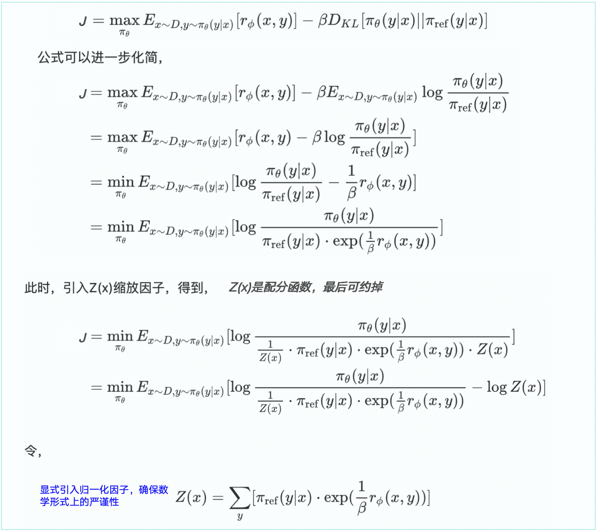

  图3-1：DPO推导的step2，引入Z(x)【目的：显式引入归一化因子，确保数学形式上的严谨性】

  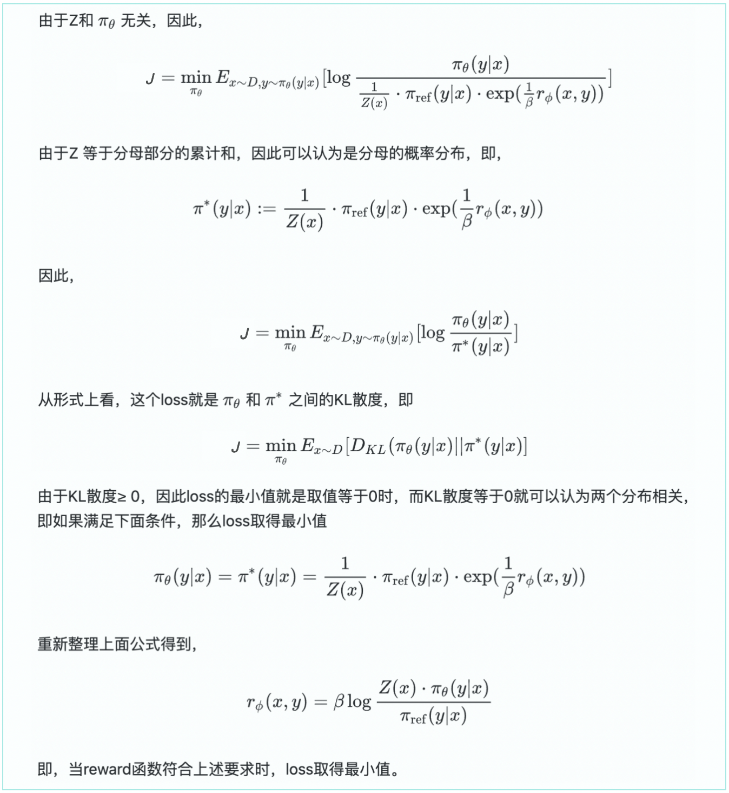

  图3-2：DPO推导的step2续图，即求出最佳loss下对应的reward函数

  **step3：表征positive的样本得分大于negative样本得分**

  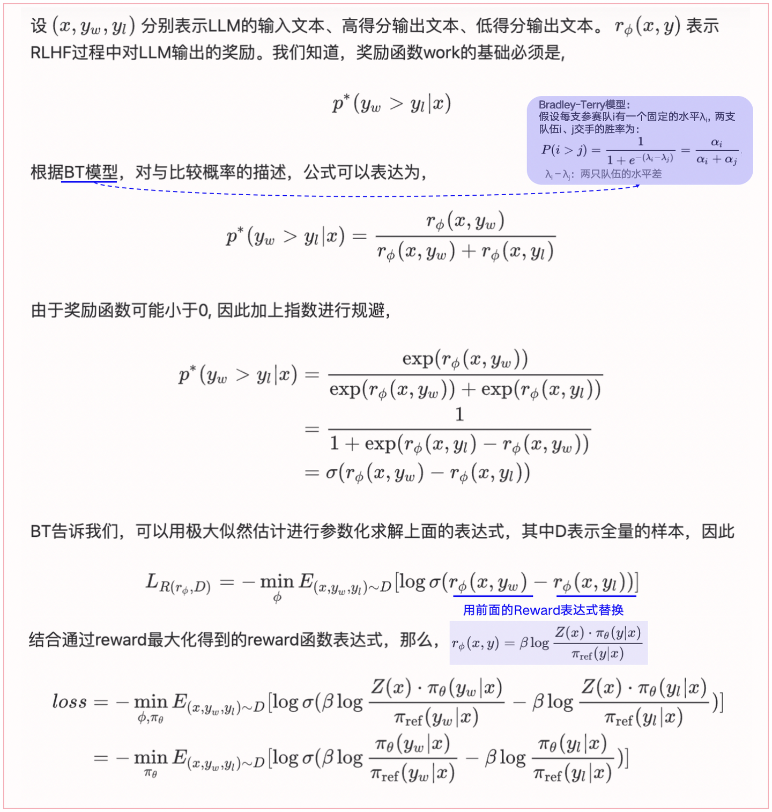

  图3-3：DPO推导的step3，即表征positive的样本得分大于negative样本得分，同时将最大的Reward带入setp2

  代码参考：Open_RLHF库的[DPO实战](https://link.zhihu.com/?target=https%3A//github.com/OpenRLHF/OpenRLHF/blob/main/openrlhf/trainer/dpo_trainer.py)、trl库的[dpo_trainer.py](https://link.zhihu.com/?target=https%3A//github.com/huggingface/trl/blob/main/trl/trainer/dpo_trainer.py)。

  ```python3
  # DPO-loss实际计算代码
  def forward(
        self,
        policy_chosen_logps: torch.Tensor,
        policy_rejected_logps: torch.Tensor,
        reference_chosen_logps: torch.Tensor,
        reference_rejected_logps: torch.Tensor,
  ) -> Tuple[torch.Tensor, torch.Tensor, torch.Tensor]:
        # 计算win_response相比lose_response之间的优势logits，然后最大化这个优势
        pi_logratios = policy_chosen_logps - policy_rejected_logps
        ref_logratios = reference_chosen_logps - reference_rejected_logps
        logits = pi_logratios - ref_logratios
        """
        普通公式：
              通常，为了最大化这个优势，会采用公式：-logsigmoid(logits)，
              由于sigmoid会把数据缩放到0-1，在0-1之间，-log()是单调递减函数，因此logits越大，loss越小
        优化后的公式：
              第一种(ipo): losses = (logits - 1 / (2 * self.beta)) ** 2：即会限制优势的幅度，
                     使logits的更新被限制在[1/(2 * self.beta), 1/self.beta]之间
              第二种: losses = (-logsigmoid(self.beta * logits) * (1 - self.label_smoothing)
                     - logsigmoid(-self.beta * logits) * self.label_smoothing)
                     预备知识：self.label_smoothing是平滑系数、sigmoid(-x)= 1 - sigmoid(x)、self.beta可看作温度系数
                     预备知识：在二分类任务中，如果只有正例，如分数为0.999，则模型表现容易过拟合。
                     因此，第二种公式首先引入了负例，表示为-log(1 - sigmoid(logits))，
                     即总分为1，正例sigmoid(logits)得分越高、负例1 - sigmoid(logits)得分就越低
                     然后，为了平衡正例和负例的作用，加入了一个平滑因子self.label_smoothing，最终是为了提升模型的泛化能力。
        """
        if self.ipo:
              losses = (logits - 1 / (2 * self.beta)) ** 2  # Eq. 17 of https://arxiv.org/pdf/2310.12036v2.pdf
        else:
              # Eq. 3 https://ericmitchell.ai/cdpo.pdf; label_smoothing=0 gives original DPO (Eq. 7 of https://arxiv.org/pdf/2305.18290.pdf)
              losses = (
                    -F.logsigmoid(self.beta * logits) * (1 - self.label_smoothing)
                    - F.logsigmoid(-self.beta * logits) * self.label_smoothing
              )
  
        loss = losses.mean()
        chosen_rewards = self.beta * (policy_chosen_logps - reference_chosen_logps).detach()
        rejected_rewards = self.beta * (policy_rejected_logps - reference_rejected_logps).detach()
  
        return loss, chosen_rewards, rejected_rewards
  ```

#### 九、先明确：DPO 本质需要什么

**✅ 1 一个基础模型（policy model）**

例如：

- LLaMA
- Qwen
- Mistral
- 自己 SFT 过的模型

通常建议：

👉 至少做过 SFT
 （否则偏好学习效果差）

**✅ 2 一个 reference model**

DPO必须要有：

```
reference_model = 原始模型快照
```

作用：

👉 控制 KL 约束
👉 防止模型发散

通常就是：

```
reference = SFT checkpoint copy
```

**✅ 3 偏好数据（核心）**

DPO只吃一种数据结构：

```
prompt
chosen response
rejected response
```

例如：

```
{
  "prompt": "解释黑洞是什么",
  "chosen": "黑洞是时空曲率极大的区域...",
  "rejected": "黑洞就是宇宙中的洞..."
}
```

#### 十一、代码实现 DPO

**Step 1 安装环境**

```
pip install transformers
pip install datasets
pip install accelerate
pip install trl
pip install peft
```

**Step 2 准备偏好数据**

最简单格式：

```
dataset = [
  {
    "prompt": "...",
    "chosen": "...",
    "rejected": "..."
  }
]
```

通常来源：

- 人类标注
- GPT 生成 + ranking
- ShareGPT偏好数据
- UltraFeedback 数据集

**Step 3 加载模型**

示例（Qwen / LLaMA都一样）：

```python
from transformers import AutoModelForCausalLM, AutoTokenizer

model_name = "mistralai/Mistral-7B-v0.1"

model = AutoModelForCausalLM.from_pretrained(model_name)
tokenizer = AutoTokenizer.from_pretrained(model_name)
```

**Step 4 创建 reference model**

```python
reference_model = deepcopy(model)
```

或者：

```python
from copy import deepcopy
ref_model = deepcopy(model)
```

**Step 5 创建 DPOTrainer**

核心一步：

```python
from trl import DPOTrainer

trainer = DPOTrainer(
    model,
    ref_model,
    args=training_args,
    train_dataset=dataset,
    tokenizer=tokenizer
)
```

**Step 6 训练参数**

典型配置：

```python
from transformers import TrainingArguments

training_args = TrainingArguments(
    per_device_train_batch_size=2,
    gradient_accumulation_steps=4,
    learning_rate=5e-6,
    num_train_epochs=3,
    logging_steps=10,
    save_steps=500
)
```

**Step 7 开始训练**

```python
trainer.train()
```

完成。

👉 这就是完整 DPO 训练流程。

#### 十二、真实生产优化（非常关键）

上面只是最小demo，工业界通常还会加：

✅ LoRA（几乎必用）

否则显存爆炸。

```
from peft import LoraConfig
```

优势：

- 训练快
- 成本低
- 收敛稳定

✅ 数据混合 SFT loss

很多公司会：

```
loss = DPO + SFT
```

因为：

👉 防止模型退化语言能力

✅ β 参数调节（超级关键）

DPO核心超参：

```
beta
```

作用：

👉 控制 KL 强度

经验值：

```
0.1 ~ 0.5 常用
```

✅ 对话模板标准化

必须统一：

```
<system>
<user>
<assistant>
```

否则效果很差。

#### 十三、完整最小可运行代码示例

这是目前最短落地代码：

```
from datasets import load_dataset
from transformers import AutoModelForCausalLM, AutoTokenizer, TrainingArguments
from trl import DPOTrainer
from copy import deepcopy

model_name = "mistralai/Mistral-7B-v0.1"

model = AutoModelForCausalLM.from_pretrained(model_name)
tokenizer = AutoTokenizer.from_pretrained(model_name)

ref_model = deepcopy(model)

dataset = load_dataset("Anthropic/hh-rlhf", split="train")

training_args = TrainingArguments(
    output_dir="./dpo_model",
    per_device_train_batch_size=2,
    learning_rate=5e-6,
    num_train_epochs=1
)

trainer = DPOTrainer(
    model,
    ref_model,
    args=training_args,
    train_dataset=dataset,
    tokenizer=tokenizer
)

trainer.train()
```

#### 十四、使用 llama factory 进行 DPO

**一、 llama factory 进行 DPO 的优势**

✅ 官方已经支持 DPO

✅ 支持绝大多数主流模型

✅ 支持 LoRA / QLoRA

✅ 工程体验很好

✅ 很适合快速实验

**二、LLaMA-Factory 为什么适合做 DPO**

它本质上已经帮你封装好了：

```
数据处理
模型加载
LoRA
DPO loss
训练调度
日志 & 可视化
```

你只需要：

👉 写配置
👉 准备数据

就能跑。

**三、支持哪些模型**

基本目前主流都支持：

- LLaMA 系列
- Qwen
- Mistral
- Yi
- Gemma
- DeepSeek
- Baichuan
- ChatGLM（部分）

**四、用 LLaMA-Factory 做 DPO 的最短流程**

**Step 1 安装**

```
git clone https://github.com/hiyouga/LLaMA-Factory
cd LLaMA-Factory

pip install -e .
```

建议再装：

```
pip install flash-attn
```

（性能提升明显）

**Step 2 准备偏好数据（核心）**

LLaMA-Factory DPO 默认支持：

数据格式（非常重要）

标准 ShareGPT DPO 格式

```json
{
  "conversations": [
    {"from": "human", "value": "..."},
    {"from": "gpt", "value": "..."}
  ],
  "chosen": "...",
  "rejected": "..."
}
```

或者简单格式：

```json
{
  "instruction": "...",
  "chosen": "...",
  "rejected": "..."
}
```

------

然后在：

```json
data/dataset_info.json
```

注册数据集。

**Step 3 写训练配置**

DPO 关键参数：

```
stage: dpo
```

最小 YAML 示例：

```
model_name_or_path: mistralai/Mistral-7B-v0.1

stage: dpo
do_train: true

dataset: my_dpo_data
template: mistral

finetuning_type: lora

lora_rank: 8
lora_alpha: 16

per_device_train_batch_size: 2
gradient_accumulation_steps: 4

learning_rate: 5e-6
num_train_epochs: 3

dpo_beta: 0.1
```

**Step 4 启动训练**

```
llamafactory-cli train config.yaml
```

就可以跑了。

**五、LLaMA-Factory 帮你自动做了哪些复杂事情**

这是它最大的价值。

✅ 自动 reference model

你不需要手动 copy。

✅ 自动 conversation template

避免 prompt 不一致问题。

✅ 自动支持 LoRA / QLoRA

显存节省巨大。

✅ 自动多卡训练

支持：

- DeepSpeed
- FSDP
- accelerate

✅ 支持混合训练

可以同时：

```
SFT + DPO
```

**六、LLaMA-Factory vs TRL**

这是很多人关心的问题。

**TRL 优点**

👉 灵活
 👉 适合研究
 👉 自定义 loss 容易

**LLaMA-Factory 优点**

👉 极快落地
 👉 配置驱动
 👉 训练稳定
 👉 工程友好

现实情况：

```
研究人员 → TRL
工程团队 → LLaMA-Factory
```

#### 十四、DPO 在 LLaMA-Factory 中的关键超参

你一定要知道这几个：

**⭐ dpo_beta**

控制：

```
KL 正则强度
```

经验值：

```
0.05 ~ 0.3
```

⭐ finetuning_type

通常选：

```
lora
```

⭐ template

必须匹配模型：

```
qwen
llama3
mistral
chatml
```

这个错误会直接毁效果。

⭐ dataset质量

DPO成败最关键因素。

#### 十五、什么时候建议用 LLaMA-Factory

特别适合：

✅ 快速实验对齐
✅ 多模型批量测试
✅ 资源有限
✅ 主要做 instruction tuning
✅ 想用 LoRA 训练

#### 十六、不太适合 LLaMA-Factory 的情况

如果你想：

- 自定义新 DPO loss
- 研究对齐算法
- 改 sampling 机制
- 做复杂 RL pipeline

那：

👉 TRL / 自己写更灵活

#### 十七、工业界真实情况

目前很多团队其实是：

```
研究阶段 → TRL
生产训练 → LLaMA-Factory
```

因为：

👉 维护成本低
👉 稳定性高
👉 上手快

  ## 十、LLM的GRPO（Group Relative Policy Optimization）模型

  - **背景（PPO的缺点）：**
    - 需要训练一个与策略模型大小相当的价值模型（Critic模型），这带来了巨大的内存和计算负担；
    - 在 LLM 的上下文中，通常只有最后一个 token 会被奖励模型打分，这使得训练一个在每个 token 上都准确的价值函数变得困难。
  - **GRPO的优势：**
    - 避免了像 PPO 那样使用额外的价值函数近似，而是使用"同一问题下多个采样输出的平均奖励"作为基线。

  **1）优化目标**

  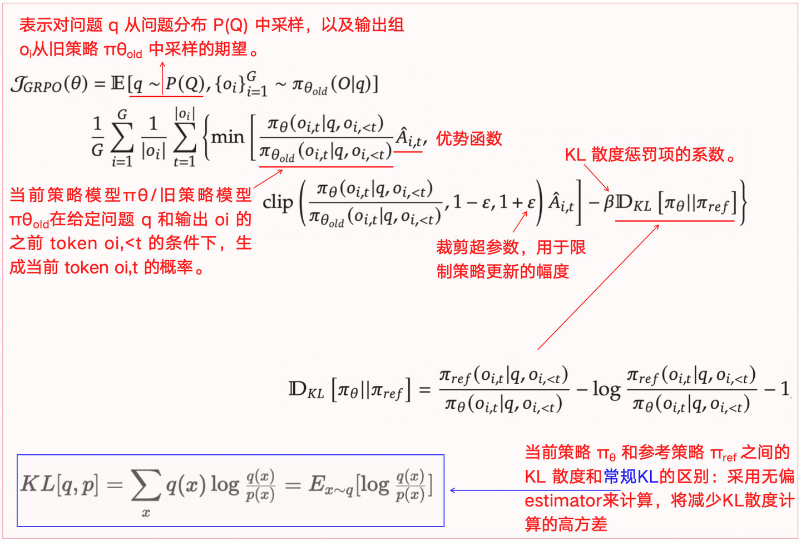

  图4-1解：GRPO公式解析

  **2）优势函数计算**

  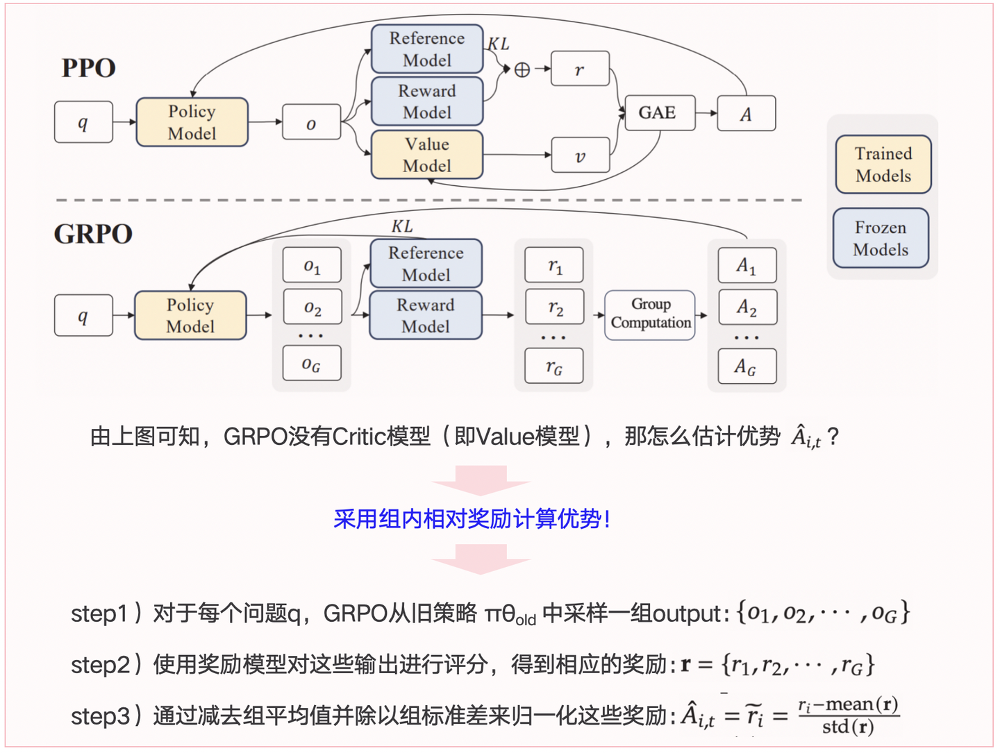

  图4-2解：GRPO的优势函数计算

  代码参考：[grpo_demo](https://link.zhihu.com/?target=https%3A//gist.github.com/willccbb/4676755236bb08cab5f4e54a0475d6fb)、[colab](https://link.zhihu.com/?target=https%3A//colab.research.google.com/drive/1bfhs1FMLW3FGa8ydvkOZyBNxLYOu0Hev%3Fusp%3Dsharing%23scrollTo%3DU1ixGbPG0Ni-)和[trl-grpo_trainer.py](https://link.zhihu.com/?target=https%3A//github.com/huggingface/trl/blob/main/trl/trainer/grpo_trainer.py)，常规做法：

  ```python3
  """
  直接使用trl封装的GRPOTrainer
  """
  trainer = GRPOTrainer(
      model=model,
      processing_class=tokenizer,
      reward_funcs=[
          xmlcount_reward_func,
          soft_format_reward_func,
          strict_format_reward_func,
          int_reward_func,
          correctness_reward_func],
      args=training_args,
      train_dataset=dataset,
      #peft_config=peft_config
  )
  trainer.train()
  
  """
  trl-grpo_trainer.py代码内部
  核心代码：_generate_and_score_completions()函数配合_prepare_inputs()函数就拿到了：
         {
              "prompt_ids": prompt_ids, # shape=(B*G, prompt_length)
              "prompt_mask": prompt_mask, 
              "completion_ids": completion_ids, # shape=(B*G, response_length)
              "completion_mask": completion_mask,
              "advantages": advantages,
              "old_per_token_logps": old_per_token_logps,
              "ref_per_token_logps": ref_per_token_logps,
          }
  """
  # unwrapped_model.generate() 方法默认返回的是生成token的整数ID
  with unwrap_model_for_generation(
                  self.model_wrapped, self.accelerator, gather_deepspeed3_params=self.args.ds3_gather_for_generation
              ) as unwrapped_model:
                  prompt_completion_ids = unwrapped_model.generate(
                      prompt_ids, attention_mask=prompt_mask, generation_config=self.generation_config
                  )
  
              # Compute prompt length and extract completion ids
              prompt_length = prompt_ids.size(1)
              prompt_ids = prompt_completion_ids[:, :prompt_length]
              completion_ids = prompt_completion_ids[:, prompt_length:]
  ...
  # 计算reference模型和old_policy模型的per_token_logps
  with torch.no_grad():
        # When using num_iterations == 1, old_per_token_logps == per_token_logps, so we can skip it's
        # computation here, and use per_token_logps.detach() instead.
        if self.num_iterations > 1:
              old_per_token_logps = self._get_per_token_logps(
                    self.model, prompt_completion_ids, attention_mask, logits_to_keep, batch_size
              )
        else:
              old_per_token_logps = None
  
        if self.beta == 0.0:
              ref_per_token_logps = None
        elif self.ref_model is not None:
              ref_per_token_logps = self._get_per_token_logps(
                    self.ref_model, prompt_completion_ids, attention_mask, logits_to_keep, batch_size
              )
        else:
              with self.accelerator.unwrap_model(self.model).disable_adapter():
                    ref_per_token_logps = self._get_per_token_logps(
                    self.model, prompt_completion_ids, attention_mask, logits_to_keep, batch_size
                    )
  ...
  # 根据每个预定义的奖励函数，获取prompt+completion的奖励
  for i, (reward_func, reward_processing_class, reward_func_name) in enumerate(
    zip(self.reward_funcs, self.reward_processing_classes, self.reward_func_names)
  ):
    with profiling_context(self, reward_func_name):
        if isinstance(
            reward_func, nn.Module
        ):  # Module instead of PretrainedModel for compat with compiled models
            if is_conversational(inputs[0]):
                messages = [{"messages": p + c} for p, c in zip(prompts, completions)]
                texts = [apply_chat_template(x, reward_processing_class)["text"] for x in messages]
            else:
                texts = [p + c for p, c in zip(prompts, completions)]
            reward_inputs = reward_processing_class(
                text=texts, return_tensors="pt", padding=True, padding_side="right", add_special_tokens=False
            )
            reward_inputs = super()._prepare_inputs(reward_inputs)
            with torch.inference_mode():
                # 根据预定义的奖励函数，获取prompt+completion的奖励
                rewards_per_func[:, i] = reward_func(**reward_inputs).logits[:, 0]  # Shape (B*G,)
  
  # Gather每个函数的奖励值，因为completions可能来自不同的分布式进程
  rewards_per_func = gather(rewards_per_func)
  
  # 对每个奖励函数加上权重、并求和
  rewards = (rewards_per_func * self.reward_weights.to(device).unsqueeze(0)).nansum(dim=1)
  
  # 计算group粒度的Reward，其中self.num_generations表示一个prompt生成的一组了多少个completion
  mean_grouped_rewards = rewards.view(-1, self.num_generations).mean(dim=1) # (B,G).mean = (B,)
  std_grouped_rewards = rewards.view(-1, self.num_generations).std(dim=1) # (B,G).mean = (B,)
  
  # 归一化Reward，计算出组内相对优势A
  ## 组内每个奖励的均值重复num_generations次
  mean_grouped_rewards = mean_grouped_rewards.repeat_interleave(self.num_generations, dim=0)
  ## 组内每个奖励的标准差重复num_generations次
  std_grouped_rewards = std_grouped_rewards.repeat_interleave(self.num_generations, dim=0)
  ## 这里的rewards的shape=(B*G,) mean_grouped_rewards的shape=(B*G,) std_grouped_rewards的shape=(B*G,)
  ## 这样算出来的advantages就是(B*G)，即每个prompt下不同的completion相比组内其他结果的优势
  advantages = rewards - mean_grouped_rewards
  if self.scale_rewards:
      advantages = advantages / (std_grouped_rewards + 1e-4)
  ```

  > 注意：[trl-grpo_trainer.py](https://link.zhihu.com/?target=https%3A//github.com/huggingface/trl/blob/main/trl/trainer/grpo_trainer.py)本质上是调用的transformers的[trainer.py](https://link.zhihu.com/?target=https%3A//github.com/huggingface/transformers/blob/main/src/transformers/trainer.py%23L3737)的training_step()函数其中的self._prepare_inputs(inputs)

## **十一、 整个 RLHF 流程图解（简化版）**

```
           上下文
              ↓
          策略模型 (LLM)
              ↓
          生成回答
              ↓
         奖励模型评分
              ↓
        PPO 更新策略
              ↓
           新策略模型
```

- 重复采样 → 评分 → 优化
- 最终策略模型生成回答更符合人类偏好

