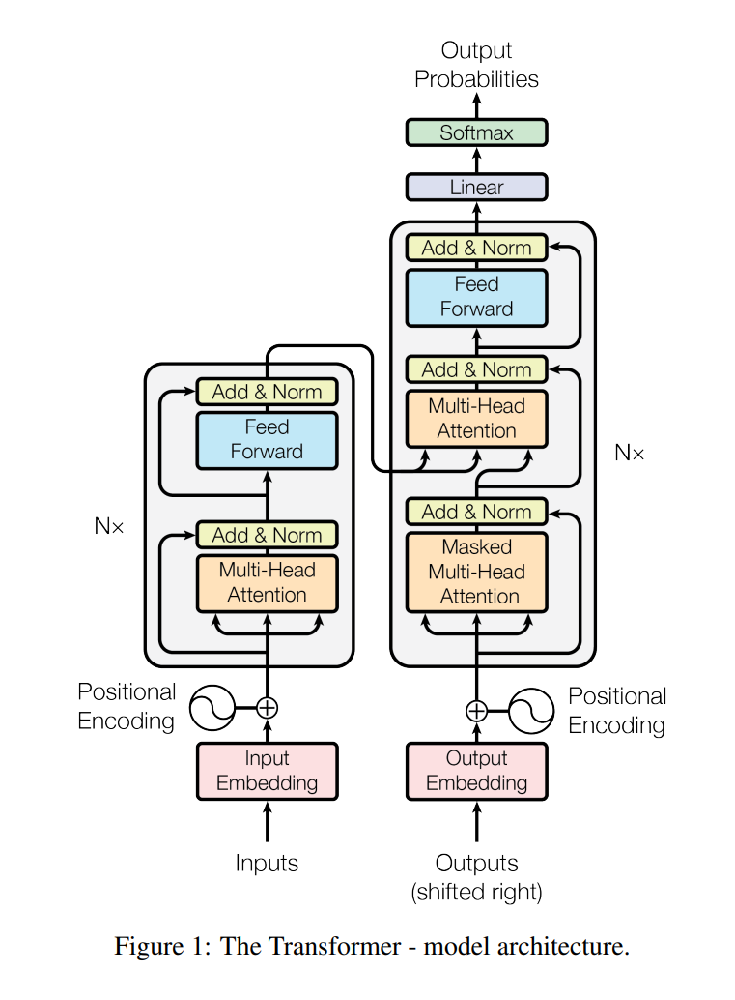
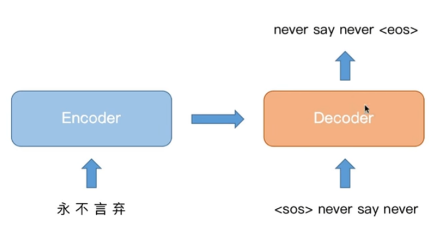
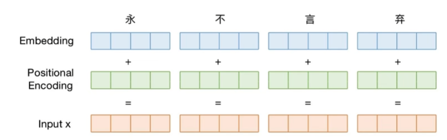
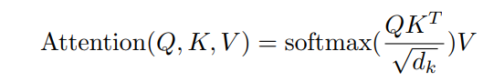
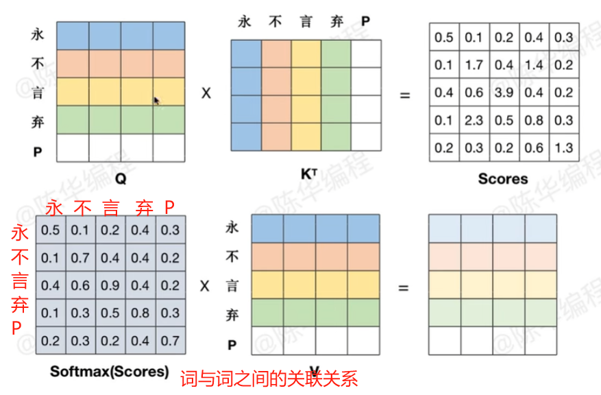
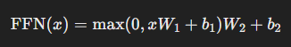
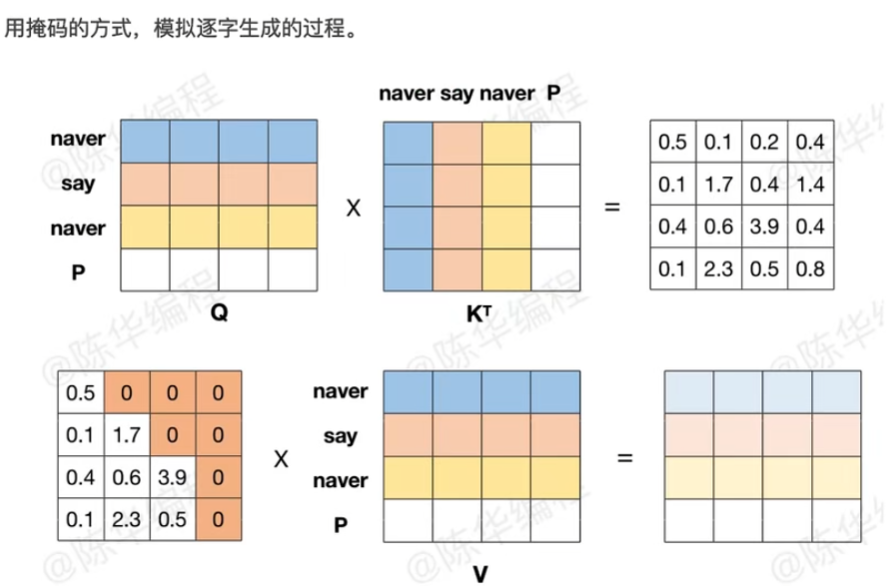
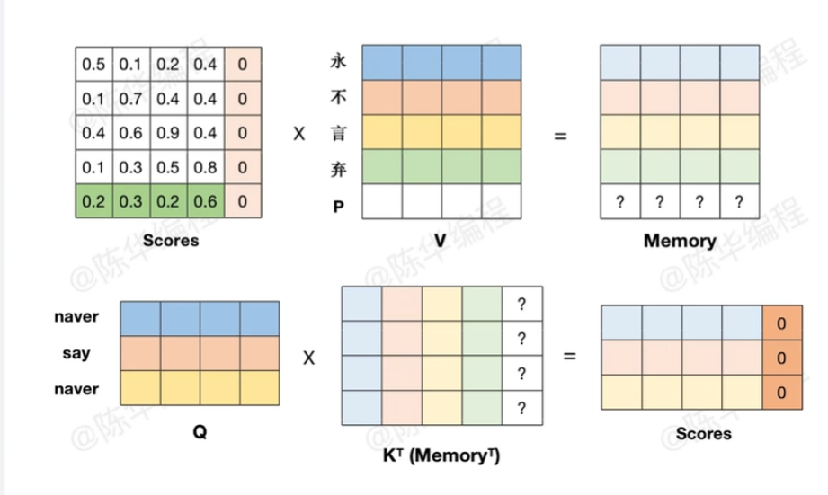

### Transfromer 简介

Transfromer 是一种用于自然语言处理和机器翻译等任务的深度学习模型架构,它由 Google 的研究人员在 2017 年提出.相比传统的循环神经网络(RNN)和卷积神经网络(CNN), Transfromer 使用了全新的架构, 通过注意力机制(Attention)来捕捉输入序列中的上下文关系.

论文地址: https://arxiv.org/abs/1706.03762

这一部分的内容, 可以对照论文中的模型结构图,来理解消化:

1. 输入嵌入层(Input Embedding Layer): 将输入序列中的单词或者符号转化为向量表示,一遍模型能够处理,简单的来说就是将文字转换成向量
2. 位置编码层(Posititional Embedding Layer): 为输入序列中的每个单词添加位置信息,以便模型能够捕捉序列中的顺序关系.
3. 编码器(Encoder): 由多个相同的编码器层堆叠而成,每个编码器层包含以下子层:
   1. 多头注意力机制(Multi-head Self-Attention): 通过计算每个位置与其他位置间的注意力权重,捕捉输入序列中的全局依赖关系
   2. 前馈神经网络(Feed-forward Neural Network): 对每个位置的特征进行独立的映射和处理,增强模型的非线性表达能力
   3. 残差连接(Residual Connection) 和 曾归一化(Layer Normalization): 用于加强模型的梯度流动和减轻训练过程中的梯度消失问题.
4. 解码器(Decoder): 由多个相同的解码器层堆叠而成,每个解码器层包含以下子层:
   1. 带掩码的多头注意力机制(Masked Multi-head Self-Attention): 帮助解码器在生成输出序列时对输入序列进行关注
   2. 编码器-解码器注意力机制(Encoder-Decoder Attention): 帮助解码器在生成每个位置的输出时关注输入序列的相关信息
   3. 前馈神经网络(Feed-forward Neural Network): 对每个位置的特征进行独立的映射和处理,增强模型的非线性表达能力
   4. 残差连接(Residual Connection) 和 曾归一化(Layer Normalization): 用于加强模型的梯度流动和减轻训练过程中的梯度消失问题.
5. 输出层(Output Layer): 将解码器的最后一层输出映射为最终的目标序列概率分布,用于生成翻译结果或者进行其他自然语言处理任务.

### 编码原理

### 自注意力机制

### self Attention

attention 是不会改变矩阵的形状的

Q = 5 x 4

k^t = 4 x 5

Scores = Q * k^t = 5 x 5

softmax(Scores) = 5 x 5

V = 5 x 4

softmax(Scores) * V = 5 x 4

 

### Feed Forward Network (FFN, 前馈神经网络) 

在 Transformer 模型中，Feed Forward Network (FFN, 前馈神经网络) 是自注意力机制之后的关键组成部分。每个 Transformer 层（Encoder/Decoder）都包含一个 FFN，它的作用是对注意力层提取的特征进行非线性变换，以增强模型的表达能力。

FFN 通常由两层全连接（Linear）神经网络和一个非线性激活函数（如 ReLU 或 GELU）组成：

### Masked Attention

### Encode-Decode Attention

