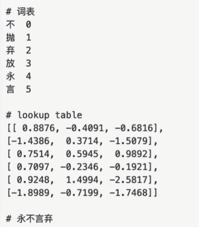

#### 完整词表,要结合语料才能生成,放到后面处理,先看一下词表在内存中的样子

假设词表大小为 10, 词向量维度为 8:

```python
import math
import torch
from torch import nn

# 实例化类
# padding_idx 指定 pad 值所对应的索引
emb = nn.Embedding(10, 8, padding_idx=0)
 
# lookup tabel
print(emb.weight)

# 单个词向量
print(emb(torch.tensor([1])))  # 抛

# 两个句子
print(emb(torch.tensor([
    [1, 2, 3],  # 抛弃放
    [1, 5, 0]   # 抛言弃
])))

# 指定填充 id,padding 是一个占位符号,不参与运算
emb = nn.Embedding(10, 8, padding_idx=0)

# 这是添加了占位符的两个句子
print(emb(torch.tensor([
    [1, 2, 3],  # 抛弃放
    [1, 5, 0]   # 抛言弃
])))
```

#### 封装 Embedding 类 (文本嵌入层)

```python
import math
import torch
from torch import nn


class Embeddings(nn.Module):
    def __init__(self, vocab_size: int = None, d_model: int = None):
        """
        vocab_size 词表的大小
        d_model 词向量的维度
        """
        super().__init__()
        # Embedding layer
        self.lut = nn.Embedding(vocab_size, d_model, padding_idx=0)
        # Embedding 维数
        self.d_model = d_model

    def forward(self, x):
        # 返回 x 对应的 embedding 矩阵,需要乘以 math.sqrt(d_model)
        # 主要原因是,在后面要对模型参数进行初始化,初始化的方法是 Xavier, 这个方法随机初始化的参数,随机抽样分布满足 N(0,1/d_model), d_model 越大,方差会越小,
        # 乘以 math.sqrt(self.d_model),可以拉回到 N(0,1)分布
        return self.lut(x) * math.sqrt(self.d_model)


if __name__ == '__main__':
    emb = Embeddings(10, 8)
    inputs = torch.tensor([
        [1, 2, 3],
        [4, 5, 0]
    ])
    output1 = emb(inputs)
    print(output1)
```
