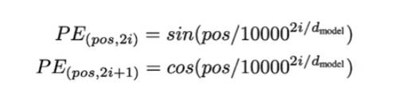
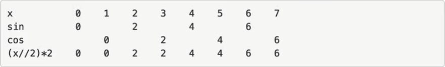

跟传统的 RNN 序列模型不同,在 Transformer 编码结构中,并没有针对词汇位置信息的处理,因为纯粹的 Attention 模块是无法捕捉输入顺序的, 因此需要在 Embedding layer 后加入位置编码器,将词汇位置不同,可能会产生不同语义信息,加入到词嵌入张量中.

Transformer 采用的是正余弦的绝对位置编码,这种编码方式可以保证,不同位置在所有维度上不会被编码到完全一样的值,从而使得每个位置都获得独一无二的编码.通俗的理解,就是将位置信息编码成向量后,每个位置对应的向量都是不同的.



对于一个位置来说,pos 是固定的, d_model 也是常量,是向量的维度论文中是 512 维的向量,变化的就是 2i 值.



### 1. 封装位置编码层

在这个项目中,大家要建立层的意识.位置编码层,是接受上一层 (文本嵌入层) 的结果,加上位置编码之后,再输出给下一层.

```python
import math
import torch
from torch import nn


class PositionalEncoding(nn.Module):
    def __init__(self, d_model, dropout: int = 0.1, max_len=5000):
        super().__init__()
        self.dropout = nn.Dropout(dropout) # 防止模型过于复杂从而导致过拟合的问题
        self.pe = torch.zeros(max_len, d_model)
        for pos in range(max_len):
            for j in range(d_model):
                angle = pos / math.pow(10000, (j // 2) * 2 / d_model)
                if j % 2 == 0:
                    self.pe[pos][j] = math.sin(angle)
                else:
                    self.pe[pos][j] = math.cos(angle)

    def forward(self, x):
        return self.dropout(x + self.pe[:x.size(1)])

```

这是直观实现,但是工程上是不会这么实现代码的,假如 d_model 是 512 维的, max_len w为 500

那么两层 for 循环就要循环 512 x 500 那么初始化的时间就太久了
