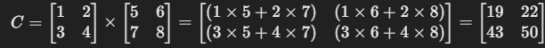

矩阵乘法通常分为 **点乘（element-wise product）** 和 **矩阵乘法（matrix multiplication，简称 × 乘）**。在 PyTorch 中，这两者的计算方式不同：

### 1. 张量乘法自动广播(点乘)

点乘是按元素相乘，要求两个矩阵的形状（shape）相同。

```python
import torch
a = torch.tensor([
  [1],
  [2],
  [3]
])
b = torch.tensor([4,5])

print(a*b) # 或者 torch.mul(A, B)
```

pytorch 会自动广播张量 b, 扩展为 (3,2), 然后每一行和 a 的对应行相乘,像上面这样的相乘会扩展为这样

```python
a = [
  [1,1],
  [2,2],
  [3,3]
]
b = [
  [4,5],
  [4,5],
  [4,5]
]
a * b = [
  [4,5],
  [8,10],
  [12,15]
]
```

这是矩阵的点乘

## 2. **矩阵乘法（Matrix Multiplication, × 乘）**

矩阵乘法遵循线性代数规则，即：

### C = A x B

其中，`A` 的列数必须等于 `B` 的行数（即 `A.shape[1] == B.shape[0]`）。

在 PyTorch 中，有几种方式进行矩阵乘法：

```python
C = torch.matmul(A, B)  # 推荐
C = A @ B  # 语法糖，等价于 torch.matmul(A, B)
C = torch.mm(A, B)  # 仅适用于 2D 矩阵
```

**输出**：

```
tensor([[19, 22],
        [43, 50]])
```

### 计算过程:



## 3. **区别总结**

|运算方式|计算规则|适用函数|形状要求|
|--|--|--|--|
|**点乘**|对应元素相乘|`A * B` 或 `torch.mul(A, B)`|形状必须相同|
|**矩阵乘法**|线性代数矩阵乘法|`A @ B` 或 `torch.matmul(A, B)` 或 `torch.mm(A, B)`|`A.shape[1] == B.shape[0]`|

**结论：**

- 如果想逐元素相乘（Hadamard 乘积），使用 `*` 或 `torch.mul`。
- 如果想进行矩阵乘法（线性代数中的乘法），使用 `@`、`torch.matmul` 或 `torch.mm`（仅限 2D）。

## 4. 位置编码优化实现


### 1). 直接套公式计算角度值

```python
d_model = 8
# 位置
position = torch.arange(0, 10)  # 循环生成 [0,1,2,...,10]
position = position.unsqueeze(1)  # 添加一个维度 [[1],[2],[3],...,[10]]
# 除法, 看成乘以除数分之1
i_2 = torch.arange(0, d_model, 2) # [0,2,4,6,8,....,d_model]
div_term = 1 / 10000 ** (i_2 / d_model)
# 角度值
angle = position * div_term
print(angle)
```

其中 i_2 ------> 2i

### 2). 公式变形

```python
div_term = 1 / 10000 ** (i_2 / d_model)
div_term = torch.exp(math.log(1 / 10000 ** (i_2 / d_model)))
div_term = torch.exp(-math.log(10000 ** (i_2 / d_model)))
div_term = torch.exp(-math.log(10000) * i_2 / d_model)
div_term = torch.exp(i_2 * -math.log(10000) / d_model)
div_term = torch.exp(torch.arange(0, d_model, 2) * -math.log(10000) / d_model)
```

解释

e^ln(x) = x

torch.exp = e^x

math.log = ln(x) base 不设置就是以 e 为底

### 3). 封装位置编码层

```python
import math
import torch
from torch import nn
from torch.autograd import Variable
from embedding import Embeddings

class PositionalEncoding(nn.Module):
    def __init__(self, d_model, dropout=0.1, max_len=5000):
        super().__init__()
        pe = torch.zeros(max_len, d_model)
        # 位置和除数
        position = torch.arange(0, max_len).unsqueeze(1)
        div_term = torch.exp(torch.arange(0, d_model, 2) * -math.log(10000) / d_model)
        # 修改 pe 矩阵的值
        pe[:, 0::2] = torch.sin(position * div_term)
        pe[:, 1::2] = torch.cos(position * div_term)
        # 由 [5000, 8] 升维到 [1, 5000, 8]
        pe = pe.unsqueeze(0)
        # 存储为不许要计算梯度的参数
        self.register_buffer("pe", pe)
        self.dropout = nn.Dropout(dropout)

    def forward(self, x):
        x = x + Variable(self.pe[:, :x.size(1)], requires_grad=False)
        return self.dropout(x)


if __name__ == '__main__':
    emb = Embeddings(10, 8)
    inputs = torch.tensor([
        [1, 2, 3],
        [4, 5, 0],
    ])
    output1 = emb(inputs)
    pe = PositionalEncoding(8)
    output2 = pe(output1)
    print(output2)

```

以上这个类的封装代码,来源于 annotated-transformer 开源项目, 利用张量乘法, 避免了两层 for 循环操作, 提高了运算效率.在自己的项目中, 涉及多层嵌套的结构,也可以参考这个方法.
