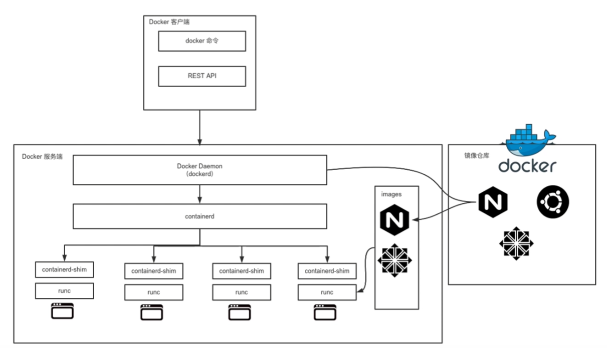
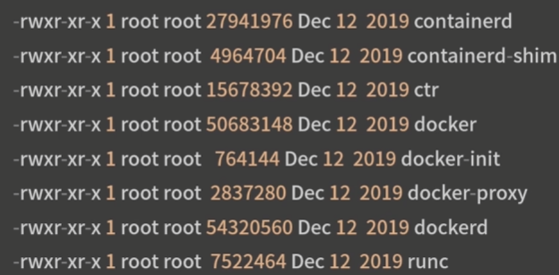
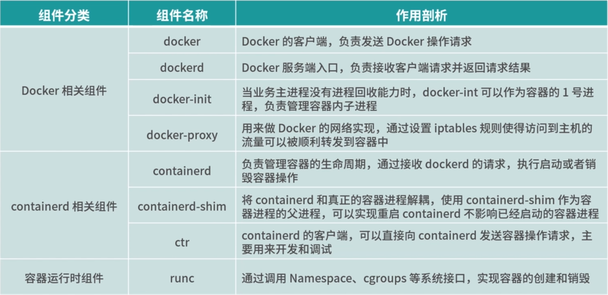

## Docker 的组件构成



docker 的服务架构采用 c/s 模式,主要由客户端和服务端组成. 客户端负责发生操作指令, 服务端负责接收并处理操作指令

客户端和服务段端通信有多种方式, 既可以在同一台机器上通过 Unix 套接字通信, 也可以通过网络远程通信

从整体架构可知, docker 架构可分为 docker 相关组件 containerd 相关组件, 和容器运行时相关组件

在	 docker 的安装路径下, 执行 ls 指令可以看到 docker 的相关组件:



这些组件根据职责可以分为以下三大类:

- Doceker 相关的组件: docker, docekred, docker-init 和 docker-proxy
- containerd 相关的组件: containerd, containerd-shim 和 ctr
- 容器运行时相关的组件: runc

## docker 相关的组件

### docker:

	docker 是一个二进制文件, 对用户可见的操作形式为 docker 命令, 通过 docker 命令可以完成所有的 Docker 客户端与服务端的通信, 通信过程为:

1. docker 组件向服务端发送请求后, 服务端根据请求执行具体的动作并将结果返回给 docker
2. docker 解析服务端返回的结果, 并将结果通过命令行标准输出展示给用户

### dockerd :

	dockerd 是 docker 服务端的常驻进程, dockerd 用来接收客户端发送的请求, 执行具体的处理任务, 完成后将结果返回给客户端, docker 客户端可以使用多种放是向 dockerd 发送请求,	我们常用的客户端与 dockerd 交互的方式有三种:

1. 通过 Unix 套接字与服务端通信, 配置格式为 unix://socket_path 默认 dockerd 生成的 socket 文件路径为 /var/run/docker.sock, 该文件只有 root 用户, 或者 docker 用户组的用户才能访问, 这就是为什么 docker 刚安装完成的时候只有 root 才能访问的原因
2. 通过 tcp 与 服务端通信, 配置格式为 tcp://host:port 通过设置 Docker 的 TLS 相关参数, 来保证数据传输的安全, 通过这种方式可以实现 客户端远程连接服务端, 但是在方便的同时也带有安全隐患, 因此, 在生产环境中你要使用 tcp 的方式与 docker 通信, 推荐使用 TLS 认证,通过设置 Docker 的 TLS 相关参数,来保证数据传输的安全
3. 通过文件描述符的方式与 dockerd 通信, 配置格式为: fd:// 这种格式一般用户 systemd 管理系统中

		docker 客户端与服务段的通信形式必须保持一致, 否则将无法通信,只有当 dockerd 监听了 docker unix 套接字客户端, 才能使用 unix 套接字的方式与服务端通信, unix 套接字也是 dockerd 默认的通信方式. 如果想通过远程的方式访问 dockerd, 可以在 dockerd 启动的时候添加 -H 参数指定监听的 HOST 和 PORT

### docker-init

	在 Linux 系统中, 1 号进程是 init 进程, 是所有进程的父进程, 主机上的进程出现问题时, init 进程可以回收这些问题进程.

在容器内部, 当业务进程没有回收子进程的能力时, 在执行 docker run 启动容器时可以添加 --init 参数,此时, docker 会将 docker-init 作为 1 号进程, 帮你管理容器内的子进程, 例如回收僵尸进程等.

### docker-proxy

	主要用来做端口映射的, 当使用 docker run 命令启动容器时, 如果使用了 -p 参数, docker-proxy 组件就会把容器内相应的端口映射到主机上来, 底层是依赖于 iptables 来实现的

启动一个 nginx 容器,并把容器的 80 端口映射到主机的 8080 端口

```sh
$ docker run --name=nginx -d -p 80:8080 nginx
a583fe9361780e73c419324306698ee65a24a468896d53f7dd77e3e36edb0fab
```

查看启动的容器ip

```sh
$ docker inspect --format "{{.NetworkSettings.IPAddress}}" nginx
172.17.0.2
```

使用 ps 指令查看主机上是否有 docker-proxy 进程

```sh
$ sudo ps aux |grep docker-proxy
root 9100 0.0 0.0 290772 9160 ? Sl 07:48 0:00 /usr/bin/docker-proxy -proto tcp -host-ip 0.0.0.0 -host-port 8080 -container-ip 172.17.0.2 -container-port 80
root 9192 0.0 0.0 112784 992 pts/0 S+ 07:51 0:00 grep --color=auto docker-proxy
```

可以看到当我们启动一个容器需要端口映射时,docker 为我们创建了一个docker-proxy 进程,并且通过参数,将我们传递的参数传递给docker-proxy 进程,然后 docker-proxy 通过 iptables 实现了端口转发

通过以下命令查看 iptables 查看 net 转发表的内容:

```sh
$ iptables -L -nv -t nat
Chain PREROUTING (policy ACCEPT 0 packets, 0 bytes)
 pkts bytes target     prot opt in     out     source               destination         
    0     0 DOCKER     all  --  *      *       0.0.0.0/0            0.0.0.0/0            ADDRTYPE match dst-type LOCAL

Chain INPUT (policy ACCEPT 0 packets, 0 bytes)
 pkts bytes target     prot opt in     out     source               destination         

Chain POSTROUTING (policy ACCEPT 0 packets, 0 bytes)
 pkts bytes target     prot opt in     out     source               destination         
    0     0 MASQUERADE  all  --  *      !docker0  172.17.0.0/16        0.0.0.0/0           
  521 31594 LIBVIRT_PRT  all  --  *      *       0.0.0.0/0            0.0.0.0/0           
    0     0 MASQUERADE  tcp  --  *      *       172.17.0.2           172.17.0.2           tcp dpt:8083
    0     0 MASQUERADE  tcp  --  *      *       172.17.0.2           172.17.0.2           tcp dpt:8082
    0     0 MASQUERADE  tcp  --  *      *       172.17.0.2           172.17.0.2           tcp dpt:8081

Chain OUTPUT (policy ACCEPT 0 packets, 0 bytes)
 pkts bytes target     prot opt in     out     source               destination         
  425 25500 DOCKER     all  --  *      *       0.0.0.0/0           !127.0.0.0/8          ADDRTYPE match dst-type LOCAL

Chain LIBVIRT_PRT (1 references)
 pkts bytes target     prot opt in     out     source               destination         
    2   165 RETURN     all  --  *      *       192.168.122.0/24     224.0.0.0/24        
    0     0 RETURN     all  --  *      *       192.168.122.0/24     255.255.255.255     
    0     0 MASQUERADE  tcp  --  *      *       192.168.122.0/24    !192.168.122.0/24     masq ports: 1024-65535
    0     0 MASQUERADE  udp  --  *      *       192.168.122.0/24    !192.168.122.0/24     masq ports: 1024-65535
    0     0 MASQUERADE  all  --  *      *       192.168.122.0/24    !192.168.122.0/24    

Chain DOCKER (2 references)
 pkts bytes target     prot opt in     out     source               destination         
    0     0 RETURN     all  --  docker0 *       0.0.0.0/0            0.0.0.0/0           
    0     0 DNAT       tcp  --  !docker0 *       0.0.0.0/0            0.0.0.0/0            tcp dpt:8083 to:172.17.0.2:8083
    0     0 DNAT       tcp  --  !docker0 *       0.0.0.0/0            0.0.0.0/0            tcp dpt:8082 to:172.17.0.2:8082
    0     0 DNAT       tcp  --  !docker0 *       0.0.0.0/0            0.0.0.0/0            tcp dpt:8081 to:172.17.0.2:8081
    0     0 DNAT       tcp  --  !docker0 *       0.0.0.0/0            0.0.0.0/0            tcp dpt:80 to:172.17.0.3:80

Chain KUBE-KUBELET-CANARY (0 references)
 pkts bytes target     prot opt in     out     source               destination
```

当我们访问主机的 80 端口时, iptables 会把流量转发到 172.17.0.3 的 80 端口,从而实现了我们从主机上可以直接访问容器内的业务

总体来说:

1. docker 是官方实现的标准客户端
2. dockerd 负责接收客户端发送的指令并返回相应的结果
3. docker-init 在业务主进程没有进程回收功能时十分有用
4. docker-proxy 组件是实现 Docker 网络访问的重要组件 

## containerd 组件

### containerd

containerd 组件是从 Docker 1.11 版本正式从 dockerd 中剥离出来的,完全遵循了 OCI 标准, 是容器标准化后的产物,并且是完全社区化运营的

因此被容器界广泛采用

containerd 不仅负责容器生命周期的管理,同时还负责一些其他的功能:

1. 镜像的管理,例如从镜像仓库拉取镜像到本地
2. 接收 dockerd 的请求, 通过适当的参数调用runc 启动容器
3. 管理存储相关的资源
4. 管理网络相关的资源

containerd 包含一个后台常驻进程, 默认的 socket 路径为 /run/containerd/containerd.sock

dockerd 通过 UNIX 套接字向 containerd 发送请求

containerd 接收到请求后负责执行相关的动作并把执行结果返回给 dockerd

如果你不想使用 dockerd ,也可以使用 containerd 来管理容器, 由于 containerd 更加简单和轻量, 现在更多的直接使用containerd 来管理容器

### containerd-shim

containerd-shim 的意思是垫片, 主要作用是将 containerd 和真正的容器进程解耦,使用 containerd-shim 作为容器进程的父进程,从而实现重启 containerd 不影响已经启动的容器进程

ctr 实际上是 containerd-ctr, 是 containerd 的客户端, 主要用来开发和调试

在没有 dockerd 的环境中, ctr 可以充当 docker 客户端的部分角色,直接向 containerd 守护进程发送操作容器的请求

### runc

容器的真正运行时

runc 是一个标准的 OCI 容器运行时的实现, 它是一个命令行工具, 可以用来直接创建和运行容器

演示 runc

准备容器运行时文件

```sh
$ cd /home/centos
## 创建 runc 运行根目录
$ mkdir runc
## 导入 rootfs 镜像文件
$ mkdir rootfs && docker export $(docker create busybox) |tar -C rootfs -xvf -
```

使用 runc spec 命令根据文件系统生成对应的 config.json 文件

```sh
$ runc spec
```

使用 cat 指令查看 config.json 文件的内容

```
$ cat config.josn
```

使用 runc run 命令直接启动 busybox 容器

```
$ runc run busybox
```

新打开一个命令行窗口, 使用 runc list 命令查看到刚才启动的容器

```sh
$ cd /home/centos/runc/
$ runc list
D     PID   STATUS    BUNDLE    CREATED       OWNED
busybox   9778    running   /home/centos/runc     2024-09-06T09:25:32.44195727Z   root
```

## 总结

1. docker 相关的组件负责发送和接受 Docker 请求
2. containerd 相关的组件负责管理容器的生命周期
3. runc 负责正真意义上创建和启动容器


