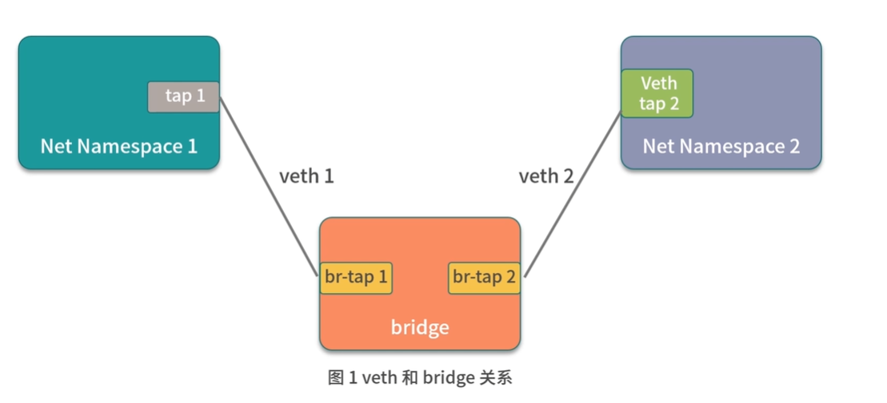
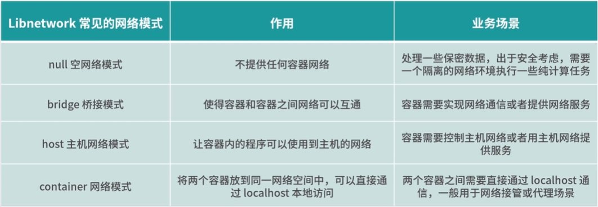

Docker 定义的网络模型标准: CNM(Container Network Model), 这里提一嘴, k8s 的网路服务并不直接使用 CNM, 而是采用了另一种容器网络模型: CNI(Container Network interface)

CNM(Container Network Model) 是 Docker 发布的容器网络标准,只要满足 CNM 接口的网络方案都可以接入到 Docker 容器网络

CNM 只是定义了网络的标准, 对于底层的实现并不关心, 这样便解耦了容器和网络, 使得容器的网络模型更加灵活

CNM 定义的网络标准包含三个元素:

1. 沙箱(Sandbox): 代表了一系列网络堆栈的配置,其中包含路由信息, 网络接口等网络资源的管理. 沙箱的实现通常是 linux 的net namespace,但也可以通过其他技术来实现,比如: free bsd jail
2. 接入点(endpoint): 接入点将沙箱链接到网络中, 代表容器的网络接口, 接入点的实现通常是 linux 的 veth 设备对
3. 网络(Network): 一组可以互相通信的接入点, 它将多接入点组成一个子网,并且多个接入点之间可以互相通信	 

CNM 的三个要素基本抽象了所的网络模型,使得网络模型的开发更加规范

为了更好构建网络标准,docker 团队把网络功能从 docker 中剥离出来,成为独立的项目, Libnetwork, 通过插件的形式为 Docker 提供网络功能, Libnetwork 是开源的, 使用 Golang 编写,完全遵循 CNM 网络规范, 是 CNM 的官网实现, Libnetwork 的工作流程也是围绕 CNM 的三个要素进行的

Libnetwork 是 docker 启动容器时来为 docker 容器提供网络接入功能的插件,  它可以让 docker 容器深入接入网络, 实现主机和容器网络的互通

## Libnetwork 的工作流程

第一步, Docker 通过调用 Libnetwork.New 函数来创建 Networkcontroller 实例

```golang
type NetworkController interface{
// 创建一个新的网络, options 参数用于指定特定性类型的网络选项
 NewNetwork(networkType, name string, id string, options...NetworkOption)(Network, error)
// ...此次省略部分接口
}
```

第二步, 通过调用 NewNetwork 函数创建指定名称和类型的 Network

```golang
type Network interface {
// 为该网路创建一个具有唯一指定名称的接入点 (Endpoint)
CreateEndpoint(name string, options...EndpointOption)(Endpoint, error)

// 删除网络
Delete() error
}
```

第三步, 通过调用CreateEndpoint 来创建接入点 (Endpoint)

```golang
// Endpoint 表示网络和杀向之间的逻辑连接
type Endpoint interface {
// 将沙箱连接到接入点, 并将为接入点分配的网络资源填充到沙箱中
Jion(sandbox Sendbox, options...EndpointOption)error
// 删除接入点
Delete(force bool) error
}
```

第四步,调用 NewSandbox 来创建容器沙箱, 主要是初始化 Namespace 相关资源

第五步, 调用 Endpoint 的 Join 函数将沙箱和网路接入点关联起来

Libnetwork 基于以上工作流程可以构建出多种网络模式, 以满足我们在不同场景下的网络需求

Libnetwork 提供的常见的四种网络模式, 这四种网络模式基本满足了我们单机容器的所有场景:

1. null 空网络模式, 构建一个没有网络接入的容器环境, 以保障数据安全
2. bridge 桥接模式, 可以打通容器与容器之间的网络通信需求
3.  host 主机网络模式, 可以让容器内的进程共享主机的网络, 从而监听或者修改主机网络
4. container 网络模式, 可以将两个容器放在同一个网络命名空间内, 让两个业务通过 localhost 即可实现互相访问

## null 空网络模式

有时候我们需要处理一些保密数据,处于安全考虑, 我们需要一个隔离的网络环境,执行一些计算任务, 这时候null 网络模式就排上用场了,这时候我们的容器就像一个没有联网的电脑, 处于一个相对安全的网络环境,确保我们的数据不会被他人从网络窃取,使用 Docker 创建 null 空网络模式时, 容器拥有自己独立的 Net Namespace ,但是,此时的容器并没有任务网络配置,没有创建任何网卡接口, IP 地址, 路由等网络配置

使用 docker run 命令启动容器时, 添加 --net=none 参数启动一个空网络模式的容器:

```sh
$ docker run --net=none -it busybox
```

使用 ifconfig 命令查看一下容器内的网络配置信息

```sh
ifconfig
lo  Link encap:Local Loopback
    inet addr:127.0.0.1 Mask:255.0.0.0
    UP LOOPBACK RUNNING MTU:65536 Metric:1
    RX packets:0 errors:0 dropped:0 overruns:0 frame:0
    TX packets:0 errors:0 dropped:0 overruns:0 frame:0
    collisions:0 txqueuelen:1000
    RX bytes:0(0.0 B) TX bytes:0 (0.0 B)
```

可以看到, 容器内除了net namespace自带的 lo 网卡, 并没有创建任何虚拟网卡

使用 route -n  命令查看一下容器内的路由信息

```sh
$ route -n
Kernel IP routing tablel
Destination     Gateway         Genmask         Flags Metric Ref    Use Iface
```

可以看到没有配置任何的路由信息

## bridge 桥接模式

docker 的 bridge 网络是启动容器时默认的网络模式

使用 bridge 网络可以实现容器与容器的互通, 可以从一个容器直接通过容器 IP 访问到另外一个容器

使用 bridge 网络可以实现主机与容器互通,在容器内启动的业务, 可以从主机直接请求

#### Linux veth

Linux veth 是实现 docker bridge 桥接模式的主要方式之一, veth 是 linux 中的虚拟设备接口, 都是成对出现的,就像一根网线, 可以用来链接虚拟网络设备, 例如: veth 可以用来连通两个 Net namespace,从而使得两个 Net Namespace 之间可以相互访问

#### linux bridge

Linux bridge 是一个虚拟设备, 是用来连接网络的设备,相当于物理网络中的交换机 可以用来转发两个 Net Namespace 内的流量



这其中:

#### veth = 网线

#### bridge = 交换机

通过交换机和网线,就可以将两个不同 net Namespace 的容器连通

docker 的 bridge 模式也是这种原理, docker 启动时, libnetwork 会在主机上创建 docker0 网桥, 相当于交换机, 从而 Docker 创建出的 bridge 模式的容器都会链接 docker0 上, 从而实现网络互通

 bridge 桥接模式是 docker 的默认网络模式,当我们创建容器时,不指定任何网路模式, docker 启动容器默认的网络模式是 bridge

## host 主机网络模式

有些基础业务需要创建或者更新主机的网络配置, 我们的程序必须以主机网络模式运行才能修改主机的网络, 这个时候就需要用到 docker host 的主机网络模式

1. 使用 host 的主机网络模式时, libnetwork 不会为容器创建新的网络配置 和 net namespace

2. Docker 容器中的进程直接共享主机的网络配置, 可以直接使用主机的网络信息, 也共享主机的端口号,所以当主机网络模式的时候, 容器已经使用端口号和主机的相同
3. 除了网络共享主机的网络外, 其他的包括进程, 文件系统, 主机名等都是与主机隔离的

host的主机网络模式通常适用于想要使用主机是网络, 但又不想把运行环境直接安装在主机上的场景中

启动一个主机网络模式的 busy box镜像

```sh
docker run -it --net=host busybox
```

然后使用 ip a 命令查看一下容器内的网络环境

```
$ ip a
```

发现和主机上的网络环境是一样的

## container 网络模式

container 网络模式允许一个容器共享另一个容器的网络命名空间, 当两个容器需要共享网络, 但其他资源仍然需要隔离时,既可以使用 container 网络模式

例如, 我们开发了一个 http 服务, 但想使用 nginx 的一些特性, 让nginx 代理外部的请求, 然后转发给自己的业务, 这时, 我们使用 container 网络模式, 将自己开发的网络服务和 ngnix 部署到同一个网络命名空间中, 

启动两个容器使用container 网络模式,使用方式如下:

```sh
docker run -d --name=busybox1 busybox sleep 3600
```

创建第二的容器和第一个容器使用相同的 net namespace, 使用 container 网络模式

```sh
docker run --it --net=container:busybox1 --name=busybox2 busybox sh
```

使用 ifconfig 查看两个容器的的网络配置, 包括 ip 都是一样的, 端口号的使用情况都是一样的

## 总结



Libnetwork 的工作流程是完全围绕 CNM 的三个要进行的

k8s 最终选择了 CNI 作为容器网络的定义标准
