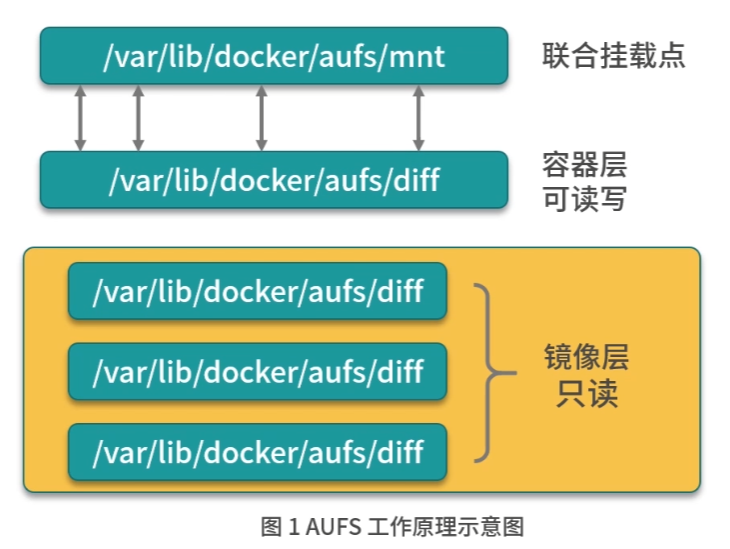
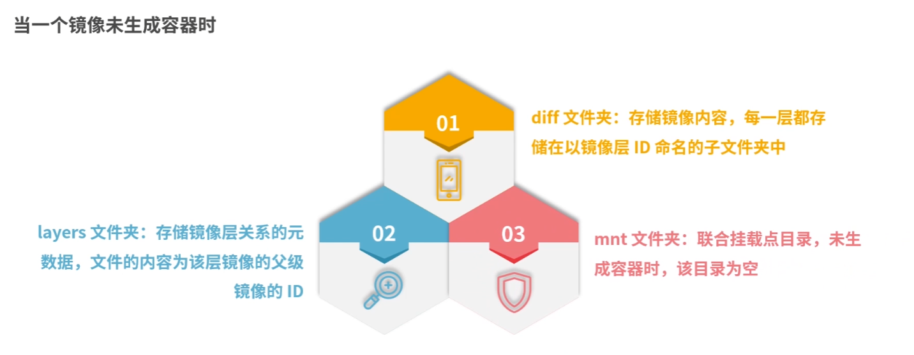
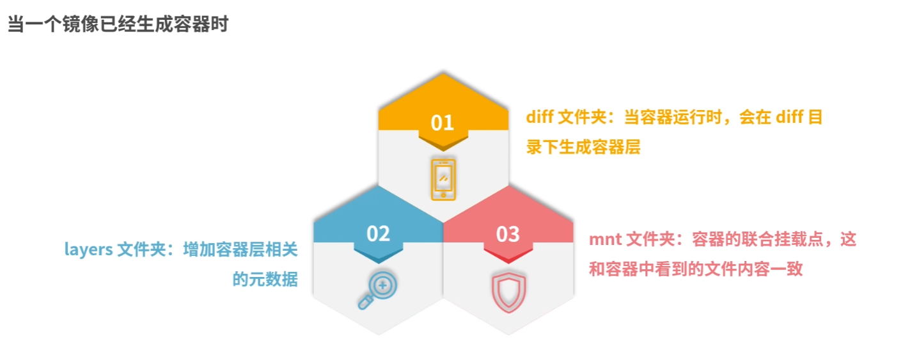
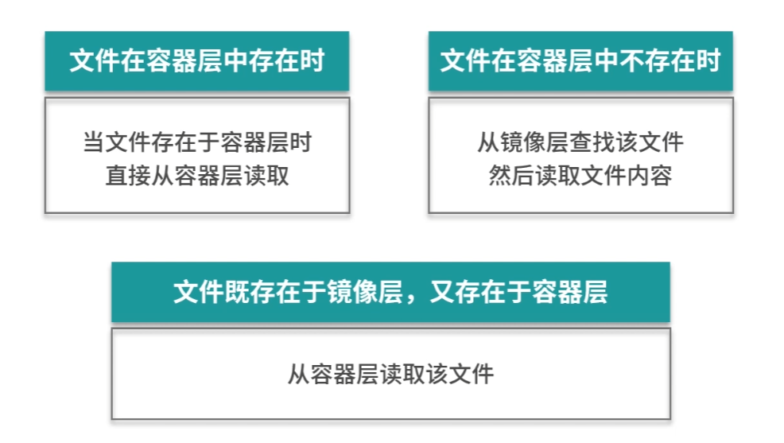
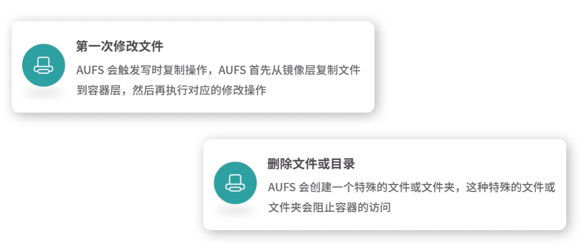

Docker 主要是基于 Namespace、cgroups 和 联合文件系统 这三大核心技术实现的

## 什么是联合文件系统

==联合文件系统==（Union File System, Unionfs）是一种分层的轻量级文件系统， 它可以把多个目录内容联合挂载到同一目录下， 从而形成一个单一的文件系统

这种特性可以让使用者像是使用一个目录一样使用联合文件系统 

#### ==联合文件系统== 对于docker 来说是一个怎样的存在呢？

联合文件系统是 Docker 镜像和容器的基础

因为它可以使 Docker 可以把镜像做成分层的结构， 从而使得镜像的每一层可以被共享

例如， 两个业务的镜像都是基于 centos7 镜像构建的，那么这两个业务镜像在物理机上只需要存储一次 centos7 的基础镜像， 从而节省了大量的存储空间。

## 如何实现联合文件系统呢

Docker 中最常见的联合文件系统有三种:

1. AUFS
2. Devicemapper
3. OverlayFs

## AUFS

AUFS 是 Docker 最早使用文件系统驱动，多用于 Ubuntu 和 Debian 系统中

在 Docker 早期，Overlayfs 和 Devicemapper 相对不够成熟， AUFS 是最早也是最稳定的文件系统驱动

aufs 目前并未合并到 linux 内核主线，因此只有 ubuntu 和 debian 等少数操作系统支持 aufs

查看系统是否支持 AUFS

```sh
grep aufs /proc/filesystems 
nodev   aufs
```

AUFS 推荐在 Ubuntu 或者 Debian 操作系统下使用， Centos 等操作系统需要单独安装 AUFS 模块

#### Docker 配置AUFS 作为联合文件系统

在 /etc/docker 下新建 daemon.json 文件， 并写入一下内容：

```json
{
  "storage=driver":"aufs"
}
```

使用 docker info 命令即可查看配置是否生效：

```sh
(transfromer) root@gpu1:~# docker info
Client:
 Version:    26.1.3
 Context:    default
 Debug Mode: false
 Plugins:
  buildx: Docker Buildx (Docker Inc.)
    Version:  v0.10.0
    Path:     /root/.docker/cli-plugins/docker-buildx

Server:
 Containers: 42
  Running: 12
  Paused: 0
  Stopped: 30
 Images: 65
 Server Version: 26.1.4
 Storage Driver: aufs
  Backing Filesystem: extfs
  Supports d_type: true
  Using metacopy: false
  Native Overlay Diff: true
  userxattr: false
 Logging Driver: json-file
 Cgroup Driver: systemd
 Cgroup Version: 1
 Plugins:
  Volume: local
  Network: bridge host ipvlan macvlan null overlay
  Log: awslogs fluentd gcplogs gelf journald json-file local splunk syslog
 Swarm: inactive
 Runtimes: io.containerd.runc.v2 nvidia runc
 Default Runtime: nvidia
 Init Binary: docker-init
 containerd version: ae71819c4f5e67bb4d5ae76a6b735f29cc25774e
 runc version: 6b8589dcb4dead72ab64f14a5912886e6165c079
 init version: 
 Security Options:
  apparmor
  seccomp
   Profile: builtin
 Kernel Version: 5.15.0-119-generic
 Operating System: Ubuntu 20.04.6 LTS
 OSType: linux
 Architecture: x86_64
 CPUs: 80
 Total Memory: 125.8GiB
 Name: gpu1
 ID: e694b678-11a9-4885-b7ed-600c57b3faa0
 Docker Root Dir: /data/docker-data/default
 Debug Mode: false
 Experimental: false
 Insecure Registries:
  ai.idocker.io
  dockerhub.kubekey.local
  idocker.io
  tdocker.io
  127.0.0.0/8
 Registry Mirrors:
  https://hub.teeeet.top/
 Live Restore Enabled: false
 Product License: Community Engine
```

可以看到这里已经生效了

配置生效后就可以使用 aufs 为 docker 提供联合文件系统服务了

## AUFS 是如何工作的呢

aufs 是联合文件系统， 意味着它在主机上使用多层目录存储，每一个目录在 AUFS 中都叫作 ==分支== ， 在 Docker 中称之为 ==层==（layer）最终呈现给用户的则是一个普通单层的文件系统， 我们把==多层以单一层的方式呈现出来的过程== 叫做 ==联合挂载==



 每个镜像层和容器层都是 /var/lib/docker 下的一个子目录，镜像曾和容器层都在 aufs/diff 目录下，每一层的名称都是镜像或者容器的 id 值，联合挂载点在/var/lib/docker/aufs/mnt 目录下， mnt 目录是真正的容器工作目录





aufs 的工作过程中对文件的操作分为读取文件和修改文件

#### 读文件



#### 写文件



当文件或者目录被删除时， aufs 并不会真正的从镜像中删除它，因为镜像层是只读的，aufs 会创建一个特殊的文件或者文件夹，这种特殊的文件或者文件夹会阻止容器的访问。 

## 实例演示 AUFS

1. 在 /tmp 目录下创建 aufs 目录
   ```sh
   $cd /tmp && mkdir aufs
   ```

2. 准备挂载点目录
   ```sh
   /tmp $cd aufs && mkdir mnt
   ```

3. 准备容器层内容
   ```sh
   ## 创建容器层目录
   /tmp/aufs $mkdir container1
   ## 在容器层目录下准备一个文件
   /tmp/aufs $echo Hello,Container layer! > container1/container1.txt
   ```

4. 准备镜像层内容
   ```sh
   ## 创建两个镜像层目录
   /tmp/aufs $mkdir image1 && mkdir image2
   ## 分别写入数据
   /tmp/aufs $echo Hello,Image layer1! > image1/image1.txt
   /tmp/aufs $echo Hello,Image layer2! > image2/image2.txt
   ```

5. 准备好的目录层级结构如下：
   ```sh
   /tmp/aufs $tree .
   .
   |--container1
   |       |
   |       --container1.txt
   |--image1
   |       |
   |       --image1.txt
   |--image2
   |       |
   |       --image2.txt
   ---mnt
   4 directories, 3 files
   ```

6. 使用mount 命令可以创建 AUFS 类型的文件系统
   ```sh
   /tmp/aufs $ sudo mount -t aufs -o dirs=./container1:./image2:./image1 none ./mnt
   ```

		==注意==： dirs 参数第一个冒号默认为读写权限， 后面的目录均为只读权限， 与 docker 容器使用 AUFS 的模式一致

		执行完上述命令后， mnt 变成了 aufs 的联合挂载目录

7. 使用 mount 命令查看已经创建的AUFS 文件系统
   ```sh
   /tmp/aufs $mount -t aufs 
   none on /tmp/aufs/mnt type aufs (rw, relatime, si=4174b83d649ffb7c)
   ```

8. 我们每创建一个 aufs 文件系统， aufs 都会为我们生成一个 id 这个 id 在/sys/fs/aufs 会创建对应的目录， 在这个 ID 的目录下可以查看文件挂载的权限
   ```sh
   /tmp/aufs $ cat /sys/fs/aufs/si_4174b83d649ffb7c/*
   /tmp/aufs/container1=rw
   /tmp/aufs/image1=ro
   /tmp/aufs/image2=ro
   64
   65
   66
   ```

9. 验证 mnt 目录下可以看到 conainer1, image1, image2 下的所有内容，使用 ls 命令查看 mnt 目录
   ```sh
   /tmp/aufs $ ls -l mnt/
   total 12
   -rw-rw-r-- l ubuntu ubuntu 24 Sep 9 16:55 container1.txt
   -rw-rw-r-- l ubuntu ubuntu 24 Sep 9 16:59 image1.txt
   -rw-rw-r-- l ubuntu ubuntu 24 Sep 9 16:59 image2.txt
   ```

10. 验证 aufs 的写时复制，写时复制是指在容器中只有需要修改某个文件时， 才会把文件从镜像层复制到容器层， 通过修改联合挂载目录mnt 下的内容来验证这一过程
    ```sh
    /tmp/aufs $ echo Hello, Image layer1 changed! > /mnt/image1.txt
    ```

11. 查看 image1/image1.txt 的文件内容
    ```sh
    /tmp/aufs $cat image1/image1.txt
    Hello,Image layer1!
    ```

		可以看到，没有变化

12. 然后查看一下容器层对应的 image1.txt 文件
    ```sh
    /tmp/aufs$ ls -l container1/
    total 8
    -rw-rw-r-- 1 ubuntu ubuntu 24 Sep 9 16:55 container1.txt
    -rw-rw-r-- 1 ubuntu ubuntu 24 Sep 9 17:55 image1.txt
    ## 查看文件内容
    /tmp/aufs$ cat container1/image1.txt
    Hello,Image layer1 changed!
    ```

		可以看见，aufs 在容器层自动创建了 image1.txt 文件， 并且内容为刚才写入的内容，由此可以看出 aufs 是写时复制的，在第一次修改镜像内某个文件时， AUFS 会复制这个文件到容器层， 然后再容器层对该文件进行修改操作。

联合文件系统是一种分层的轻量级文件系统，它可以把多个目录的内容联合挂载到同一目录下，从而形成一个单一的文件系统
