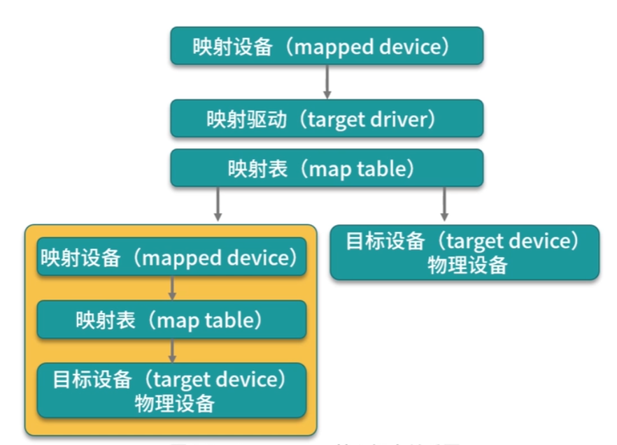

由于 aufs 目前并未合并到 linux 内核主线，只有 ubuntu 和 debian 等少数操作系统支持 aufs， 因此比较常用的 ==联合文件系统== 是 == Devicemapper== 

AUFS 是一种文件系统

Devicemapper 从 Linux 内核 2.6.9 版本开始引入， 是 ==一种映射块设备的技术框架==

目前 Linux 下比较流行的 LVM 和 软件磁盘阵列都是基于 Devicemapper 机制实现的

## Devicemapper 的关键技术

devicemapper 将主要的工作部分分为：

1. 用户空间
   
   负责配置具体的设备映射策略与相关的内核空间控制逻辑
   
   例如：逻辑设备 dma 如何与 物理设备 sda 相关联， 怎么建立逻辑设备和物理设备的映射关系等
2. 内核空间
   
   负责用户空间配置的关联关系实现
   
   例如：当 io 请求到达虚拟设备 dma 时，内核空间负责接管 io 请求，然后处理和过滤这些 io 请求，并转发到具体的设备 sda 上， 这个架构类似于 cs 架构的工作模式，客户端负责具体的规则定义和配置下发，服务端根据客户端配置的规则来执行具体的处理任务

## Devicemapper 的工作机制主要围绕三个核心概念

1. 设备映射（mapped device）
   
   即对外提供的逻辑设备， 是由 Devicemapper 模拟的一个虚拟设备， 并不真正存在于宿主机上的物理设备
2. 目标设备（target device)
   
   是映射设备对应物理设备或者物理设备的某一个分段，是真正存在于物理机上的一个设备
3. 映射表（map table)
   
   记录了映射设备在目标设备的起始地址、范围和目标设备的类型等变量

Devicemapper 在内核中通过很多模块化的映射驱动（target driver) 插件实现了 ==对真正 IO 请求的拦截、过滤和转发工作== 比如 Raid、软件加密、廋供给（Thin Provisioning) 等。

其中廋供给模块是 Docker 使用 devicemapper 技术框架中非常重要的模块

## 瘦供给（Thin Provisioning)

==瘦供给== 的意思是 ==动态分配==

是我们需要多少磁盘空间， 存储驱动就帮我们分配多少磁盘空间，是基于快照实现的

==全球网络存储工业协会 SNI（StorageNetworking Industry Association）对快照（Snapshot）的定义：==

关于制定数据集合的一个完全可用的拷贝，该拷贝包括相应数据在某个时间点（拷贝开始的时间点）的映像。快照可以是其所表达的数据的一个副本，也可以是数据的一个复制品

## Docker 是如何使用瘦供给来做到像 AUFS 那样分层存储文件的？

docker 使用了瘦供给的快照（snapshot）技术

当 docker 使用 Devicemapper 作为文件存储驱动时，==docker 将镜像和容器文件存储子啊瘦供给池（thinpool）中，并将这些内容挂载在/var/lib/docker/devicemapper/目录下
