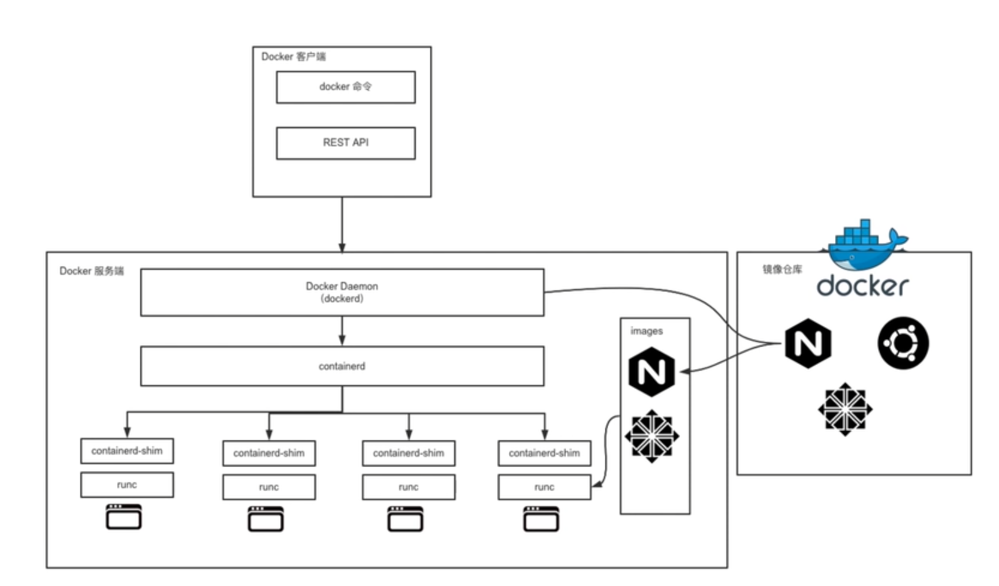
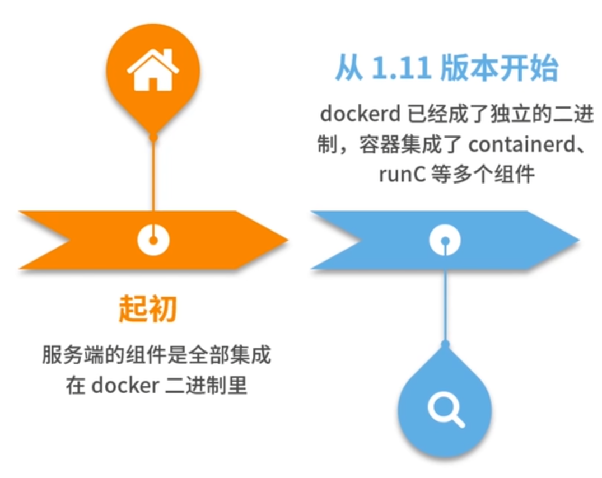
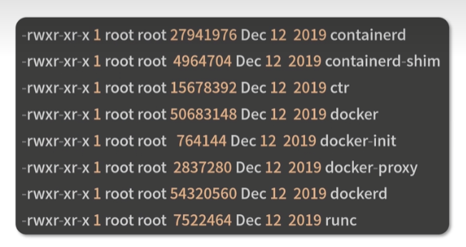

# 核心概念:镜像,容器,仓库

## docker 的三大核心概念

### 镜像

==镜像==是一个只读的文件和文件夹组合,是 Docker 容器启动的先决条件,它包含了容器运行时所需要的所有基础文件和配置信息,是容器启动的基础

想要使用一个镜像有以下两种方式:

- 自己创建镜像:
  - 基于 centos 镜像制作自己的业务镜像:
    - 安装部署 nginx 服务
    - 部署应用程序
    - 做一些自定义配置
- 从功能镜像仓库拉取别人制作好的镜像:
  - 常用的软件或者系统,例如:
    - nginx
    - ubunut
    - centos
    - mysql
      ```
        可以到 Docker hub 搜索并下载
      ```

### 容器

  		==容器==是镜像运行的实体,镜像是静态的只读文件,容器带有运行时带有的可读写层,并且容器中的进程处于运行状态,容器运行着真正的应用进程,容器的五种状态有:

- 初建
- 运行
- 停止
- 暂停
- 删除
  
  	==容器的本质==是主机上运行的一个进程,但容器有自己独立的命名空间隔离和资源限制,在容器内部,无法看到主机上的进程,环境变量,网络信息等,早期容器的编排技术有三大主力:
- Docker Swarm
- kubernetes
- Mesos
  
  ==OCI== 全称 ==开放容器标准==(Open Container Initiative) 是一个轻量级,开放的治理结构,OCI 组织于 2015 年成立,并指定了两个标准:
- 容器运行时标准( runtime spec)
- 容器镜像标准 ( image speec)

  docker 架构

  

		可以看到 docker 的架构是 c/s 架构,主要由客户端和服务端两大部分组成,客户端和服务端通信有多种方式,既可以在同一台机器上使用 unix 套接字通信,也可以通过网络连接进行远程通信,一下是两大部分的内容:

- 客户端: 主要用于发送指令
  - docker 命令: Docker 用户与 Docker 服务端交互的主要方式
  - 使用直接请求 REST API 的方式与 Docker 服务端交互
  - 使用各种语言的 SDK 与 Docker 服务端交互:
    - go
    - java
    - python
    - php
- 服务端: 主要用于接受处理指令,是Docker 所有后台服务的统称:
  - dockerd 是一个非常重要的管理进程,负责响应和处理来自 Docker 客户端的请求,然后将客户端的请求转化为 Docker 的具体操作:
    - 镜像
    - 容器
    - 网络
    - 挂载卷
    - ...
  
  

docker 1809.2 版本的服务端组件详情:

	

其中比较重要的两组件是:

- runc
  
  是 docker 官方按照 OCI 容器运行时实现的一个标准,用来运行容器的轻量级工具,是真正用来运行容器的
- containerd
  
  是 docker 服务端的一个核心组件, 是从 dockerd 中剥离出来的,它的诞生完全遵循 OCI 标准,是容器标准化后的产物,通过 containerd-shim 启动并管理容器 runc,可以说 containerd 真正管理了容器的生命周期. 通过 grpc 和 dockerd 通信.由于与真正的容器运行 runc 中间有了 containerd 这一 OCI 标准层,使得 dockerd 可以确保接口向下兼容

通过启动一个容器,来验证 dockerd, containerd, runc 之间的进程关系:

- 启动一个 busybox 容器

```sh
docker run -d busybox sleep 3600
```

- 查看 dockerd 的 pid

```
ps aux |grep dockerd
root 4147 0.3 0.2 1447892 83236? Ssl Jul09 245:59 /usr/bin/dockerd
```

- 使用 pstree 命令查看进程父子关系

```
pstree -l -a -A 4147
```

dockerd 启动的时候 containerd 就随之启动了,dockerd 和 containerd 就一直存在,当执行docker run 命令时, containerd 就会创建 containerd-shim 充当垫片进程,然后启动容器的真正进程,这个架构图和 docker 架构图中展示的 docker 服务器部分是一摸一样的

### 仓库 
