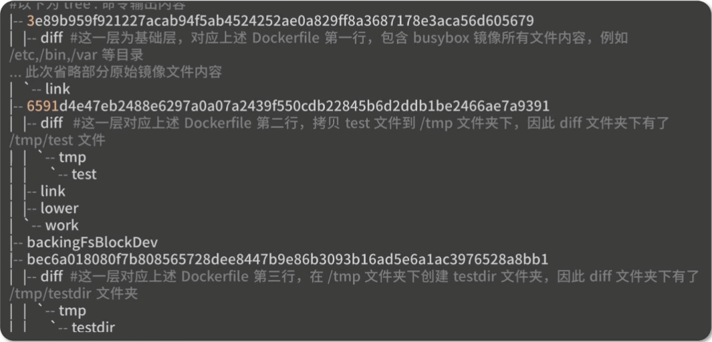
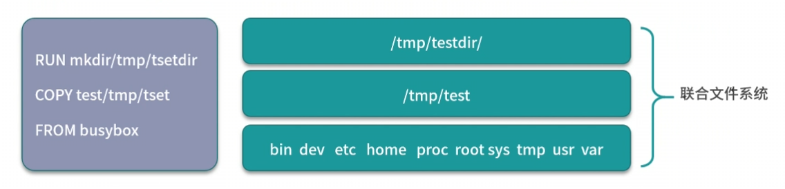

# 镜像使用: Docker 环境下如何配置你的镜像

## 1.讲解镜像的基本操作

镜像:

1. 是一个只读的 Docker 容器模板,包含启动容器所需要的所有文件系统结构和内容,简单来说,镜像是一个特殊的文件系统,他提供了程序运行时所需要的程序,软件库,资源,配置等静态数据.
2. 镜像不包含任何动态数据.镜像内容在构建后不会被改变
3. 同样的镜像不同的名字镜像的 id 是一样的,实际上不同的名字指向同一镜像文件
4. 镜像的操作:
   1. docker pull: 拉取镜像:
      ```sh
      docker pull [Registry]/[Repository]/[Image]:[Tag]
      ```
      
      其中参数指令解释如下:
      1. Registry: 注册服务器,docker 默认会从 docker.io 拉取镜像,如果你有自己的镜像仓库,可以把它替换为自己的镜像仓库
      2. Repository: 镜像仓库,通常把一组相关联的镜像归为一个镜像仓库 libarary 为docker 默认的镜像仓库
      3. Image: 镜像名称
      4. tag:  镜像的标签,如果你不指定拉取的镜像标签默认拉取的镜像标签为 lastest
      
      实际上执行docker pull 命令会先在本地搜索,在本地搜索不到镜像再在docker 仓库中拉取镜像
   2. docker build: 构建镜像
      
      镜像构建指令:
      ```sh
      docker build -f [DOCKERFILE] -t [Registry]/[Repository]/[Image]:[Tag] .
      ```
      
      dockerfile 的介绍:
      1. dockerfile: 一个描述镜像构建过程的明文文件
      2. dockerfile 的每一行都会生成一个独立的镜像层,并且拥有唯一的ID
      3. dockerfile 的命令是完全透明的,通过查看 dockerfile 的内容,可以知道镜像是如何一步步构建的
      4. dockerfile 是纯文本的,方便跟随代码一起存放在代码仓库并作版本管理
      
      dockerfile 的指令:
      1. FROM: dockerfile 除了注释第一行必须是 FROM, FROM 后面跟随镜像名称,代表我们要基于哪个基础镜像构建我们的容器
      2. RUN: 后面跟随一个具体的命令,类似 linux 命令行执行命令
      3. ADD: 拷贝本机文件或者远程文件到镜像内
      4. COPY: 拷贝本机文件到镜像内
      5. USER: 指定容器启动的用户
      6. ENTRYPOINT: 容器的启动命令
      7. CMD: CMD 为 ENTRYPOINT 指令提供默认参数,也可以单独使用 CMD 指定容器启动参数
      8. ENV: 指定容器运行时的环境变量,格式为: key=value 
      9. ARG: 定义外部变量,构建镜像时可以使用: build-arg <valuename>=<value> 的格式传递参数用于构建
      10. EXPOSE: 指定容器监听的端口,格式为: [port]/tcp 或者 [port]/udp
      11. WORKDIR: 为 dockerfile 中跟在其后的所有 RUN, CMD, ENTRYPOINT,COPY和ADD 命令设置工作目录
   3. docker commit: 基于已有容器构建镜像
      ```sh
      docker commit [CONTAINER_NAME/CONTAINER_ID] [TARGET_NAME][:TAG]
      ```
   4. docker rmi/docker image rm: 镜像删除
      ```
      docker rmi [TARGET_NAME][:TAG]
      ```
   5. docker images/docker image ls: 查看镜像, 列出本地所有镜像
      
      要查询特别名字的镜像可以使用:
      ```sh
      docker image ls busybox
      ```
      
      来查询所有叫 bosybox 的镜像
   6. docker tag:重命名镜像
      ```sh
      docker tag [SOURCE_IMAGE][:TAG] [TARGET_IMAGE][:TAG]
      ```
   7. docker run: 从镜像启动容器
   8. docker save:将镜像保存为文件
      ```dockerfile
      docker save [IMAGENAME]:[TAG] -o [FILENAME].tar
      ```
   9. docker load:将文件加载为镜像
      ```sh
      docker load -i [FILENANE].tar
      ```

## 2.介绍镜像的实现原理

```
    Docker 镜像是由一系列镜像层(layer) 组成的,每一层代表了镜像构建过程中的一次提交
```

尝试构建以下镜像:

```dockerfile
FROM busybox
COPY test /tmp/test
RUN mkdir  /tmp/testdir
```

在 test 文件夹下使用以下指令构建镜像:

```sh
docker build -f Dockerfile -t mybusybox .
```

这里我的docker 所使用的是 overlayer2 文件驱动,进入到以下目录:

```
cd /var/lib/docker/overlay2
```

使用以下指令查看镜像文件:

```
tree
```



通过图片可以看到,dockerfile 的每一层都生成了一个镜像层



Docker镜像静态的分层管理的文件组合,镜像底层的实现依赖于联合文件系统(UnionFS)

镜像是由一系列的镜像层(layer) 组成,每一层代表了构建镜像过程中的一次提交,当需要修改镜像内的某个文件时,只需要在当前镜像层的基础上新建一个镜像层,并且只存放修改过的文件内容
