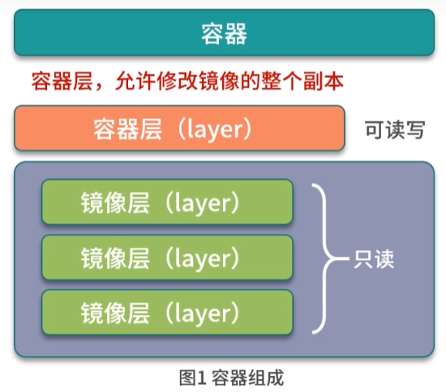
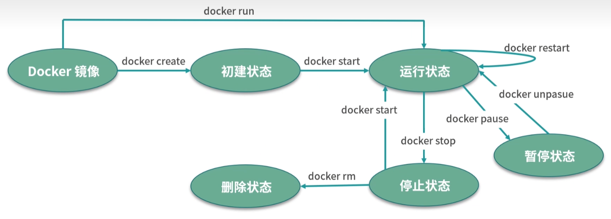
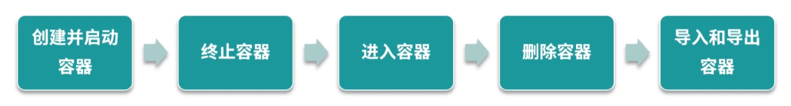

# 得心应手掌握 docker 容器基本操作

## 什么是容器

容器是基于镜像创建的可运行实例,并且单独存在,一个镜像可以创建出多个容器



运行容器化的环境时,实际上是在容器内部创建该文件系统的读写副本,这将创建一个容器层,该层允许修改镜像的整个副本

## 容器的生命周期

1. created: 初建状态
2. running: 运行状态
3. stopped: 停止状态
4. paused: 暂停状态
5. deleted: 删除状态
   
   各生命周期的转换关系如图所示:
   
   
   
   

## 容器常用的基本操作指令

### 1. 开启容器

   执行docker run 命令:

```sh
docker run -it --name=busybox busybox
```

   -t: 分配一个伪终端

   -i: 打开终端的 stdin

   同时使用 -it 指令可以进入交互模式,在交互模式下,用户可以通过所创建的终端来输入命令

   杀死容器中的主进程,也就是 1 号进程,容器也会被杀死

   docker run 创建并启动容器时, docker 后台的执行流程为:

1. docker 会检查本地是否存在 busybox 镜像,如果镜像不存在,则从docker hub 中拉取 busybox 镜像
2. 使用 busybox 镜像创建并启动一个容器
3. 分配文件系统,并在镜像只读层外创建一个读写层
4. 从 docker ip 池中分配一个ip 给容器
5. 执行用户的启动命令运行镜像

### 2. 终止容器

1. 停止运行中的容器:

```sh
docker stop [-t] --time[=10]
```

该命令首先会向运行中的容器发送 SIGTERM 信号,如果容器的 1 号进程能够接受并且处理 SIGTERM 信号,则等待容器 1 号进程处理完毕后退出,如果等待一段时间后,容器仍然没有退出,则会向容器的一号进程发送 SIGKILL 强制终止容器

2. 查看停止状态的容器信息:

```sh
docker ps -a
```

3. 处于终止状态的容器启动指令:

```sh
docker start [CONTANER_NAME/CONTAINER_ID]
```

4. 重启一个容器:

```sh
docker restart [CONTANER_NAME/CONTAINER_ID]
```

命令会将容器终止,并重新启动它

### 3. 进入容器

```sh
docker attach
```

注意: 同时使用 docker attach 命令同时在多个终端中运行时,所有的终端窗口将同步显示相同的内容,当某个命令行窗口的命令阻塞时,其他的窗口同样也无法操作

```sh
docker exec -it [CONTANER_NAME/CONTAINER_ID] sh
```

注意: docker exec 主要是在容器中启动进程,只是被用作启动 bash 交互式的进入容器,exec 可以不止执行 bash 指令,相同的 -it 交互式的执行指令,指令在推出交互的时候退出

```sh
nsenter
```

### 4. 删除容器

指令使用格式如下:

```sh
docker rm [OPTIONS] [CONTANER_NAME/CONTAINER_ID]
```

1. 删除一个已经停止的容器:

```sh
docker rm [CONTANER_NAME/CONTAINER_ID]
```

2. 删除一个正在运行中的容器:

```sh
docker rm -f/--force [CONTANER_NAME/CONTAINER_ID]
```

docker 会发送 SIGKILL 参数强行终止正在运行中的容器

### 5. 导出容器

导出一个容器到文件:

```sh
docker export [CONTANER_NAME/CONTAINER_ID] > [FILENAME].tar
```

会在当前文件夹下生成 tar 文件,可以将当前文件拷贝到其他机器上,通过导入命令实现容器的迁移

### 6. 导入容器

从文件中导入容器:

```sh
docker import [OPTINES] file | URL [REPOSITORY:[tar]]
```

执行完 docker import 后会变为本地镜像,最后再使用docker run 命令启动该镜像

## 结语

### 镜像

镜像包含了容器运行所需要的文件系统结构和内容,只是静态只读文件

### 容器

容器是在镜像的只读层上创建了可写层,并且容器中的进程属于运行状态,容器是正真的应用载体
