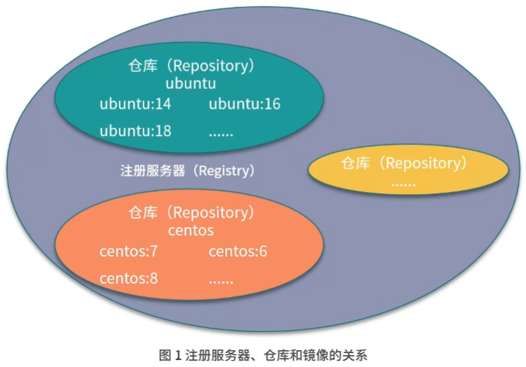
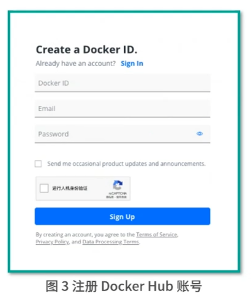
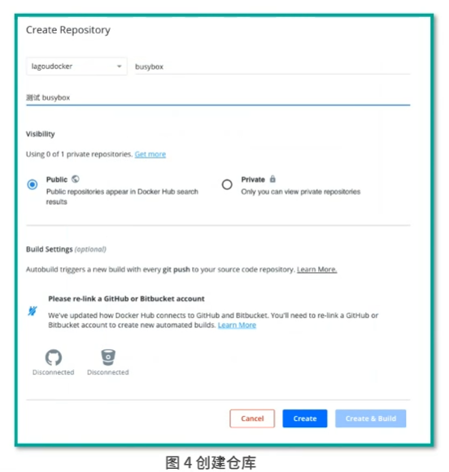
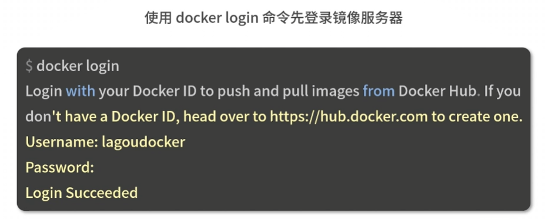

其实我们不仅可以使用公共的镜像仓库,存储和分发镜像,也可以搭建自己的私有镜像仓库

## 仓库

是存储和分发 Docker 镜像的地方

Docker Hub 是用来提供 Docker 镜像存储和分发的地方

镜像仓库类似于代码仓库, docker hub 的名称来自于 github

github 是我们常用的代码仓库,存储和分发的地方

同样 docker hub 也是用来提供 docker 镜像存储和分发的地方

### 注册服务器和仓库的概念



#### 注册服务器

		是用来存放仓库的实际服务器

#### 仓库

		可以被理解为一个具体的项目或者目录

<br/>

注册服务器可以包含很多个仓库,每个仓库又可以包含很多个镜像

按照类型,我们可以把镜像仓库分为 ==公共镜像仓库== 和 ==私有镜像仓库==

## 公共镜像仓库

		公共镜像仓库一般是 Docker 官方或者其他第三方组织(阿里云, 腾讯云, 网易云) 提供的,允许所有人注册和使用的镜像仓库, docker hub 是全球最大的镜像市场, 目前已经有超过 10 万个容器镜像, 这些容器镜像主要来软件供应商, 开源组织和社区,大部分的操作系统和软件镜像都可以直接在 docker hub 下载并使用

### 注册 Docker hub 账号





登录镜像服务器指令:

```
docker login
```

这时 docker 会要求我们输入账户名和密码,输入我们刚才注册的账号和密码,看到 login succeed 表示登录成功,登录成功后就可以推送镜像到自己创建的镜像仓库了



## 搭建私有镜像仓库

### Distribution

仅满足了镜像存储和管理的功能,用户权限管理相对较弱,并且没有管理界面

### Harbor

企业级镜像管理软件,拥有 rbac(基于角色的访问控制),管理用户界面以及审计等非常完善的功能