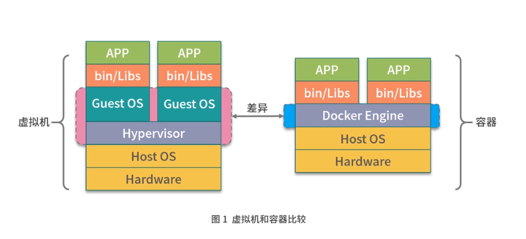
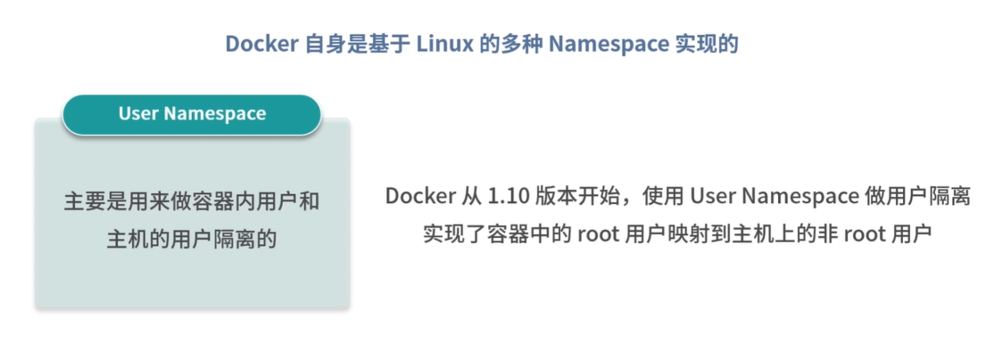
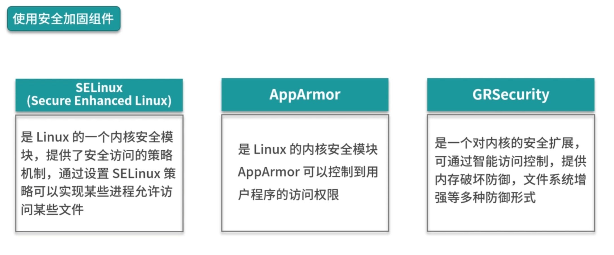
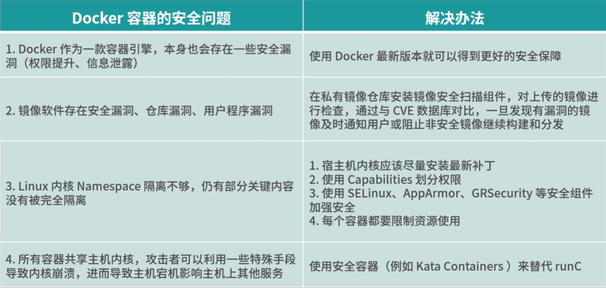

### Docker 是基于 Linux 内核的 Namespace 技术实现资源隔离的,所有的容器都共享主机的内核

Docker 与虚拟机的区别:

### 虚拟机:

是通过管理系统,模拟出 cpu, memory, network 等硬件,然后在这些虚拟硬件上创建出客户内核和操作系统,这样的做的好处是虚拟机有自己的内核和操作系统,并且硬件都是通过虚拟机管理系统模拟出来的,用户程序无法直接使用到主机的硬件资源和操作系统.因此虚拟机对有隔离性和安全性有着更好的保障.

### docker:

而 docker 容器则是通过 linux 内核的 namespace 技术, 实现了文件系统,进程,设备以及网络的隔离,然后再通过 cgroups 对 cpu, 内存等资源进行限制,最终实现了容器之间相互不受影响.由于容器的隔离性仅仅依靠内核提供,因此容器的隔离性也远弱于虚拟机. 

### 虚拟机安全性比 docker 容器好为何还要选择容器的原因:

容器的性能损耗非常小,并且镜像也非常小,容器秒级的启动等待性也非常匹配业务快速迭代的业务场景

### Docker 自身安全

CVE 目前已经记录了多项与 Docker 相关的安全漏洞,主要有权限提升,信息泄露等几类安全问题, Docker 官方记录的安全问题可以参考:(https://docs.docker.com/engine/security/non-events/)

### 镜像安全

1. 镜像软件存在安全漏洞,镜像内部要安装软件包,如果软件包存在安全漏洞,镜像也会存在安全隐患
2. 仓库漏洞,镜像仓库被攻击然后被串改镜像
3. 用户程序漏洞

尽管目前 namespace 已经提供了非常多的资源隔离类型,但是仍有部分关键内容没有被完全隔离,其中包括一些系统的关键性目录(如: /sys, /proc等)

仅仅依靠 namespace 的隔离是完全不够的,一旦内核的 namespace 被突破,使用者就有可能直接获取到主机的超级权限,从而影响主机的安全甚至整个超算中心的安全.

由于同一宿主机上所有容器共享主机内核,攻击者可以利用一些特殊手段导致内核崩溃,进而导致主机宕机影响主机上的其他服务

在私有镜像仓库安装镜像安全扫描组件,对上传的镜像进行检查,通过与 CVE 数据库对比,一旦发现有漏洞的镜像,及时通知用户,或者阻止非安全镜像构建和分发.

在拉去镜像时,要去确保只从受信任的镜像仓库拉取,并且与镜像仓库通信一定要使用 https 协议

### 加强内核安全和管理

宿主机及时升级内核漏洞,宿主机内核应该尽量安装最新补丁,更新的内核补丁往往有着更好的安全性和稳定性

使用 Capabilities 划分权限: 例如设置 cron 定时任务, 操作内核模块, 配置网络等权限,容器需要针对每一项 Capabilities 更细粒度的去控制权限,例如:

- cron 定时任务可以在容器内运行,设置定时任务的权限也仅限于容器任务
- 由于容器是共享主机内核,因此在容器内部一般不允许直接操作主机内核
- 容器的网络管理在容器外部,一般情况下,在容器内部是不需要执行ifconfig,route 等命令的
- 大多数情况下,容器不需要主机的 root 权限, Docker 默认情况下也不开启额外特权,在执行 docker run 命令启动容器时, 如非特殊可控情况, --privileged 参数不允许设置为 true, 其他特殊的权限也可以通过 --cap-add 参数, 根据使用场景适当的添加相应的权限

### 资源限制

执行 docker run 命令启动容器时可以传递的资源参数:

1. --cpus 限制 CPU 配额
2. -m, --memory 限制内存配额
3. --pids-limit 限制容器的 PID 个数

### 使用安全容器

安全容器和普通容器的区别: 安全容器中的每个容器都运行在一个单独的微型虚拟机中,拥有独立的操作系统和内核,并且有虚拟化层的安全隔离

Kata Container 只有一个精简版的 Guest Kernel 运行着容器本身的应用,并且通过减少不必要的内存,尽量共享可以共享的内存来进一步减少内存开销

Kata Container 实现了 OCI 规范, 可以直接使用 Docker 的镜像启动 Kata 容器,具有开销更小,秒级启动,安全隔离等许多优点

