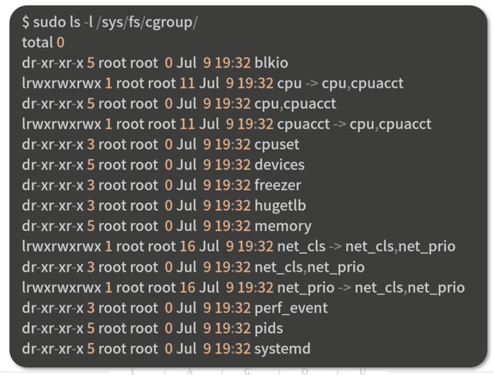
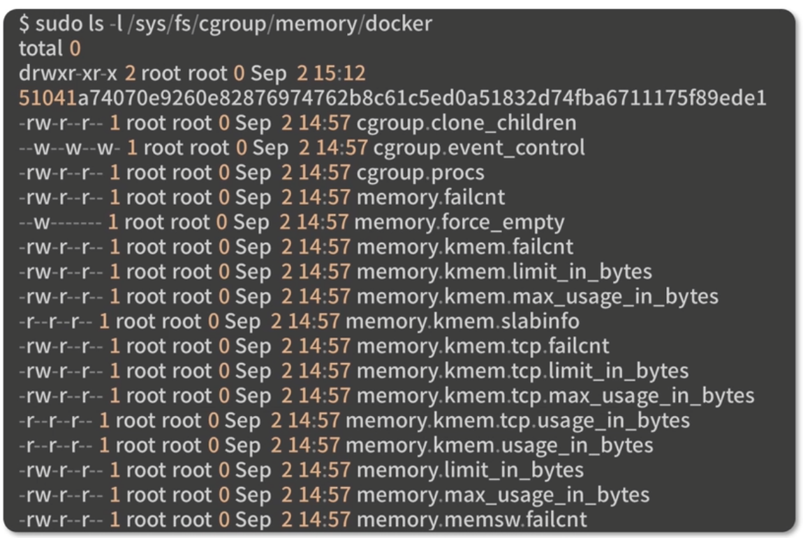
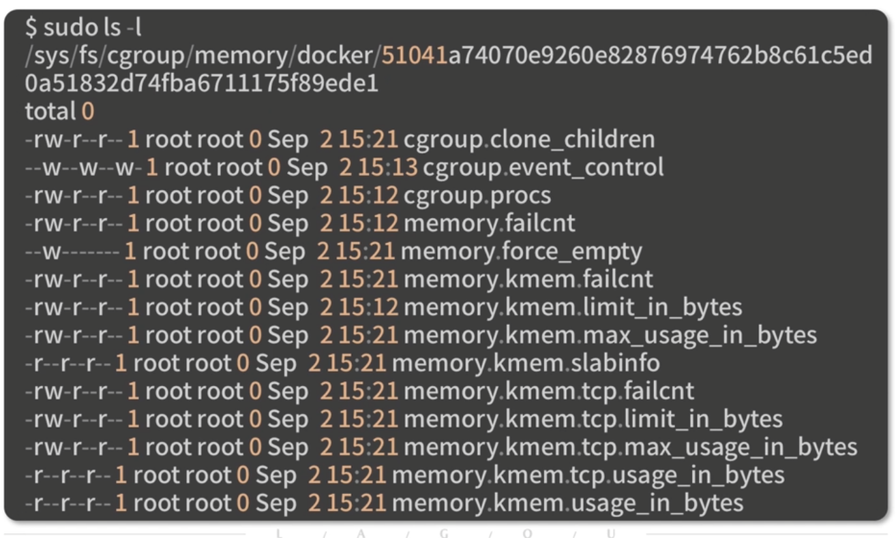
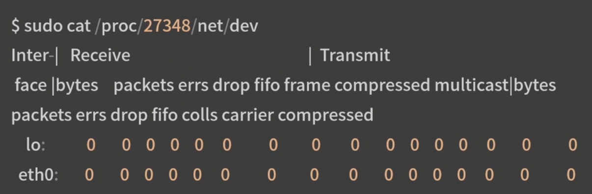

## 1. 容器特性:

1. 容器是短期存活的, 并且可以动态调度
2. 容器的本质是进程,而不是一个完整的操作系统
3. 由于容器非常轻量, 容器的创建和销毁也会比传统虚拟机更加的频繁

## 2. docker 常见的监控方案:

1. docker stats
2. sysdig
3. cAdvisor
4. prometheus

cAdvisor 是谷歌开源的一款通用容器解决方案:

1. 可以采集机器上所有运行的容器信息
2. 提供基础的查询界面和http接口
3. k8s 也集成了 cAdvisor 作为容器监控的默认工具

#### 启动 cAdvisor

```sh
docker run \
  --volume=/:/rootfs:ro \
  --volume=/var/run:/var/run:ro \
  --volume=/sys:/sys:ro \
  --volume=/var/lib/docker/:/var/lib/docker:ro \
  --volume=/dev/disk/:/dev/disk:ro \
  --publish=8080:8080 \
  --detach=true \
  --name=cadvisor \
  --privileged \
  --device=/dev/kmsg \
  lagoudocker/cadvisor:v0.37.0
```

#### cAdvisor 监控容器特点

1. 可以同时采集物理机容器状态
2. 可以展示监控历史数据

## 3. 容器监控的原理

Docker 是基于 namespace, cgroups 和 联合文件系统实现的

Cgroups 不仅可以用于容器资源的限制,还可以提供容器的资源使用率

Cgroups 的工作目录 /sys/fs/cgroup 下包含了 Cgroups 的所有内容

Cgroups 包含了很多文件子系统,可用来对不同的资源进行限制, cpu, 内存, pid, 磁盘 io等资源进行限制和监控



这些文件夹代表 cgroups 的子系统

docker 会在 cgroups 子系统下创建 docker 文件夹

### 实践

在主机上使用以下命令启动一个资源限制为 1 核 2 G 的 nginx 容器:

```sh
docker run --name=nginx --cpus=1 -m=2g --name=nginx -d nginx
## 这里输出容器 ID
51041a74070e9260e82876974762b8c615ed0a51834565fde8123548912
```



查看以容器 id 为目录的文件夹:



使用 cat 命令查看文件内容:

```sh
sudo cat /sys/fs/cgroup/memory/docker/51041a74070e9260e82876974762b8c615ed0a51834565fde8123548912/memeory.limit_in_bytes
# 返回参数
2147483648
```

转化后的结果正好是2G,复合我们创建容器时的参数设置

内存的使用情况存放在 memory.usage_in_bytes 文件里, 使用 cat 命令查看文件内容

```sh
$ sudo /sys/fs/cgroup/memory/docker/51041a74070e9260e82876974762b8c615ed0a51834565fde8123548912/memory.usage_in_bytes
# 返回参数
4259840
```

约为 4M

使用 docker inspect 命令查看上面启动的 nginx 容器的 PID

```sh
$ docker inspect nginx |grep Pid
"Pid": 27348
"PidMode": "",
"PidLimit": 0
```

使用 cat 命令查看 /proc/27348/net/dev 的内容:

```sh
$ sudo cat /proc/27348/net/dev
```



/proc/27348/net/dev 文件内记录了该容器内每个网卡的接受和发送情况,以及错误数,丢包数等情况,可见容器中的数据都是从这里定时读取并展示的

容器的监控原理是,定时读取 Linux 主机上的相关文件并展示给用户
