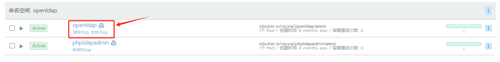
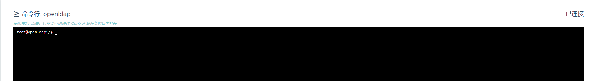
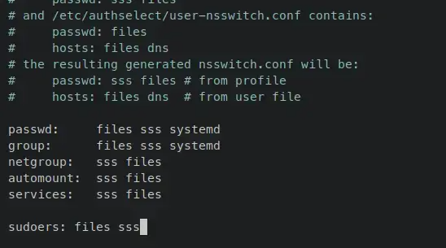
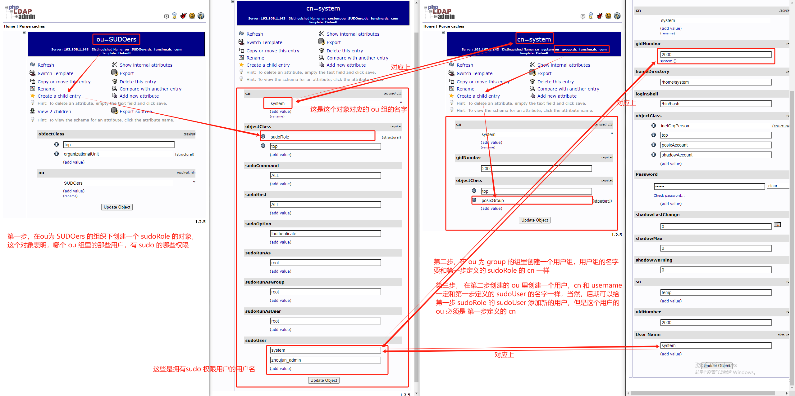

# ldap 开启 sudo 权限:让 ldap 用户可以拥有执行 sudo 的能力

## ldap 服务端

### 以下是容器部署 openldap server:

​    容器镜像为: osixia/openldap:latest

​    可视化客户镜像为: osixia/phpldapadmin:latest

#### 进入容器:





#### 执行一下三条指令,开启 ldap sudo 能力:

参见:

##### 基于docker的高可用openldap（包含lam-admin网页和sudo，ppolicy模块）

https://blog.csdn.net/qq_38120778/article/details/106889176

##### 1.填加sudo的overlay模块:

```sh
cat<<EOF|ldapadd -Y EXTERNAL -H ldapi:///
dn: cn=sudo,cn=schema,cn=config
objectClass: olcSchemaConfig
cn: sudo
olcAttributeTypes: {0}( 1.3.6.1.4.1.15953.9.1.1 NAME 'sudoUser' DESC 'User(s
 ) who may  run sudo' EQUALITY caseExactIA5Match SUBSTR caseExactIA5Substrin
 gsMatch SYNTAX 1.3.6.1.4.1.1466.115.121.1.26 )
olcAttributeTypes: {1}( 1.3.6.1.4.1.15953.9.1.2 NAME 'sudoHost' DESC 'Host(s
 ) who may run sudo' EQUALITY caseExactIA5Match SUBSTR caseExactIA5Substring
 sMatch SYNTAX 1.3.6.1.4.1.1466.115.121.1.26 )
olcAttributeTypes: {2}( 1.3.6.1.4.1.15953.9.1.3 NAME 'sudoCommand' DESC 'Com
 mand(s) to be executed by sudo' EQUALITY caseExactIA5Match SYNTAX 1.3.6.1.4
 .1.1466.115.121.1.26 )
olcAttributeTypes: {3}( 1.3.6.1.4.1.15953.9.1.4 NAME 'sudoRunAs' DESC 'User(
 s) impersonated by sudo (deprecated)' EQUALITY caseExactIA5Match SYNTAX 1.3
 .6.1.4.1.1466.115.121.1.26 )
olcAttributeTypes: {4}( 1.3.6.1.4.1.15953.9.1.5 NAME 'sudoOption' DESC 'Opti
 ons(s) followed by sudo' EQUALITY caseExactIA5Match SYNTAX 1.3.6.1.4.1.1466
 .115.121.1.26 )
olcAttributeTypes: {5}( 1.3.6.1.4.1.15953.9.1.6 NAME 'sudoRunAsUser' DESC 'U
 ser(s) impersonated by sudo' EQUALITY caseExactIA5Match SYNTAX 1.3.6.1.4.1.
 1466.115.121.1.26 )
olcAttributeTypes: {6}( 1.3.6.1.4.1.15953.9.1.7 NAME 'sudoRunAsGroup' DESC '
 Group(s) impersonated by sudo' EQUALITY caseExactIA5Match SYNTAX 1.3.6.1.4.
 1.1466.115.121.1.26 )
olcAttributeTypes: {7}( 1.3.6.1.4.1.15953.9.1.8 NAME 'sudoNotBefore' DESC 'S
 tart of time interval for which the entry is valid' EQUALITY generalizedTim
 eMatch ORDERING generalizedTimeOrderingMatch SYNTAX 1.3.6.1.4.1.1466.115.12
 1.1.24 )
olcAttributeTypes: {8}( 1.3.6.1.4.1.15953.9.1.9 NAME 'sudoNotAfter' DESC 'En
 d of time interval for which the entry is valid' EQUALITY generalizedTimeMa
 tch ORDERING generalizedTimeOrderingMatch SYNTAX 1.3.6.1.4.1.1466.115.121.1
 .24 )
olcAttributeTypes: {9}( 1.3.6.1.4.1.15953.9.1.10 NAME 'sudoOrder' DESC 'an i
 nteger to order the sudoRole entries' EQUALITY integerMatch ORDERING intege
 rOrderingMatch SYNTAX 1.3.6.1.4.1.1466.115.121.1.27 )
olcObjectClasses: {0}( 1.3.6.1.4.1.15953.9.2.1 NAME 'sudoRole' DESC 'Sudoer
 Entries' SUP top STRUCTURAL MUST cn MAY ( sudoUser $ sudoHost $ sudoCommand
  $ sudoRunAs $ sudoRunAsUser $ sudoRunAsGroup $ sudoOption $ sudoOrder $ su
 doNotBefore $ sudoNotAfter $ description ) )
EOF

```

##### 2.添加sudo功能:

```sh
cat<<EOF|ldapadd -x -W -D "cn=admin,dc=example,dc=com" # 注意修改这里改为 n=admin,dc=funsine,dc=com
dn: ou=SUDOers,dc=example,dc=com  # 注意修改这里改为 dn: ou=SUDOers,dc=funsine,dc=com
ou: SUDOers
objectClass: top
objectClass: organizationalUnit

dn: cn=defaults,ou=SUDOers,dc=example,dc=com
objectClass: sudoRole
cn: defaults
sudoOption: requiretty
sudoOption: !visiblepw
sudoOption: always_set_home
sudoOption: env_reset
sudoOption: env_keep =  "COLORS DISPLAY HOSTNAME HISTSIZE INPUTRC KDEDIR LS_COLORS"
sudoOption: env_keep += "MAIL PS1 PS2 QTDIR USERNAME LANG LC_ADDRESS LC_CTYPE"
sudoOption: env_keep += "LC_COLLATE LC_IDENTIFICATION LC_MEASUREMENT LC_MESSAGES"
sudoOption: env_keep += "LC_MONETARY LC_NAME LC_NUMERIC LC_PAPER LC_TELEPHONE"
sudoOption: env_keep += "LC_TIME LC_ALL LANGUAGE LINGUAS _XKB_CHARSET XAUTHORITY"
sudoOption: secure_path = /sbin:/bin:/usr/sbin:/usr/bin
sudoOption: logfile = /var/log/sudo
EOF

```

###### 并输入admin的密码

##### 3.最后添加一个sudo的目录。用户为800001，之后用户可以用图形化的方法更改:

```sh
cat<<EOF|ldapadd -x -W -D "cn=admin,dc=example,dc=com"
dn: cn=sudo_ops_role,ou=SUDOers,dc=example,dc=com
objectClass: sudoRole
cn: sudo_ops_role
sudoOption: !authenticate
sudoRunAsUser: root
sudoCommand: ALL
sudoHost: ALL
sudoUser: 800001
EOF

```

## ldap 客户端:

### 以下是在各个节点配置需要修改的地方:

##### How to Integrate Sudoers with OpenLDAP Serverlint 

https://www.howtoforge.com/how-to-integrate-sudoers-with-openldap-server/

### 第一步:

#### 修改nsswitch.conf文件:

```sh
sudo vim /etc/nsswitch.conf
```

#### 在最后添加一行:

```sh
sudoers:    files    sss
```

#### 如下所示:



### 第二步:

#### 修改sssd.conf文件:

```sh
sudo vim /etc/sssd/sssd.conf
```

#### 在[domain/default]下添加 sudoers_base 和 sudo_provider:

```sh
[domain/default]
....
sudoers_base ou=sudo,dc=funsine,dc=com
sudo_provider = ldap
```

#### 在 [sssd] 下面的 service 最后面添加 sudo,autofs:

```sh
[sssd]
services = nss, pam, autofs, sudo
```

#### 在文本的最后添加 [sudo]:

```sh
[sudo]
```

#### 整体效果如下:

```sh
[sssd]
config_file_version = 2
# services = nss,pam 
# update for sudo
services = nss, pam, autofs, sudo
domains = funsine.com
debug_level = 9

[nss]
homedir_substring = /home

[pam]

[domain/funsine.com]
id_provider = ldap
#ldap_schema = rfc2307bis
auth_provider = ldap
#autofs_provider = ldap
#chpass_provider = ldap
ldap_uri = ldap://192.168.1.143:389
ldap_search_base = dc=funsine,dc=com
ldap_id_use_start_tls = False
ldap_tls_cacertdir = /etc/openldap/certs
ldap_default_bind_dn = cn=admin,dc=funsine,dc=com
ldap_default_authtok_type = password
ldap_default_authtok = admin
cache_credentials = True
ldap_tls_reqcert = never
entry_cache_timeout = 600
#ldap_network_timeout = 3
#ldap_connection_expire_timeout = 60

# for sudo
sudoers_base ou=SUDOers,dc=funsine,dc=com 
sudo_provider = ldap

[sudo]
```

#### 重启 sssd 服务:

```sh
sudo systemctl restart sssd
```

## 添加一个拥有sudo权限的用户需要注意的:


