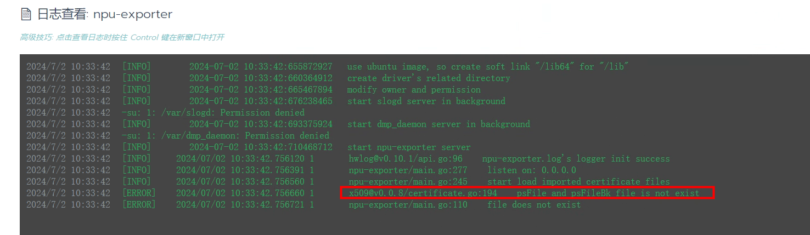
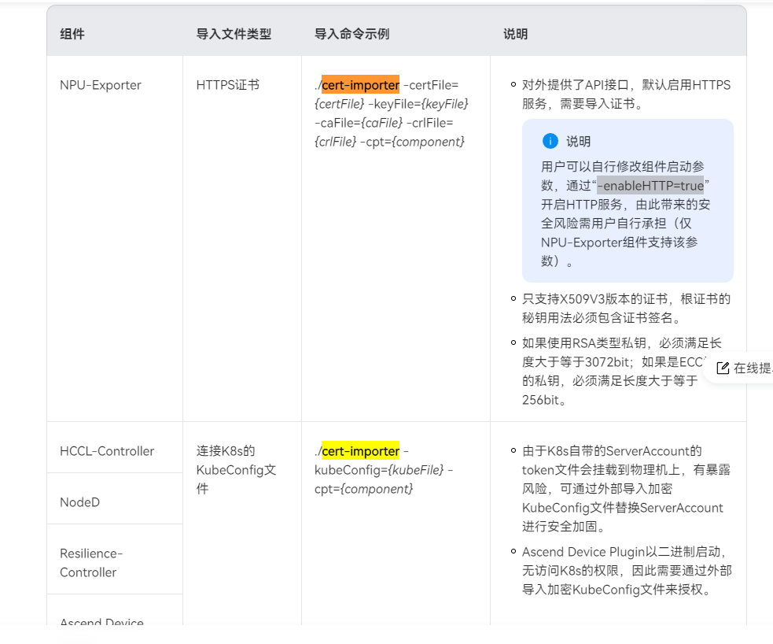

安装NPU监控

[参考文档](https://www.hiascend.com/document/detail/zh/mindx-dl/50rc1/dluserguide/clusterscheduling/dlug_installation_02_000027.html)

操作主机anpu1，构建镜像，推入私服并使用yaml文件启动。

所需文件路径：root/npu-exporter   root/npu_driver_arm64

命令记录：

```sh
mkdir NPU-exporter
cp Ascend-mindxdl-npu-exporter_3.0.0_linux-aarch64.zip -r -p NPU-exporter/
cd NPU-exporter/

unzip Ascend-mindxdl-npu-exporter_3.0.0_linux-aarch64.zip

docker build --no-cache -t idocker.io/npu-exporter:3.0.0 ./
docker push idocker.io/npu-exporter:3.0.0

docker build --no-cache -t npu-exporter-310p:3.0.0 -f Dockerfile-310P-1usoc ./
docker build --no-cache -t idocker.io/npu-exporter-310p:3.0.0 -f Dockerfile-310P-1usoc ./
docker push idocker.io/npu-exporter-310p:3.0.0

vi npu-exporter-v3.0.0.yaml

mkdir -p /root/npu-exporter ;cp npu-exporter-v3.0.0.yaml /root/npu-exporter/
mkdir -p /root/npu-exporter ;cp npu-exporter-310P-1usoc-v3.0.0.yaml /root/npu-exporter/
cd ~/npu-exporter/

vi npu-exporter-v3.0.0.yaml
vi npu-exporter-310P-1usoc-v3.0.0.yaml

kubectl create ns npu-exporter
kubectl apply -f npu-exporter-v3.0.0.yaml
kubectl apply -f npu-exporter-310P-1usoc-v3.0.0.yaml
vi npu-exporter-310P-1usoc-v3.0.0.yaml

```

**在rancher界面上手动将exporter daemonset绑定节点标签accelerator=huawei-Ascend910   accelerator=huawei-Atlas310P**

因为默认启用https，不导入证书无法启动



在

[解决办法1](https://www.hiascend.com/document/detail/zh/mindx-dl/300/dluserguide/clusterscheduling/dlug_installation_02_000024.html#ZH-CN_TOPIC_0000001455789333__section16309114475219)

[解决办法2](https://www.hiascend.com/document/detail/zh/mindx-dl/300/dluserguide/clusterscheduling/dlug_installation_02_000029.html)

中找到解决方法，可以设置以http通讯。



910 exporter直接在rancher页面中修改yaml文件添加-enableHTTP=true

310则需要更改run_for_310P_1usoc.sh脚本中的启动命令，加入-enableHTTP=true，再重新打镜像。

配置文件备份：

service

```yaml
apiVersion: v1
kind: Service
metadata:
  annotations:
    field.cattle.io/creatorId: user-5dbt9
    field.cattle.io/ipAddresses: "null"
    field.cattle.io/targetDnsRecordIds: "null"
    field.cattle.io/targetWorkloadIds: "null"
  creationTimestamp: "2024-07-02T06:17:46Z"
  labels:
    cattle.io/creator: norman
  name: ascend-910-exporter
  namespace: npu-exporter
  resourceVersion: "101801333"
  selfLink: /api/v1/namespaces/npu-exporter/services/ascend-910-exporter
  uid: 2e06db0a-28d8-4d12-8a2e-6cd28ff0613e
spec:
  clusterIP: 10.233.13.233
  ports:
  - name: http
    port: 8082
    protocol: TCP
    targetPort: 8082
  selector:
    app: npu-exporter
    device: "910"
  sessionAffinity: None
  type: ClusterIP
status:
  loadBalancer: {}
```

promethues additional-config

```yaml
- job_name: cattle-prometheus/npu-910-metrics
  honor_timestamps: true
  scrape_interval: 5s
  scrape_timeout: 5s
  metrics_path: /metrics
  scheme: http
  kubernetes_sd_configs:
  - role: endpoints
    namespaces:
      names:
      - npu-exporter
  relabel_configs:
  - source_labels: [__meta_kubernetes_endpoints_name]
    separator: ;
    regex: ascend-910-exporter
    replacement: $1
    action: keep
  - source_labels: [__meta_kubernetes_pod_node_name]
    separator: ;
    regex: (.*)
    target_label: kubernetes_node
    replacement: $1
    action: replace
  - source_labels: [__meta_kubernetes_pod_host_ip]
    separator: ;
    regex: (.+)
    target_label: host_ip
    replacement: $1
    action: replace
```

daemonset

```yaml
apiVersion: apps/v1
kind: DaemonSet
metadata:
  annotations:
    deprecated.daemonset.template.generation: "3"
    field.cattle.io/publicEndpoints: '[{"nodeName":"c-s74r7:machine-p5h7c","addresses":["10.0.0.125"],"port":8082,"protocol":"TCP","podName":"npu-exporter:npu-exporter-910-649zf","allNodes":false}]'
    kubectl.kubernetes.io/last-applied-configuration: '{"apiVersion":"apps/v1","kind":"DaemonSet","metadata":{"annotations":{},"name":"npu-exporter-910","namespace":"npu-exporter"},"spec":{"selector":{"matchLabels":{"app":"npu-exporter","device":"910"}},"template":{"metadata":{"annotations":{"seccomp.security.alpha.kubernetes.io/pod":"runtime/default"},"labels":{"app":"npu-exporter","device":"910"}},"spec":{"containers":[{"args":["umask
      027;npu-exporter -port=8082 -ip=0.0.0.0 -enableHTTP=true -updateTime=5 -logFile=/var/log/mindx-dl/npu-exporter/npu-exporter.log
      -logLevel=0 -containerMode=docker"],"command":["/bin/bash","-c","--"],"image":"idocker.io/npu-exporter:3.0.0","imagePullPolicy":"Never","name":"npu-exporter","ports":[{"containerPort":8082,"name":"http","protocol":"TCP"}],"resources":{"limits":{"cpu":"4000m","memory":"2000Mi"},"requests":{"cpu":"1000m","memory":"1000Mi"}},"securityContext":{"privileged":true,"readOnlyRootFilesystem":true,"runAsGroup":0,"runAsUser":0},"volumeMounts":[{"mountPath":"/var/log/mindx-dl/npu-exporter","name":"log-npu-exporter"},{"mountPath":"/etc/localtime","name":"localtime","readOnly":true},{"mountPath":"/usr/local/Ascend/driver","name":"ascend-driver","readOnly":true},{"mountPath":"/usr/local/dcmi","name":"ascend-dcmi","readOnly":true},{"mountPath":"/etc/mindx-dl/kmc_primary_store","name":"kmckeystore"},{"mountPath":"/etc/mindx-dl/.config","name":"kmckeybak"},{"mountPath":"/etc/mindx-dl/npu-exporter","name":"kmc-exporter"},{"mountPath":"/sys","name":"sys","readOnly":true},{"mountPath":"/var/run/dockershim.sock","name":"docker-shim","readOnly":true},{"mountPath":"/var/run/docker","name":"docker","readOnly":true},{"mountPath":"/run/containerd","name":"containerd","readOnly":true},{"mountPath":"/tmp","name":"tmp"}]}],"nodeSelector":{"accelerator":"huawei-Ascend910"},"volumes":[{"hostPath":{"path":"/var/log/mindx-dl/npu-exporter","type":"Directory"},"name":"log-npu-exporter"},{"hostPath":{"path":"/etc/localtime"},"name":"localtime"},{"hostPath":{"path":"/usr/local/Ascend/driver"},"name":"ascend-driver"},{"hostPath":{"path":"/usr/local/dcmi"},"name":"ascend-dcmi"},{"hostPath":{"path":"/etc/mindx-dl/kmc_primary_store","type":"Directory"},"name":"kmckeystore"},{"hostPath":{"path":"/etc/mindx-dl/.config","type":"Directory"},"name":"kmckeybak"},{"hostPath":{"path":"/etc/mindx-dl/npu-exporter","type":"Directory"},"name":"kmc-exporter"},{"hostPath":{"path":"/sys"},"name":"sys"},{"hostPath":{"path":"/var/run/dockershim.sock"},"name":"docker-shim"},{"hostPath":{"path":"/var/run/docker"},"name":"docker"},{"hostPath":{"path":"/run/containerd"},"name":"containerd"},{"hostPath":{"path":"/tmp"},"name":"tmp"}]}}}}'
  creationTimestamp: "2024-07-02T03:31:31Z"
  generation: 3
  name: npu-exporter-910
  namespace: npu-exporter
  resourceVersion: "101747351"
  selfLink: /apis/apps/v1/namespaces/npu-exporter/daemonsets/npu-exporter-910
  uid: daa42bc8-e618-4436-a9cc-9b7321ac78ae
spec:
  revisionHistoryLimit: 10
  selector:
    matchLabels:
      app: npu-exporter
      device: "910"
  template:
    metadata:
      annotations:
        cattle.io/timestamp: "2024-07-02T03:42:26Z"
        field.cattle.io/ports: '[[{"containerPort":8082,"dnsName":"npu-exporter-910-hostport","hostPort":8082,"kind":"HostPort","name":"910http","protocol":"TCP","sourcePort":8082}]]'
        seccomp.security.alpha.kubernetes.io/pod: runtime/default
      creationTimestamp: null
      labels:
        app: npu-exporter
        device: "910"
    spec:
      affinity:
        nodeAffinity:
          requiredDuringSchedulingIgnoredDuringExecution:
            nodeSelectorTerms:
            - matchExpressions:
              - key: accelerator
                operator: In
                values:
                - huawei-Ascend910
      containers:
      - args:
        - umask 027;npu-exporter -port=8082 -ip=0.0.0.0 -enableHTTP=true -updateTime=5
          -logFile=/var/log/mindx-dl/npu-exporter/npu-exporter.log -logLevel=0 -containerMode=docker
        command:
        - /bin/bash
        - -c
        - --
        image: idocker.io/npu-exporter:3.0.0
        imagePullPolicy: Never
        name: npu-exporter
        ports:
        - containerPort: 8082
          hostPort: 8082
          name: 910http
          protocol: TCP
        resources:
          limits:
            cpu: "4"
            memory: 2000Mi
          requests:
            cpu: "1"
            memory: 1000Mi
        securityContext:
          capabilities: {}
          privileged: true
          readOnlyRootFilesystem: true
          runAsGroup: 0
          runAsUser: 0
        terminationMessagePath: /dev/termination-log
        terminationMessagePolicy: File
        volumeMounts:
        - mountPath: /var/log/mindx-dl/npu-exporter
          name: log-npu-exporter
        - mountPath: /etc/localtime
          name: localtime
          readOnly: true
        - mountPath: /usr/local/Ascend/driver
          name: ascend-driver
          readOnly: true
        - mountPath: /usr/local/dcmi
          name: ascend-dcmi
          readOnly: true
        - mountPath: /sys
          name: sys
          readOnly: true
        - mountPath: /var/run/dockershim.sock
          name: docker-shim
          readOnly: true
        - mountPath: /var/run/docker
          name: docker
          readOnly: true
        - mountPath: /run/containerd
          name: containerd
          readOnly: true
      dnsPolicy: ClusterFirst
      nodeSelector:
        accelerator: huawei-Ascend910
      restartPolicy: Always
      schedulerName: default-scheduler
      securityContext: {}
      terminationGracePeriodSeconds: 30
      volumes:
      - hostPath:
          path: /var/log/mindx-dl/npu-exporter
          type: Directory
        name: log-npu-exporter
      - hostPath:
          path: /etc/localtime
          type: ""
        name: localtime
      - hostPath:
          path: /usr/local/Ascend/driver
          type: ""
        name: ascend-driver
      - hostPath:
          path: /usr/local/dcmi
          type: ""
        name: ascend-dcmi
      - hostPath:
          path: /sys
          type: ""
        name: sys
      - hostPath:
          path: /var/run/dockershim.sock
          type: ""
        name: docker-shim
      - hostPath:
          path: /var/run/docker
          type: ""
        name: docker
      - hostPath:
          path: /run/containerd
          type: ""
        name: containerd
  updateStrategy:
    rollingUpdate:
      maxUnavailable: 1
    type: RollingUpdate
status:
  currentNumberScheduled: 2
  desiredNumberScheduled: 2
  numberAvailable: 1
  numberMisscheduled: 0
  numberReady: 1
  numberUnavailable: 1
  observedGeneration: 3
  updatedNumberScheduled: 2
```
