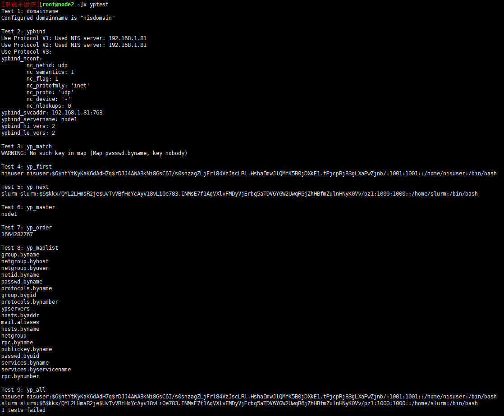

# 数学库环境需求确认（明确实施内容、工作范围）

```
1、确认客户数学库要求，通过项目负责人或者招投标文件。
```

# 硬件要求

```sh
1、管理网络调试完成能各自ping通，能局域网内所有机器能上外网

2、ib交换机调试完成能保证正常ping通（ib网卡需要安装驱动才能进行使用，需要厂家提供驱动）

3、后期监控项的配置，需要交换机提前配置SNMP服务！！

4、bios设置关闭cpu超线程模式

5、系统安装时不添加home，swap分区

ib网卡驱动下载地址（需要对应型号版本【与厂家确认】）（网卡型号MT27600）（选择OPENEULER【欧拉系统】）（接受协议后下载）
https://network.nvidia.com/products/infiniband-drivers/linux/mlnx_ofed/
```

# 前期系统准备（计算网络与ib网络配置）

```sh
网卡禁用networkmanager，启用network

网卡配置时千万不要用networkmanager，不要用图形界面配置，否则hosts会失效
在网卡配置时，确认管理网络与存储

计算与存储服务共用ib网络？

系统缺陷？，需要重新启动网卡，由于机器太多直接重启所有机器（已经可以正常访问了）
```

# 1. 环境准备

***

## 1.1 设置免密登录

```sh
#生成秘钥（管理节点）
ssh-keygen -t rsa

#分发至其他节点（管理节点）
for i in $(seq 1 4);do ssh-copy-id -i .ssh/id_rsa.pub root@compute$i ;done

#测试
ssh controller1
```

## 1.2 关闭审计、防火墙、清空iptables规则（所有节点）

```sh
#释掉/lib/systemd/system/auditd.service 中 RefuseManualStop=yes 项（允许服务停止）
for i in $(seq 1 4);do ssh compute$i "sed 's/RefuseManualStop=yes/#RefuseManualStop=yes/' /lib/systemd/system/auditd.service -i";done

#检查
cat /lib/systemd/system/auditd.service | grep #RefuseM

#检查其他节点
for i in $(seq 1 4);do ssh compute3 "cat /lib/systemd/system/auditd.service | grep #RefuseM";done

#检查文件后重新加载配置
systemctl daemon-reload
#其他节点
for i in $(seq 1 4);do ssh compute$i "systemctl daemon-reload";done

#关闭审计、防火墙、清空iptables规则
systemctl disable auditd firewalld --now && iptables -F

#其他节点
for i in $(seq 1 4);do ssh compute$i "systemctl disable auditd firewalld --now && iptables -F";done

#查看服务状态
systemctl status auditd | grep runn & systemctl status firewalld | grep runn
iptables -L
其他节点
ssh compute3 "systemctl status auditd | grep runn & systemctl status firewalld | grep runn"
```

***

## 1.3 关闭selinux（已关闭，只需检查）

```sh
#检查配置
cat /etc/selinux/config

#修改配置永久禁用（麒麟默认为永久禁用，所以无需执行）
sed -i 's/SELINUX=enable/SELINUX=disabled/' /etc/selinux/config && setenforce 0
```

***

## 1.4 追加hosts文件配置（根据实际情况修改）

```sh
for i in $(seq 1 4);do ssh compute$i "cat >> /etc/hosts << EOF
192.168.1.11   controller1

192.168.1.21   compute1
192.168.1.22   compute2
192.168.1.23   compute3
192.168.1.24   compute4
EOF";done

#验证
for i in $(seq 1 4);do ssh compute$i "cat /etc/hosts";done

#网段修改语句（无需执行）
#for i in $(seq 1 4);do ssh compute$i "sed 's/192.168.1/192.168.2/' /etc/hosts -i";done
#for i in $(seq 1 4);do ssh compute$i "sed 's/comtroller1/controller1/' /etc/hosts -i";done
```

***

## 1.5 修改hostname

```sh
#根据实际情况修改
for i in $(seq 1 4);do ssh compute$i "hostnamectl set-hostname compute$i";done
#控制节点
hostnamectl set-hostname controller1

#登录查看验证
ssh compute3
```

***

## 1.6 设置时钟同步

```sh
#无需安装，自带有
#yum install chrony

#/etc/chrony.conf文件追加配置（阿里时钟服务器、同步网段）（管理节点）

cat >> /etc/chrony.conf << EOF
server ntp.aliyun.com iburst
allow 192.168.2.0/24
local stratum 10
EOF

#其他节点配置本地时钟同步主机（其他节点）
for i in $(seq 1 4);do ssh compute$i "cat >> /etc/chrony.conf << EOF
server controller1 iburst
EOF";done

#注释默认配置文件项（主节点）（此配置会导致时钟同步出问题）
sed -i 's/pool pool.ntp.org iburst/#pool pool.ntp.org iburst/' /etc/chrony.conf
#（其他节点）
for i in $(seq 1 4);do ssh compute$i "sed -i 's/pool pool.ntp.org iburst/#pool pool.ntp.org iburst/' /etc/chrony.conf";done

#检查配置（主节点）
cat /etc/chrony.conf | grep '^server\|^allow\|^#pool' 
#（其他节点）
for i in $(seq 1 4);do ssh compute$i "cat /etc/chrony.conf | grep '^server\|^allow\|^#pool' ";done

#设置开机启动、重启服务（主节点）
systemctl enable chronyd.service --now && systemctl restart chronyd.service
#（其他节点）
for i in $(seq 1 4);do ssh compute$i "systemctl enable chronyd.service --now && systemctl restart chronyd.service";done

#验证（主节点）（以^*开头则为同步成功例：^* controller1）
chronyc sources
#（其他节点）
for i in $(seq 1 4);do ssh compute$i "chronyc sources";done
```

# 2. 分布式文件系统（如果有多块数据盘，那么将所有的盘加起来做raid1）

## 2.1 配置文件系统（所有存储节点）（目前假定主节点hostName为storage1）

```
说明：
【布式文件系统最少由两个物理磁盘组成，其中一个盘为系统盘，其他盘做为分布式存储盘来使用】
【分布式文件系统只需要使用到一个盘符】
【分布式服务有一个缺陷，当整个超算集群重启时分布式文件服务系统暂未启动，此时磁盘挂载已经开始工作，将会导致分布式磁盘挂载失败】
```

## 2.1.1 安装glusterfs分布式存储

```sh
#已安装（系统自带有，无需安装）
#yum install glusterfs
```

## 2.1.2 查看磁盘

```sh
lsblk -af
```

## 2.1.3 格式化磁盘

```sh
【格式化物理磁盘，此磁盘将完全用于分布式文件系统。注意，如果格式化系统盘系统将无法启动！】
mkfs.xfs -f -i size=512 /dev/sdb
```

## 2.1.4 创建挂载路径

```sh
mkdir -p /bricks/brick1
```

## 2.1.5 开机自动挂载

```sh
#查看磁盘UUID
blkid /dev/sdb

#在【vi /etc/fstab】文件中新增自动挂载
【若重启后自动挂载失败，则需手动执行挂载】
cat >> /etc/fstab << EOF
UUID="d353de1e-37d9-422b-ac65-3ae4c5e2861c" /bricks/brick1 xfs defaults 1 2
EOF
```

## 2.1.6 挂载磁盘并查看挂载信息

```sh
【mount -a 会将 /etc/fstab 中定义的所有挂载点都挂上】
mount -a

#查看挂载状态
lsblk -l
```

## 2.1.7 设置glusterfs服务开机自启并启动

```sh
#开机自启并启动
systemctl enable glusterd --now

#查看服务状态
systemctl status glusterd
```

## 2.1.8 所有存储节点连接至主节点（单节点则无需操作，直接跳过此步骤）（主存储节点，添加其他节点）

```sh
【其他存储节点统一添加至storage1节点，通过主节点提供分布式文件存储服务】（删除节点：gluster peer detach storage1）（自己不需要添加，只需要添加其他存储即可）
gluster peer probe storage1

#各节点分别查看连接状态
gluster peer status
```

## 2.1.9 创建分布式存储卷

```sh
#新建文件夹（所有存储节点）
mkdir /bricks/brick1/gv0

#创建分布式复制卷
gluster volume create net_volume01 replica 2 transport tcp storage1:/bricks/brick1/gv0 storage2:/bricks/brick1/gv0 storage3:/bricks/brick1/gv0 storage4:/bricks/brick1/gv0
【测试环境一般为单个存储节点，那么需要将 [replica 2] 复制卷参数去掉】
【卷参数需要根据实际节点数量增减】
#单节点使用以下语句
gluster volume create net_volume01 transport tcp controller1:/bricks/brick1/gv0

#备注
【使用rdma方式会有很多问题，使用tcp即可】

【RDMA方式】创建分布式复制卷
上文中的tcp改成rdma
（删除卷，需先停止卷再删除）
gluster v stop net_volume01
gluster v delete net_volume01
（删除目录之后才能继续使用前面的目录继续创建）
rm -rf /bricks/brick1/gv0

#启动分布式卷
gluster volume start net_volume01

#查看卷信息
gluster volume info

```

## 2.1.10 业务节点挂载分布式存储卷（管理节点和计算节点）

```sh
#创建目录
mkdir /share
#多节点
for i in $(seq 1 4);do ssh compute$i "mkdir /share";done

#添加自动挂载
cat >> /etc/fstab << EOF
[controller]1:/net_volume01 /share glusterfs defaults,_netdev 0 0
EOF
#多节点
for i in $(seq 1 4);do ssh compute$i "cat >> /etc/fstab << EOF
storage1:/net_volume01 /share glusterfs defaults,_netdev 0 0
EOF";done

#检查文件
cat /etc/fstab
#多节点
for i in $(seq 1 4);do ssh compute$i "cat /etc/fstab | grep share";done

#挂载
mount -a
#多节点
for i in $(seq 1 4);do ssh compute$i "mount -a";done

#文件系统性能测试（存储节点）
gluster volume profile net_volume01 start

#获取性能测试数据
gluster volume profile net_volume01 info

#备注
【RDMA方式挂载】
mount -t glusterfs -o transport=rdma cn1:/net_volume01 /share
【RDMA自动挂载配置】
cn01:/net_volume01 /share glusterfs defaults,_netdev,transport=rdma  0 0
```

# 3. 用户管理

## 3.1 配置用户管理服务端（管理节点）

```sh
#安装软件包
yum -y install ypserv yp-tools rpcbind

#追加NIS 域名
cat >> /etc/sysconfig/network << EOF
NISDOMAIN=godway.hpc
EOF

#检查配置
cat /etc/sysconfig/network

#配置生效
nisdomainname godway.hpc

#开机自动追加
cat >> /etc/rc.d/rc.local << EOF
/bin/nisdomainname godway.hpc
EOF

#检查配置
cat /etc/rc.d/rc.local

#追加开放网段访问权限（记住修改网段，否则会导致后面测试无法通过）
cat >> /etc/ypserv.conf << EOF
127.0.0.0                  : *       : *                : none
192.168.2.0/255.255.255.0  : *       : *                : none
10.0.0.0/255.255.255.0     : *       : *                : none
*                          : *       : *                : deny
EOF

#检查配置
cat /etc/ypserv.conf | grep 'none\|deny$'

#修改配置（无需修改）检查即可（如果需要配置备用服务端需要进行修改）
vi /var/yp/Makefile
NOPUSH=true

#设置开机启动并启动NIS服务
systemctl enable rpcbind.service ypserv.service yppasswdd.service --now

【需要先创建两个空白文件，否则创建数据库会在结尾处报错】
touch /etc/netgroup && touch /etc/publickey

#创建用户（用于后续yptest测试，不创建则会出现额外的错误）
useradd slurm

#创建数据库（ctrl + d 完成配置)
/usr/lib64/yp/ypinit -m

#查看数据库
ls /var/yp/godway.hpc/

#检查服务
rpcinfo -u localhost ypserv
rpcinfo -p
```

## 3.2 配置用户管理客户端（除主节点外，其他所有节点）

```sh
#安装软件
for i in $(seq 1 4);do ssh compute$i "yum -y install ypbind yp-tools rpcbind";done

#设置NIS域名
for i in $(seq 1 4);do ssh compute$i "cat >> /etc/sysconfig/network << EOF
NISDOMAIN=godway.hpc
EOF";done

#检查
for i in $(seq 1 4);do ssh compute$i "cat /etc/sysconfig/network | grep NISDOMAIN";done

#开机自动加入NIS域
for i in $(seq 1 4);do ssh compute$i "cat >> /etc/rc.d/rc.local << EOF
/bin/nisdomainname godway.hpc
EOF";done

#检查
for i in $(seq 1 4);do ssh compute$i "cat /etc/rc.d/rc.local | grep nisdomainname";done

#加入建立的NIS域
for i in $(seq 1 4);do ssh compute$i "cat >> /etc/yp.conf << EOF
domain godway.hpc server controller1
EOF";done

#检查配置
for i in $(seq 1 4);do ssh compute$i "cat /etc/yp.conf | grep godway";done

#添加密码验证方式
for i in $(seq 1 4);do ssh compute$i "sed -i -e 's/^passwd:/passwd:  nis/' -e 's/^shadow:/shadow:  nis/' -e 's/^group:/group:  nis/' -e 's/^hosts:/hosts:  nis/' /etc/nsswitch.conf";done

#检查配置
for i in $(seq 1 4);do ssh compute$i "cat /etc/nsswitch.conf | grep nis";done

【调整的四个参数，案例如下】
passwd:    nis files sss systemd
shadow:    nis files sss
group:     nis files sss systemd 
hosts:     nis files dns myhostname

#启动ypbind服务并设置开机启动
for i in $(seq 1 4);do ssh compute$i "systemctl enable ypbind.service --now";done

#测试
yptest
（若只有【Test 3: yp_match WARNING: No such key in map (Map passwd.byname, key nobody)】一项错误则服务正常）
```



```sh
#查看数据库文件列表
ypwhich -x

#查看密码？
ypcat passwd

#查看nis服务器hosts文件
ypcat hosts

#查询指定用户账号密码（对应前面创建的用户名称）
ypmatch [slurm] passwd

#修改账号密码（不用此项测试）
yppasswd [slurm]
```

# 4. slurm 并行计算调度平台

## 4.1 安装mysql数据库（8.0版本以上）（管理节点）

```sh
#下载安装包
wget https://repo.mysql.com//mysql80-community-release-el8-4.noarch.rpm

#安装资源包
rpm -ivh mysql80-community-release-el8-4.noarch.rpm

#安装mysql（此方式会安装最新版）
yum install -y mysql-community-server mysql-community-devel

#启动并设置开机启动
systemctl enable mysqld --now

#初始化密码（查看日志获取密码：cat /var/log/mysqld.log）（设置密码为：Godway!233）
mysql_secure_installation设置一个密码以后后面的直接回车跳过！
```

## 4.2 安装并行管理服务

### 安装依赖包（管理节点）

```sh
yum -y install munge munge-devel hwloc-libs hwloc-devel pam-devel perl-ExtUtils-MakeMaker readline-devel hdf5 hdf5-devel lz4 lz4-devel rrdtool rrdtool-devel pmix pmix-devel

#计算节点，munge服务（通讯需要用到）（各个节点【不包括存储】）
for i in $(seq 1 4);do ssh compute$i "yum -y install munge munge-devel hwloc-libs hwloc-devel pam-devel perl-ExtUtils-MakeMaker readline-devel hdf5 hdf5-devel lz4 lz4-devel rrdtool rrdtool-devel pmix pmix-devel";done

#创建目录
#软件包拷贝至管理节点并解压(arm的文件名为slurm-21.08.8.aarch64.tar.gz)（管理节点）
mkdir -p /opt/src/slurm
tar -xzvf slurm-21.08.8.tar.gz -C /opt/src/slurm

#在/opt/src/slurm/目录下创建yum仓库索引
cd /opt/src/slurm/ && createrepo .

#生成配置
cat > /etc/yum.repos.d/slurm.repo << EOF
[slurm]
name=slurm
baseurl=file:///opt/src/slurm
gpgcheck=0
enable=1
EOF

#检查
cat /etc/yum.repos.d/slurm.repo

#管理节点安装补丁包
【ARM平台】（才能安装下面的软件包）（此包需要操作系统厂商提供）
yum install ~/libjwt-* -y
【x86平台】
yum install ~/libjwt-* -y

#管理节点安装软件包
yum -y install slurm slurm-perlapi slurm-slurmdbd slurm-slurmctld slurm-slurmrestd
```

### 计算节点

```sh
#为其他节点设置slurm仓库（将上述文件传输至其他slurm节点/etc/yum.repos.d/下）（计算节点）
for i in $(seq 1 4);do scp /etc/yum.repos.d/slurm.repo compute$i:/etc/yum.repos.d;done

#创建文件夹
for i in $(seq 1 28);do ssh compute$i "mkdir -p /opt/src/slurm";done

#资源文件拷贝至目录
for i in $(seq 1 28);do scp -r /opt/src/slurm/* compute$i:/opt/src/slurm;done

【拷贝补丁包】
#拷贝补丁包
for i in $(seq 1 4);do scp ~/libjwt-* compute$i:~/;done

#安装补丁包
for i in $(seq 1 28);do ssh compute$i "yum install ~/libjwt-* -y";done

#安装软件（比较久）（计算节点）（优化 https://blog.csdn.net/Areigninhell/article/details/102609084）
for i in $(seq 1 4);do ssh compute$i "yum -y install slurm slurm-perlapi slurm-slurmd slurm-libpmi";done
（海洋学院，与ib驱动冲突，卸载驱动之后解决）

#创建管理用户（管理节点）（已创建）
#useradd slurm

#从管理节点查看其他节点是否正常获取slurm用户信息
#pdsh -w compute[2-10] id slurm
for i in $(seq 1 4);do ssh compute$i "id slurm";done

#控制节点生成munge服务key（root目录）
create-munge-key

#复制到各个节点
for i in $(seq 1 4);do scp /etc/munge/munge.key compute$i:/etc/munge/;done

#设置文件所有者为munge（所有节点，包括管理节点）
#管理节点
chown munge.munge /etc/munge/munge.key
#其他节点
for i in $(seq 1 4);do ssh compute$i "chown munge.munge /etc/munge/munge.key";done

#启动并设置开机启动
#管理节点
systemctl enable munge --now
#其他节点
for i in $(seq 1 4);do ssh compute$i "systemctl enable munge --now";done

#验证服务
for i in $(seq 1 4);do ssh compute$i "systemctl status munge | grep running";done
```

[slurm.conf](files/slurm.conf) 
[slurm.conf简版](files/slurm_simple.conf)

```sh
#配置主配置文件（控制节点）
/etc/slurm/slurm.conf
【内容模板可访问 https://slurm.schedmd.com/configurator.html 填写相应信息生成，然后修改】

#创建目录
#编辑配置
mkdir /etc/slurm && vi /etc/slurm/slurm.conf
```

[slurmdbd.conf](files/slurmdbd.conf)

```sh
#数据库配置（控制节点）
#编辑配置（无需修改）
vi /etc/slurm/slurmdbd.conf
```

[cgroup.conf](files/cgroup.conf)

```sh
#cgroup限制配置（控制节点）
/etc/slurm/cgroup.conf
【原注释：启用cgroup资源限制，可以防止用户实际使用的资源超过用户为该作业通过作业调度系统申请到的资源。如不需限制，不要在/etc/slurm/slurm.conf中设定ProctrackType=proctrack/cgroup和TaskPlugin=task/cgroup参数。如设定了ProctrackType=proctrack/cgroup和TaskPlugin=task/cgroup参数，还需要设定/etc/slurm/cgroup.conf】

#编辑配置（将内容拷贝至文件）（无需修改）
vi /etc/slurm/cgroup.conf
```

## 4.5 设置验证支持

### 修改slurm.conf 和slurmdbd.conf 的jwt 验证支持配置（以上配置文件已做配置无需下面操作）

（/etc/slurm/slurm.conf）（
/etc/slurm/slurmdbd.conf）

```sh
#配置验证类型为JWT（上文已做配置）
#配置JWT key 文件路径（上文已做配置）
#AuthAltTypes=auth/jwt
#AuthAltParameters=jwt_key=/etc/slurm/jwt.key
```

### 创建JWT key（控制节点？）

```sh
#创建JWT key、赋予slurm用户权限
dd if=/dev/random of=/etc/slurm/jwt.key bs=32 count=1 && chown slurm:slurm /etc/slurm/jwt.key && chmod 0600 /etc/slurm/jwt.key
dd if=/dev/random of=/etc/slurm/jwt_hs256.key bs=32 count=1 && chown slurm:slurm /etc/slurm/jwt_hs256.key && chmod 0600 /etc/slurm/jwt_hs256.key
```

### 设置配置文件、目录、权限（控制节点？）

```sh
#/etc/slurm/slurmdbd.conf文件所有者须为slurm用户
#/etc/slurm/slurmdbd.conf文件权限须为600
#/etc/slurm/slurm.conf文件所有者须为root用户
chown slurm.slurm /etc/slurm/slurmdbd.conf && chmod 600 /etc/slurm/slurmdbd.conf && chown root /etc/slurm/slurm.conf

#建立slurm 服务日志目录（所有节点）
mkdir -p /var/log/slurm && for i in $(seq 1 4);do ssh compute$i "mkdir -p /var/log/slurm && cd /var/log/slurm && pwd";done

#建立slurmctld服务存储其状态目录，由slurm.conf中StateSaveLocation参数定义（控制节点？）
#设置/var/spool/slurmctld目录所有者为slurm用户
mkdir /var/spool/slurmctld && chown slurm.slurm /var/spool/slurmctld
```

## 4.6 设置并行作业数据库

### 将账户信息存储至数据库（还有其他存储方式这里不做赘述）

```sh
#登录数据库
mysql -uroot -p       #密码手动输入 Godway!233

#创建slumdb用户（密码为：Slurm8&Pwd）
create user 'slurmdb'@'localhost' identified by 'Slurm8&Pwd';

#创建数据库（slurm_acct_db）（slurm_jobcomp_db）
create database slurm_acct_db;
create database slurm_jobcomp_db;

#赋予所有权限
grant all privileges on slurm_acct_db.* to 'slurmdb'@'localhost';
grant all privileges on slurm_jobcomp_db.* to 'slurmdb'@'localhost';

#刷新权限
FLUSH PRIVILEGES;
```

### 启动服务并设置开机启动

```sh
systemctl enable --now slurmdbd && systemctl enable --now slurmctld
```

### 查看服务状态

```sh
systemctl status slurmdbd
systemctl status slurmctld

#slurmctld 服务报错（重启一下，可能是在数据服务没起来的时候启动失败了）
```

## 4.7 设置slurmrestd 服务

### 修改slurmrestd.service文件（添加 User=adm 项）（文件位置：vi /lib/systemd/system/slurmrestd.service）

```sh
sed -i -e 's/^Type=simple/Type=simple\nUser=adm/' -e 's/^ExecStart/#ExecStart/' -e 's/^ExecReload/Environment="SLURM_JWT=daemon"\nExecStart=\/usr\/sbin\/slurmrestd $SLURMRESTD_OPTIONS 0.0.0.0:6820 -vvv\nExecReload/' /lib/systemd/system/slurmrestd.service && cat /lib/systemd/system/slurmrestd.service
```

#### 查看是否与下文改动项一致

```sh
[Unit]
Description=Slurm REST daemon
After=network-online.target munge.service slurmctld.service
Wants=network-online.target
ConditionPathExists=/etc/slurm/slurm.conf

[Service]
Type=simple
#添加配置
User=adm
EnvironmentFile=-/etc/sysconfig/slurmrestd
# Default to local auth via socket
#这个要注释掉
#ExecStart=/usr/sbin/slurmrestd $SLURMRESTD_OPTIONS unix:/var/lib/slurmrestd.socket
# Uncomment to enable listening mode
#添加配置
Environment="SLURM_JWT=daemon"
#添加配置
ExecStart=/usr/sbin/slurmrestd $SLURMRESTD_OPTIONS 0.0.0.0:6820 -vvv
ExecReload=/bin/kill -HUP $MAINPID

[Install]
WantedBy=multi-user.target
```

### 启动服务并设置自启

```sh
systemctl daemon-reload && systemctl enable --now slurmrestd && systemctl status slurmrestd
```

## 4.8 设置slurmd服务

### 创建slurmd.service文件（文件内容如下）（需要修改主节点名称）（计算节点）（文件位置：vi /lib/systemd/system/slurmd.service）

```sh
#执行前确认控制节点hostname名称

cat > /lib/systemd/system/slurmd.service << EOF
[Unit]
Description=Slurm node daemon
After=munge.service network-online.target remote-fs.target
Wants=network-online.target
# ConditionPathExists=/etc/slurm/slurm.conf

[Service]
Type=simple
EnvironmentFile=-/etc/sysconfig/slurmd

# 增加--conf-server cn01:6817设定slurmctld服务节点（确认控制节点名称）
ExecStart=/usr/sbin/slurmd --conf-server controller1:6817 -D -s $SLURMD_OPTIONS
ExecReload=/bin/kill -HUP $MAINPID
KillMode=process
LimitNOFILE=131072
LimitMEMLOCK=infinity
LimitSTACK=infinity
Delegate=yes

[Install]
WantedBy=multi-user.target
EOF
cat /lib/systemd/system/slurmd.service
```

### 将文件复制到各节点（计算节点？）

```sh
for i in $(seq 1 4);do scp /lib/systemd/system/slurmd.service compute$i:/lib/systemd/system/;done
```

### 刷新各节点的systemctl服务配置（计算节点？）

```sh
for i in $(seq 1 4);do ssh compute$i "systemctl daemon-reload; systemctl enable slurmd --now && systemctl status slurmd | grep runn";done
```

### 检查各节点是否启动成功（主节点）

```sh
#查看各计算节点（在计算节点执行？）（此项不做参考，以下面一项为参考）
srun cn1

#查看各计算节点状态信息
sinfo
```

# 5. 并行库（计算节点）

## 5.1 安装MVAPICH

### 下载mvapich2-2.3.7.tar.gz（指定版本？）

```sh
#拷贝至各节点
for i in $(seq 1 4);do scp ~/mvapich2-2.3.7.tar.gz compute$i:~/;done

安装编译环境
for i in $(seq 1 4);do ssh compute$i "yum install gcc gcc-c++ slurm-devel gcc-gfortran -y";done
```

### 创建目录并解压

```sh
for i in $(seq 1 4);do ssh compute$i "mkdir /opt/software && tar -xzvf ~/mvapich2-2.3.7.tar.gz -C /opt/software";done
```

### 编译安装（ --build=arm-linux）

```sh
#configre
for i in $(seq 1 4);do ssh compute$i "cd /opt/software/mvapich2-2.3.7/ && ./configure --with-pmi=pmi2 --with-pm=slurm --with-device=ch3:sock";done

#make
for i in $(seq 1 4);do ssh compute$i "cd /opt/software/mvapich2-2.3.7/ && make -j96";done

#make install
for i in $(seq 1 4);do ssh compute$i "cd /opt/software/mvapich2-2.3.7/ && make install";done
```

### 验证

```sh
#进入目录
cd examples/
#执行命令
mpicc -o cpi cpi.c
#执行命令
srun -n2 --mpi=pmi2 cpi

#输出内容大致如下
Process 0 of 2 is on cn01
Process 1 of 2 is on cn01
pi is approximately 3.1415926544231318, Error is 0.0000000008333387
wall clock time = 0.013168
```

## 5.2 安装LAPACK

### 下载lapack-3.10.01.tar.gz（指定版本？）

```sh
https://netlib.org/lapack/index.html

#拷贝至计算节点
for i in $(seq 1 28);do scp ~/lapack-3.10.1.tar.gz compute$i:~/;done

#解压
#tar -xzvf lapack-3.10.1.tar.gz -C /opt/software
for i in $(seq 1 4);do ssh compute$i "tar -xzvf lapack-3.10.1.tar.gz -C /opt/software";done
```

### 编译

```sh
#进入目录
#cd /opt/software/lapack-3.10.1/ && cp make.inc.example make.inc
for i in $(seq 1 4);do ssh compute$i "cd /opt/software/lapack-3.10.1/ && cp make.inc.example make.inc";done

#make blaslib -j128
for i in $(seq 1 4);do ssh compute$i "cd /opt/software/lapack-3.10.1/ && make blaslib -j96";done

#make cblaslib -j128
for i in $(seq 1 4);do ssh compute$i "cd /opt/software/lapack-3.10.1/ && make cblaslib -j96";done

#make lapacklib -j128
for i in $(seq 1 4);do ssh compute$i "cd /opt/software/lapack-3.10.1/ && make lapacklib -j96";done

#make lapackelib -j128
for i in $(seq 1 4);do ssh compute$i "cd /opt/software/lapack-3.10.1/ && make lapackelib -j96";done
```

### 验证blas

### 创建vi test.c 文件（内容如下）

```sh
cat > /opt/test.c << EOF
#include <stdio.h>
#include "cblas.h"

int main()
{
        const int dim=2;
        double a[4]={1.0,1.0,1.0,1.0},b[4]={2.0,2.0,2.0,2.0},c[4];
        int m=dim,n=dim,k=dim,lda=dim,ldb=dim,ldc=dim;
        double al=1.0,be=0.0;
        cblas_dgemm(101,111,111,m,n,k,al,a,lda,b,ldb,be,c,ldc);
        printf("the matrix c is:%f,%f\n%f,%f\n",c[0],c[1],c[2],c[3]);
        return 0;
}
EOF
```

### 编译

```sh
# 编译程序需要添加包含lapcak库文件和头文件路径？
#-I/opt/software/lapack-3.10.1/CBLAS/include/ -L/opt/software/lapack-3.10.1 

gcc test.c -o test -I/opt/software/lapack-3.10.1/CBLAS/include/ -L/opt/software/lapack-3.10.1 -lcblas  -lrefblas  -lm -lgfortran

#执行测试
./test

#输出大致如下
the matrix c is:4.000000,4.000000
4.000000,4.000000
```

### 验证lapack

### 创建vi test_lapack.c 文件（内容如下）

```sh
#include <stdio.h>
#include <lapacke.h>

int main (int argc, const char * argv[])
{
double a[5][3] = {1,1,1,2,3,4,3,5,2,4,2,5,5,4,3};
double b[5][2] = {-10,-3,12,14,14,12,16,16,18,16};
lapack_int info,m,n,lda,ldb,nrhs;
int i,j;

m = 5;
n = 3;
nrhs = 2;
lda = 3;
ldb = 2;

info = LAPACKE_dgels(LAPACK_ROW_MAJOR,'N',m,n,nrhs,*a,lda,*b,ldb);

for(i=0;i<n;i++)
{
    for(j=0;j<nrhs;j++)
    {
        printf("%lf ",b[i][j]);
    }
    printf("\n");
}
return(info);
}
```

### 编译与测试

```sh
gcc test_lapack.c -o test_lapack -I/opt/software/lapack-3.10.1/LAPACKE/include/ -L/opt/software/lapack-3.10.1 -llapacke -llapack -lcblas  -lrefblas  -lm -lgfortran

#测试
./test_lapack

#输出如下 
2.000000 1.000000 
1.000000 1.000000 
1.000000 2.000000
```

### 编译lapack自带测试程序

```sh
cd /opt/software/lapack-3.10.1/ && make lapack_testing -j128

#输出如下
            -->   LAPACK TESTING SUMMARY  <--
    Processing LAPACK Testing output found in the TESTING directory
SUMMARY                 nb test run     numerical error       other error  
================       ===========    =================    ================  
REAL                 1317867        0    (0.000%)    0    (0.000%)    
DOUBLE PRECISION    1318689        0    (0.000%)    0    (0.000%)    
COMPLEX              777619        0    (0.000%)    0    (0.000%)    
COMPLEX16             778430        0    (0.000%)    0    (0.000%)    

d
--> ALL PRECISIONS    4192605        0    (0.000%)    0    (0.000%)
```

## 5.3 安装GotoBLAS2

### 下载GotoBLAS2-1.13.tar.gz（指定版本？）（x86平台，arm不安装此库）

```sh
https://www.tacc.utexas.edu/research-development/tacc-software/gotoblas2 
```

### 解压与编译（ --build=arm-linux）

```sh
for i in $(seq 1 28);do scp ~/GotoBLAS2-1.13.tar.gz compute$i:~/;done

#解压
for i in $(seq 1 4);do ssh compute$i "tar -xzvf GotoBLAS2-1.13.tar.gz -C /opt/software";done

# 编辑Makefile 去掉netlib，因为前面已经编译安装lapack-3.10.1
for i in $(seq 1 4);do ssh compute$i "sed 's/all :: libs netlib tests shared/all :: libs tests shared/' /opt/software/GotoBLAS2/Makefile -i";done

# 编辑Makefile.rule（TARGET = PENRYN）（BINARY=64 ，此数字需要根据服务器cpu核心数来定【核心数*cpu数】）
for i in $(seq 1 4);do ssh compute$i "sed -e 's/^# TARGET = PENRYN/TARGET = PENRYN/' -e 's/^# CC = gcc/CC = gcc/' -e 's/^# BINARY=64/BINARY=48/' /opt/software/GotoBLAS2/Makefile.rule -i";done

# 如果不能确定TARGET类型，执行以下命令查询
cat /proc/cpuinfo | grep name | cut -f2 -d: | uniq -c

# 执行编译
for i in $(seq 1 4);do ssh compute$i "cd /opt/software/GotoBLAS2/ && gmake clean";done

for i in $(seq 1 4);do ssh compute$i "cd /opt/software/GotoBLAS2/ && make all -j98";done

# 编译成功输出如下
GotoBLAS build complete.

OS               ... Linux             
Architecture     ... x86_64               
BINARY           ... 64bit                 
C compiler       ... GCC  (command line : gcc)
Fortran compiler ... GFORTRAN  (command line : gfortran)
Library Name     ... libgoto2_nehalemp-r1.13.a (Multi threaded; Max num-threads is 4)         
```

## 5.3 安装fftw（arm平台）

### 下载、安装

```sh
wget http://www.fftw.org/fftw-3.3.10.tar.gz

#拷贝至个计算节点
for i in $(seq 1 28);do scp ~/fftw-3.3.10.tar.gz compute$i:~/;done

#解压
for i in $(seq 1 28);do ssh compute$i "tar -xzvf ~/fftw-3.3.10.tar.gz -C /opt/software";done

#配置
for i in $(seq 1 4);do ssh compute$i "cd /opt/software/fftw-3.3.10/ && ./configure --prefix=/opt/software/fftw-3.3.10 --enable-threads --enable-mpi --enable-shared --enable-openmp";done

#编译
for i in $(seq 1 4);do ssh compute$i "cd /opt/software/fftw-3.3.10/ && make -j128";done

#安装
for i in $(seq 1 4);do ssh compute$i "cd /opt/software/fftw-3.3.10/ && make install";done

#查看是否存在这些文件
for i in $(seq 1 4);do ssh compute$i "ls /opt/software/fftw-3.3.10/ | grep 'bin\|include\|lib\|share'";done

#检查是否生成如下目录
bin  include  lib  share
```

## 5.4 安装OpenBLAS（arm平台）

### 下载、安装

```sh
wget https://github.com/xianyi/OpenBLAS/archive/v0.3.21.tar.gz -O OpenBLAS-0.3.21.tar.gz

#拷贝至各节点
for i in $(seq 1 28);do scp /root/OpenBLAS-0.3.21.tar.gz  compute$i:~/;done

for i in $(seq 1 28);do ssh compute$i "tar -xzvf ~/OpenBLAS-0.3.21.tar.gz -C /opt/software";done

for i in $(seq 1 28);do ssh compute$i "cd /opt/software/OpenBLAS-0.3.21 && make FC=gfortran USE_OPENMP=1 -j";done

for i in $(seq 1 28);do ssh compute$i "cd /opt/software/OpenBLAS-0.3.21 && make PREFIX=/opt/software/OpenBLAS-0.3.21 install";done
```

### 创建vi test_cblas_dgemm.c 文件 

```sh
#include <cblas.h>
#include <stdio.h>

void main()
{
  int i=0;
  double A[6] = {1.0,2.0,1.0,-3.0,4.0,-1.0};         
  double B[6] = {1.0,2.0,1.0,-3.0,4.0,-1.0};  
  double C[9] = {.5,.5,.5,.5,.5,.5,.5,.5,.5}; 
  cblas_dgemm(CblasColMajor, CblasNoTrans, CblasTrans,3,3,2,1,A, 3, B, 3,2,C,3);

  for(i=0; i<9; i++)
    printf("%lf ", C[i]);
  printf("\n");
}
```

### 验证

```sh
#编译
gcc -o test_cblas_open test_cblas_dgemm.c -I/opt/software/OpenBLAS-0.3.21/include -L/opt/software/OpenBLAS-0.3.21/lib/ -lopenblas -lpthread -lgfortran

#引入环境变量（文件所在目录）
export LD_LIBRARY_PATH=/opt/software/OpenBLAS-0.3.21/lib

#执行
./test_cblas_open
#输出如下：
11.000000 -9.000000 5.000000 -9.000000 21.000000 -1.000000 5.000000 -1.000000 3.000000 
```

# 6. 高性能计算管理软件

## 6.1 开始安装管理节点

### 管理节点

```sh
#校验文件完整性（可不校验）
md5sum godway-1.5.7.aarch64.tar.gz

#创建目录
#解压至对应目录
mkdir -p /opt/src/godway && tar -xzvf godway-1.5.7.aarch64.tar.gz -C /opt/src/godway

## 管理节点包
#godway-server
#godway-agentd
#godway-web

## 计算节点包
#godway-agentd
```

### 创建yum仓库

```sh
cd /opt/src/godway/ && createrepo .
```

### apache账户权限设置（否则作业资源管理无法正常加载）

```sh
cat >> /etc/sudoers << EOF
apache  ALL=(ALL)       NOPASSWD: ALL
EOF
```

### 安装依赖包（主节点）

```sh
yum install httpd php-* libxml2 libxml2-devel net-snmp net-snmp-devel OpenIPMI OpenIPMI-devel libevent libevent-devel curl curl-devel libssh2 libssh2-devel pcre pcre-devel -y
```

### 创建仓库配置文件（指定仓库存放路径）

```sh
cat >/etc/yum.repos.d/godway.repo<<EOF
[godway]
name=godway
baseurl=file:///opt/src/godway
gpgcheck=0
enable=1
EOF
```

### yum仓库配置分发至其他节点(其他所有节点)

```sh
for i in $(seq 1 4);do scp /etc/yum.repos.d/godway.repo compute$i:/etc/yum.repos.d;done
```

### 安装管理平台软件包

```sh
#安装主程序（管理节点）
yum -y install godway-server godway-agentd godway-web

#其他节点安装godway之前需要先复制目录下的某些文件才行，否则会报错（其他所有节点）
#创建文件夹
for i in $(seq 1 4);do ssh compute$i "mkdir -p /opt/src/godway";done

#拷贝至节点
for i in $(seq 1 4);do scp -r /opt/src/godway/* compute$i:/opt/src/godway;done

#安装代理（计算节点和其他节点）
for i in $(seq 1 4);do ssh compute$i "yum -y install godway-agentd";done
```

## 6.2 配置管理平台数据库

```sh
#进入控制节点mysql数据库（Godway!233）
mysql -uroot -p

#创建用户
create user 'zabbix'@'localhost' identified by 'Zabbix!234';
create database zabbix character set utf8mb4 collate utf8mb4_bin;
grant all privileges on zabbix.* to 'zabbix'@'localhost';
FLUSH PRIVILEGES;
exit

#数据导入（手输密码，且独立执行）
cd /usr/share/godway/database/mysql && mysql -uzabbix -p zabbix < schema.sql && mysql -uzabbix -p zabbix < images.sql && mysql -uzabbix -p zabbix < data.sql
```

### 修改管理节点配置文件

```sh
#配置文件目录
vi /etc/godway/zabbix_server.conf
#只需修改密码（无需修改，里面已是此密码）
DBPassword=Zabbix!234
```

### 管理节点的启动与设置开机启动

```sh
systemctl enable Godway-server --now

#查看服务状态
systemctl status Godway-server
```

### 修改agent服务配置文件（管理节点）

```sh
#配置目录
vi /etc/godway/zabbix_agentd.conf

#配置开放网段（主节点）【Server=127.0.0.1,192.168.[1].0/24】（对应添加主机时使用的网段）（一般为管理网段，后续配置监控时使用的网段）
sed -i 's/^Server=127.0.0.1,192.168.1/Server=127.0.0.1,192.168.2/' /etc/godway/zabbix_agentd.conf

（其他所有节点）
for i in $(seq 1 4);do ssh compute$i "sed -i 's/^Server=127.0.0.1,192.168.1/Server=127.0.0.1,192.168.2/' /etc/godway/zabbix_agentd.conf";done

#改完重启服务
for i in $(seq 1 4);do ssh compute$i "systemctl restart Godway-agent.service";done
```

### agent节点的启动与设置开机启动（所有节点）

```sh
for i in $(seq 1 4);do ssh compute$i "systemctl enable Godway-agent.service --now";done

#查看服务状态
for i in $(seq 1 4);do ssh compute$i "hostname && systemctl status Godway-agent.service | grep running";done
```

### 启动 httpd 与 php-fpm 服务（管理节点）

```sh
systemctl enable httpd php-fpm --now

#查看服务状态
systemctl status httpd
systemctl status php-fpm
```

## 6.3 配置zabbix访问权限

### 确认zabbix配置打开此项

```sh
#配置文件地址（无需配置，默认已打开）
#vi /etc/godway/zabbix_server.conf
SSHKeyLocation=/home/zabbix/.ssh
```

### 创建目录赋予权限（后续秘钥目录）（主节点？）

```sh
#停止服务（否则无法创建？）
systemctl stop Godway-server Godway-agent

#创建目录
mkdir /home/zabbix

#配置权限
chown zabbix:zabbix /home/zabbix
chmod 700 /home/zabbix

#启动服务
systemctl start Godway-server Godway-agent

#查看服务状态
systemctl status Godway-server Godway-agent
```

### zabbix用户生成秘钥（在配置监控项时有用到）

```sh
systemctl stop Godway-server.service 
systemctl stop Godway-agent.service
#测试，如果不存在则创建目录
test -d /home/zabbix || mkdir /home/zabbix
usermod -m -d /home/zabbix zabbix
chown zabbix:zabbix /home/zabbix
chmod 700 /home/zabbix
systemctl start Godway-server.service
systemctl start Godway-agent.service
sudo -u zabbix ssh-keygen -t rsa
```

### 秘钥传达至其他节点

```sh

for i in $(seq 1 4);do sudo -u zabbix ssh-copy-id root@compute$i;done

#检查是否登录成功
sudo -u zabbix ssh root@compute1
```

## 6.4 访问系统、配置监控项

### 进入系统

```sh
http://<server_ip_or_name>/godway
【配置数据库密码（其他直接下一步）】（密码：Zabbix!234）

登录密码
Admin
zabbix
```

### 添加群组

```sh
创建“Hpc management”“Hpc compute”“Hpc storage”“Hpc glusterfs”“Hpc switch”的主机群组
```


### 添加主机

```sh
#第一次进入先删掉所有主机条目
```


#### 添加管理节点

```sh
【输入节点名称】
【模板选择 Linux by Zabbix agent】（不选此项将状态为未知的）
【选择HPC management，linux services群组】
【类型选择：客户端】
【配置接口为客户端、输入节点自身ip即可】（管理网段ip）
【点击添加完成配置】
```

#### 添加计算节点

```sh
【输入节点名称】
【模板选择 Linux by Zabbix agent】（不选此项将状态为未知的）
【选择HPC compute，linux services群组】
【类型选择：客户端】
【配置接口为客户端、输入节点自身ip即可】（管理网段ip）
【点击添加完成配置】
```

#### 添加文件系统节点

```sh
【输入节点名称】
【模板（无需）选择】
【选择群组“Hpc glusterfs”】
【类型选择：客户端】
【配置接口为客户端、输入节点自身ip即可】（管理网段ip）
【点击添加完成配置】
```

##### 文件系统监控项01

```sh
#总空间大小
【输入监控项名称"Total space"】
【类型选择“客户端agent”】
【键值选择“ vfs.fs.size[/share,total]”】（自己修改）
【单位输入“B”】（以B为单位）
【点击“添加”】
```

##### 文件系统监控项02

```sh
#磁盘使用空间
【输入监控项名称"Used space"】
【类型选择“客户端agent”】
【键值选择“vfs.fs.size[/share,used]”】
【数据类型选择“数字”】
【单位输入“B”】
【点击“添加”】
```

##### 文件系统监控项03

```sh
#磁盘使用率
【输入监控项名称"Space utilization"】
【类型选择“客户端agent”】
【键值选择“vfs.fs.size[/share,pused]”】
【数据类型选择“浮点数”】
【单位输入“%”】
【点击“添加”】
```

##### 文件系统监控项04

```sh
#卷状态
【输入监控项名称“volume status info”】
【类型选择“SSH客户端”】
【键值选择“ssh.run[volume.status,,,]”】
【数据类型选择“文本”】
【认证方法选择“公钥”】（请使用“SSH客户端”）
【用户名称输入“root”，公钥文件输入“id_rsa.pub”，私钥文件输入“id_rsa”】
【执行的脚本输入“gluster volume info”】
【执行间隔：30m】
【描述输入“volume status info”】
【其他选择默认】
【点击“添加”】
#注意：接口配置为ssh 客户端，需要配置zabbix_server.conf 文件的SSHKeyLocation项，指定ssh 的密码存储路径，详见zabbix 使用手册->配置->监控项类型->ssh检查
```

##### 文件系统监控项05

```sh
#卷性能
【输入监控项名称：volume profile info】
【类型选择“SSH客户端”】
【键值选择“ssh.run[volume.profile,,,]”】
【数据类型选择“文本”】
【认证方法选择“公钥”】
【用户名称输入“root”，公钥文件输入“id_rsa.pub”，私钥文件输入“id_rsa”】
【执行的脚本输入“gluster volume profile net_volume01 info cumulative | egrep 'Brick|latency|WRITE|READ|LOOKUP|STAT|FSTAT|RELEASE|OPEN|FLUSH'”】
【执行间隔：10m】
【描述输入“volume profile info”】
【点击“添加”】
```

#### 添加switch节点（添加交换机）

```sh
【输入主机名称“switch-交换机型号”】
【选择模板：“Huawei VRP SNMP”】
【选择群组：“Hpc switch”】
【接口：点击添加，选择SNMP，然后输入交换节点的ip地址，选择snmp版本，输入snmp 共同体】(一般是SNMPv2协议)
【选择：“已启用”】
【宏：设置交换机中配置的共同体名称】
【点击“添加”】
#注意：接口配置snmp ，需要选择匹配的snmp 协议和共同体
#switch和庆泽确认snmp共同体
```


### 监控项添加问题

```sh
1、如果提示无法找到文件系统的/share 目录，则检查节点是否正确挂载share目录

2、如果提示ssh无法建立连接，则查看ssh是否配置正确（查看步骤6.3）

3、所有节点都处于【未知的】状态
（一般是agent的网段没有与配置文件匹配导致）

4、作业提交界面报错
（打开apache权限即可）

5、配置监控项测试时报错，提示公钥身份验证失败
（原因是海洋学院的文件存储节点放在了控制节点之上，本身没有对本机有ssh的秘钥设置，所以创建秘钥后解决）（zabbix默认是无密码的，若要使用则需要设置密码？？）

【slurm服务出错导致，检查slurm服务状态、日志】
#集群信息
sinfo

#查看节点状态信息
scontrol show node

#更改节点
scontrol update NodeName=<node> State=DOWN Reason=hung_completing


#刷新节点状态
scontrol update NodeName=compute28 State=RESUME

#运行测试
srun compute1
```

## 6.5任务提交测试

```sh
#在安装完成之后在页面测试提交cpi作业
cd /opt/software/mvapich2-2.3.7/examples/

#编译获得cpi文件
mpicc -o cpi cpi.c

#本地测试
srun -n2 --mpi=pmi2 cpi

#拷贝出来，放在页面进行提交测试，看是否执行成功（两个任务）
```

## 6.6其他测试内容

```sh
#后期【交付文档】需要通过处理器个数、处理器型号、频率来计算算力值
#后期【交付文档】需要统计硬盘信息、内存信息、磁盘信息
```

# 集群重启可能会遇到的问题

## 1、ib交换机为傻瓜式交换机时，ib网络异常

```sh
查看子网管理器是否启动
systemctl opensm
```

## 2、share目录未挂载

```sh
在所有机器同时启动时，由于共享盘还没有启动完成，或者本地网卡还没启动完成，挂载时可能会挂载不上
```
