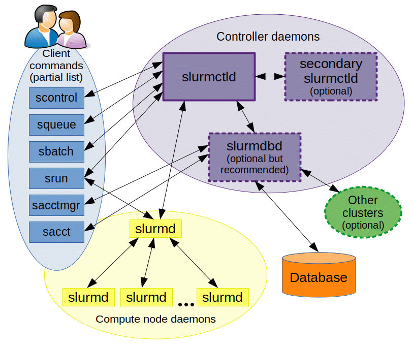
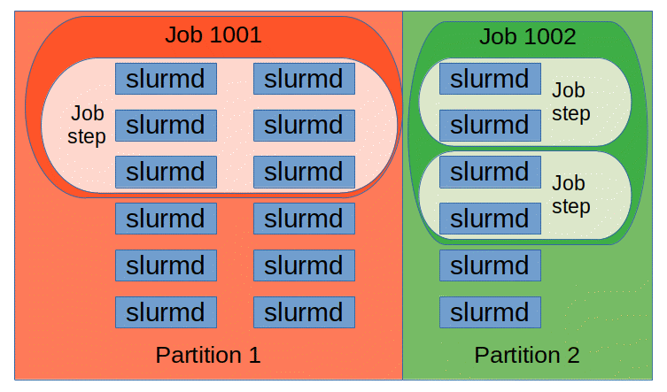

# [主要参考](https://docs.slurm.cn/master/man-pages-shou-ce)

### 架构图

由这些 slurm 守护进程管理的实体

包括节点、 slurm 中的计算资源、分区(将节点分组为逻辑(可能重叠)集合)、作业或分配给用户的指定时间内的资源，以及作业步骤(作业步骤是作业中的一组任务(可能并行))。

==分区可以被视为作业队列==，每个分区都有各种各样的约束，比如作业大小限制、作业时间限制、允许使用它的用户等等。

按优先级排序的作业是在一个分区内分配节点，直到该分区内的资源(节点、处理器、内存等)耗尽为止。

一旦一个作业被分配了一组节点，用户就能够在分配中的任何配置中以作业步骤的形式启动并行工作。例如，可以启动一个作业步骤来利用分配给该作业的所有节点，或者几个作业步骤可以独立地使用分配的一部分。

## slurm 节点及其守护进程作用

|守护进程|作用|
|--|--|
|slurmctld|The central management daemon of Slurm.   Slurm 的中央管理守护进程。|
|slurmd|The compute node daemon for Slurm.   Slurm 的计算节点守护进程。|
|slurmdbd|Slurm Database Daemon.   Slurm 数据库守护进程。|
|slurmrestd|The Slurm REST API daemon.   Slurm 的 REST API 守护进程。|
|slurmstepd|The job step manager for Slurm.   Slurm 的工作步骤经理。|
|SPANK|Slurm Plug-in Architecture for Node and job (K)control.   用于节点和作业(k)控制的 slurm 结构插件。|