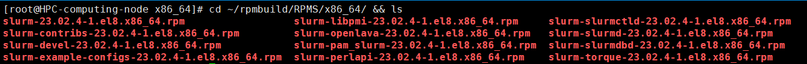
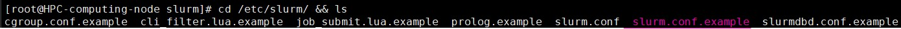
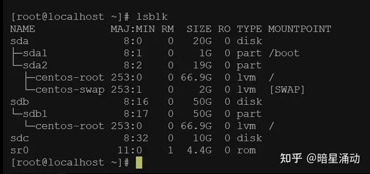
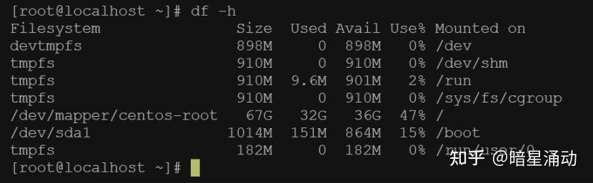
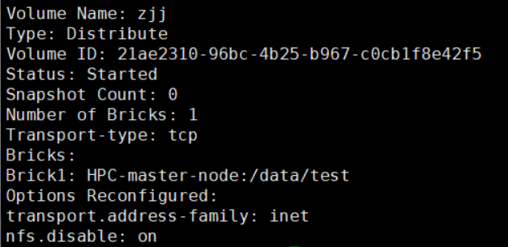

#### 目的

从零开始部署hpc,学习超算部署过程及业务。

#### 部署环境

- 操作系统 RockyLinux 8.8
- 实体物理机
- 部署组件： Slurm、glusterfs、munge
- 部署前应该做的事
  
  修改主机名
  ```sh
  # 查询主机名
  hostname
  # 修改主机名,把之前的删除,自定义以后,wq 保存关闭即可
  vi /etc/hostname
  # 也可以使用,以下命令来修改
  hostnamectl set-hostname 自定义主机名
  # 以下是个示例
  hostnamectl set-hostname hpc01
  # 检查一下主机名是否生效,这应该返回的是最新的主机名
  hostname
  # 重启主机以使新主机名生效
  reboot
  ```
  
  注意：在更新主机名后，您可能需要重新配置一些与主机名相关的服务和配置文件，如SSL证书、配置文件中的主机名等。
  
  修改hosts
  ```sh
  # 打开 /etc/hosts 文件
  vi /etc/hosts
  # 添加类似一下内容
  192.168.1.143 hpc01
  192.168.1.142 hpc02
  ...
  # ip地址 + 空格 + 主机名
  ```
  
  关闭 selinux
  ```sh
  # 查询 selinux 状态 
  getenforce
  # 临时关闭 selinux                                                           
  setenforce 0
  # 永久关闭 selinux                                                        
  vi /etc/selinux/config                                                 
  # 找到 SELINUX=enforcing 这一行,将 SELINUX=enforing 改成 SELINUX=disabled, 保存退出, 这个是下次重启时生效
  ```
  
  关闭防火墙
  ```sh
  # 停止防火墙
  systemctl stop firewalld
  # 关闭防火墙服务
  systemctl disable firewalld
  # 查询防火墙状态
  systemctl status firewalld
  ```
  
  系统基础设置和时间同步相关
  ```sh
  # 可选安装(不一定非要这样)
  yum groups install -y "Server with GUI" && reboot
  # 配置时间同步服务,同步服务器时间,先查看时间同步服务的状态
  systemctl status chronyd.service 
  # 修改时间同步的配置文件
  vi /etc/chrony.conf
  # 将现有的四个时间同步服务注释掉(如果有就注释没有就算了),然后添加阿里云的时间同步服务, 如果已经是这样的话就不用修改了
  pool ntp.aliyun.com iburst 
  # 然后找到 "# allow 192.168.0.0/16",将其 ip 改成本机 ip,这里的本机 ip 是 192.168.1.145 , 并保存退出
  allow 192.167.1.145
  # 然后重启时间同步服务
  systemctl restart chronyd.service
  ```
- 源码编译 Slurm rpm 包
  
  安装源
  ```sh
  yum install epel* && yum makecache
  ```
  
  在计算集群环境中保护和管理用户和服务的身份验证
  ```sh
  # 安装基础组件
  yum install munge* rng-tools
  rngd -r /dev/urandom
  # 然后对 munge 程序文件的权限进行调整
  chmod -R 0700 /etc/munge /var/log/munge && chmod -R 0711 /var/lib/munge && chmod -R 0755 /var/run/munge
  # 生成 munge 程序的密钥文件, /etc/munge/munge.key
  /usr/sbin/create-munge-key -r
  # 启动 munge 服务
  systemctl enable munge --now
  # 验证 munge 程序运行的状态
  munge -n | unmunge
  # 在线不能安装 munge-devel ,可到 http://www.rpmfind.net/linux/rpm2html/search.php?query=munge-devel 下载后，手动安装
  rpm -ivh munge-devel-0.5.15-150400.18.3.6.x86_64.rpm --nodeps
  # 安装一些 依赖的第三方库
  yum install libmunge*
  ```
  
  安装配置记帐数据库, MariaDB数据库管理系统是MySQL的一个分支
  ```sh
  dnf install mysql-server  (for rocky linux)
  yum install mariadb*
  systemctl start mariadb 
  #########配置数据库######
  mysql
  # 创建数据库
  create database slurm_acct_db;
  # 创建数据库    
  create database slurm_jobcomp_db;   
  grant all privileges on slurm_acct_db.* to slurm@localhost identified by 'Slurm123' with grant option;
  grant all privileges on slurm_acct_db.* to slurm@system0 identified by 'Slurm123' with grant option;
  grant all privileges on slurm_jobcomp_db.* to slurm@localhost identified by 'Slurm123' with grant option;
  grant all privileges on slurm_jobcomp_db.* to slurm@system0 identified by 'Slurm123' with grant option;
  flush privileges;
  exit 
  ```
  
  源码编译slurm
  ```sh
  # 安装编译 slurm 包所需要的一些第三方库
  yum install -y rpm-build bzip2-devel libjwt-devel openssl openssl-devel zlib-devel perl-DBI perl-ExtUtils-MakeMaker pam-devel readline-devel mariadb-devel python3 gtk2 gtk2-devel gcc make
  # 创建 slurm 管理用户的配套用户
  groupadd -g 200 slurm && useradd -u 200 -g 200 -s /sbin/nologin -M slurm
  # 转到用户目录并下载 slurm 软件
  cd && wget https://download.schedmd.com/slurm/slurm-23.02.4.tar.bz2
  # 使用 rpm 对 slurm 进行编译
  rpmbuild -ta slurm*.tar.bz2
  # 如果要编译相关 slurmrestd,加上参数
  rpmbuild -ta slurm*.tar.bz2 --with slurmrestd --with=with-jwt
  # 其他的插件全部依赖 slurm-23.02.4-1.el8.x86_64.rpm,如果构建这个包的时候没有加 with-jwt,其他的也不会有这个插件,会疯狂报缺乏 jwt 插件的错误
  # 查看编译完成的结果
  cd ~/rpmbuild/RPMS/x86_64/
  ```
  
  编译结果如下图所示
  
  
  
  将这些文件复制到其他节点并进行安装
  ```sh
  yum loaclinstall -y *.rpm
  ```
  
  安装完成后, 对 slurm 作业系统进行配置
  ```sh
  # 首先转到安装路径, 有个配置文件的模板 slurm.conf.example
  cd /etc/slurm/ && ls
  ```
  
  如下图所示
  
  
  
  复制这个文件来创建一个配置文件
  ```sh
  # 复制配置文件范例
  cp slurm.conf.example slurm.conf
  # 修改配置文件
  vi slurm.conf
  # 修改以下参数
  ClusterName = 自定义集群名字
  SlurmctldHost = 管理节点的主机名(如 hpc01 or HPC-master-node)
  SlurmUser = 为之前 创建 slurm 管理用户的配套用户
  SlurmdUser = slurm
  ReturnToService = 2
  # 启动 slurm 服务
  systemctl start slurmd.service
  systemctl start slurmdbd.service
  systemctl start slurmctld.service
  ```
- glusterFS 部署 (集群)( 对于 hpc 2.0 系统可以不用安装) 
  
  安装glusterFS
  ```sh
  yum -y install centos-release-gluster6 
  yum install -y glusterfs glusterfs-server glusterfs-fuse glusterfs-rdma
  ```
  
  启动glusterd服务
  ```sh
  # 开启 gluster 服务
  systemctl start glusterd
  # 开启 gluster 服务开机自启动
  systemctl enable glusterd
  # 查询 gluster 服务状态
  systemctl status glusterd
  ```
  
  创建集群, 将存储节点都放进来
  ```sh
  gluster peer probe hpc01
  gluster peer probe hpc02
  ...
  # 将一个个的存储节点添加至 glusterFS 存储集群
  # 查询 glusterFS 集群状态
  gluster peer status
  ```
  
  如果想从集群中去除节点，可以执行如下命令，但该节点中不能存在卷中正在使用的brick。
  ```sh
  gluster peer detach 节点名称
  ```
  - 每一个存储节点要做的事
    
    查看硬盘挂载详情
    ```sh
    lsblk
    ```
    
    效果如下
    
    
    
    其中，TYPE 为 disk 类型，且没有下分支的，即是没有被分区的硬盘。
    
    查看存储节点磁盘挂载状态
    ```sh
    df -h
    ```
    
    效果如下
    
    
    
    如果需要还需要格式化硬盘
    ```sh
    mkfs.xfs /dev/sdc
    ```
    
    请注意，这些命令均会删除硬盘上的所有数据，请谨慎使用。
    
    创建存储目录
    ```sh
    mkdir -p /data
    ```
    
    挂载硬盘到 /data 目录下,当然也可以自定义
    ```sh
    # 临时挂载
    mount /dev/sdc /data
    # 永久挂载, 即开机挂载,首先查看硬盘的uuid
    ls -l /dev/disk/by-uuid/
    # 修改 /etc/fstab
    vi /etc/fstab
    # 在最后一行添加
    UUID=查到的uuid字符串       /data       xfs       defaults        0 0
    # wq,保存退出,然后执行以下指令立即生效
    mount -a
    ```
    
    一个目录是不允许挂多块盘的
  
  但是可以用gluster把不同目录的存储组合起来,创建volune(分布式卷)
  ```sh
  # 可以是不同的主机的不同目录合并成一个卷
  gluster volume create 卷名 主机名01:目录路径 主机名02:目录路径
  # 可以是同一个主机的不同目录合并成一个卷
  gluster volume create 卷名 主机名01:目录路径01 主机名02:目录路径02
  # 以下是个实例
  gluster volume create gls HPC-master-node:/data/test
  ```
  
  查看 volume 状态
  ```sh
  gluster volume status
  ```
  
  返回消息结果如下
  
  
  
  启动 volume
  ```sh
  gluster volume start 卷名
  # 以下是个实例
  gluster volume start zjj
  ```
  
  gluster 调优, 最好还是设置一下, 不设就是默认的
  ```sh
  # 开启 指定 volume 的配额
  gluster volume quota 卷名 enable
  
  # 限制 指定 volume 的配额
  gluster volume quota 卷名 limit-usage / 5TB
  
  # 设置 cache 大小, 默认32MB
  gluster volume set 卷名 performance.cache-size 4GB
  
  # 设置 io 线程, 太大会导致进程崩溃
  gluster volume set 卷名 performance.io-thread-count 16
  
  # 设置 网络检测时间, 默认42s
  gluster volume set 卷名 network.ping-timeout 10
  
  # 设置 目录索引的自动愈合进程
  gluster volume set 卷名 cluster.self-heal-daemon on
  
  # 设置 自动愈合的检测间隔, 默认600s
  gluster volume set 卷名 cluster.heal-timeout 300
  
  # 设置 写缓冲区的大小, 默认1M
  gluster volume set 卷名 performance.write-behind-window-size 1024MB
  ```
  
  在计算节点或者其他客户端上使用 gluster volume
  ```sh
  # 安装客户端
  yum install -y glusterfs glusterfs-fuse
  # 创建挂载目录,当然自定义都可以
  mkdir -p /mnt/gfsmnt
  # 当 gluster volume 是由多个节点混合构成 如:
  gluster volume create 卷名 主机名01:目录路径01 主机名02:目录路径02
  # 在应用节点的主机名随意填写 主机名01 或者 主机名02 中的任意一个即可, 如:
  mount -t glusterfs 主机名01(主机名02):卷名 挂载目录
  # 以下是个例子, 将 gluster volume 卷挂载到刚刚创建的目录下
  mount -t glusterfs hpc01:/zjj /mnt/gfsmnt/
  # 检查挂载结果
  df -h
  ```
  
  关闭 gluster 集群应该 先关闭应用节点,再关闭存储集群
  
  [gluster存储简介,原理,部署使用](https://www.cnblogs.com/you-men/p/14894404.html)
