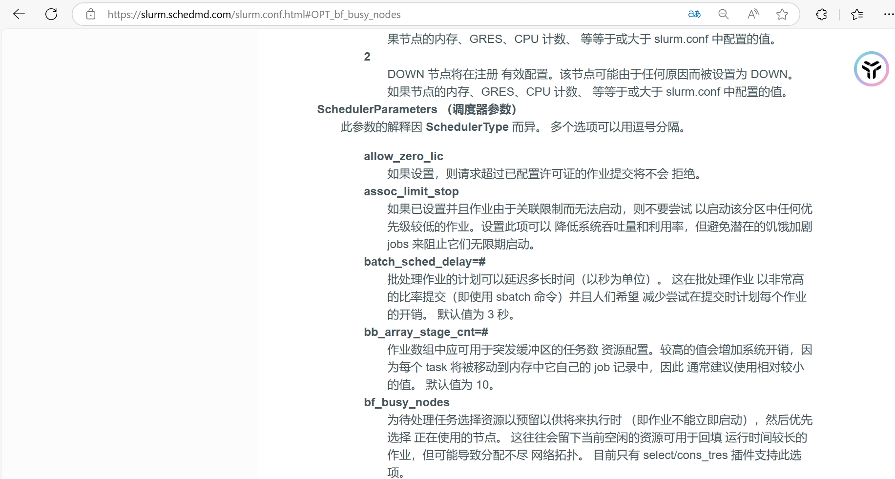
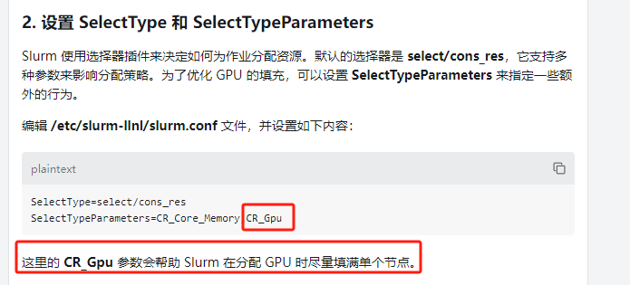

# [主要参考](https://docs.slurm.cn/master/man-pages-shou-ce)

# Configuration Files

|序号|配置文件|用途|
|:--:|--|--|
|1|acct_gather.conf|Slurm configuration file for the acct_gather plugins.  <br/>Slurm 的配置文件。|
|2|burst_buffer.conf|Slurm burst buffer configuration. <br/>Slurm 脉冲缓冲器配置。|
|3|cgroup.conf|Slurm configuration file for the cgroup support.  <br/>Cgroup 支持的 slurm 配置文件。|
|4|ext_sensors.conf|Slurm configuration file for the external sensor support.  <br/>外部传感器支持的 slurm 配置文件。|
|5|gres.conf|Slurm configuration file for generic resource management.  <br/>通用资源管理的 slurm 配置文件。|
|6|helpers.conf|Slurm configuration file for the node_features/helpers plugin.  <br/>Slurm/helpers 插件的配置文件。|
|7|job_container.conf|Slurm configuration file for configuring the tmpfs job container plugin.  <br/>配置 tmpfs 作业容器插件的 slurm 配置文件。|
|8|knl.conf|Slurm configuration file for Intel Knights Landing management.  <br/>英特尔骑士登陆管理的 slurm 配置文件。|
|9|nonstop.conf|Slurm configuration file for failure management.  <br/>用于故障管理的 slurm 配置文件。|
|10|oci.conf|Slurm configuration file for OCI Containers.  <br/>保监处货柜的 slurm 配置文件。|
|11|slurm.conf|Slurm configuration file.  <br/>Slurm 配置文件。|
|12|slurmdbd.conf|Slurm Database Daemon (SlurmDBD) configuration file.  <br/>Slurm 数据库守护进程(slurmDBD)配置文件。|
|13|topology.conf|Slurm configuration file for defining the network topology.  <br/>定义 slurm 网络拓扑的配置文件。|

## 11.slurm.conf

### Slurm 配置文件。

管理节点,即 slurmctld 所在的节点知道所有节点的主机名和ip,即 /etc/hosts 文件中要有一下内容:

```sh
192.168.1.143 mn1
192.168.1.142 cn1
192.168.1.141 cn2
```

一个标准的配置文件:

[参考配置说明文档](https://slurm.schedmd.com/slurm.conf.html)

控制节点配置

```sh
SlurmctldParameters=enable_configless
```

计算节点可以同步控制节点的数据到计算节点

设置 srun 可用端口号区间

```sh
SrunPortRange = 30001-30005
```

### 调度器配置: jiajia科技有需求,尽量多的将零碎的作业调度到已经使用的节点上以节省资源运行大体量作业:

这张图来源于付伟强:



来自官网:

```sh
https://slurm.schedmd.com/slurm.conf.html#OPT_bf_.busy_nodes
```

看着靠谱.

这张图来源于宝哥:



来源于 chart_gpt,官方文档里没有这个选项,看着不靠谱
