[[裸金属]]

## 📊 知识架构图

```mermaid
graph TB
    subgraph Core["🔧 核心概念"]
        BMC["BMC<br/>Baseboard Management Controller<br/>服务器独立管理系统"]
        style BMC fill:#FF6B6B,stroke:#333,stroke-width:2px,color:#fff
    end
    
    subgraph Methods["🚀 部署方式"]
        VM["Virtual Media<br/>虚拟光驱挂载"]
        PXE["PXE<br/>传统网络启动"]
        IPXE["iPXE<br/>增强型网络启动"]
        Redfish["Redfish API<br/>标准化远程部署"]
        IPMI["IPMI<br/>老旧设备支持"]
        
        style VM fill:#4ECDC4,stroke:#333,stroke-width:2px,color:#fff
        style PXE fill:#4ECDC4,stroke:#333,stroke-width:2px,color:#fff
        style IPXE fill:#45B7D1,stroke:#333,stroke-width:2px,color:#fff,font-weight:bold
        style Redfish fill:#4ECDC4,stroke:#333,stroke-width:2px,color:#fff
        style IPMI fill:#4ECDC4,stroke:#333,stroke-width:2px,color:#fff
    end
    
    subgraph Tech["⚙️ 技术细节"]
        IPXECmd["iPXE 指令集<br/>脚本命令参考"]
        BootProcess["启动流程<br/>BIOS→DHCP→TFTP→HTTP"]
        Scripting["脚本编程<br/>自动化安装配置"]
        
        style IPXECmd fill:#95E1D3,stroke:#333,stroke-width:2px,color:#333
        style BootProcess fill:#95E1D3,stroke:#333,stroke-width:2px,color:#333
        style Scripting fill:#95E1D3,stroke:#333,stroke-width:2px,color:#333
    end
    
    subgraph Practice["💼 实际应用"]
        Single["小规模单机<br/>Virtual Media"]
        Batch["批量部署<br/>PXE/iPXE"]
        Cloud["大规模集群<br/>Redfish + iPXE"]
        
        style Single fill:#F38181,stroke:#333,stroke-width:2px,color:#fff
        style Batch fill:#F38181,stroke:#333,stroke-width:2px,color:#fff
        style Cloud fill:#AA96DA,stroke:#333,stroke-width:2px,color:#fff,font-weight:bold
    end
    
    subgraph Tools["🛠️ 管理工具"]
        MAAS["MAAS<br/>Ubuntu Metal as a Service"]
        Ironic["Ironic<br/>OpenStack Bare Metal"]
        Cobbler["Cobbler<br/>系统安装服务"]
        Foreman["Foreman<br/>基础设施管理"]
        
        style MAAS fill:#FFE66D,stroke:#333,stroke-width:2px,color:#333
        style Ironic fill:#FFE66D,stroke:#333,stroke-width:2px,color:#333
        style Cobbler fill:#FFE66D,stroke:#333,stroke-width:2px,color:#333
        style Foreman fill:#FFE66D,stroke:#333,stroke-width:2px,color:#333
    end
    
    %% 关系连接
    BMC --> VM
    BMC --> PXE
    BMC --> IPXE
    BMC --> Redfish
    BMC --> IPMI
    
    IPXE --> IPXECmd
    IPXE --> BootProcess
    IPXE --> Scripting
    
    PXE --> BootProcess
    
    Single --> VM
    Batch --> PXE
    Batch --> IPXE
    Cloud --> IPXE
    Cloud --> Redfish
    
    Cloud --> MAAS
    Cloud --> Ironic
    Batch --> Cobbler
    Cloud --> Foreman
    
    classDef default fill:#e1f5fe,stroke:#01579b,stroke-width:2px,color:#000
```



---

## 📚 文档导航

### 1️⃣ **基础概念** → [[BMC远程拉取操作系统]]
- BMC 的定义和作用
- 常见 BMC 类型（iDRAC、iLO、iBMC 等）
- 各种部署方式的对比
- 生产环境推荐方案

**关键内容**:
- ✅ BMC 独立于主系统的优势
- ✅ 各种部署方式的适用场景
- ✅ 5 种主要部署方式详解
- ✅ Redfish API 基础用法

**推荐阅读顺序**: 1️⃣ 首先了解

---

### 2️⃣ **网络启动详解** → [[4_iPXE网络启动方案]]
- iPXE 的优势和工作原理
- 网络启动的完整流程
- 服务器配置示例
- 架构设计和最佳实践

**关键内容**:
- ✅ iPXE vs 传统 PXE 的优缺点
- ✅ 完整的启动流程图
- ✅ 服务端和客户端配置
- ✅ 实际部署案例

**推荐阅读顺序**: 2️⃣ 深入理解部署流程

**与本文的关系**:
- 继续深化 [[BMC远程拉取操作系统#七、iPXE + HTTP 无盘安装|BMC 中关于 iPXE 的介绍]]
- 需要 [[5_ipxe指令说明|iPXE 指令]] 支撑脚本编写

---

### 3️⃣ **指令参考** → [[5_ipxe指令说明]]
- iPXE 完整指令速查表
- 9 大类指令详解
- 内置变量参考
- 实战脚本示例

**关键内容**:
- ✅ 网络、启动、镜像、脚本控制指令
- ✅ 菜单、输入输出、系统控制指令
- ✅ 内置系统变量表
- ✅ 6 个完整的实战示例

**推荐阅读顺序**: 3️⃣ 编写自动化脚本时参考

**与本文的关系**:
- 是 [[4_iPXE网络启动方案|iPXE 方案]] 的技术实现参考
- 支撑 [[4_iPXE网络启动方案#自动化脚本编写|自动化脚本]] 的编写

---

### 4️⃣ **启动方式详解** → [[Redfish启动方式详解]]
- UEFI 和 Legacy BIOS 对比
- 13+ 种启动设备全解析
- 不同厂商的支持情况
- 实战脚本和故障排除

**关键内容**:
- ✅ BootSourceOverrideMode（启动模式）完整指南
- ✅ BootSourceOverrideTarget（启动设备）详细对比
- ✅ Pxe vs HddUrl vs RemoteDrive 各种网络启动
- ✅ Dell/HPE/Lenovo/Huawei 厂商支持表
- ✅ 4 个生产环境实战脚本

**推荐阅读顺序**: 2️⃣ 部署前必读

**与本文的关系**:
- 深化 [[BMC远程拉取操作系统#五、Redfish API 自动化部署|BMC 中的 Redfish 部分]]
- 与 [[4_iPXE网络启动方案|iPXE 方案]] 配合使用
- 涉及 Redfish API 启动参数设置

---

## 🔗 内容关系矩阵

| 文档 | 基础 | 应用 | 技术 | 工具 |
|------|------|------|------|------|
| [[BMC远程拉取操作系统\|BMC]] | ⭐⭐⭐ | ⭐⭐⭐ | ⭐⭐ | ⭐⭐ |
| [[4_iPXE网络启动方案\|iPXE方案]] | ⭐⭐ | ⭐⭐⭐ | ⭐⭐⭐ | ⭐⭐ |
| [[5_ipxe指令说明\|指令参考]] | ⭐ | ⭐⭐ | ⭐⭐⭐ | ⭐ |

---

## 📖 学习路径

### 🌱 初学者路径
```
BMC基础概念
    ↓
Virtual Media 简介（单机应用）
    ↓
远程控制和 iKVM
    ↓
Redfish API 基础
```

### 🌿 中级路径
```
BMC 详细了解
    ↓
PXE 启动原理
    ↓
iPXE 网络启动方案
    ↓
自动化脚本编写
    ↓
iPXE 指令详解
```

### 🌳 高级路径
```
完整的裸金属部署体系
    ↓
Redfish + iPXE 整合方案
    ↓
自动化编排工具（Ironic/MAAS）
    ↓
大规模集群部署实战
    ↓
性能优化和高可用设计
```

---

## 🎯 常见使用场景

### 场景 1️⃣: 单机部署操作系统
**所需知识**: [[BMC远程拉取操作系统#四、Virtual Media|Virtual Media]] → Web UI 操作
**参考文档**: [[BMC远程拉取操作系统]]

### 场景 2️⃣: 批量部署 10-50 台服务器
**所需知识**: [[4_iPXE网络启动方案|iPXE 方案]] → [[5_ipxe指令说明#实际应用示例|脚本编写]]
**参考文档**: [[4_iPXE网络启动方案]], [[5_ipxe指令说明]]

### 场景 3️⃣: 大规模集群自动化（100+ 台）
**所需知识**: [[BMC远程拉取操作系统#五、Redfish API 自动化部署|Redfish API]] → Ironic/MAAS
**参考文档**: [[BMC远程拉取操作系统#十、OpenStack Ironic|OpenStack Ironic]], [[4_iPXE网络启动方案]]

### 场景 4️⃣: 编写自定义启动脚本
**所需知识**: [[5_ipxe指令说明|iPXE 指令]] → 脚本编写
**参考文档**: [[5_ipxe指令说明#实际应用示例|实战示例]]

---

## 🔍 快速查找

| 我想... | 查看文档 | 具体章节 |
|--------|---------|---------|
| 了解 BMC 是什么 | [[BMC远程拉取操作系统\|BMC]] | 概述、BMC 的作用 |
| 单机安装系统 | [[BMC远程拉取操作系统\|BMC]] | Virtual Media |
| 批量部署系统 | [[4_iPXE网络启动方案\|iPXE方案]] | 完整方案 |
| 学习 iPXE 指令 | [[5_ipxe指令说明\|指令参考]] | 各章节 |
| 编写启动脚本 | [[5_ipxe指令说明#实际应用示例\|指令参考]] | 实际应用示例 |
| 使用 Redfish API | [[BMC远程拉取操作系统\|BMC]] | Redfish API 部分 |
| 理解启动流程 | [[4_iPXE网络启动方案\|iPXE方案]] | 启动流程图 |
| 找推荐方案 | [[BMC远程拉取操作系统\|BMC]] | 实际生产推荐方案 |

---

## 🔐 安全性

**重要**: 参考 [[BMC远程拉取操作系统#十一、安全建议|安全建议]]

BMC 拥有最高权限，防护至关重要:
- 独立管理网络
- 不暴露公网
- 定期升级 Firmware
- 使用强密码和访问控制

---

## 📋 更新日志

| 日期 | 更新内容 |
|------|---------|
| 2026-05-18 | 创建知识体系和关系图谱 |
| 2026-05-18 | 添加 iPXE 指令说明文档 |
| - | 后续补充中... |

---

## 💡 相关概念

- **PXE** (Pre-boot Execution Environment): 预启动执行环境
- **DHCP** (Dynamic Host Configuration Protocol): 动态主机配置协议
- **TFTP** (Trivial File Transfer Protocol): 简单文件传输协议
- **BMC** (Baseboard Management Controller): 基板管理控制器
- **Redfish**: RESTful 接口和 JSON 模式标准
- **IPMI** (Intelligent Platform Management Interface): 智能平台管理接口
- **iKVM** (Integrated Keyboard Video Mouse): 集成键鼠显示控制
- **Virtual Media**: 虚拟介质挂载
- **SAN** (Storage Area Network): 存储区域网络
- **iSCSI**: Internet Small Computer System Interface

---

*此文档为裸金属知识库的索引和导航。最后更新: 2026-05-18*
