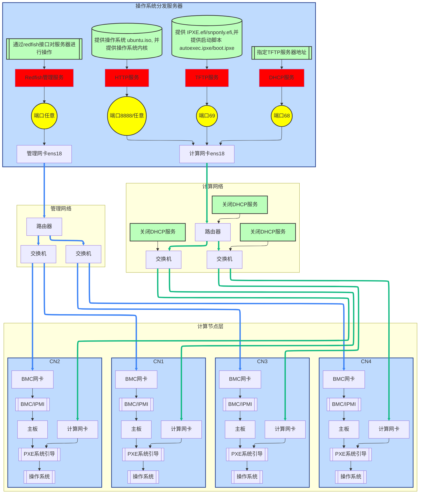

## 📍 知识导航
- 🔗 [[0_裸金属知识体系|← 返回知识体系]]
- 📚 相关文档: [[BMC远程拉取操作系统]] | [[5_ipxe指令说明]]
- 👓 本文是对 [[BMC远程拉取操作系统#七、iPXE + HTTP 无盘安装|BMC 中 iPXE 方案]] 的详细展开

---



# 一. 搭建 IPXE 服务器
## i. 部署 DHCP 服务
1. 安装 isc-dhcp-server tftpd-hpa
```bash
apt install isc-dhcp-server
```

2. 配置 /etc/dhcp/dhcpd.conf 如下
```bash
(base) root@mn1:~# cat /etc/dhcp/dhcpd.conf 
subnet 192.168.100.0 netmask 255.255.255.0 {
    range 192.168.100.100 192.168.100.200;
    option routers 192.168.100.1;
    option broadcast-address 192.168.1.255;
 
    next-server 192.168.100.160; # <=============== 这里要指向 TFTP 所在服务器的 IP
    filename "ipxe.efi";   # UEFI机器
}
```

3. 检查 DHCP 服务是否配置正确
```bash
(base) root@mn1:~# dhcpd -t -cf /etc/dhcp/dhcpd.conf
Internet Systems Consortium DHCP Server 4.4.3-P1
Copyright 2004-2022 Internet Systems Consortium.
All rights reserved.
For info, please visit https://www.isc.org/software/dhcp/
Config file: /etc/dhcp/dhcpd.conf
Database file: /var/lib/dhcp/dhcpd.leases
PID file: /var/run/dhcpd.pid
```

4. 启动 DHCP 服务
```bash
systemctl restart isc-dhcp-server
```

## ii. 部署 TFTP 服务
1. 安装 TFTP服务
```bash
apt install tftpd-hpa
```

2. 配置 /etc/default/tftpd-hpa 如下:
```bash
# /etc/default/tftpd-hpa

TFTP_USERNAME="tftp"
#TFTP_DIRECTORY="改成你存放 ipxe.efi 的路径"
TFTP_DIRECTORY="/var/ty-root/users/zhoujun/Downloads"
TFTP_ADDRESS=":69"
TFTP_OPTIONS="--secure"
```

3. 启动 tftp 服务
```bash
systemctl restart tftpd-hpa.service 
```

4. 下载 ipxe.efi
```bash
# 项目源码地址
https://github.com/ipxe/ipxe
# 项目编译后的地址
https://github.com/ipxe/ipxe/releases
# 下载指令
wget https://github.com/ipxe/ipxe/releases/download/v2.0.0/ipxeboot.tar.gz
# 解压 tar 包
tar -zxvf ipxeboot.tar.gz
# 解压项目结构
.
├── arm32
│   ├── ipxe.efi
│   ├── ipxe-legacy.efi
│   └── snponly.efi
├── arm64
│   ├── ipxe.efi
│   ├── ipxe-legacy.efi
│   └── snponly.efi
├── arm64-sb
│   ├── ipxe.efi
│   ├── ipxe-shim.efi -> shimaa64.efi
│   ├── shimaa64.efi
│   ├── snponly.efi
│   └── snponly-shim.efi -> shimaa64.efi
├── i386
│   ├── ipxe.efi
│   ├── ipxe-legacy.efi
│   ├── ipxe-legacy.pxe
│   ├── ipxe.pxe
│   ├── snponly.efi  # <=================================================企业服务器推荐使用这个
│   └── undionly.kpxe
├── ipxe.efi -> x86_64/ipxe.efi
├── ipxe-legacy.efi -> x86_64/ipxe-legacy.efi
├── ipxe-legacy.pxe -> x86_64/ipxe-legacy.pxe
├── ipxe.pxe -> x86_64/ipxe.pxe
├── loong64
│   ├── ipxe.efi
│   ├── ipxe-legacy.efi
│   └── snponly.efi
├── riscv32
│   ├── ipxe.efi
│   ├── ipxe-legacy.efi
│   └── snponly.efi
├── riscv64
│   ├── ipxe.efi
│   ├── ipxe-legacy.efi
│   └── snponly.efi
├── sb -> x86_64-sb
├── snponly.efi -> x86_64/snponly.efi
├── undionly.kpxe -> x86_64/undionly.kpxe
├── x86_64
│   ├── ipxe.efi
│   ├── ipxe-legacy.efi
│   ├── ipxe-legacy.pxe
│   ├── ipxe.pxe
│   ├── snponly.efi
│   └── undionly.kpxe
└── x86_64-sb
    ├── ipxe.efi
    ├── ipxe-shim.efi -> shimx64.efi
    ├── shimx64.efi
    ├── snponly.efi
    └── snponly-shim.efi -> shimx64.efi

11 directories, 43 files
```

5. 编辑操作系统引导脚本 autoexec.ipxe
```ipxe
#!ipxe
dhcp
chain http://192.168.100.160:8888/boot.ipxe
```
与 snponly.efi 存放在同一目录下

6. 编辑系统启动脚本 boot.ipxe
```ipxe
#!ipxe
dhcp
set base http://192.168.100.160:8888
kernel ${base}/vmlinuz ip=dhcp boot=casper netboot=http url=${base}/ubuntu-26.04-live-server-amd64.iso
initrd ${base}/initrd
boot
```
与 snponly.efi 存放在同一目录下

## iii. 部署 HTTP 服务
1. 下载操作系统 iso
```bash
wget https://releases.ubuntu.com/26.04/ubuntu-26.04-live-server-amd64.iso
```

2. 获取操作系统内核
```bash
mkdir /mnt/iso
mount -o loop ubuntu-26.04-live-server-amd64.iso /mnt/iso/
cp /mnt/iso/casper/vmlinuz ./vmlinuz
cp /mnt/iso/casper/initrd ./initrd
```

3. 将所有在的这些都放到 http 服务器提供获取的路径下

4. 启动 http 服务
```bash
python3 -m http.server 8888 # 端口号要和 boot.ipxe 中的 base 写的一样
```

## iv. 部署 Redfish 管理服务
1. 设置PXE启动
```bash
curl --location 'https://192.168.100.34/redfish/v1/Systems/1' \
--header 'Content-Type: application/json' \
-k -u Administrator:Admin@9000 \
--data '{
    "Boot": {
        "BootSourceOverrideEnabled": "Once",
        "BootSourceOverrideTarget": "Pxe"
    }
}'
```

2. 开机/关机
```bash
curl --location 'https://192.168.100.34/redfish/v1/Systems/1/Actions/ComputerSystem.Reset' \
--header 'Content-Type: application/json' \
-k -u Administrator:Admin@9000 \
# 开机
--data '{
  "ResetType": "On"
}'
# 正常关机
--data '{
  "ResetType": "GracefulShutdown"
}'
# 强制关机
--data '{
  "ResetType": "ForceOff"
}'
# 强制重启
--data '{
  "ResetType": "ForceRestart"
}'
# 正常重启
--data '{
  "ResetType": "GracefulRestart"
}'
```

