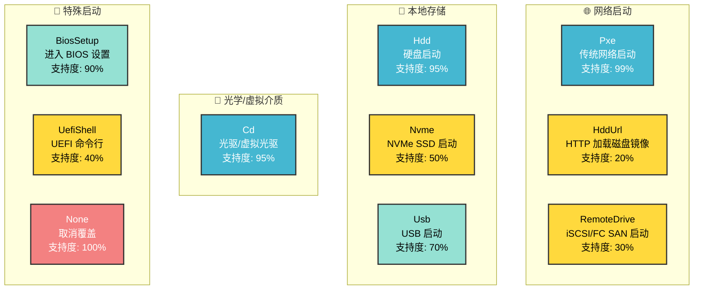

## 📍 知识导航
- 🔗 [[0_裸金属知识体系|← 返回知识体系]]
- 📚 相关文档: [[BMC远程拉取操作系统]] | [[5_ipxe指令说明]]
- 👓 本文深化 [[BMC远程拉取操作系统#五、Redfish API 自动化部署|BMC 中的 Redfish 部分]]

---

# Redfish 启动方式详解

## 概述

启动方式（Boot Configuration）是服务器启动过程中的关键配置，直接影响系统能否正常启动。本文详细介绍 Redfish 标准中的启动模式、启动设备以及厂商实现差异。

---

## 目录

1. [启动模式（BootSourceOverrideMode）](#启动模式)
2. [启动设备（BootSourceOverrideTarget）](#启动设备)
3. [不同厂商的支持情况](#厂商支持)
4. [实战应用](#实战应用)
5. [最佳实践](#最佳实践)

---

## 启动模式

### BootSourceOverrideMode 详解

启动模式决定了服务器使用哪套固件和启动协议：

```
UEFI (Unified Extensible Firmware Interface)
  ↓
GPT 分区表
↓
64 位启动
↓
Secure Boot 支持
↓
快速启动（3-5 秒）

---

Legacy BIOS (Basic Input/Output System)
  ↓
MBR 分区表（最大 2TB）
↓
16 位启动
↓
无安全启动
↓
启动缓慢（10-15 秒）
```

### 模式类型

| 模式 | 标识 | 说明 | 分区表 | 磁盘限制 | 推荐 |
|------|------|------|--------|---------|------|
| **UEFI** | `Uefi` | 现代统一固件 | GPT | 无限制 | ✅ 99% |
| **Legacy** | `Legacy` | 传统 BIOS | MBR | 2TB | ❌ 已淘汰 |
| **混合** | `Uefi,Legacy` | 两种兼容 | 两种 | 受限 | ⚠️ 过渡用 |

---

### UEFI 启动流程


---

### UEFI vs Legacy 对比

| 特性 | UEFI | Legacy BIOS |
|------|------|-----------|
| **启动时间** | 3-5 秒 | 10-15 秒 |
| **磁盘支持** | 无限制（GPT） | 最大 2TB（MBR） |
| **位数** | 64 位 | 16 位 |
| **网络启动** | HTTP/PXE（快） | TFTP（慢） |
| **Secure Boot** | ✅ 支持 | ❌ 不支持 |
| **驱动** | 模块化 | 嵌入式 |
| **安全性** | 高 | 低 |
| **服务器** | 现代（2010+） | 老旧（2010-） |
| **推荐指数** | ⭐⭐⭐⭐⭐ | ⭐ |

---

### Redfish API 设置启动模式

#### 查询支持的模式

```bash
curl -k -u admin:password \
  https://<bmc-ip>/redfish/v1/Systems/1 | jq '.Boot.BootSourceOverrideMode@Redfish.AllowableValues'

# 返回示例：
# ["Uefi", "Legacy"]  或
# ["Uefi", "Legacy", "Uefi,Legacy"]
```

#### 设置为 UEFI 模式

```bash
curl -k -u admin:password \
  -X PATCH \
  -H "Content-Type: application/json" \
  -d '{
    "Boot": {
      "BootSourceOverrideMode": "Uefi",
      "BootSourceOverrideTarget": "Pxe",
      "BootSourceOverrideEnabled": "Once"
    }
  }' \
  https://<bmc-ip>/redfish/v1/Systems/1
```

#### 设置为 Legacy 模式（不推荐）

```bash
curl -k -u admin:password \
  -X PATCH \
  -H "Content-Type: application/json" \
  -d '{
    "Boot": {
      "BootSourceOverrideMode": "Legacy",
      "BootSourceOverrideTarget": "Pxe",
      "BootSourceOverrideEnabled": "Once"
    }
  }' \
  https://<bmc-ip>/redfish/v1/Systems/1
```

---

### 检查当前系统使用的模式

```bash
# 在已启动的系统中查看
[ -d /sys/firmware/efi ] && echo "UEFI" || echo "Legacy BIOS"

# 或者
efibootmgr >/dev/null 2>&1 && echo "UEFI" || echo "Legacy BIOS"

# 查看 UEFI 启动项
sudo efibootmgr

# 查看 UEFI 变量
sudo efivar -l
```

---

## 启动设备

### BootSourceOverrideTarget 完整列表

Redfish 标准定义了 13+ 种启动设备，但不同厂商支持情况差异很大：



---

### 启动设备详解

#### 1. **Pxe** - 传统网络启动（最通用 ✅）

```bash
# 设置 PXE 启动
curl -k -u admin:password \
  -X PATCH \
  -H "Content-Type: application/json" \
  -d '{
    "Boot": {
      "BootSourceOverrideMode": "Uefi",
      "BootSourceOverrideTarget": "Pxe",
      "BootSourceOverrideEnabled": "Once"
    }
  }' \
  https://<bmc-ip>/redfish/v1/Systems/1
```

**工作流程**:
```
PXE 启动
  ↓
DHCP 获取配置
  ↓
TFTP 获取 Boot Loader
  ↓
HTTP/TFTP 获取内核和 initrd
  ↓
启动操作系统或 iPXE 脚本
```

**优点**:
- ✅ 支持度最高（99%）
- ✅ 标准化、通用
- ✅ 支持自动化部署
- ✅ 支持 iPXE 脚本

**缺点**:
- ❌ TFTP 传输较慢
- ❌ 需要 DHCP 服务器

**应用场景**: 批量部署、自动化部署、无盘启动

---

#### 2. **HddUrl** - HTTP 加载磁盘镜像（新型 ⭐）

```bash
# 设置 HddUrl 启动
curl -k -u admin:password \
  -X PATCH \
  -H "Content-Type: application/json" \
  -d '{
    "Boot": {
      "BootSourceOverrideTarget": "HddUrl",
      "BootSourceOverrideEnabled": "Once"
    }
  }' \
  https://<bmc-ip>/redfish/v1/Systems/1
```

**工作流程**:
```
HTTP Server
  ↓
直接下载磁盘镜像（disk.img/qcow2）
  ↓
在内存中启动
  ↓
操作系统运行
```

**特点**:
- ✅ 比 PXE 快 3-5 倍
- ✅ 支持大型镜像
- ✅ 配置简单（无需 DHCP/TFTP）
- ❌ 支持度低（仅新版 Dell iDRAC9+）
- ❌ 需要完整磁盘镜像

**vs PXE 对比**:

| 对比 | PXE | HddUrl |
|------|-----|--------|
| 协议 | DHCP + TFTP + HTTP | 直接 HTTP |
| 速度 | 较慢 | 快 3-5 倍 |
| 配置 | 复杂 | 简单 |
| 兼容性 | 广泛（99%） | 有限（20%） |
| 镜像格式 | 内核+initrd | 完整磁盘镜像 |

**应用场景**: 现代大规模部署、需要高速部署的场景

---

#### 3. **RemoteDrive** - SAN 启动（高可用）

```bash
# 设置 RemoteDrive 启动
curl -k -u admin:password \
  -X PATCH \
  -H "Content-Type: application/json" \
  -d '{
    "Boot": {
      "BootSourceOverrideTarget": "RemoteDrive",
      "BootSourceOverrideEnabled": "Once"
    }
  }' \
  https://<bmc-ip>/redfish/v1/Systems/1
```

**支持的协议**:

| 厂商 | iSCSI | 光纤通道 (FC) | NFS |
|------|-------|--------------|-----|
| Dell iDRAC | ✅ | ✅ | ✅ |
| HPE iLO | ✅ | ❌ | ❌ |
| Lenovo | ⚠️ | ❌ | ❌ |
| Huawei | ⚠️ | ❌ | ❌ |

**应用场景**: 
- 高可用集群
- 存储集中化
- 灾难恢复
- 虚拟化环境

---

#### 4. **Cd** - 光驱/虚拟光驱（最简单）

```bash
# 先挂载虚拟光驱
curl -k -u admin:password \
  -X POST \
  -H "Content-Type: application/json" \
  -d '{
    "Image": "http://server/ubuntu.iso",
    "Inserted": true,
    "WriteProtected": true
  }' \
  https://<bmc-ip>/redfish/v1/Managers/1/VirtualMedia/CD

# 再设置启动设备
curl -k -u admin:password \
  -X PATCH \
  -H "Content-Type: application/json" \
  -d '{
    "Boot": {
      "BootSourceOverrideTarget": "Cd",
      "BootSourceOverrideEnabled": "Once"
    }
  }' \
  https://<bmc-ip>/redfish/v1/Systems/1
```

**优点**:
- ✅ 支持度高（95%）
- ✅ 简单直观
- ✅ 无需额外基础设施

**缺点**:
- ❌ 需要手工操作或编程
- ❌ 单机部署效率低

**应用场景**: 单机部署、应急安装、维护操作

---

#### 5. **Hdd** - 硬盘启动（常规）

```bash
curl -k -u admin:password \
  -X PATCH \
  -H "Content-Type: application/json" \
  -d '{
    "Boot": {
      "BootSourceOverrideTarget": "Hdd",
      "BootSourceOverrideEnabled": "Once"
    }
  }' \
  https://<bmc-ip>/redfish/v1/Systems/1
```

**用途**: 从本地 SATA/SAS 硬盘启动已安装的系统

---

#### 6. **Nvme** - NVMe SSD 启动（高性能）

```bash
curl -k -u admin:password \
  -X PATCH \
  -H "Content-Type: application/json" \
  -d '{
    "Boot": {
      "BootSourceOverrideTarget": "Nvme",
      "BootSourceOverrideEnabled": "Once"
    }
  }' \
  https://<bmc-ip>/redfish/v1/Systems/1
```

**特点**:
- ✅ 超高速（3000+ MB/s）
- ✅ 低延迟
- ❌ 支持度中等（50%）

**注意**: 即使 Redfish 不支持 Nvme 启动，系统也能从 NVMe 启动（需要在 BIOS 中配置启动顺序）

---

#### 7. **Usb** - USB 启动

```bash
curl -k -u admin:password \
  -X PATCH \
  -H "Content-Type: application/json" \
  -d '{
    "Boot": {
      "BootSourceOverrideTarget": "Usb",
      "BootSourceOverrideEnabled": "Once"
    }
  }' \
  https://<bmc-ip>/redfish/v1/Systems/1
```

**用途**:
- 从 U 盘启动安装程序
- 应急启动
- 系统维护和修复

---

#### 8. **BiosSetup** - 进入 BIOS 设置界面

```bash
curl -k -u admin:password \
  -X PATCH \
  -H "Content-Type: application/json" \
  -d '{
    "Boot": {
      "BootSourceOverrideTarget": "BiosSetup",
      "BootSourceOverrideEnabled": "Once"
    }
  }' \
  https://<bmc-ip>/redfish/v1/Systems/1
```

**用途**: 修改 BIOS/UEFI 配置、RAID 配置、启动顺序等

---

#### 9. **UefiShell** - UEFI 命令行（调试）

```bash
curl -k -u admin:password \
  -X PATCH \
  -H "Content-Type: application/json" \
  -d '{
    "Boot": {
      "BootSourceOverrideTarget": "UefiShell",
      "BootSourceOverrideEnabled": "Once"
    }
  }' \
  https://<bmc-ip>/redfish/v1/Systems/1
```

**用途**:
- 调试和诊断
- 修复启动问题
- 低级系统维护

---

#### 10. **None** - 取消启动覆盖

```bash
curl -k -u admin:password \
  -X PATCH \
  -H "Content-Type: application/json" \
  -d '{
    "Boot": {
      "BootSourceOverrideTarget": "None",
      "BootSourceOverrideEnabled": "Disabled"
    }
  }' \
  https://<bmc-ip>/redfish/v1/Systems/1
```

**用途**: 恢复正常启动顺序（按 BIOS 中配置的顺序启动）

---

### 启动设备支持度汇总

```
┌──────────────────────────────────────┐
│  通用性排序（支持度从高到低）         │
├──────────────────────────────────────┤
│  ✅✅✅ 100% 通用                     │
│     None, Pxe, Cd, Hdd             │
│                                      │
│  ✅✅ 90%+ 支持                       │
│     BiosSetup, Usb                 │
│                                      │
│  ✅ 50%+ 支持                        │
│     Nvme, UefiShell                │
│                                      │
│  ⚠️  <50% 支持                       │
│     HddUrl (20%), RemoteDrive (30%)│
│                                      │
│  ❌ 基本不支持                        │
│     UefiBootNext, UefiTarget       │
└──────────────────────────────────────┘
```

---

## 厂商支持

### 重要警告 ⚠️

**Redfish 是标准，但厂商实现各不相同！**

```
Redfish 标准（理想）
  ↓
  ❌ 厂商选择性实现
  ↓
实际支持情况
```

---

### Dell iDRAC（支持度最高）

**支持的启动模式**:
```json
"BootSourceOverrideMode@Redfish.AllowableValues": [
  "Uefi",
  "Legacy",
  "Uefi,Legacy"
]
```

**支持的启动设备** (iDRAC9，Dell R650+):
```json
"BootSourceOverrideTarget@Redfish.AllowableValues": [
  "None",
  "Pxe",
  "Floppy",
  "Cd",
  "Hdd",
  "Usb",
  "Nvme",
  "HddUrl",
  "RemoteDrive",
  "UefiShell"
]
```

**查询 Dell 支持的设备**:
```bash
curl -k -u root:calvin \
  https://<idrac-ip>/redfish/v1/Systems/System.Embedded.1 \
  | jq '.Boot'
```

**特点**:
- ✅ 支持最完整
- ✅ HddUrl 支持最好
- ✅ 文档完善

---

### HPE iLO（支持度中等）

**支持的启动设备** (iLO 5，HPE Gen10+):
```json
"BootSourceOverrideTarget@Redfish.AllowableValues": [
  "None",
  "Pxe",
  "Cd",
  "Hdd",
  "Usb",
  "BiosSetup"
]
```

**查询 HPE 支持的设备**:
```bash
curl -k -u Administrator:password \
  https://<ilo-ip>/redfish/v1/Systems/1 \
  | jq '.Boot'
```

**特点**:
- ⚠️ 不支持 HddUrl
- ⚠️ 不支持 RemoteDrive（FC）
- ✅ 基础功能完善

---

### Lenovo XCC（支持度有限）

**支持的启动设备** (ThinkSystem):
```json
"BootSourceOverrideTarget@Redfish.AllowableValues": [
  "None",
  "Pxe",
  "Cd",
  "Hdd",
  "BiosSetup"
]
```

**查询 Lenovo 支持的设备**:
```bash
curl -k -u USERID:PASSW0RD \
  https://<xcc-ip>/redfish/v1/Systems/1 \
  | jq '.Boot'
```

**特点**:
- ❌ 不支持 Nvme
- ❌ 不支持 HddUrl
- ❌ RemoteDrive 支持有限

---

### Huawei iBMC（支持度较低）

**支持的启动设备**:
```json
"BootSourceOverrideTarget@Redfish.AllowableValues": [
  "None",
  "Pxe",
  "Cd",
  "Hdd",
  "BiosSetup"
]
```

**特点**:
- ❌ 不支持 Usb
- ❌ 不支持 Nvme
- ❌ 不支持高级功能

---

### 厂商支持对比表

| 启动设备 | Dell | HPE | Lenovo | Huawei |
|---------|------|-----|--------|--------|
| None | ✅ | ✅ | ✅ | ✅ |
| Pxe | ✅ | ✅ | ✅ | ✅ |
| Cd | ✅ | ✅ | ✅ | ✅ |
| Hdd | ✅ | ✅ | ✅ | ✅ |
| BiosSetup | ✅ | ✅ | ✅ | ✅ |
| Usb | ✅ | ✅ | ❌ | ❌ |
| Nvme | ✅ | ⚠️ | ❌ | ❌ |
| HddUrl | ✅ | ❌ | ❌ | ❌ |
| RemoteDrive | ✅ | ⚠️ | ⚠️ | ❌ |
| UefiShell | ✅ | ⚠️ | ❌ | ❌ |

---

## 实战应用

### 启动参数字段详解

```json
{
  "Boot": {
    "BootSourceOverrideEnabled": "Disabled/Once/Continuous",
    //
    // Disabled      - 禁用启动覆盖（正常启动顺序）
    // Once          - 一次性启动（推荐）
    // Continuous    - 一直使用该启动设备
    //
    
    "BootSourceOverrideMode": "Uefi/Legacy",
    //
    // 启动模式，必须与硬件兼容
    //
    
    "BootSourceOverrideTarget": "设备名称"
    //
    // 启动设备名称
    //
  }
}
```

---

### 场景 1️⃣: 一次性网络启动部署

```bash
#!/bin/bash

BMC_IP="192.168.1.100"
USER="admin"
PASS="password"

echo "设置一次性 PXE 启动..."

curl -k -u ${USER}:${PASS} \
  -X PATCH \
  -H "Content-Type: application/json" \
  -d '{
    "Boot": {
      "BootSourceOverrideEnabled": "Once",
      "BootSourceOverrideMode": "Uefi",
      "BootSourceOverrideTarget": "Pxe"
    }
  }' \
  https://${BMC_IP}/redfish/v1/Systems/1

echo "✅ 已设置为 PXE 一次性启动"
echo "下次启动时将进行网络启动，之后自动恢复"
```

---

### 场景 2️⃣: 查询并安全设置启动设备

```bash
#!/bin/bash

BMC_IP="192.168.1.100"
USER="admin"
PASS="password"
TARGET_DEVICE="Pxe"

echo "查询支持的启动设备..."

ALLOWED=$(curl -s -k -u ${USER}:${PASS} \
  https://${BMC_IP}/redfish/v1/Systems/1 \
  | jq -r '.Boot.BootSourceOverrideTarget@Redfish.AllowableValues[]')

echo "支持的设备: $ALLOWED"

# 检查目标设备是否支持
if echo "$ALLOWED" | grep -q "^${TARGET_DEVICE}$"; then
    echo "✅ 支持 $TARGET_DEVICE，继续设置..."
    
    curl -k -u ${USER}:${PASS} \
      -X PATCH \
      -H "Content-Type: application/json" \
      -d "{\"Boot\": {\"BootSourceOverrideTarget\": \"$TARGET_DEVICE\", \"BootSourceOverrideEnabled\": \"Once\"}}" \
      https://${BMC_IP}/redfish/v1/Systems/1
    
    echo "✅ 设置成功"
else
    echo "❌ 不支持 $TARGET_DEVICE"
    echo "请使用以下设备之一: $ALLOWED"
    exit 1
fi
```

---

### 场景 3️⃣: 优雅降级（自动选择支持的设备）

```bash
#!/bin/bash

BMC_IP="192.168.1.100"
USER="admin"
PASS="password"

# 按优先级尝试设置
PREFERRED_DEVICES=("HddUrl" "Pxe" "Cd" "Hdd")

ALLOWED=$(curl -s -k -u ${USER}:${PASS} \
  https://${BMC_IP}/redfish/v1/Systems/1 \
  | jq -r '.Boot.BootSourceOverrideTarget@Redfish.AllowableValues[]')

echo "支持的设备: $ALLOWED"

for DEVICE in "${PREFERRED_DEVICES[@]}"; do
    if echo "$ALLOWED" | grep -q "^${DEVICE}$"; then
        echo "使用 $DEVICE 启动"
        
        curl -k -u ${USER}:${PASS} \
          -X PATCH \
          -H "Content-Type: application/json" \
          -d "{\"Boot\": {\"BootSourceOverrideTarget\": \"$DEVICE\", \"BootSourceOverrideEnabled\": \"Once\"}}" \
          https://${BMC_IP}/redfish/v1/Systems/1
        
        echo "✅ 已设置为 $DEVICE"
        exit 0
    fi
done

echo "❌ 没有找到合适的启动设备"
exit 1
```

---

### 场景 4️⃣: 识别厂商并采用不同策略

```bash
#!/bin/bash

BMC_IP="192.168.1.100"
USER="admin"
PASS="password"

# 查询 BMC 厂商信息
BMC_INFO=$(curl -s -k -u ${USER}:${PASS} https://${BMC_IP}/redfish/v1/)

VENDOR=$(echo $BMC_INFO | jq -r '.Vendor // "Unknown"')

echo "检测到 BMC 厂商: $VENDOR"

case $VENDOR in
    "Dell"*)
        echo "Dell 服务器，优先使用 HddUrl"
        BOOT_DEVICE="HddUrl"
        ;;
    "HPE"*)
        echo "HPE 服务器，使用 Pxe（不支持 HddUrl）"
        BOOT_DEVICE="Pxe"
        ;;
    "Lenovo"*)
        echo "Lenovo 服务器，使用 Pxe（功能有限）"
        BOOT_DEVICE="Pxe"
        ;;
    *)
        echo "未知厂商，使用通用 Pxe"
        BOOT_DEVICE="Pxe"
        ;;
esac

echo "选择启动设备: $BOOT_DEVICE"

curl -k -u ${USER}:${PASS} \
  -X PATCH \
  -H "Content-Type: application/json" \
  -d "{\"Boot\": {\"BootSourceOverrideTarget\": \"$BOOT_DEVICE\", \"BootSourceOverrideEnabled\": \"Once\"}}" \
  https://${BMC_IP}/redfish/v1/Systems/1

echo "✅ 已设置"
```

---

## 最佳实践

### ✅ 规范做法

```bash
# 1. 总是先查询支持的设备
ALLOWED=$(curl -s ... | jq '.Boot.BootSourceOverrideTarget@Redfish.AllowableValues[]')

# 2. 检查目标设备是否在列表中
if [[ "$ALLOWED" == *"$TARGET"* ]]; then
    # 3. 设置启动设备
    # ...
else
    # 4. 使用备选方案或提示错误
fi

# 5. 一定使用 "Once" 模式
"BootSourceOverrideEnabled": "Once"
```

---

### ❌ 常见错误

```bash
# ❌ 错误 1: 直接设置，不检查支持
curl ... -d '{"Boot": {"BootSourceOverrideTarget": "HddUrl"}}'
# 可能导致错误: "The value 'HddUrl' is not valid"

# ❌ 错误 2: 使用 Continuous 模式
"BootSourceOverrideEnabled": "Continuous"
# 可能导致无限循环启动或启动失败

# ❌ 错误 3: 混用不兼容的模式和设备
"BootSourceOverrideMode": "Legacy"
"BootSourceOverrideTarget": "Nvme"
# Legacy 模式不支持 NVMe

# ❌ 错误 4: 忽略厂商差异
# 在 HPE 上用 HddUrl，但 HPE 不支持此设备
```

---

### 📋 启动设备选择决策树

```
需要启动系统？
├─ 网络启动（部署）
│  ├─ 支持 HddUrl？ → 使用 HddUrl（快速）
│  └─ 不支持？ → 使用 Pxe（通用）
│
├─ 本地启动（生产）
│  ├─ 优先 Nvme？ → 检查支持后使用
│  └─ 使用 Hdd → 通用、稳定
│
├─ 安装 ISO？
│  └─ 使用 Cd (Virtual Media)
│
├─ 系统维护？
│  ├─ 修改 BIOS → 使用 BiosSetup
│  ├─ 调试系统 → 使用 UefiShell
│  └─ 从 U 盘 → 使用 Usb
│
└─ 恢复正常
   └─ 使用 None
```

---

### 生产部署推荐方案

#### 方案 A: 100% 通用（推荐保险）

```json
{
  "Boot": {
    "BootSourceOverrideEnabled": "Once",
    "BootSourceOverrideMode": "Uefi",
    "BootSourceOverrideTarget": "Pxe"
  }
}
```

**适用**: 所有服务器（99%+ 支持）

---

#### 方案 B: 性能优先（仅 Dell）

```json
{
  "Boot": {
    "BootSourceOverrideEnabled": "Once",
    "BootSourceOverrideMode": "Uefi",
    "BootSourceOverrideTarget": "HddUrl"
  }
}
```

**适用**: Dell 服务器（R650+、iDRAC9+）

---

#### 方案 C: 混合方案（推荐）

```bash
# 先检查是否支持 HddUrl
if ALLOWED.contains("HddUrl") {
    use "HddUrl"
} else if ALLOWED.contains("Pxe") {
    use "Pxe"
} else {
    use "Cd"  # 最后备选
}
```

---

## 故障排除

### 问题 1: 设置启动设备失败

```
错误: The value 'HddUrl' is not a valid value for 'BootSourceOverrideTarget'

解决: 查询支持的设备列表，使用支持的设备
```

### 问题 2: 设置后不生效

```
原因: BootSourceOverrideEnabled 设置为 "Disabled"

解决: 必须设置为 "Once" 或 "Continuous"
```

### 问题 3: 系统无限循环启动

```
原因: BootSourceOverrideEnabled 设置为 "Continuous"

解决: 改为 "Once"，并在启动后立即改回 "None" 或 "Disabled"
```

---

## 参考资源

- [[5_ipxe指令说明|iPXE 指令参考]]
- [[BMC远程拉取操作系统|BMC 完整指南]]
- [[4_iPXE网络启动方案|iPXE 网络启动方案]]
- [Redfish 官方规范](https://www.dmtf.org/standards/redfish)
- [Dell iDRAC Redfish 文档](https://www.dellemc.com/)
- [HPE iLO Redfish 文档](https://www.hpe.com/)

---

*文档更新时间: 2026-05-18*
