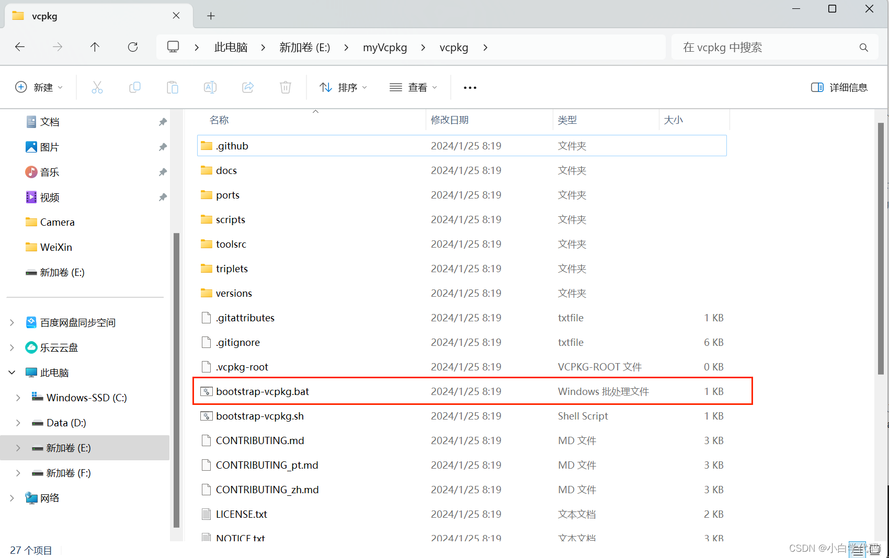
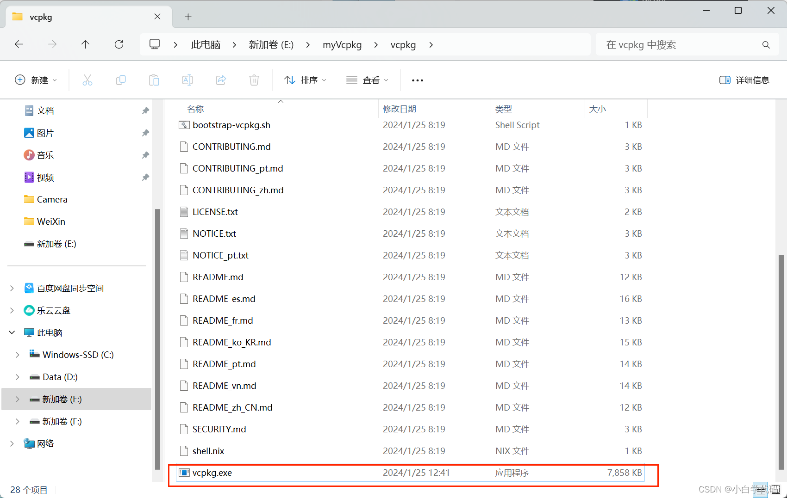
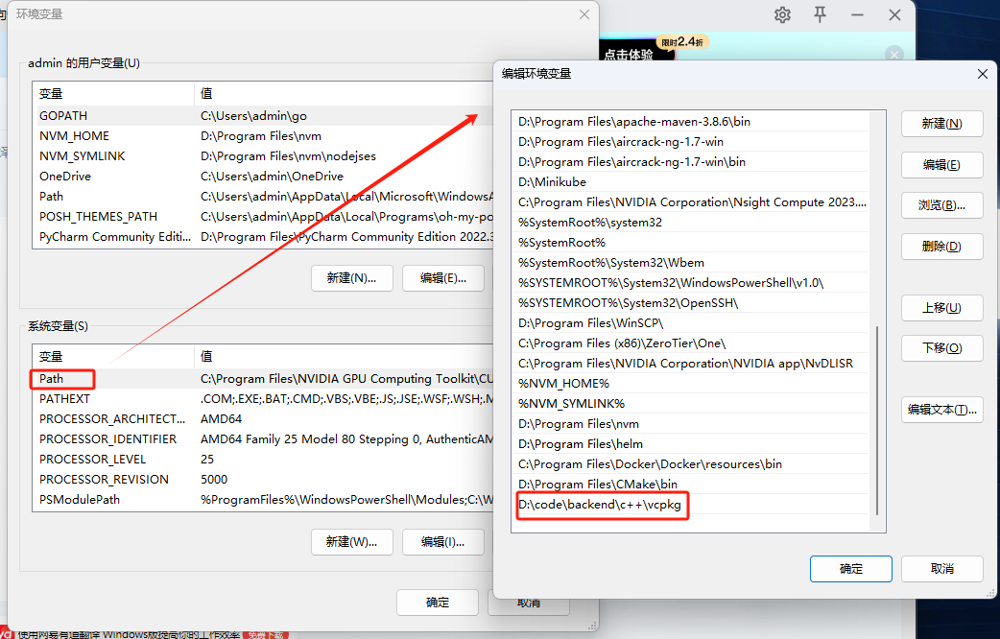
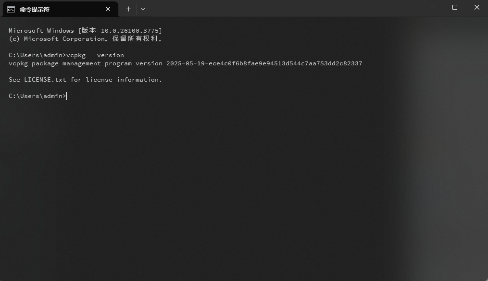

1. 下载Vcpkg

```
git clone https://gitcode.com/microsoft/vcpkg.git
or
git clone https://github.com/microsoft/vcpkg.git
```

2. 安装Vcpkg

双击【bootstrap-vcpkg.bat】文件



安装完成后你会在自己的文件夹中看到vcpkg.exe



添加环境变量：



测试：


