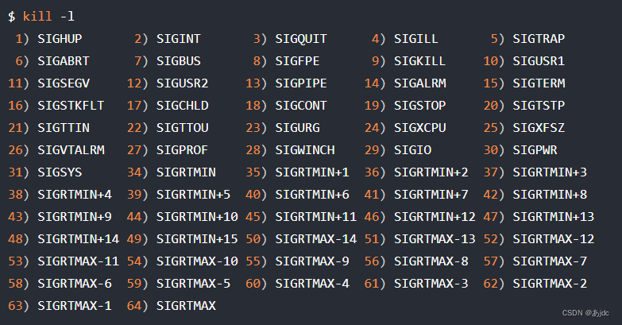

来源:

  [一篇文章带你彻底弄懂Linux中的信号](https://blog.csdn.net/m0_61227789/article/details/134053946)

[【Linux】信号（一文学会，近万字好文深度讲解信号）](https://blog.csdn.net/weixin_71138261/article/details/130940292)

# 一、信号类型

信号(signal)是一种软中断，它本质上是在软件层次上对硬件中断机制的一种模拟。信号传递的信息量相对较少，但便于管理和使用，可以用于系统管理相关的任务，例如通知进程终结、中止或者恢复等。信号机制是进程间通信的一种方式，采用异步通信方式。

Linux系统定义了64种信号，分为两类：可靠信号与不可靠信号，前32种信号为不可靠信号，后32种为可靠信号。

## 1.概念

不可靠信号： 也称为非实时信号，不支持排队，信号可能会丢失, 比如发送多次相同的信号, 进程只能收到一次，信号值取值区间为1~31。

可靠信号： 也称为实时信号，支持排队, 信号不会丢失, 发多少次, 就可以收到多少次. 信号值取值区间为32~64。

## 2.信号表

在终端，可通过kill -l查看所有的signal信号。

|取值|名称|解释|默认动作|
|--|--|--|--|
|1|SIGHUP|挂起||
|2|SIGINT|中断||
|3|SIGQUIT|退出||
|4|SIGILL|非法指令||
|5|SIGTRAP|断点或陷阱指令||
|6|SIGABRT|abort发出的信号||
|7|SIGBUS|非法内存访问||
|8|SIGFPE|浮点异常||
|9|SIGKILL|kill信号|不能被忽略、处理和阻塞|
|10|SIGUSR1|用户信号1||
|11|SIGSEGV|无效内存访问||
|12|SIGUSR2|用户信号2||
|13|SIGPIPE|管道破损，没有读端的管道写数据||
|14|SIGALRM|alarm发出的信号||
|15|SIGTERM|终止信号||
|16|SIGSTKFLT|栈溢出||
|17|SIGCHLD|子进程退出|默认忽略|
|18|SIGCONT|进程继续||
|19|SIGSTOP|进程停止   |不能被忽略、处理和阻塞|
|20|SIGSTP|进程停止||
|21|SIGTTIN|进程停止，后台进程从终端读数据时||
|22|SIGTTOU|进程停止，后台进程向终端写数据时||
|23|SIGURG|I/O有紧急数据到达当前进程|默认忽略|
|24|SIGXCPU|进程的CPU时间片到期||
|25|SIGXFSZ|文件的大小超出上限||
|26|SIGVTALRM|虚拟时钟超时||
|27|SIGPROF|profile时钟超时||
|28|SIGWINCH|窗口大小改变 |默认忽略|
|29|SIGIO|I/O相关||
|30|SIGPWR|关机|默认忽略|
|31|SIGSYS|系统调用异常||

对于signal信号，绝大部分的默认处理都是终止进程或停止进程，或dump内核映像转储。 上述的31的信号为非实时信号，其他的信号32-64 都是实时信号。

在 linux 脚本中可以使用 trap 指令获取 操作系统中发送的信号,并执行 自定义的函数
