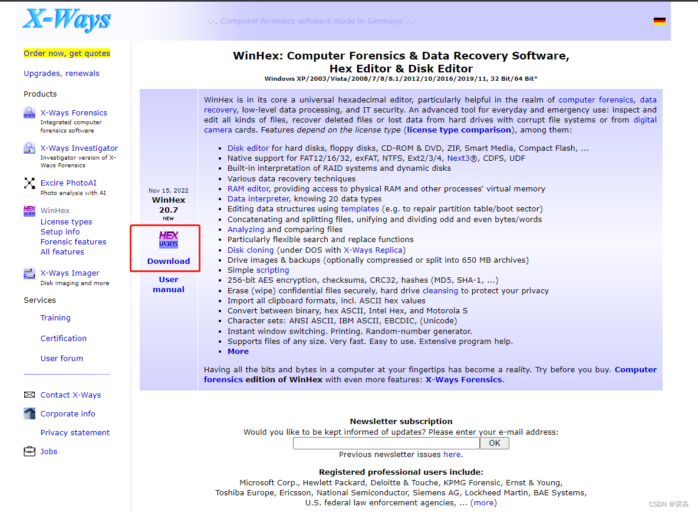
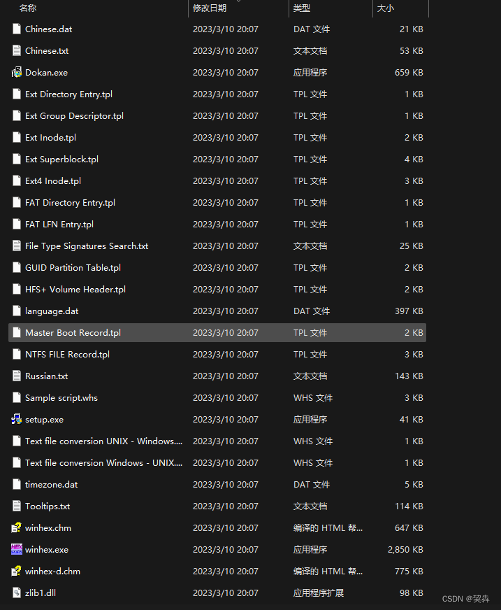
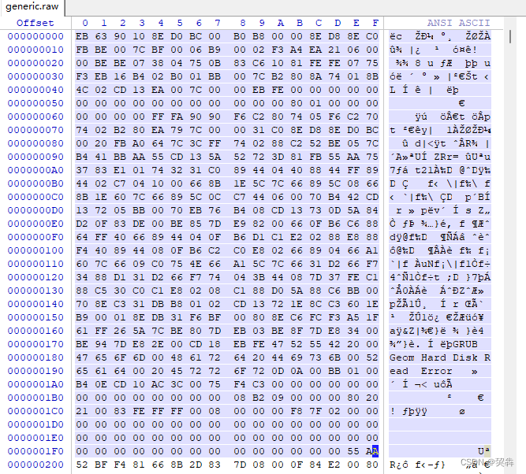
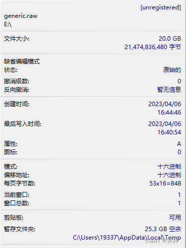
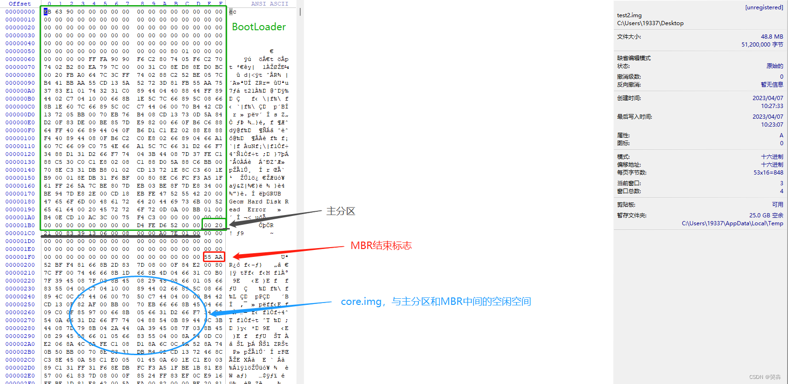

## 目录

### 下载WinHex

### 安装WinHex

### 查看现成的磁盘文件

### 手动创建磁盘文件

		创建磁盘文件

		创建分区

		安装引导程序

		查看磁盘

### 下载WinHex

#### [下载链接](https://so.csdn.net/so/search?q=WinHex&spm=1001.2101.3001.7020)：WinHex: Hex Editor & Disk Editor, Computer Forensics & Data Recovery Software



### 安装WinHex

#### 1).下载完成后出现winhex.zip文件，解压文件，放置到合适位置。如图为winhex.zip内的内容。



#### 2).解压完成之后，直接以管理员方式直接打开winhex.exe文件即可。


#### 查看现成的磁盘文件

		磁盘文件可以通过kvm、vmware、virtualbox等软件进行创建，但是需要将vmdk，qcow2等格式的自盘文件转换为raw格式。

```powershell
[root@zyq images]# /home/zyq/qemu-img convert -p -O raw generic.qcow2 generic.raw
    (100.00/100%)
[root@zyq images]# 
[root@zyq images]# ll generic.* -h
-rw------- 1 root root  21G Apr  6 08:54 generic.qcow2
-rw-r--r-- 1 root root  20G Apr  6 17:49 generic.raw
[root@zyq images]# ll generic.*   
-rw------- 1 root root 21478375424 Apr  6 08:54 generic.qcow2
-rw-r--r-- 1 root root 21474836480 Apr  6 17:49 generic.raw
 
```

查看转换格式后的磁盘文件





### 手动创建磁盘文件

### 1. 创建磁盘文件

```sh
[root@zyq tmp]# dd if=/dev/zero of=/tmp/test.img bs=512 count=100000
100000+0 records in
100000+0 records out
51200000 bytes (51 MB) copied, 0.0909236 s, 563 MB/s
 
[root@zyq tmp]# ll test.img  
-rw-r--r-- 1 root root 51200000 Apr  7 09:00 test.img
 
[root@zyq tmp]# ll test.img -h
-rw-r--r-- 1 root root 49M Apr  7 09:00 test.img
```

### 2.创建分区

```sh
[root@zyq tmp]# fdisk test.img
Welcome to fdisk (util-linux 2.23.2).
 
Changes will remain in memory only, until you decide to write them.
Be careful before using the write command.
 
Device does not contain a recognized partition table
Building a new DOS disklabel with disk identifier 0xfd823fb1.
 
Command (m for help): n
Partition type:
   p   primary (0 primary, 0 extended, 4 free)
   e   extended
Select (default p): 
Using default response p
Partition number (1-4, default 1): 
First sector (2048-99999, default 2048): 
Using default value 2048
Last sector, +sectors or +size{K,M,G} (2048-99999, default 99999): 
Using default value 99999
Partition 1 of type Linux and of size 47.8 MiB is set
 
Command (m for help): w
The partition table has been altered!
 
Syncing disks.
 
 
[root@zyq tmp]# partprobe test.img
[root@zyq tmp]# fdisk test.img -l
 
Disk test.img: 51 MB, 51200000 bytes, 100000 sectors
Units = sectors of 1 * 512 = 512 bytes
Sector size (logical/physical): 512 bytes / 512 bytes
I/O size (minimum/optimal): 512 bytes / 512 bytes
Disk label type: dos
Disk identifier: 0xfd823fb1
 
   Device Boot      Start         End      Blocks   Id  System
test.img1            2048       99999       48976   83  Linux
```

### 3.安装引导程序

```sh
[root@zyq tmp]# grub2-install test.img
Installing for x86_64-efi platform.
Installation finished. No error reported.
```

### 4.查看磁盘



core.img占据的空间大小

2048*512/1024-0.5=1023.5Kbytes
