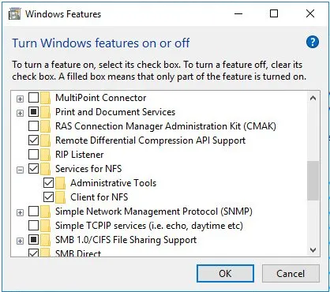
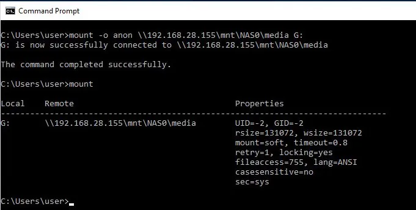
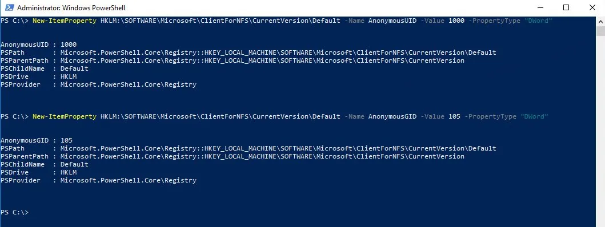
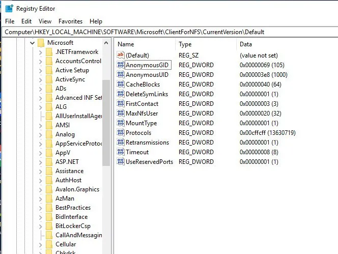
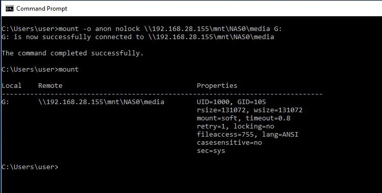
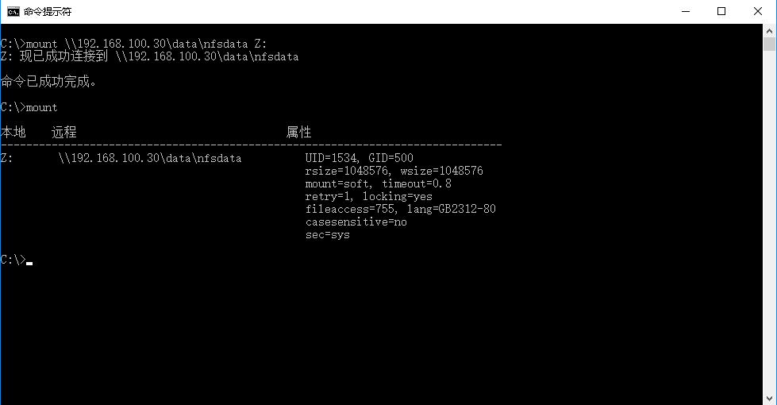

# 使用身份映射在 Windows 中挂载 NFS 共享

在我们开始之前，让我们启用 NFS 服务和两个子功能。



在 Windows 中安装 NFS 共享的典型方式是使用匿名 (anon) 用户安装远程文件系统：

```powershell
mount -o anon \\192.168.28.155\mnt\NAS0\media G:
```

这将根据 NFS 共享的配置权限授予您只读访问权限。



如果您想要读/写访问权限，则必须添加两个 DWORD 注册表项，其中包含拥有共享的 Unix 用户的 UID 和 GID。
启动管理 PowerShell 终端。

```powershell
New-ItemProperty HKLM:\SOFTWARE\Microsoft\ClientForNFS\CurrentVersion\Default -Name AnonymousUID -Value 1000 -PropertyType "DWord"
New-ItemProperty HKLM:\SOFTWARE\Microsoft\ClientForNFS\CurrentVersion\Default -Name AnonymousGID -Value 105  -PropertyType "DWord"
```



打开注册表:

```powershell
regedit
```



重新启动。

重启计算机-强制

现在再次挂载 NFS 共享

```powershell
mount -o anon \\192.168.28.155\mnt\NAS0\media G:
```



大多数人可能就此止步了，因为它确实有效。但是，系统上的任何用户都可以挂载此共享，并对该网络资源拥有读/写访问权限。

为了增强我们的安全态势，我们可以使用几种身份映射机制之一来更好地保护我们与 NFS 共享的交互。利用本地密码和组文件是这些机制之一，不需要额外的服务器或活动目录集成。这些文件的位置是：

```sh
C:\windows\system32\drivers\etc\passwd
C:\windows\system32\drivers\etc\group
```

格式应为：

```sh
passwd:
    [域]\<UnixUser>:x:<UnixUID>:<UnixGID>:说明文字：C:\Users\<UnixUser>
group:
    [域]\<UnixGroup>:x:<UnixGID>:<UnixUID>
```

以下是我的实验室虚拟机中两个文件的内容：

```
C:\Windows\System32\drivers\etc> type passwd
mechanic:x:1000:100:Windows User,,,:c:\users\mechanic

C:\Windows\System32\drivers\etc> type group
wheel:x:0:0
```

一旦这些文件存在并且具有有效条目，Windows 将使用它们并仅将权限映射到正确的用户。如果您创建了 AnonymousUID/GID 注册表条目，请将其删除，并确保已启用 NFS 服务和两个子功能（NFS 客户端和管理工具）。

然后该过程就像使用 nolock 选项安装一样简单。

```powershell
mount -o nolock \\192.168.100.30\data\nfsdata Z:
```

效果如下:



如果此方法无效，请仔细检查以下内容：

1. NFS 共享 UID 和 GID 与 Windows 机器上的密码和组文件中的相匹配。
2. 您已删除注册表中的 AnonymousUID 和 AnonymousGID 条目
3. 你没有跳过重启部分
4. 当您将密码和组文件放置在正确的位置时，您无需在挂载时使用“anon”选项。