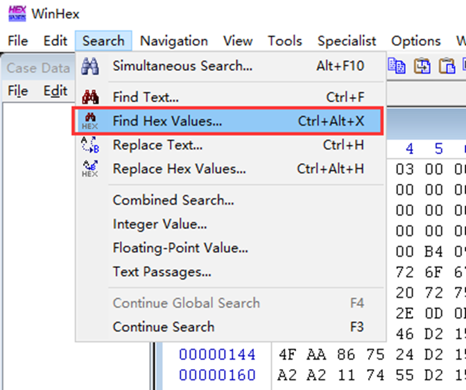
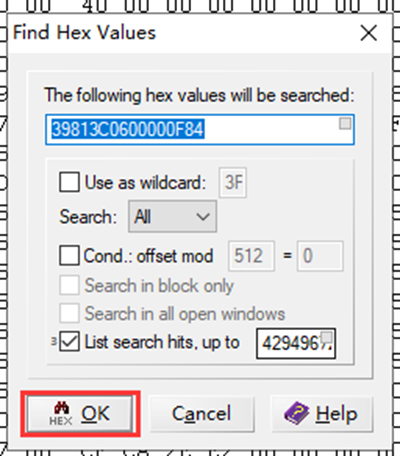
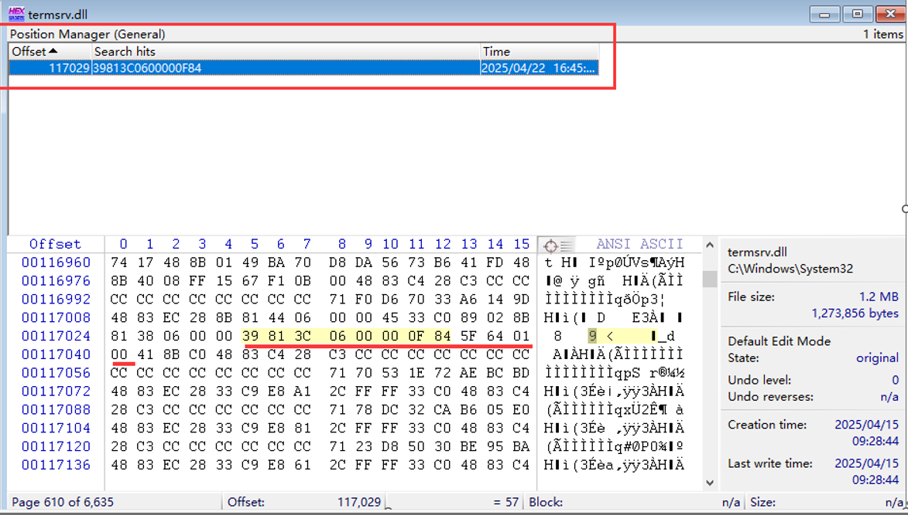
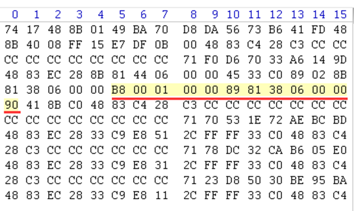

# 如何修改文件termsrv.dll实现多用户同时远程

### 背景：

正常情况下，最多只能2个用户同时远程到计算机；

如何修改文件termsrv.dll实现2个以上用户同时远程？

下面给出解决方案。

 

### 1. 先把补丁文件 C:\Windows\System32\termsrv.dll 复制出来桌面备份

（以免修改后还是无法多人远程可以还原文件，否则补丁文件有问题会导致重启后进不去系统）

 

### 2. 用 WinHex 编辑工具打开，搜索十六进制文本：（工具自行下载）

39813C0600000F84xxxxxxxx（共24位数，后8位因不同系统不同版本而不一样）

把这一串24位数修改为

B80001000089813806000090

然后另存为一份

 

### 3. 管理员运行cmd命令

关闭远程服务：net stop TermService /y

把修改后的补丁文件替换掉C:\Windows\System32\termsrv.dll
如果遇到权限问题无法替换，文件右键 => 属性 => 安全 => 高级 => 所有者更改为Administrator => 编辑Administrators访问权限勾上完全控制 => 确定
