由于没有远程桌面授权服务器可以提供许可证，远程会话连接已断开。请跟服务器管理员联系。原因是服务器安装了远程桌面服务RemoteApp,这个是需要授权的。但是微软官方给予了120天免授权使用，超过120天还没有可用授权就会出现远程会话被中断，可修改注册表来延长使用期限，此方法win2008和win2012适用
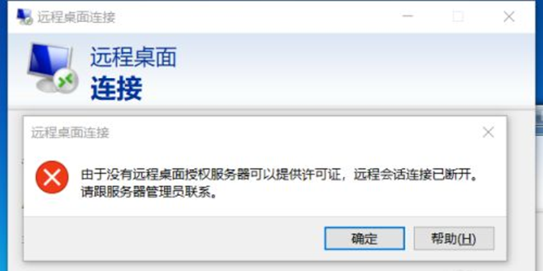

1. 首先进入安装了远程桌面服务RemoteApp的服务器

2. 按 win+R 键 打开运行，输入regedit 然后按 确定

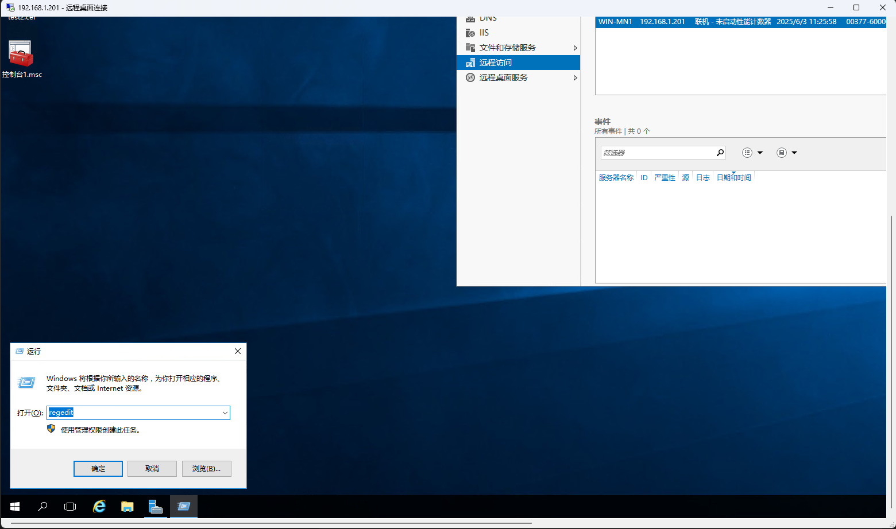

3. 然后就打开了注册表编辑器

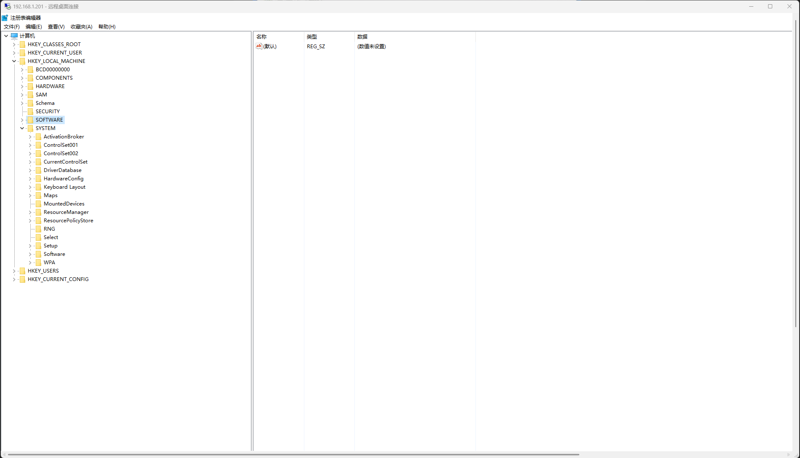

4. 然后进入 HKEY_LOCAL_MACHINE \ SYSTEM \ CurrentControlSet \ Control \ Terminal Server \ RCM \ GracePeriod ，选中 GracePeriod 然后右键 点击 权限

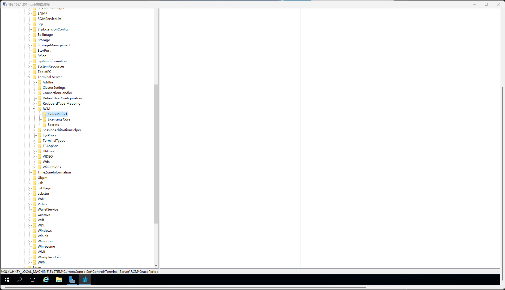

5. 选择Administrators , 把完全控制勾上，点击确定后。

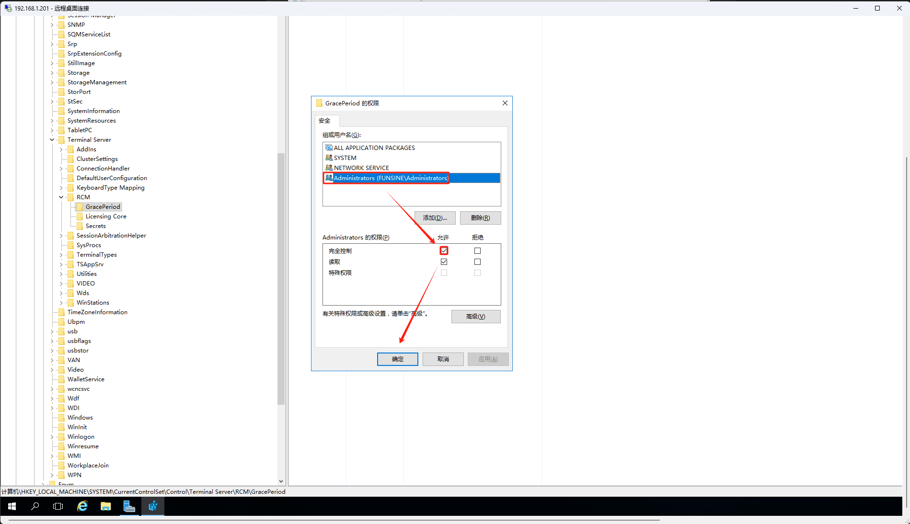

如果修改成功了直接执行后面的7

如果执行失败了，就会出现以下信息

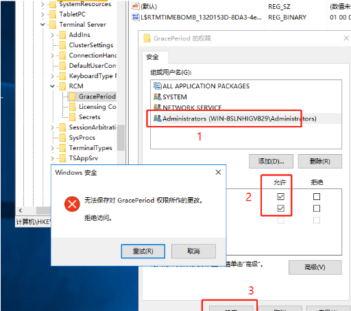

6. administrator权限赋予
回到GracePeriod，右键权限，点击高级

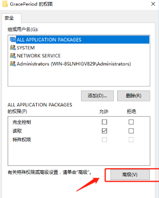

点击更改所有者

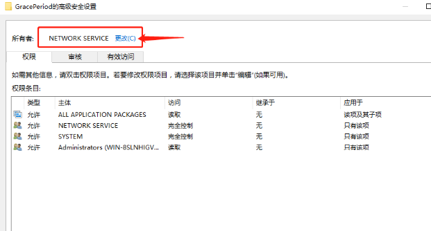

注意：这里选择的是Administrators，看上图中的图标。
更改所有者后在审核里进行添加

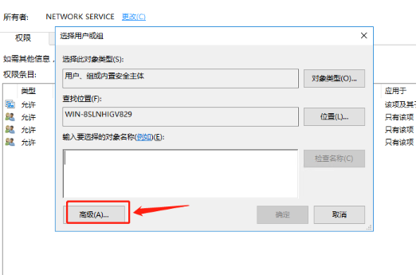

选择Administrators为主体后，在此处添加完全控制权限

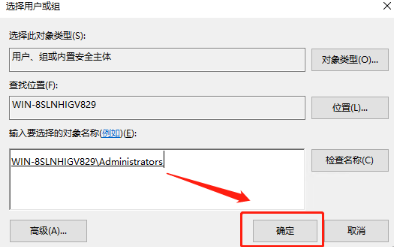

选择Administrators , 然后把 完全控制 勾上 ， 再按确定

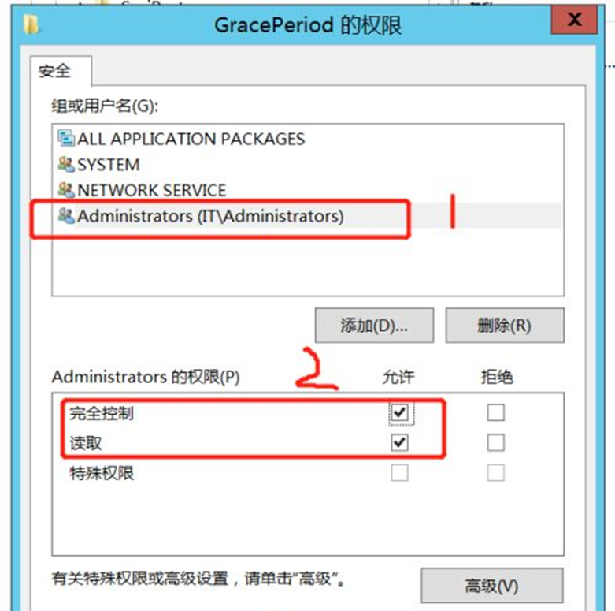

7.选中注册表中的 REG_BINARY，然后右键修改名字

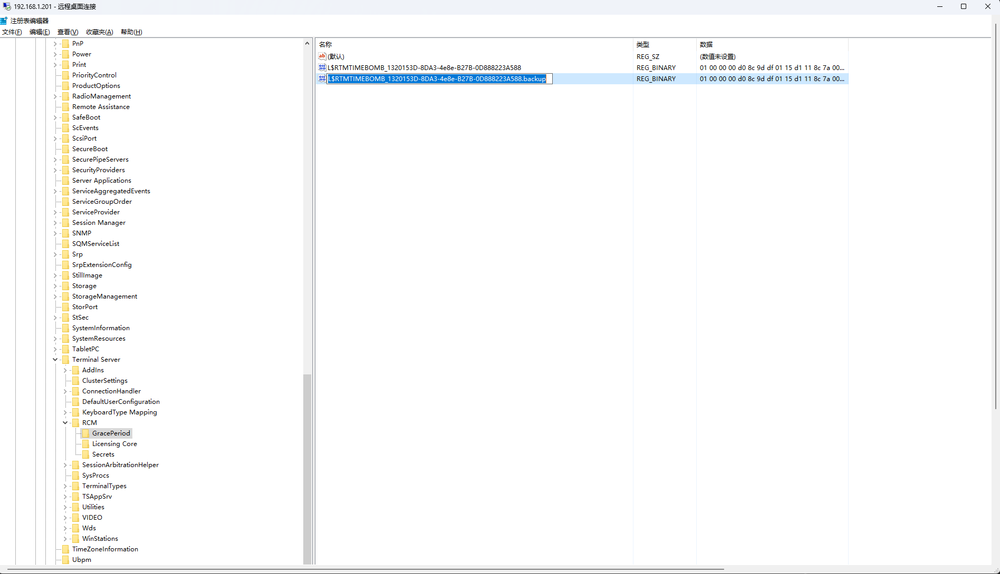

9、然后关掉注册表编辑器，重启服务器
10、重启服务器后就不会被中断了，此方法可以继续使用120天，等到120天到了再按此方法进行操作就可以再继续使用了
