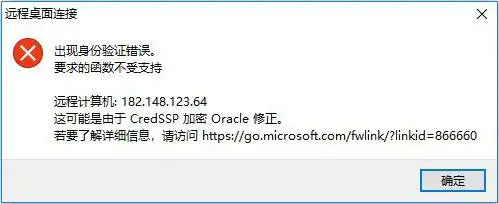
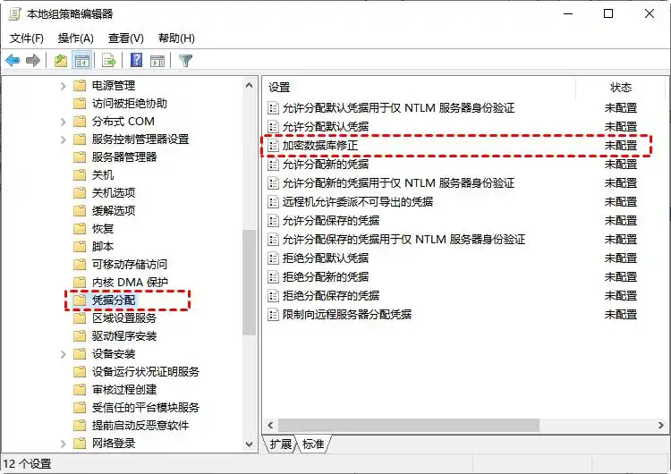
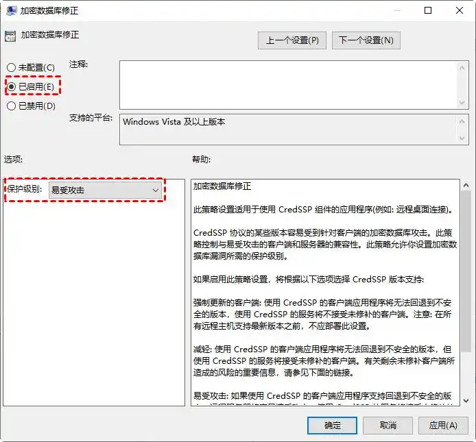
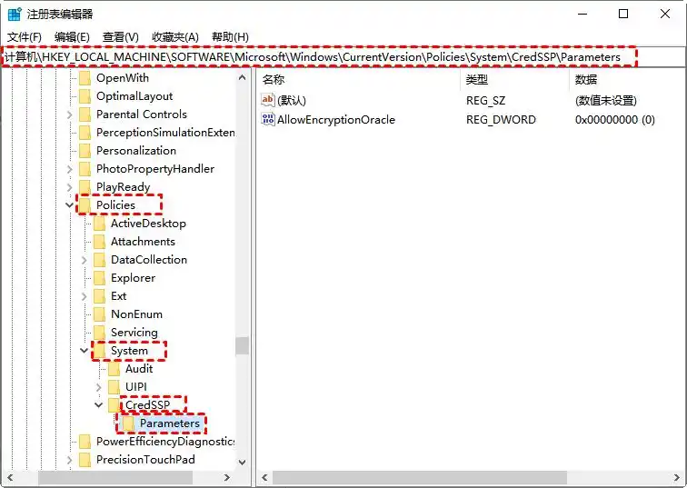
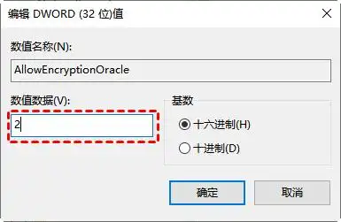

在尝试远程连接到其他设备时，您可能会遇到身份验证错误，通常会弹出提示“出现身份验证错误，要求的函数不受支持”。这种身份验证错误通常是因为您输入的凭据与受控设备上设置的安全帐户信息不匹配。



### 在控制机上使用以下两种方法

## 方法1.设置组策略编辑器

### 为了解决远程桌面连接中的身份验证错误，您可以使用组策略编辑器启用“加密数据库修正”选项。以下是具体的操作步骤：

#### 步骤1.按下Win + R组合键打开运行对话框，输入“gpedit.msc”以打开组策略编辑器。

#### 步骤2.在组策略编辑器的左侧菜单中，依次展开“计算机配置” > “管理模板” > “系统” > “凭据分配”。

#### 步骤3.在右侧窗格中，双击“加密数据库修正”。



#### 步骤4.选择“已启用”，在保护级别选项中选择“易受攻击”，然后点击“应用”。



## 方法2.修改注册表设置

### 为了解决远程桌面连接出现身份验证错误，您可以尝试调整“AllowEncryptionOracle”的值。请按照以下步骤进行操作：

#### 步骤1.按下Win + R键打开运行窗口，然后输入“regedit”以启动注册表编辑器。

#### 步骤2.导航至以下路径：

```
Computer\HKEY_LOCAL_MACHINE\SOFTWARE\Microsoft\Windows\CurrentVersion\Policies\System\CredSSP\Parameters
```



提示：如果发现 CredSSP\Parameters的后两项不存在，请手动创建它们。

#### 步骤3.在右侧窗格中，双击“AllowEncryptionOracle”项，将其值更改为“2”以启用功能。如果需要禁用此功能，只需将值更改为“0”即可。

