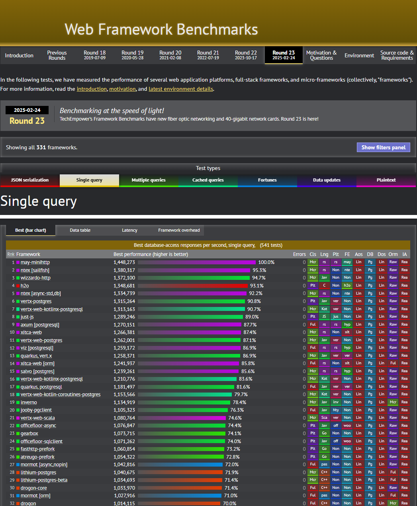

[Web Framework Benchmarks](https://www.techempower.com/benchmarks/#section=data-r23&test=db&b=7&s=3&p=zik0zj-zik0zj-zik0zj-zik0zj-zik0zj-18y67&w=zik0zj-zik0zj-zik0zj-hra0hr&d=e7&a=2&o=f)

|排行|语言|常见框架|每秒并发量(次/秒)|比例|
|--|--|--|--|--|
|1|c++|Drogon|1,033,970|100%|
|2|go|echo|432,423|41.8%|
|3|java|spring|322,865|31.2%|
|4|python|fastapi|231,555|22.3%|