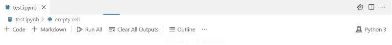
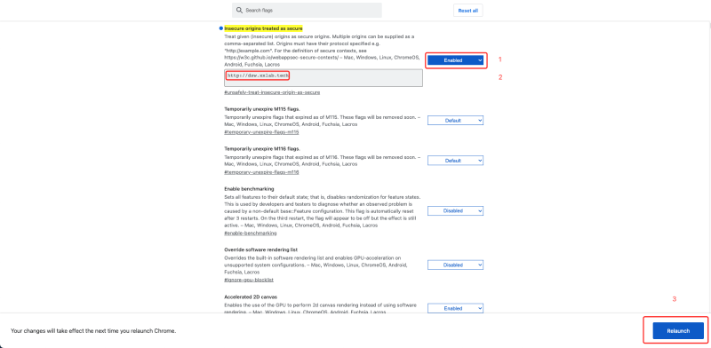
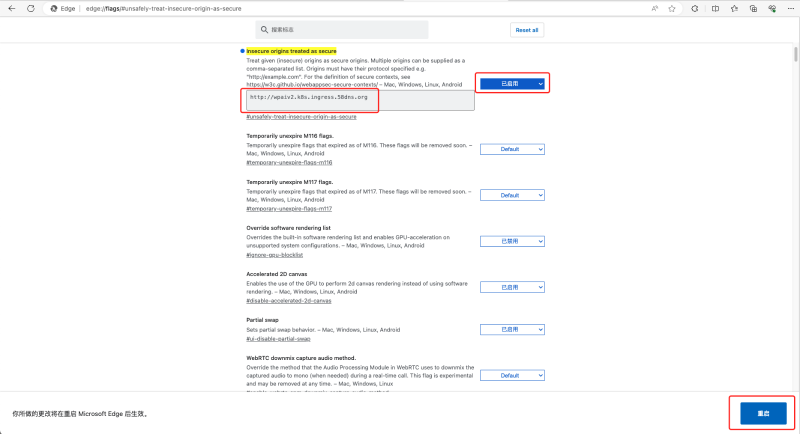

## code-server 无法打开ipynb文件，报错‘crypto.subtle‘ is not available so webviews will not work的解决方法

------

最近使用code-server（VS Code For Web）发现在HTTP环境下一直加载中，不能打开。



```vbnet
  ERR 'crypto.subtle' is not available so webviews will not work. This is likely because the editor is not running in a secure context (https://developer.mozilla.org/en-US/docs/Web/Security/Secure_Contexts).: Error: 'crypto.subtle' is not available so webviews will not work. This is likely because the editor is not running in a secure context (https://developer.mozilla.org/en-US/docs/Web/Security/Secure_Contexts).
```

查看浏览器控制台发现报错，当添加HTTPS证书比较麻烦时可以采用下面临时解决方案。

## Chrome

开启chrome 的 unsafely-treat-insecure-origin-as-secure 功能。

进入chrome flag管理界面 `chrome://flags/#unsafely-treat-insecure-origin-as-secure`



将对应的 code-server 网址填入对应的网址框，并开启该功能，这样很多 code-server 扩展的问题就解决了。

# Edge

进入Edge flag管理界面



image-1697525172657

在网址框中添加，并开启该功能，点击 “重启” 重启浏览器。

## Firefox & Safari:

Firefox 和 Safari 浏览器都不允许在非安全的上下文（如HTTP）中使用 crypto.subtle ，出于安全考虑，Firefox HTTP下只能使用localhost，且不支持通过配置安全策略来使用 crypto.subtle；而Safari 目前没有公开的设置允许 HTTP 下使用 crypto.subtle 。