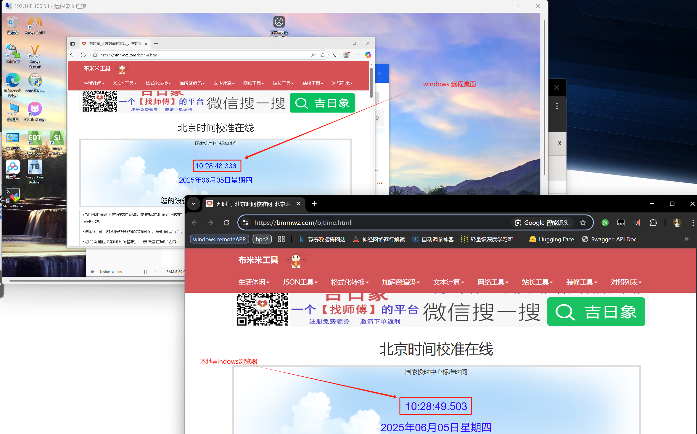
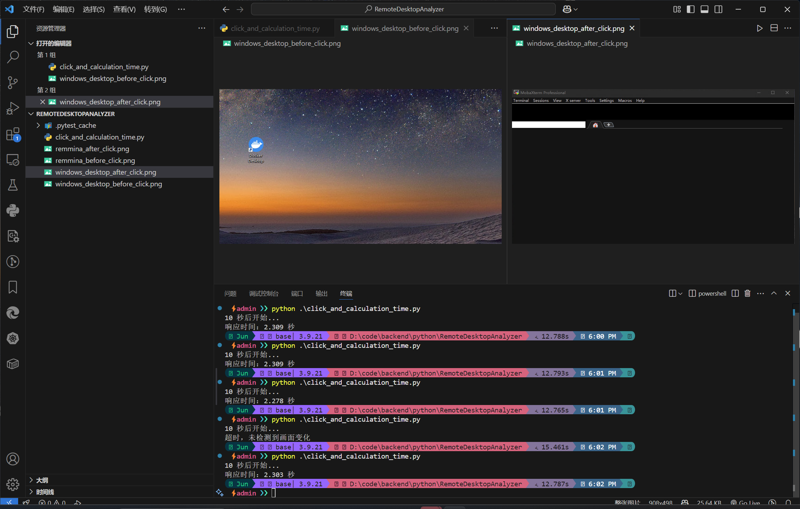
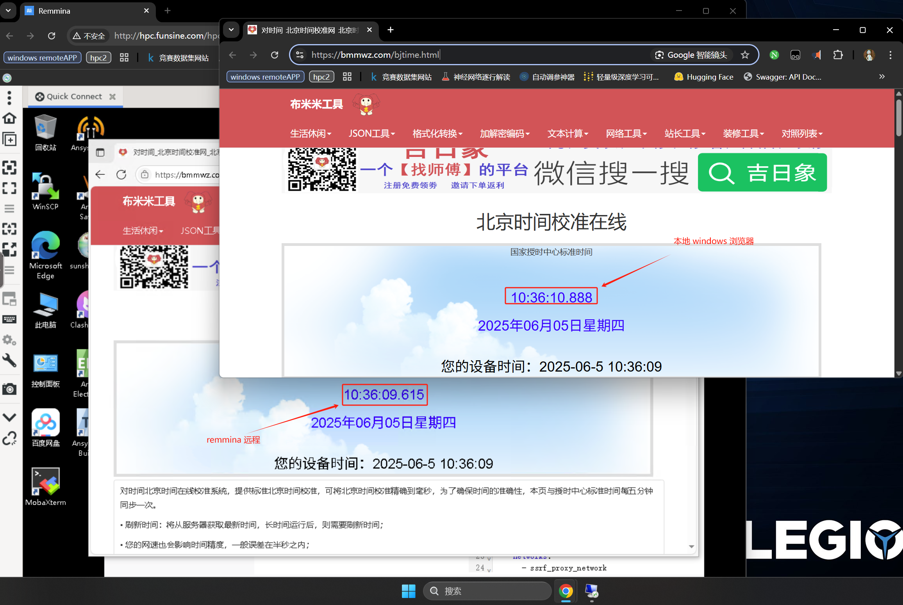
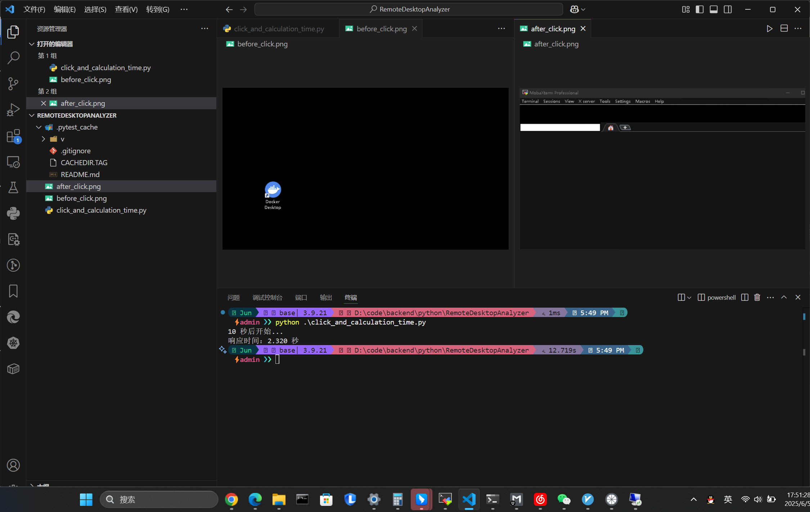
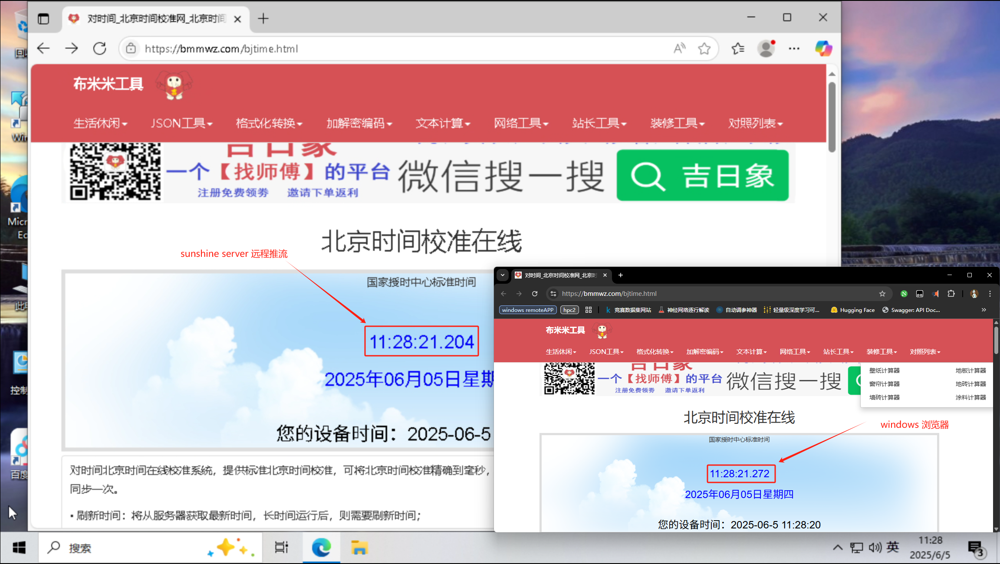
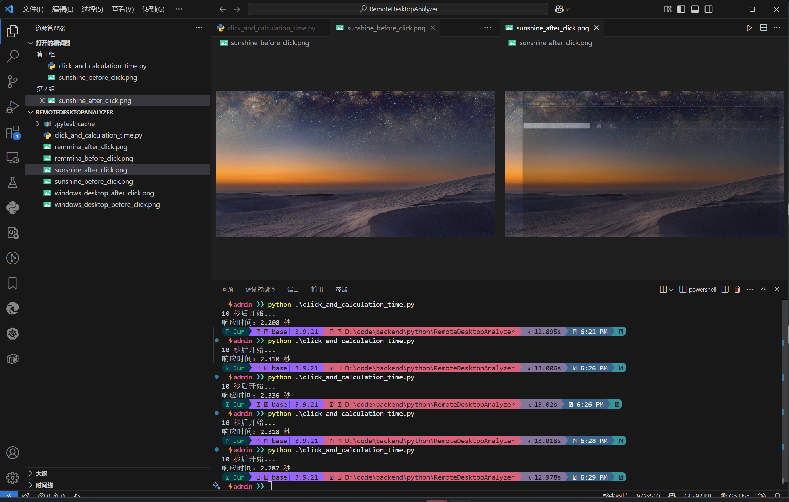
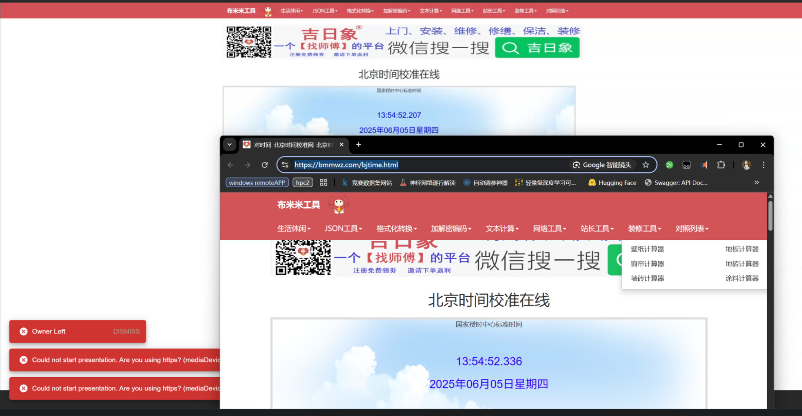
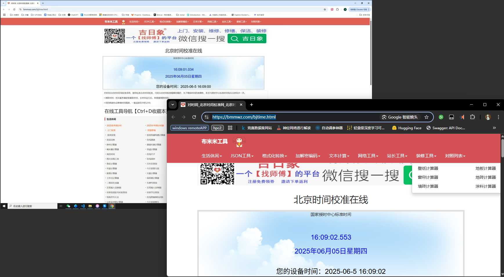

方案测试环境如下：

1. 在公司内网 1 网段，内网环境，不涉及外网
2. 都是用型号为 拯救者 R9000P 笔记本进行远程访问
3. 笔记本的网络是无线网
4. 远程链接的对象都是 192.168.100.53 物理服务器

显示延迟：

1. 在同等条件下，打开实时网站 https://bmmwz.com/bjtime.html

操作延时：

1. 在同等条件下，打开mobaXterm 应用

在同等网络环境下测试结果如下：

|方案编号|来源|方案|链接|支持|优点|缺点|限制原因|显示延迟|操作响应延迟 (包含应用开启时间)|鼠标跟随性|工时|备注|
|--|--|:--|--|:--|:--|:--|--|--|--|--|:--|--|
|0|周俊|直接 Windows 远程桌面连接||远程桌面 √  远程应用 x       |1.windows 桌面原生 2.性能好原生符合windows 3.较好的符合 window server 的多用户场景|1.不支持远程应用 2.与平台完全无关 3.延时相对较高 4.不适用于公网环境|1. rdp 协议延迟 2. 网络延迟|1.167s|2.303s|差|- （无法直接用）|对比方案|
|1|周俊|直接 windows 远程桌面应用||远程桌面 x                         远程应用 √|1.windows 桌面原生  2.性能好原生符合windows 3.可将远程应用内嵌到平台 4. 较好的符合 windows server 的多用户场景|1.不支持远程桌面 2.延时相对较高|1.rdp 协议延迟  2.网络延迟|1.167s||差|-（2周尝试）||
|2|周俊|hpc2 remmina-client 应用方案|https://github.com/FreeRDP/Remmina.git|远程桌面 √ 远程应用 ×|1.修改量小 2.工时短 3.保证能用 4.适用于公网环境|1. 延时相对较高 2.不支持远程应用 3.需要用户手动输入windows 端的IP,账号,密码,无法一键登录 4.与平台不融合，平台不能控制应用内行为|1.rdp 协议延迟 2.网路延迟|1.273s|2.320s|差|3 人天                  |c++         |
|3|周俊|remmina 源码修改方案|https://github.com/FreeRDP/Remmina.git|远程桌面 √   远程应用 ×|1.能够很好的适应平台 2.适用于公网环境 3.开发工作量小于方案 4.有最低性能保障|1. 延时高 2.不支持远程应用 3.需要不小的开发工作量|1.rdp 协议延迟 2.网络延迟|1.273s+ (推断)|2.320s (推断)|差|4-5人月|c++|
|4|宝哥|moonlight+sunshine|https://github.com/LizardByte/Sunshine.git https://github.com/moonlight-stream/moonlight-qt.git|远程桌面 √ 远程应用 √|1.延迟低 2.性能好 3.能够很好的适应平台 |1.开发特别巨大量大 2.需要客户端转网页端 3.不支持多用户同时登陆图形工作站 4.与平台嵌合有相当的难度|1.需要在图形工作站安装 service 端 2.在公网环境下要管理 treafic 路由域名转发 3.网络延迟|0.07s|2.310s              |好|10人月 (功能基本实现)|c++|
|5|宝哥|基于 go+ typescript 的 webrtc 方案 |https://github.com/screego/server.git|远程桌面 √ 远程应用 √|1. 延迟低 2. 性能好 3.能够很好的适应平台 4.支持多用户同时登陆图形工作站 5.开发量相对方案4来说要小很多|1.还是有相当的开发量的 2.未实现控制逻辑，只有显示逻辑，实现控制逻辑还有相当的工作量 3.支持多用户同时登录图形工作站但是每个用户桌面都需要开启 service 端服务 4.不原生支持 windows rdp 协议，对于多用户场景需要单独想办法解决 5.在公网环境下要管理 treafic 路由域名转发|1.需要在图形工作站安装 service 端，每个用户都需要在自己的桌面下启动服务 2.需要做端口管理 3.在公网环境下要管理 treafic 路由域名转发 4.网络延迟|0.129s|未知|未知|6人月|go|
|6|周俊|基于 freerdp + labdatachannel(webrtc) + drogon 封装一套远程桌面应用|https://github.com/FreeRDP/FreeRDP.git https://github.com/drogonframework/drogon.git https://github.com/paullouisageneau/libdatachannel.git|远程桌面 √ 远程应用 √|1.基于 windows 原生协议，较好的符合windows server 多用户场景 2.不需要在图形工作站维护 server 端 3.能够很好的适应平台，完全自主 4.延迟较低 5.不用管理多个路由的 treafik 转发|1.还是有相当的开发量的 2.延时相对方案 4 来说还是相对较高|1.rdp 协议延迟  2.网络延迟|1.273s p(推断）               |未知|未知|6人月|c++|
|7|宝哥|基于 go 的 webrtc 方案|https://github.com/rviscarra/webrtc-remote-screen|远程桌面 √ 远程应用 x（可加）           |1.全生态链自主可控 2.能够很好的适应平台 3.支持多用户同时登陆图形工作站|1.跳帧（可改） 2.相比方案5有更高的工作量 3.不原生支持 windows rdp 协议，对于多用户场景需要单独想办法解决 4.未实现控制逻辑，只有显示逻辑，实现控制逻辑还有相当的工作量 |1.需要在图形工作站安装 service 端，每个用户都需要在自己的桌面下启动服务  2.需要做端口管理  3.在公网环境下要管理 treafic 路由域名转发  4.网络延迟|1.52s|未知|未知|6人月|go|

## 方案 0

### 显示延迟

### 操作延迟

 

## 方案 2

### 显示延迟

### 操作延迟

## 方案 4

### 显示延迟

### 操作延迟

## 方案 5

### 显示延迟

### 操作延迟

 

## 方案 7

### 显示延迟

