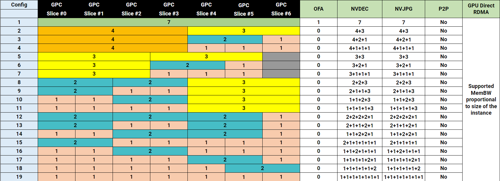
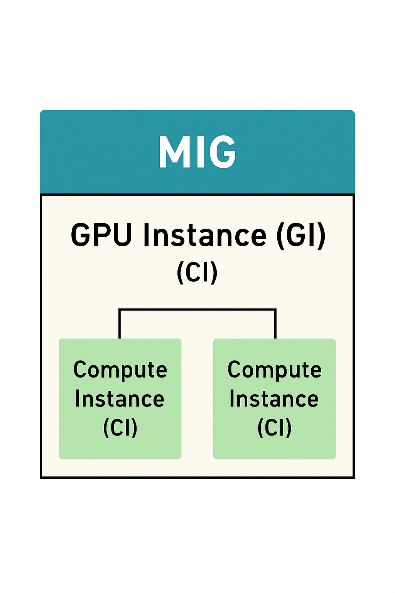
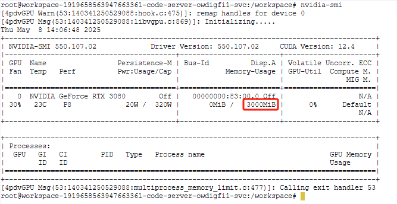

### 注:以下调研结果仅对 x86/amd64 架构下的英伟达显卡负责

|解决方案|MIG|第四范式vGPU调度器|
|--|--|--|
|支持显卡型号|英伟达 gpu 的以下型号GB200, B200，H100-SXM5，H100-PCIE，H100-SXM5，H100-PCIE，H100 on GH200，H200-SXM5，H200 NVL，A100-SXM4，A100-SXM4，A100-PCIE，A100-PCIE，A30，详情见表格|nvidia 所有显卡（GPU），寒武纪卡(MLU),海光显卡（DCU）|
|启用/部署方式|nvidia-smi -i <GPU IDs> -mig 1<br/>需要重启显卡|helm install vgpu helm-hpc-dev/vgpu --set scheduler.kubeScheduler.imageTag=v1.31.2 --set scheduler.kubeScheduler.image=idocker.io/google_containers/kube-scheduler -n kube-system<br/>有gpu 的节点要添加标签 gpu = on|
|隔离方式|根据芯片硬件设计方式拆分，物理级别隔离， 驱动切分|cuda 劫持， 软件切分|
|优点|英伟达官方提供的免费显卡切分方案，安全，硬件隔离，同一显卡中的进程崩溃不影响其他进程，可以物理切分支持k8s容器和物理机进程|第三方提供的 cuda 劫持方案，支持所有 gpu 切分，还额外支持其他加速卡切分，更适合超融合算力平台，可以做到任意方式的隔离，显存大小，算力多少可以做到自定义限制隔离|
|缺点|只支持部分显卡，只支持指定的切分方式，很具有局限性|同一显卡的进程崩溃可能会导致同一显卡所有进程崩溃|
|结论|方案具备GPU的共享和独占两种使用方式，具备GPU 资源调度能力，支持按照显存进行资源调度；|方案具备GPU的共享和独占两种使用方式，具备GPU 资源调度能力，支持按照显存进行资源调度；|
|存在问题|没有实际的支持 MIG 的显卡用于测试||

## 1. MIG 拆分方案

### 1.支持的 GPU

从 NVIDIA Ampere 一代开始的 GPU（即计算能力 >= 8.0 的 GPU）均支持 MIG。下表列出了受支持的 GPU：

|产品|架构|微架构|计算能力|内存大小|最大实例数|
|--|--|--|--|--|--|
|GB200|Blackwell|GB100|10|186GB|7|
|B200|Blackwell|GB100|10|180GB|7|
|H100-SXM5|Hopper|GH100|9|80GB|7|
|H100-PCIE|Hopper|GH100|9|80GB|7|
|H100-SXM5|Hopper|GH100|9|94GB|7|
|H100-PCIE|Hopper|GH100|9|94GB|7|
|GH200 上的 H100|Hopper|GH100|9|96GB|7|
|H200-SXM5|Hopper|GH100|9|141GB|7|
|H200 NVL|Hopper|GH100|9|141GB|7|
|A100-SXM4|NVIDIA Ampere 架构|GA100|8|40GB|7|
|A100-SXM4|NVIDIA Ampere 架构|GA100|8|80GB|7|
|A100-PCIE|NVIDIA Ampere 架构|GA100|8|40GB|7|
|A100-PCIE|NVIDIA Ampere 架构|GA100|8|80GB|7|
|A30|NVIDIA Ampere 架构|GA100|8|24GB|4|

### 2. H200 的配置



### 3. H200 141GB 产品上支持的拆分方案

|配置名称|显存占比|SM 数占比|硬件单元|L2 缓存占比|拷贝引擎|实例数量|
|--|--|--|--|--|--|--|
|MIG 1g.18gb|1/8|1/7|1 NVDEC / 1 JPEG / 0 OFA|1/8|1|7|
|MIG 1g.18gb+me|1/8|1/7|1 NVDEC / 1 JPEG / 1 OFA|1/8|1|1（一个 1g 配置，包含媒体扩展）|
|MIG 1g.35gb|1/4|1/7|1 NVDEC / 1 JPEG / 0 OFA|1/8|1|4|
|MIG 2g.35gb|2/8|2/7|2 NVDEC / 2 JPEG / 0 OFA|2/8|2|3|
|MIG 3g.71gb|4/8|3/7|3 NVDEC / 3 JPEG / 0 OFA|4/8|3|2|
|MIG 4g.71gb|4/8|4/7|4 NVDEC / 4 JPEG / 0 OFA|4/8|4|1|
|MIG 7g.141gb|全部|7/7|7 NVDEC / 7 JPEG / 1 OFA|全部|8|1|

### 4. MIG 相关指令

```sh
# 启动 MIG 模式，指定的 GPU ID会开启 MIG 模式
nvidia-smi -i <GPU IDs> -mig 1
# MIG 模式启用/禁用后需要重启 GPU 才生效。重启系统或者重载驱动
sudo reboot
# 或者：
sudo nvidia-smi --gpu-reset -i 0
# 列出当前 gpu 产品拆分方案
$ nvidia-smi mig -lgip
+-----------------------------------------------------------------------------+
| GPU instance profiles:                                                      |
| GPU   Name             ID    Instances   Memory     P2P    SM    DEC   ENC  |
|                              Free/Total   GiB              CE    JPEG  OFA  |
|=============================================================================|
|   0  MIG 1g.5gb        19     7/7        4.75       No     14     0     0   |
|                                                             1     0     0   |
+-----------------------------------------------------------------------------+
|   0  MIG 1g.5gb+me     20     1/1        4.75       No     14     1     0   |
|                                                             1     1     1   |
+-----------------------------------------------------------------------------+
|   0  MIG 1g.10gb       15     4/4        9.62       No     14     1     0   |
|                                                             1     0     0   |
+-----------------------------------------------------------------------------+
|   0  MIG 2g.10gb       14     3/3        9.62       No     28     1     0   |
|                                                             2     0     0   |
+-----------------------------------------------------------------------------+
|   0  MIG 3g.20gb        9     2/2        19.50      No     42     2     0   |
|                                                             3     0     0   |
+-----------------------------------------------------------------------------+
|   0  MIG 4g.20gb        5     1/1        19.50      No     56     2     0   |
|                                                             4     0     0   |
+-----------------------------------------------------------------------------+
|   0  MIG 7g.40gb        0     1/1        39.25      No     98     5     0   |
|                                                             7     1     1   |
+-----------------------------------------------------------------------------+
# 按照 ID 9 拆分 GPU ID 为 0 的显卡
$ sudo nvidia-smi mig -cgi 9,3g.20gb -C
Successfully created GPU instance ID  2 on GPU  0 using profile MIG 3g.20gb (ID  9)
Successfully created compute instance ID  0 on GPU  0 GPU instance ID  2 using profile MIG 3g.20gb (ID  2)
Successfully created GPU instance ID  1 on GPU  0 using profile MIG 3g.20gb (ID  9)
Successfully created compute instance ID  0 on GPU  0 GPU instance ID  1 using profile MIG 3g.20gb (ID  2)
# NVIDIA 的 mig 工具中 -cgi（即 --create-gpu-instance）选项用来创建 GPU 实例
# 在这个命令中：
# 1. 9：代表你要创建的 GPU 实例的 profile ID，对应特定的 SM 数量（Streaming Multiprocessors）；
# 2. 3g.20gb：代表实例将占用 3 个 GPU 引擎单元 和 约 20 GB 的显存；
# 3. -C：执行创建操作。
# 查看可用的 GPU 实例
$ sudo nvidia-smi mig -lgi
+----------------------------------------------------+
| GPU instances:                                     |
| GPU   Name          Profile  Instance   Placement  |
|                       ID       ID       Start:Size |
|====================================================|
|   0  MIG 3g.20gb       9        1          4:4     |
+----------------------------------------------------+
|   0  MIG 3g.20gb       9        2          0:4     |
+----------------------------------------------------+
# 混合切分方式
$ sudo nvidia-smi mig -cgi 19,14,5
Successfully created GPU instance ID 13 on GPU  0 using profile MIG 1g.5gb (ID 19)
Successfully created GPU instance ID  5 on GPU  0 using profile MIG 2g.10gb (ID 14)
Successfully created GPU instance ID  1 on GPU  0 using profile MIG 4g.20gb (ID  5)


$ sudo nvidia-smi mig -lgi
+----------------------------------------------------+
| GPU instances:                                     |
| GPU   Name          Profile  Instance   Placement  |
|                       ID       ID       Start:Size |
|====================================================|
|   0  MIG 1g.5gb       19       13          6:1     |
+----------------------------------------------------+
|   0  MIG 2g.10gb      14        5          4:2     |
+----------------------------------------------------+
|   0  MIG 4g.20gb       5        1          0:4     |
+----------------------------------------------------+

# 查看计算实例的 uuid
$ nvidia-smi -L
GPU 0: A100-SXM4-40GB (UUID: GPU-e86cb44c-6756-fd30-cd4a-1e6da3caf9b0)
  MIG 3g.20gb Device 0: (UUID: MIG-c7384736-a75d-5afc-978f-d2f1294409fd)
  MIG 3g.20gb Device 1: (UUID: MIG-a28ad590-3fda-56dd-84fc-0a0b96edc58d)

# 测试使用计算实例
$ CUDA_VISIBLE_DEVICES=MIG-c7384736-a75d-5afc-978f-d2f1294409fd python train.py
# 或者
$ CUDA_VISIBLE_DEVICES=MIG-c7384736-a75d-5afc-978f-d2f1294409fd ./BlackScholes &
$ CUDA_VISIBLE_DEVICES=MIG-a28ad590-3fda-56dd-84fc-0a0b96edc58d ./BlackScholes &
# 验证两个 CUDA 应用程序是否在两个单独的 GPU 实例上运行：
$ nvidia-smi
+-----------------------------------------------------------------------------+
| MIG devices:                                                                |
+------------------+----------------------+-----------+-----------------------+
| GPU  GI  CI  MIG |         Memory-Usage |        Vol|         Shared        |
|      ID  ID  Dev |                      | SM     Unc| CE  ENC  DEC  OFA  JPG|
|                  |                      |        ECC|                       |
|==================+======================+===========+=======================|
|  0    1   0   0  |    268MiB / 20224MiB | 42      0 |  3   0    2    0    0 |
+------------------+----------------------+-----------+-----------------------+
|  0    2   0   1  |    268MiB / 20096MiB | 42      0 |  3   0    2    0    0 |
+------------------+----------------------+-----------+-----------------------+

+-----------------------------------------------------------------------------+
| Processes:                                                                  |
|  GPU   GI   CI        PID   Type   Process name                  GPU Memory |
|        ID   ID                                                   Usage      |
|=============================================================================|
|    0    1    0      58866      C   ./BlackScholes                    253MiB |
|    0    2    0      58856      C   ./BlackScholes                    253MiB |
+-----------------------------------------------------------------------------+
# 创建 CI
$ sudo nvidia-smi mig -cci 0,0,0 -gi 1
Successfully created compute instance on GPU  0 GPU instance ID  1 using profile MIG 1c.3g.20gb (ID  0)
Successfully created compute instance on GPU  0 GPU instance ID  1 using profile MIG 1c.3g.20gb (ID  0)
Successfully created compute instance on GPU  0 GPU instance ID  1 using profile MIG 1c.3g.20gb (ID  0)
# 查看 GI 1 上的 CI
$ sudo nvidia-smi mig -lcip -gi 1
+--------------------------------------------------------------------------------------+
| Compute instance profiles:                                                           |
| GPU     GPU       Name             Profile  Instances   Exclusive       Shared       |
|       Instance                       ID     Free/Total     SM       DEC   ENC   OFA  |
|         ID                                                          CE    JPEG       |
|======================================================================================|
|   0      1       MIG 1c.3g.20gb       0      0/3           14        2     0     0   |
|                                                                      3     0         |
+--------------------------------------------------------------------------------------+
|   0      1       MIG 2c.3g.20gb       1      0/1           28        2     0     0   |
|                                                                      3     0         |
+--------------------------------------------------------------------------------------+
|   0      1       MIG 3g.20gb          2*     0/1           42        2     0     0   |
|                                                                      3     0         |
+--------------------------------------------------------------------------------------+
# 使用 CI
$ CUDA_VISIBLE_DEVICES=MIG-c7384736-a75d-5afc-978f-d2f1294409fd ./BlackScholes &
$ CUDA_VISIBLE_DEVICES=MIG-c376546e-7559-5610-9721-124e8dbb1bc8 ./BlackScholes &
$ CUDA_VISIBLE_DEVICES=MIG-928edfb0-898f-53bd-bf24-c7e5d08a6852 ./BlackScholes &
# 删除 GPU CI
$ sudo nvidia-smi mig -dci
Successfully destroyed compute instance ID  0 from GPU  0 GPU instance ID  1
Successfully destroyed compute instance ID  1 from GPU  0 GPU instance ID  1
Successfully destroyed compute instance ID  2 from GPU  0 GPU instance ID  1
# 删除 GPU 实例
$ sudo nvidia-smi mig -dgi
Successfully destroyed GPU instance ID  1 from GPU  0
Successfully destroyed GPU instance ID  2 from GPU  0
# 关闭 MIG
$ sudo nvidia-smi -i 0 -mig 0
```

### 5. MIG 中 I,GI,CI 这三者的关系

|MIG 架构组件|类比传统计算架构|
|--|--|
|**GPU（物理 GPU）**|物理服务器 / 物理主机|
|**GI（GPU Instance）**|虚拟机（VM）|
|**CI（Compute Instance）**|容器（如 Docker 容器）|

```
I > GI > CI
```



|层级|角色|是否可独立存在|创建顺序限制|
|--|--|--|--|
|GPU|物理 GPU|✅|最底层|
|GI|虚拟 GPU|✅|必须先于 CI|
|CI|计算容器|❌ 依赖 GI|GI 创建后才可建|

[参考文档，见MIG 用户指南](https://docs.nvidia.com/datacenter/tesla/mig-user-guide/#h200-profiles-v1)

## 2. 第四范式 vgpu 方案

### 1. 部署

```sh
can# 先下拉第四范式 vgpu schudler 源码
git clone https://github.com/Project-HAMi/HAMi.git
# 构建 helm chart 包
cd HAMI/charts/ &&　helm package hami
# 上传 chart 到 chart 仓库
curl -v -u 'admin':'FUsl2023!.' http://192.168.1.47:8081/repository/helm-hpc-dev/ --upload-file  hami-2.0.0.tgz
# 查看当前 k8s 版本
$ kubectl version
WARNING: This version information is deprecated and will be replaced with the output from kubectl version --short.  Use --output=yaml|json to get the full version.
Client Version: version.Info{Major:"1", Minor:"24", GitVersion:"v1.24.9", GitCommit:"9710807c82740b9799453677c977758becf0acbb", GitTreeState:"clean", BuildDate:"2022-12-08T10:15:09Z", GoVersion:"go1.18.9", Compiler:"gc", Platform:"linux/amd64"}
Kustomize Version: v4.5.4
Server Version: version.Info{Major:"1", Minor:"24", GitVersion:"v1.24.9", GitCommit:"9710807c82740b9799453677c977758becf0acbb", GitTreeState:"clean", BuildDate:"2022-12-08T10:08:06Z", GoVersion:"go1.18.9", Compiler:"gc", Platform:"linux/amd64"}
# 可以看到版本是 1.24.9， 因此拉取镜版本为 1.24.9 注意一定要拉取对应 k8s 版本的镜像
# 拉取关键镜像上传到 docker 仓库
docker pull registry.cn-hangzhou.aliyuncs.com/google_containers/kube-scheduler:v1.24.9 && docker tag registry.cn-hangzhou.aliyuncs.com/google_containers/kube-scheduler:v1.24.9 idocker.io/google_containers/kube-scheduler:v1.24.9 && docker push idocker.io/google_containers/kube-scheduler:v1.24.9
# 给所有带 gpu 的节点添加标签
kubectl label nodes gpu2,gpu3 gpu=on
# 部署
helm install vgpu helm-hpc-dev/vgpu --set scheduler.kubeScheduler.imageTag=v1.31.2 --set scheduler.kubeScheduler.image=idocker.io/google_containers/kube-scheduler -n kube-system
```

### 2.卸载

```sh
helm uninstall vgpu -n kube-system
```

### 3.使用

```yaml
limit:
  nvidia.com/gpu: 2
  nvidia.com/gpumem: 3000 # 每个vGPU申请3000m显存 （可选，整数类型）
  nvidia.com/gpucores: 30 # 每个vGPU的算力为30%实际显卡的算力 （可选，整数类型）
```

### 4. 效果



[参考文档](https://github.com/Project-HAMi/HAMi/blob/master/README_cn.md)