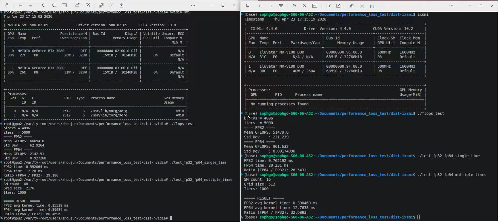

# 天数智芯 智铠100 (MR-V100) 技术规格与生态概览
[[天数智芯]]
天数智芯（Iluvatar CoreX）于 2022 年发布的 **智铠 100 (MR-V100)** 是一款面向云端推理的通用 GPU 加速卡。该产品基于自主研发的第二代通用 GPU 架构，采用 7nm 制程工艺，旨在为安防、互联网、金融、医疗等领域提供高性能、高性价比的国产算力解决方案。

## 🚀 核心特性

- **全自研架构**：具备完整的指令集系统，兼具通用计算与高性能 AI 推理能力。
- **多精度支持**：支持 **FP32、FP16、INT8** 等多种混合精度计算，针对 AI 推理场景进行了深度优化。
- **强大的视频处理**：具备超强的编解码能力，单卡最高支持 **128 路 1080P@30fps** 并发解码。
- **低迁移成本**：兼容主流 CUDA 生态，通过 IXUCA 软件栈实现算法模型的快速迁移与部署。

## 📊 硬件规格参数

| 参数维度          | 详细规格                                                 | 备注                      |
| :------------ | :--------------------------------------------------- | :---------------------- |
| **GPU 架构**    | 通用 GPU (GPGPU)                                       | 第二代自主研发架构               |
| **计算精度 (峰值)** | FP32: 24 TFLOPS<br>FP16: 96 TFLOPS<br>INT8: 192 TOPS | 高性能混合精度推理               |
| **显存容量**      | 32 GB HBM2E                                          | 支持大模型推理与高并发处理           |
| **显存带宽**      | (参考典型规格)                                             | 配合 PCIe Gen4 高速接口       |
| **接口类型**      | PCIe Gen4.0 x1 16 lane                               | 高速数据吞吐                  |
| **视频解码**      | 最高 128 路 (1080P@30fps)                               | 支持 HEVC, AVC, VP9, AVS2 |
| **图像处理**      | JPEG 解码/编码: 2000 / 500 fps                           | 高分辨率图像吞吐                |
| **功耗 (TDP)**  | 150W                                                 | 板级功耗，单槽设计               |
| **散热方式**      | 被动散热                                                 | 适用于服务器机箱环境              |
| **物理尺寸**      | 全高全长，单槽 PCIe 卡                                       | 兼容标准服务器架构               |

## 🛠️ 软件生态 (IXUCA)

天数智芯自主研发的 **IXUCA** 是统一计算架构软件栈，通过提供与主流 GPU 兼容的 API 和算子，大幅降低了开发者的迁移成本。

### 1. 核心组件
- **深度学习框架集成**：支持 TensorFlow, Py Torch, PaddlePaddle 等主流框架。
- **推理引擎**：
    - **IGIE (Iluvatar GPU Inference Engine)**：高性能神经网络推理框架，通过图优化、算子融合等技术提升吞吐量。
    - **IxRT (Runtime)**：专用推理运行时，支持将训练好的模型快速部署到加速卡上。
- **开发工具链**：包含编译器、驱动、数学库 (**ixDNN**, **ixBLAS**) 及通信库 (**ixCCL**)。

### 2. 模型支持情况
智铠 100 已适配超过 200 个主流推理模型，涵盖 LLM、CV、NLP 等领域：
- **大语言模型 (LLM)**: 支持 DeepSeek-R1 (Distill), Qwen 系列 (2.5/2/1.5, VL), Llama 系列, InternLM3, GLM 系列等。
- **计算机视觉 (CV)**: 涵盖 ResNet, YOLO (v3/v5/v8/v10), MobileNet, EfficientNet, ViT 等主流目标检测与分类模型。
- **自然语言处理 (NLP) & 语音**: 支持 BERT, RoBERTa, Whisper, CosyVoice2 等。

## 🔍 监控与管理工具: `ixsmi`

`ixsmi` 是天数智芯 GPU 的命令行管理工具，功能与 `nvidia-smi` 高度对标。

| 功能 | 命令示例 | 说明 |
| :--- | :--- | :--- |
| **查看概览** | `ixsmi` | 显示型号、显存使用、温度、功算力及驱动版本 |
| **实时监控** | `watch -n 1 ixsmi` | 动态刷新 GPU 状态 |
| **内存查询** | `ixsmi -q -d MEMORY` | 查看当前显存使用详情 |
| **利用率查询** | `ixsmi -q -d UTILIZATION` | 查看 GPU 计算核心利用率 |
| **进程监控** | `ixsmi -q -d PIDS` | 列出正在运行的 GPU 任务进程 |
| **拓扑结构** | `ixsmi topo` | 查看 GPU 间的互联拓扑 (P2P) |

## 🌐 应用领域

- **智能安防**：大规模视频流实时监控与异常检测。
- **智慧城市/交通**：车路协同、交通流量分析。
- **金融科技**：高频交易分析、风险评估模型推理。
- **医疗影像**：医学图像自动化处理与识别。
- **互联网/数据中心**：大规模推荐系统、搜索增强与内容审核。

## FP64转FP32性能损失

##### 测试代码:
***1. flops_test.cu***
```c++
#include <iostream>
#include <cuda.h>
#include <vector>
#include <numeric>
#include <cmath>

#define BLOCK_SIZE 256

// =========================
// FP32 kernel (peak-friendly)
// =========================
__global__ void kernel_fp32(float a, float b, float *out, int iters) {
    int idx = blockIdx.x * blockDim.x + threadIdx.x;

    float x = a + idx * 1e-7f;
    float y = b + idx * 1e-7f;

    float r0 = x, r1 = y, r2 = x, r3 = y;

    #pragma unroll 1
    for (int i = 0; i < iters; i++) {
        r0 = fmaf(r0, x, y);
        r1 = fmaf(r1, y, x);
        r2 = fmaf(r2, x, x);
        r3 = fmaf(r3, y, y);

        r0 = fmaf(r0, r1, r2);
        r1 = fmaf(r1, r2, r3);
        r2 = fmaf(r2, r3, r0);
        r3 = fmaf(r3, r0, r1);
    }

    out[idx] = r0 + r1 + r2 + r3;
}

// =========================
// FP64 kernel (peak-friendly)
// =========================
__global__ void kernel_fp64(double a, double b, double *out, int iters) {
    int idx = blockIdx.x * blockDim.x + threadIdx.x;

    double x = a + idx * 1e-12;
    double y = b + idx * 1e-12;

    double r0 = x, r1 = y, r2 = x, r3 = y;

    #pragma unroll 1
    for (int i = 0; i < iters; i++) {
        r0 = fma(r0, x, y);
        r1 = fma(r1, y, x);
        r2 = fma(r2, x, x);
        r3 = fma(r3, y, y);

        r0 = fma(r0, r1, r2);
        r1 = fma(r1, r2, r3);
        r2 = fma(r2, r3, r0);
        r3 = fma(r3, r0, r1);
    }

    out[idx] = r0 + r1 + r2 + r3;
}

// =========================
// FLOPs model
// =========================
inline long long calc_ops(int blocks, int iters) {
    long long threads = (long long)blocks * BLOCK_SIZE;
    // 32 FMA per iter per thread, 2 FLOPs per FMA
    return threads * iters * 32 * 2;
}

// =========================
// CUDA timing
// =========================
template<typename Kernel, typename T>
float run_kernel(Kernel kernel,
                 int blocks,
                 int iters,
                 T a,
                 T b,
                 T *d_out) {

    cudaEvent_t start, stop;
    cudaEventCreate(&start);
    cudaEventCreate(&stop);

    cudaEventRecord(start);
    kernel<<<blocks, BLOCK_SIZE>>>(a, b, d_out, iters);
    cudaEventRecord(stop);

    cudaEventSynchronize(stop);

    float ms;
    cudaEventElapsedTime(&ms, start, stop);

    cudaEventDestroy(start);
    cudaEventDestroy(stop);

    return ms;
}

// =========================
// benchmark
// =========================
template<typename Kernel, typename T>
double benchmark(const std::string &name,
                 Kernel kernel,
                 int blocks,
                 int iters,
                 T a,
                 T b,
                 T *d_out) {

    for (int i = 0; i < 10; i++) {
        run_kernel(kernel, blocks, iters, a, b, d_out);
    }

    std::vector<double> results;

    for (int i = 0; i < 20; i++) {
        float ms = run_kernel(kernel, blocks, iters, a, b, d_out);
        long long ops = calc_ops(blocks, iters);

        double gflops = ops / (ms / 1000.0) / 1e9;
        results.push_back(gflops);
    }

    double sum = std::accumulate(results.begin(), results.end(), 0.0);
    double mean = sum / results.size();

    double var = 0;
    for (auto v : results)
        var += (v - mean) * (v - mean);
    var /= results.size();

    std::cout << "==== " << name << " ====" << std::endl;
    std::cout << "Mean GFLOPS: " << mean << std::endl;
    std::cout << "Std Dev    : " << std::sqrt(var) << std::endl;

    return mean;
}

// =========================
// main
// =========================
int main() {

    int blocks = 4096;
    int iters  = 5000;

    std::cout << "blocks = " << blocks << std::endl;
    std::cout << "iters  = " << iters << std::endl;

    float *d_f32;
    double *d_f64;

    cudaMalloc(&d_f32, blocks * BLOCK_SIZE * sizeof(float));
    cudaMalloc(&d_f64, blocks * BLOCK_SIZE * sizeof(double));

    float a32 = 1.23f, b32 = 4.56f;
    double a64 = 1.23, b64 = 4.56;

    benchmark("FP32", kernel_fp32, blocks, iters, a32, b32, d_f32);
    benchmark("FP64", kernel_fp64, blocks, iters, a64, b64, d_f64);

    cudaFree(d_f32);
    cudaFree(d_f64);

    return 0;
}

```

***2. test_fp32_fp64_multiple_times.cu***
```c++
#include <iostream>
#include <cuda_runtime.h>

#define N (1 << 20)
#define BLOCK_SIZE 256

// ---------------- FP32 ----------------
__global__ void kernel_fp32(float *a, float *b, float *c, int iters) {
    int idx = blockIdx.x * blockDim.x + threadIdx.x;

    for (int i = idx; i < N; i += gridDim.x * blockDim.x) {
        float x = a[i];
        float y = b[i];

        #pragma unroll 20
        for (int k = 0; k < iters; k++) {
            x = x * y + 1.001f;
            y = y * x + 2.002f;
        }

        c[i] = x + y;
    }
}

// ---------------- FP64 ----------------
__global__ void kernel_fp64(double *a, double *b, double *c, int iters) {
    int idx = blockIdx.x * blockDim.x + threadIdx.x;

    for (int i = idx; i < N; i += gridDim.x * blockDim.x) {
        double x = a[i];
        double y = b[i];

        #pragma unroll 20
        for (int k = 0; k < iters; k++) {
            x = x * y + 1.001;
            y = y * x + 2.002;
        }

        c[i] = x + y;
    }
}

// ---------------- 运行函数 ----------------
float run_fp32(float *d_a, float *d_b, float *d_c, int grid, int iters) {
    cudaEvent_t start, stop;
    cudaEventCreate(&start);
    cudaEventCreate(&stop);

    // warmup
    for (int i = 0; i < 5; i++) {
        kernel_fp32<<<grid, BLOCK_SIZE>>>(d_a, d_b, d_c, iters);
    }
    cudaDeviceSynchronize();

    cudaEventRecord(start);

    float elapsed = 0.0f;
    int launches = 0;

    while (elapsed < 10000.0f) { // 10 秒
        kernel_fp32<<<grid, BLOCK_SIZE>>>(d_a, d_b, d_c, iters);
        launches++;

        cudaEventRecord(stop);
        cudaEventSynchronize(stop);
        cudaEventElapsedTime(&elapsed, start, stop);
    }

    cudaDeviceSynchronize();

    float avg = elapsed / launches;

    cudaEventDestroy(start);
    cudaEventDestroy(stop);

    return avg;
}

float run_fp64(double *d_a, double *d_b, double *d_c, int grid, int iters) {
    cudaEvent_t start, stop;
    cudaEventCreate(&start);
    cudaEventCreate(&stop);

    // warmup
    for (int i = 0; i < 5; i++) {
        kernel_fp64<<<grid, BLOCK_SIZE>>>(d_a, d_b, d_c, iters);
    }
    cudaDeviceSynchronize();

    cudaEventRecord(start);

    float elapsed = 0.0f;
    int launches = 0;

    while (elapsed < 10000.0f) { // 10 秒
        kernel_fp64<<<grid, BLOCK_SIZE>>>(d_a, d_b, d_c, iters);
        launches++;

        cudaEventRecord(stop);
        cudaEventSynchronize(stop);
        cudaEventElapsedTime(&elapsed, start, stop);
    }

    cudaDeviceSynchronize();

    float avg = elapsed / launches;

    cudaEventDestroy(start);
    cudaEventDestroy(stop);

    return avg;
}

// ---------------- 主函数 ----------------
int main() {
    int device = 0;
    cudaSetDevice(device);

    int sm_count;
    cudaDeviceGetAttribute(&sm_count, cudaDevAttrMultiProcessorCount, device);

    int grid = sm_count * 32;   // 保证跑满
    int iters = 1000;           // 可调（不够满就加大）

    std::cout << "SM count: " << sm_count << std::endl;
    std::cout << "Grid size: " << grid << std::endl;
    std::cout << "Iters: " << iters << std::endl;

    // ---------------- 内存 ----------------
    size_t size_f = N * sizeof(float);
    size_t size_d = N * sizeof(double);

    float *h_a_f = (float*)malloc(size_f);
    float *h_b_f = (float*)malloc(size_f);

    double *h_a_d = (double*)malloc(size_d);
    double *h_b_d = (double*)malloc(size_d);

    for (int i = 0; i < N; i++) {
        h_a_f[i] = 1.0f;
        h_b_f[i] = 2.0f;

        h_a_d[i] = 1.0;
        h_b_d[i] = 2.0;
    }

    float *d_a_f, *d_b_f, *d_c_f;
    double *d_a_d, *d_b_d, *d_c_d;

    cudaMalloc(&d_a_f, size_f);
    cudaMalloc(&d_b_f, size_f);
    cudaMalloc(&d_c_f, size_f);

    cudaMalloc(&d_a_d, size_d);
    cudaMalloc(&d_b_d, size_d);
    cudaMalloc(&d_c_d, size_d);

    cudaMemcpy(d_a_f, h_a_f, size_f, cudaMemcpyHostToDevice);
    cudaMemcpy(d_b_f, h_b_f, size_f, cudaMemcpyHostToDevice);

    cudaMemcpy(d_a_d, h_a_d, size_d, cudaMemcpyHostToDevice);
    cudaMemcpy(d_b_d, h_b_d, size_d, cudaMemcpyHostToDevice);

    // ---------------- 测试 ----------------
    float avg_fp32 = run_fp32(d_a_f, d_b_f, d_c_f, grid, iters);
    float avg_fp64 = run_fp64(d_a_d, d_b_d, d_c_d, grid, iters);

    std::cout << "\n===== RESULT =====" << std::endl;
    std::cout << "FP32 avg kernel time: " << avg_fp32 << " ms" << std::endl;
    std::cout << "FP64 avg kernel time: " << avg_fp64 << " ms" << std::endl;
    std::cout << "Ratio (FP64 / FP32): " << avg_fp64 / avg_fp32 << std::endl;

    // ---------------- 释放 ----------------
    cudaFree(d_a_f);
    cudaFree(d_b_f);
    cudaFree(d_c_f);

    cudaFree(d_a_d);
    cudaFree(d_b_d);
    cudaFree(d_c_d);

    free(h_a_f);
    free(h_b_f);
    free(h_a_d);
    free(h_b_d);

    return 0;
}
```

***3. test_fp32_fp64_single_time.cu***
```c++
#include <iostream>
#include <cuda_runtime.h>

#define N (1 << 24)   // 数据规模
#define BLOCK_SIZE 256

// FP32 kernel
__global__ void kernel_fp32(float *a, float *b, float *c) {
    int idx = blockIdx.x * blockDim.x + threadIdx.x;
    if (idx < N) {
        float x = a[idx];
        float y = b[idx];
        
        // 增加计算强度
        #pragma unroll 10
        for (int i = 0; i < 100; i++) {
            x = x * y + 1.0f;
            y = y * x + 2.0f;
        }

        c[idx] = x + y;
    }
}

// FP64 kernel
__global__ void kernel_fp64(double *a, double *b, double *c) {
    int idx = blockIdx.x * blockDim.x + threadIdx.x;
    if (idx < N) {
        double x = a[idx];
        double y = b[idx];

        #pragma unroll 10
        for (int i = 0; i < 100; i++) {
            x = x * y + 1.0;
            y = y * x + 2.0;
        }

        c[idx] = x + y;
    }
}

int main() {
    size_t size_f = N * sizeof(float);
    size_t size_d = N * sizeof(double);

    // 分配内存
    float *h_a_f = (float*)malloc(size_f);
    float *h_b_f = (float*)malloc(size_f);
    float *h_c_f = (float*)malloc(size_f);

    double *h_a_d = (double*)malloc(size_d);
    double *h_b_d = (double*)malloc(size_d);
    double *h_c_d = (double*)malloc(size_d);

    // 初始化
    for (int i = 0; i < N; i++) {
        h_a_f[i] = 1.0f;
        h_b_f[i] = 2.0f;

        h_a_d[i] = 1.0;
        h_b_d[i] = 2.0;
    }

    float *d_a_f, *d_b_f, *d_c_f;
    double *d_a_d, *d_b_d, *d_c_d;

    cudaMalloc(&d_a_f, size_f);
    cudaMalloc(&d_b_f, size_f);
    cudaMalloc(&d_c_f, size_f);

    cudaMalloc(&d_a_d, size_d);
    cudaMalloc(&d_b_d, size_d);
    cudaMalloc(&d_c_d, size_d);

    cudaMemcpy(d_a_f, h_a_f, size_f, cudaMemcpyHostToDevice);
    cudaMemcpy(d_b_f, h_b_f, size_f, cudaMemcpyHostToDevice);

    cudaMemcpy(d_a_d, h_a_d, size_d, cudaMemcpyHostToDevice);
    cudaMemcpy(d_b_d, h_b_d, size_d, cudaMemcpyHostToDevice);

    int grid = (N + BLOCK_SIZE - 1) / BLOCK_SIZE;

    cudaEvent_t start, stop;
    cudaEventCreate(&start);
    cudaEventCreate(&stop);

    // FP32 测试
    cudaEventRecord(start);
    kernel_fp32<<<grid, BLOCK_SIZE>>>(d_a_f, d_b_f, d_c_f);
    cudaEventRecord(stop);
    cudaEventSynchronize(stop);

    float time_fp32;
    cudaEventElapsedTime(&time_fp32, start, stop);

    // FP64 测试
    cudaEventRecord(start);
    kernel_fp64<<<grid, BLOCK_SIZE>>>(d_a_d, d_b_d, d_c_d);
    cudaEventRecord(stop);
    cudaEventSynchronize(stop);

    float time_fp64;
    cudaEventElapsedTime(&time_fp64, start, stop);

    std::cout << "FP32 time: " << time_fp32 << " ms\n";
    std::cout << "FP64 time: " << time_fp64 << " ms\n";
    std::cout << "Ratio (FP64 / FP32): " << time_fp64 / time_fp32 << std::endl;

    cudaFree(d_a_f);
    cudaFree(d_b_f);
    cudaFree(d_c_f);
    cudaFree(d_a_d);
    cudaFree(d_b_d);
    cudaFree(d_c_d);

    free(h_a_f);
    free(h_b_f);
    free(h_c_f);
    free(h_a_d);
    free(h_b_d);
    free(h_c_d);

    return 0;
}
```

***4. Makefile-ixsmi***
```Makefile
# === Configuration ===
# Default CUDA_PATH (DTK path)
CUDA_PATH ?= /usr/local/corex

# Compiler
CXX = $(CUDA_PATH)/bin/clang++

# Compiler flags from CMakeLists.txt
CXXFLAGS = --std=c++17 \
           -fvisibility=hidden \
           --cuda-path=$(CUDA_PATH) \
           --cuda-gpu-arch=ivcore11 \
           -Wl,--disable-new-dtags \
           -mllvm -pragma-unroll-threshold=100000 \
           -mllvm -unroll-threshold=5000 \
           -Wno-unused-command-line-argument \
           -fcolor-diagnostics

# Linker flags: find libraries in lib64, and set rpath for runtime
LDFLAGS = -L$(CUDA_PATH)/lib64 -Wl,-rpath=$(CUDA_PATH)/lib64
LIBS = -lcudart -lcuda

# Project name = current folder name
PROJ = $(notdir $(CURDIR))

# Source file (only test_fp32_fp64.cu as per your example)
SRC1 = src/test_fp32_fp64_multiple_times.cu
SRC2 = src/test_fp32_fp64_single_time.cu
SRC3 = src/flops_test.cu

# === Rules ===
all: $(PROJ)

# Compile .cu with -x ivcore
$(PROJ): $(SRCS)
	$(CXX) $(CXXFLAGS) -x ivcore $(SRC1) -o dist-ixsmi/test_fp32_fp64_multiple_times $(LDFLAGS) $(LIBS)
	$(CXX) $(CXXFLAGS) -x ivcore $(SRC2) -o dist-ixsmi/test_fp32_fp64_single_time $(LDFLAGS) $(LIBS)
	$(CXX) $(CXXFLAGS) -x ivcore $(SRC3) -o dist-ixsmi/flops_test $(LDFLAGS) $(LIBS)

run: all
	./$(PROJ)

clean:
	rm -f $(PROJ) tdump.mem tdump.txt

.PHONY: all run clean
```

***5. Makefile-nvidia***
```Makefile
# === Configuration ===
CUDA_PATH ?= /usr/local/cuda

CXX = $(CUDA_PATH)/bin/nvcc

CXXFLAGS = -std=c++17 \
           -O3 \
           -use_fast_math \
           -Xcompiler -fvisibility=hidden \
           -Xptxas -v \
           -gencode arch=compute_80,code=sm_80

LDFLAGS = -L$(CUDA_PATH)/lib64 -Xlinker -rpath -Xlinker $(CUDA_PATH)/lib64
LIBS    = -lcudart

# Sources
SRC1 = src/test_fp32_fp64_multiple_times.cu
SRC2 = src/test_fp32_fp64_single_time.cu
SRC3 = src/flops_test.cu

# Outputs
BIN1 = dist-nvidia/test_fp32_fp64_multiple_times
BIN2 = dist-nvidia/test_fp32_fp64_single_time
BIN3 = dist-nvidia/flops_test

# === Rules ===
all: $(BIN1) $(BIN2) $(BIN3)

dist-nvidia:
	mkdir -p dist-nvidia

$(BIN1): $(SRC1) | dist-nvidia
	$(CXX) $(CXXFLAGS) $< -o $@ $(LDFLAGS) $(LIBS)

$(BIN2): $(SRC2) | dist-nvidia
	$(CXX) $(CXXFLAGS) $< -o $@ $(LDFLAGS) $(LIBS)

$(BIN3): $(SRC3) | dist-nvidia
	$(CXX) $(CXXFLAGS) $< -o $@ $(LDFLAGS) $(LIBS)

run: all
	./$(BIN1)

clean:
	rm -rf dist-nvidia

.PHONY: all run clean
```

##### 与 RTX3080Ti 比较图

