[[清微电子]]
# 一. 芯片平台

## 1. 基本信息

主要是 **AMD 架构(x86)**

平台根据现有的信息是 linux **ubuntu 16**

docker 版本 **大于等于19.03**

containerd 版本 **1.2.13**

k8s 版本 依据现有资料 **无判断依据**,但是根据 **conatinerd** 的版本信息和 [**container与k8s版本对应关系表格**](https://containerd.io/releases/) 

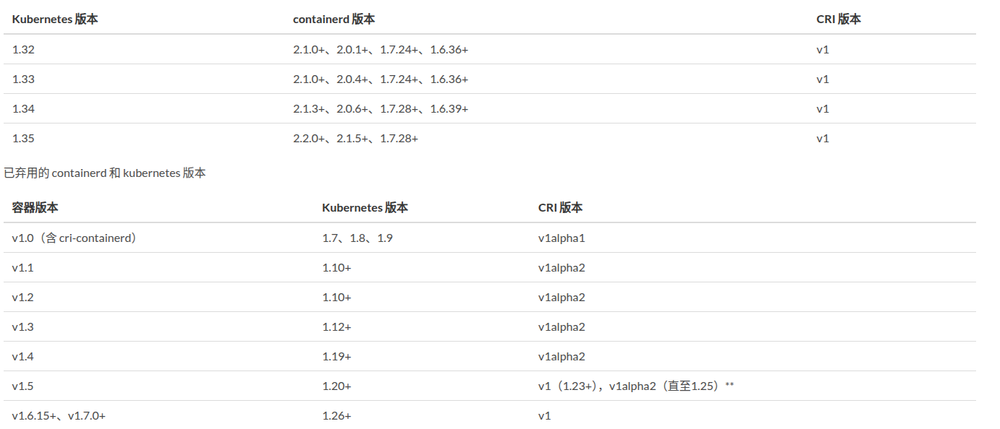

可以大致推断出对应的 k8s 版本应是 **1.10 到 1.12**

这些都是根据  Knight 对应显卡为 TX5 做出的出的推断, 如果 后期厂家给出的工具链或者项目使用的显卡非 TX5 系, 或者后期 Knight 不支持 TX8 以上推论全部作废

## 2. 官方推荐 docker 安装流程

### 2.1. 下载docker安装包

1. 下载url：https://download.docker.com/linux/ubuntu/dists/

进入该网址后，进入xenial -> pool -> stable -> amd64

1. 下载安装包：

[containerd.io_1.2.13-2_amd64.deb](https://download.docker.com/linux/ubuntu/dists/xenial/pool/stable/amd64/containerd.io_1.2.13-2_amd64.deb)

[docker-ce-cli_19.03.12~3-0~ubuntu-xenial_amd64.deb](https://download.docker.com/linux/ubuntu/dists/xenial/pool/stable/amd64/docker-ce-cli_19.03.12~3-0~ubuntu-xenial_amd64.deb)

[docker-ce_19.03.12~3-0~ubuntu-xenial_amd64.deb](https://download.docker.com/linux/ubuntu/dists/xenial/pool/stable/amd64/docker-ce_19.03.12~3-0~ubuntu-xenial_amd64.deb)

### 2.2. 安装docker

1. 更新可用软件包列表

```bash
sudo apt update
```


1. 更新所有软件包

```bash
sudo apt -y upgrade
```


1. 安装前面下载的安装包（参考[下载docker安装包](https://knight-docs.readthedocs.io/zh-cn/latest/overview/l)）

> sudo dpkg -i [containerd.io_1.2.13-2_amd64.deb](https://download.docker.com/linux/ubuntu/dists/xenial/pool/stable/amd64/containerd.io_1.2.13-2_amd64.deb)
>
> sudo dpkg -i [docker-ce_19.03.12~3-0~ubuntu-xenial_amd64.deb](https://download.docker.com/linux/ubuntu/dists/xenial/pool/stable/amd64/docker-ce_19.03.12~3-0~ubuntu-xenial_amd64.deb)
>
> sudo dpkg -i [docker-ce-cli_19.03.12~3-0~ubuntu-xenial_amd64.deb](https://download.docker.com/linux/ubuntu/dists/xenial/pool/stable/amd64/docker-ce-cli_19.03.12~3-0~ubuntu-xenial_amd64.deb)

1. 确认docker版本大于等于19.03

```bash
docker -v
```

## 3. 主要侧重

- **核心技术指标**：主要侧重于 **TOPS/W (能效比)**，而非单纯的 TOPS (算力峰值)。

## 4. 芯片型号

* TX5系列芯片 —> 中端, 高性能系列 —> 安防、家居、工业视觉、边缘服务器
* TX8系列芯片 —> 云端 —> 智算中心、大模型 
* RN8120加速卡 + 加速卡 + 服务器（高算力）

# 二.核心架构：CGRA (非冯·诺依曼架构)

## 1. 常见的架构类型

| 架构类型      | 灵活性 | 性能/能效  | 编程难度 | 适用场景                                             |
| :------------ | :----- | :--------- | :------- | :--------------------------------------------------- |
| **CPU**       | 极高   | 较低       | 低       | 通用计算、操作系统、控制密集型任务                   |
| **GPU**       | 高     | 高         | 中等     | 图形处理、AI训练、高度规则并行计算                   |
| **FPGA**      | 高     | 较高       | 高       | 原型验证、特定算法加速、低延迟接口                   |
| **DCRA/CGRA** | 较高   | **非常高** | 较高     | **高性能、高能效要求的特定领域**，如AI推理、通信基带 |
| **ASIC**      | 无     | 极高       | N/A      | 大批量、功能固定的产品，如手机SoC、AI专用芯片        |

## 2. 核心技术范式CGRA：从“指令驱动”到“数据流驱动”

在使用清微芯片前，必须理解其与 NVIDIA GPU 的本质区别。清微智能的核心竞争力在于其**“软件定义硬件”**的能力，通过 CGRA（粗粒度可重构架构）实现了计算逻辑的动态重组，其计算逻辑并非传统的“读取指令 $\rightarrow$ 运算 $\rightarrow$ 写回”，而是**“数据流驱动 (Data-flow Driven)”**。清微智能的芯片不属于传统的指令驱动架构，而是采用“空域执行”模式，从根本上规避了冯·规模架构的“指令瓶颈”。

* **架构本质**：
  * ** 数据流驱动 (Data-flow Driven)**：计算过程像水流一样，数据在流动过程中直接完成计算，无需经过传统的“取指-译码-执行”循环，极大降低了延迟和能耗。
  * **三维重构维度**：
    1. **MAC 层面**：支持不同位宽（1-bit to 16-bit）的重构，实现极高精度的混合精度计算。
    2. **执行单元层面**：支持不同算子（Operator）的重构，能够灵活适应各种神经网络层。
    3. **阵列层面**：支持不同功能（Function）的重构，实现硬件功能的动态切换。
  * **动态重构能力**：硬件功能随软件变化而变化，重构时间达到**纳秒级**，且在运行过程中实现无缝执行，用户几乎感知不到架构切换。

* **性能指标对比 (能效比优势)**：
  * **vs CPU**：能效比提升 **1000倍** 以上。
  * **vs GPU**：能效比提升 **100~1000倍**。
  * **vs FPGA**：能效比提升 **100倍** 以上。
  * **vs NPU**：性能提升 **10倍** 以上。

* **NVIDIA GPU (SIMT)**：依靠指令流驱动，计算单元在等待指令解析，存在明显的取指/译码延迟。
* **清微 RPU (CGRA)**：依靠数据流驱动，计算单元（PE）通过预先配置好的“电路路径”进行计算。数据像水流一样经过，计算随之完成。
* **对开发者的意义**：不需要编写 CUDA Kernel，而是需要通过其**编译器**将模型转化为**硬件配置流 (Configuration Bitstream)**。

## 3. 图像化理解

### 3.1. CGRA 的工作方式

​                     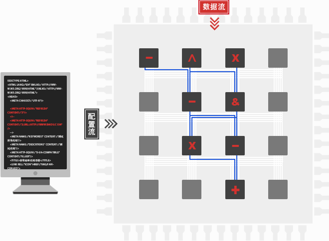\

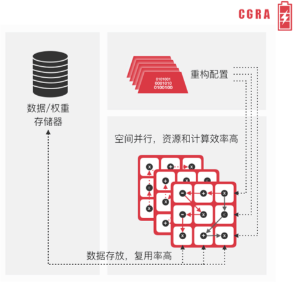

### 3.2. 算图分割

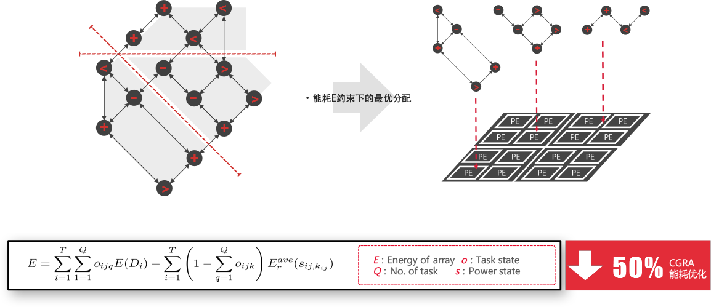

### 3.3. 时空域数据流扩展技术

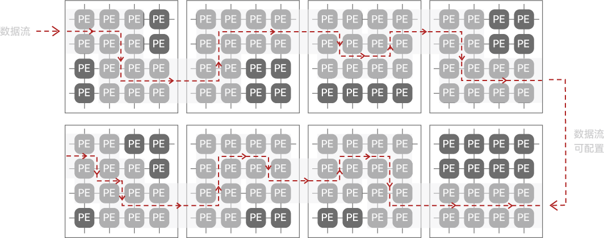

# 三.工具介绍 Knight -> 主要对应 TX5 系列芯片

**[说明文档地址](https://knight-docs.readthedocs.io/zh-cn/latest/overview/overview.html#docker)**

## 0.官方QQ运营号


相关团队 **github地址** : https://github.com/tsingmicro-toolchain

1. 项目一: 

   [OnnxSlim](https://github.com/tsingmicro-toolchain/OnnxSlim):

   ​	OnnxSlim 能帮助您精简 ONNX 模型，减少运算节点数量，同时保持相同的准确度，并且能大幅提升推理速度。

2. 项目二:

​	[ts.knight-modelzoo](https://github.com/tsingmicro-toolchain/ts.knight-modelzoo)也就是 **knight**:

​		TS.Knight是清微智能提供的一站式开发平台，包含部署AI模型所需的全套工具链，支持模型量化、精度比对、模型编译、模拟和性能分析等功能。

## 1. 下载方法

进入[软件下载页面](http://community.tsingmicro.com/portal/download/index.html)

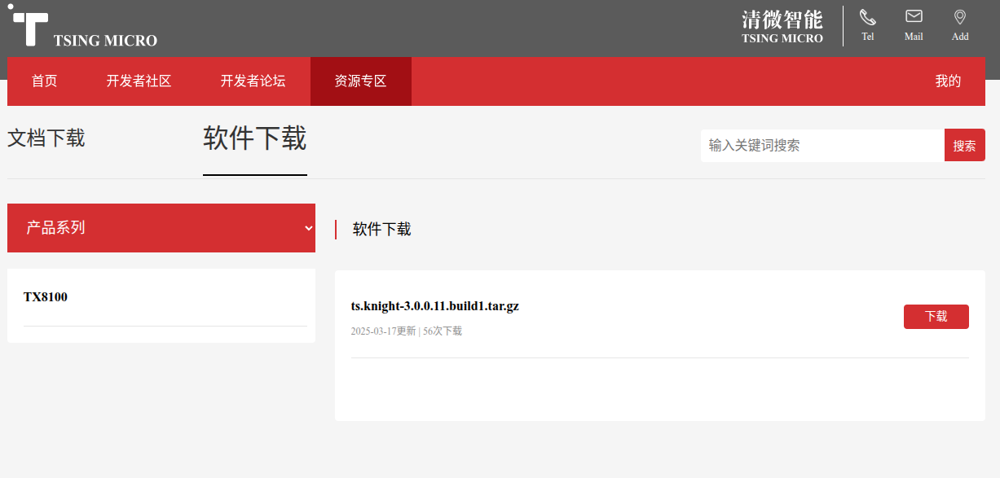

点击下载进入[下载申请页面](http://community.tsingmicro.com/portal/usercenter/apply.html)

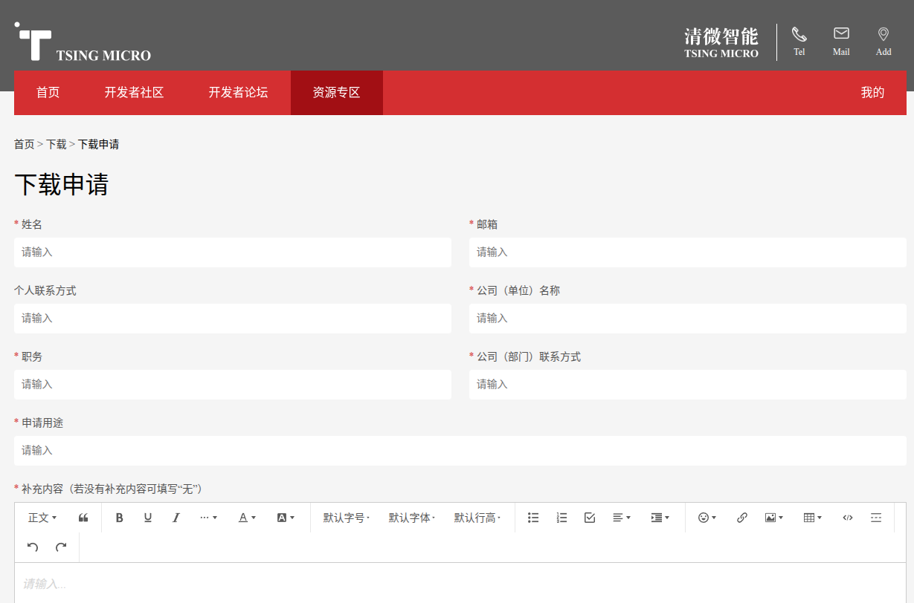

**填写申请信息等待回复**

## 2. 软件包目录

Knight产品目录如下所示：


ReleaseDocuments目录中为产品文档，示例如下：

```
├── 进阶指南
├── 算子规格表
├── 01-TS.Knight-使用指南综述_V3.5.pdf
├── 02-TS.Knight-快速上手指南_V3.5.pdf
├── 03-TS.Knight-模型转换使用指南_V3.5.pd
├── 04-TS.Knight-仿真性能分析使用指南_V3.5.pdf
├── 05-TS.Knight-SDK使用指南_V3.5.pdf
├── 06-TS.Knight-量化工具FAQ_V3.5.pdf
├── 07-TS.Knight-SDK-FAQ_V3.5.pdf
├── 08-TS.Knight-支持模块清单_V3.5.pdf
```


ReleaseDeliverables目录中为软件产品，示例如下：

```
├── TX510x-Lib
├── TX5112x_TX5239x201-Lib
├── TX5215x_TX5239x200_TX5239x220_TX5239x300-Lib
├── TX5336x_TX5256x-Lib
├── TX5368x_TX5339x_TX5335x-Lib
├── TX5326x-Lib
├── ts.knight-3.5.tar.gz
├── TS.Knight-MC_3.5.tar.gz
├── TS-Finetune-Lib_3.5.tar.gz
```


备注

注意：以上内容仅为示例，不同版本以实际产品包为准。 `ts.knight-XXX.tar.gz` 为 `Knight` 镜像压缩包，参见 [运行镜像](https://knight-docs.readthedocs.io/zh-cn/latest/overview/overview.html#id14) ，运行镜像后进入Knight容器， 容器内文件目录如下表所示。

| 一级                 | 二级目录       | 开源/封闭                 | 说明                                                                                                                                            |
| ------------------ | ---------- | --------------------- | --------------------------------------------------------------------------------------------------------------------------------------------- |
| /TS-KnightSoftware | /tools     | 开源                    | 常用小工具。/model_check: 检查点2和检查点3结果验证。 详情参见[`model_check.py使用说明`_](https://knight-docs.readthedocs.io/zh-cn/latest/overview/overview.html#id47) 。 |
| /TS-KnightDemo     | /Resources | 开源                    | Knight demo相关的模型和数据， 和代码                                                                                                                      |
| /Scripts           | 开源         | Knight demo的运行shell脚本 |                                                                                                                                               |

Knight库文件目录如下表所示，库相关内容详情参见《TS.Knight-SDK使用指南》

| 一级                                              | 二级目录          | 开源 封闭                                                                                                                                                         | 说明                                                                                                                                                           |
| ----------------------------------------------- | ------------- | ------------------------------------------------------------------------------------------------------------------------------------------------------------- | ------------------------------------------------------------------------------------------------------------------------------------------------------------ |
| /TX510x-Lib                                     | /RNE -SIM-Lib | 封闭                                                                                                                                                            | TX510x系列芯片 Knight RNE模拟库，详情参见 [SDK使用指南](https://knight-docs.readthedocs.io/zh-cn/latest/user_guides_base/sdk.html)                                           |
| /RN E-RT-Lib                                    | 封闭            | TX510x系列芯片 Knight RNE运行时库，详情参见 [SDK使用指南](https://knight-docs.readthedocs.io/zh-cn/latest/user_guides_base/sdk.html)                                           |                                                                                                                                                              |
| /TX5368x_TX5339x_TX53 35x-Lib                   | /RNE -SIM-Lib | 封闭                                                                                                                                                            | TX5368x系列，TX5339x 系列和TX5335x系列芯片Knight RNE模拟库，详情参见 [SDK使用指南](https://knight-docs.readthedocs.io/zh-cn/latest/user_guides_base/sdk.html)                      |
| /RN E-RT-Lib                                    | 封闭            | TX5368x系列 ，TX5339x系列和TX5335x系列 Knight RNE运行时库，详情参见 [SDK使用指南](https://knight-docs.readthedocs.io/zh-cn/latest/user_guides_base/sdk.html)                       |                                                                                                                                                              |
| /TX5112x_TX5239x201-L ib                        | /RNE -SIM-Lib | 封闭                                                                                                                                                            | TX5112x系列和TX5239x201系列芯片 Knight RNE模拟库，详情参见 [SDK使用指南](https://knight-docs.readthedocs.io/zh-cn/latest/user_guides_base/sdk.html)                             |
| /RN E-RT-Lib                                    | 封闭            | TX5112x系列 和TX5239x201系列芯片Knight RNE运行时库，详情参见 [SDK使用指南](https://knight-docs.readthedocs.io/zh-cn/latest/user_guides_base/sdk.html)                             |                                                                                                                                                              |
| /TX5215x_TX5239x200_ TX5239x220_TX5239x300 -Lib | /RNE-SIM-L ib | 封闭                                                                                                                                                            | TX5215x系列，TX5 239x200系列，TX5239x220系列 和TX5239x300系列芯片Knight RNE模拟库, 详情参见 [SDK使用指南](https://knight-docs.readthedocs.io/zh-cn/latest/user_guides_base/sdk.html) |
| /RN E-RT-Lib                                    | 封闭            | TX5215x系列, TX5 239x200系列,TX5239x220系列 和TX5239x300系列芯片Knight RNE运行时库，详情参见 [SDK使用指南](https://knight-docs.readthedocs.io/zh-cn/latest/user_guides_base/sdk.html) |                                                                                                                                                              |
| /TX5336x_TX5256x-Lib                            | /RNE-SIM-Lib  | 封闭                                                                                                                                                            | TX5336系列和TX5256系列芯片Knight RNE模拟库, 详情参见 [SDK使用指南](https://knight-docs.readthedocs.io/zh-cn/latest/user_guides_base/sdk.html)                                  |
| /RNE-RT-Li b                                    | 封闭            | TX5336系列和TX5256系列芯片Knight RNE运行时库, 详情参见 [SDK使用指南](https://knight-docs.readthedocs.io/zh-cn/latest/user_guides_base/sdk.html)                                  |                                                                                                                                                              |
| TS.Knight-Fine tune-Lib_XXX.tar.gz              |               | 开源                                                                                                                                                            | Knight Finetune库,详情参见QAT使用说明                                                                                                                                 |
| TS.Knight-MC_XXX.tar. gz                        |               | 封闭                                                                                                                                                            | Knight压缩工具详情参见 模型压缩使用指南                                                                                                                                      |

## 2. 概述

TS.Knight是清微智能提供的一站式开发平台，包含部署AI模型所需的全套工具链，支持模型量化、精度比对、模型编译、模拟和性能分析等功能。

## 3.支持芯片

| **支持芯片** |                         隶属                          |         使用场合         |
| :----------: | :---------------------------------------------------: | :----------------------: |
| TX5368AV200  | 疑似 **中端/高性能系列 (Mid-range/High-performance)** | 边缘服务器、自动驾驶辅助 |
| TX5339AV200  | 疑似 **中端/高性能系列 (Mid-range/High-performance)** | 边缘服务器、自动驾驶辅助 |
| TX5335AV200  | 疑似 **中端/高性能系列 (Mid-range/High-performance)** | 边缘服务器、自动驾驶辅助 |
| TX5215CV200  |                                                       |                          |
| TX5215DV200  |                                                       |                          |
| TX5215DV300  |                                                       |                          |
| TX5215EV300  |                                                       |                          |
| TX5239DV200  |                                                       |                          |
| TX5239DV220  |                                                       |                          |
| TX5239DV300  |                                                       |                          |
| TX5112CV201  |               **边缘端系列 (Edge/IoT)**               | 智能摄像头、工业视觉检测 |
| TX5112DV201  |               **边缘端系列 (Edge/IoT)**               | 智能摄像头、工业视觉检测 |
| TX5112CV300  |               **边缘端系列 (Edge/IoT)**               | 智能摄像头、工业视觉检测 |
| TX5112DV300  |               **边缘端系列 (Edge/IoT)**               | 智能摄像头、工业视觉检测 |
| TX5239CV201  |                                                       |                          |
| TX5239DV201  |                                                       |                          |
| TX5336AV200  |   **中端/高性能系列 (Mid-range/High-performance)**    | 边缘服务器、自动驾驶辅助 |
| TX5256AV200  |                                                       |                          |
| TX5110CV206  |            疑似 **边缘端系列 (Edge/IoT)**             | 智能摄像头、工业视觉检测 |
| TX5326DV500  |                                                       |                          |
| TX5326EV500  |                                                       |                          |

大概支持的就是**TX5系列芯片**

## 4. 整体框架

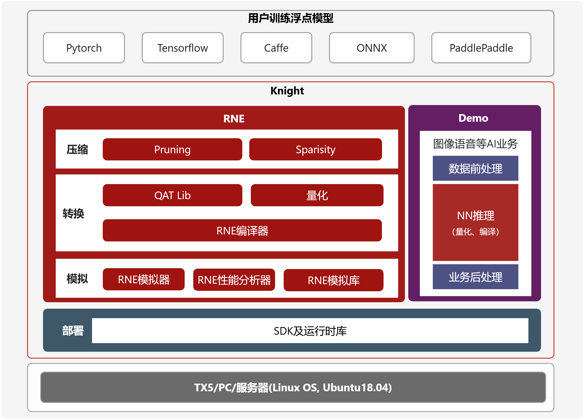

- Knight压缩工具(Knight-ModelCompression): 用于模型剪枝、稀疏、结构搜索、模型蒸馏等模型压缩。
- Knight量化工具(Knight-Quantize): 基于少量数据(比如图片、语音、文本等类型) 量化浮点模型。
- Knight RNE编译器(Knight-RNE-Compiler): 编译量化模型，产生RNE执行的指令配置文件。
- Knight RNE模拟器(Knight-RNE-Simulator) : 用于仿真神经网络在RNE上推理计算过程，输出计算层的结果。
- Knight RNE性能分析器(Knight-RNE-Profiling): 用于分析神经网络在芯片RNE上执行时间和存储开销，并给出分析报告。
- Knight Finetune库(Knight-Finetune-Lib) : 即QAT库，在使用量化工具后，精度损失较大的情况下，可使用Finetune库进行量化感知训练，得到更适合量化的浮点模型。
- Knight RNE模拟库(Knight-RNE-Simulator-Lib) : 供用户在PC端调用编写自己的应用程序，从而实现模拟运行结果。
- Knight RNE 运行时库(Knight-RNE-Runtime-Lib) : 供用户在PC端交叉编译时调用，从而实现板端运行。
- Knight Demo: 提供计算机视觉，智能语音等领域的端到端的运行示例，演示Knight工具链的使用流程和具体用法。

## 5. 工具提供的 AI 全栈应用开发流程

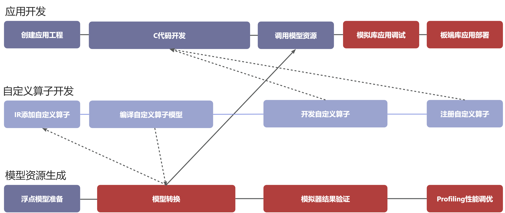

Knight工具链可支持 **端侧** 和 **云端**  AI推理全栈开发,包含以下三个主要流程:

#### 1. 应用开发

用户调用 **Knight RNE SDK API** 编写自己的业务应用，加载编译后的模型部署资源

**链接** 模拟库在纯软件环境中仿真调试自己的应用

**链接 **板端库在板端进行部署

#### 2. 模型部署资源生成

准备已训练好的浮点模型

使用 **Knight 量化工具** 量化成IR定点模型，然后对比量化精度

 **编译** 生成模型资源，用户可进行 **模拟器结果验证** 以及 **Profiling性能调优**

#### 3.自定义算子开发

模型中存在芯片不支持的算子时，

用户在量化后的IR模型中添加自定义算子层

之后进行IR模型编译，供应用开发时调用

用户在应用开发时进行自定义算子的C代码实现，通过 **SDK API相应接口** 进行自定义算子注册。

最后，与整个应用程序一起进行模拟库上调测，板端库上部署。

##  6. 模型资源生成开发流程

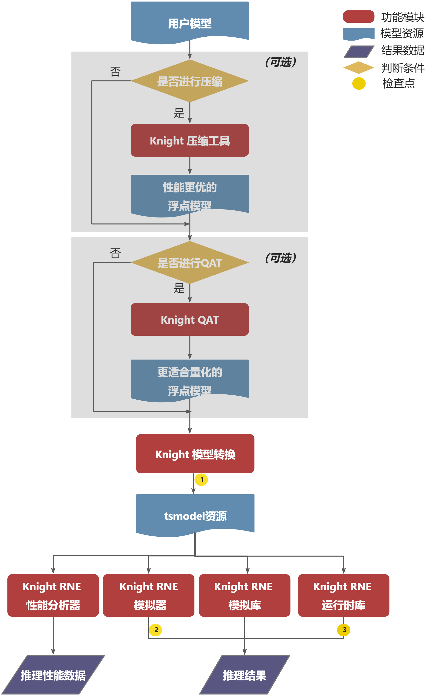

## 7. 部署安装

在 **docker** 环境完备的情况下,加载镜像

```bash
docker load -i ts.knight-<version>.tar.gz
```

查看已经加载的镜像

```bash
docker images
```

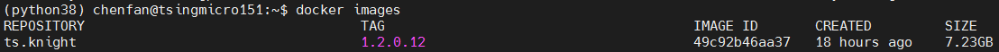

运行镜像

```
docker run --name=knight_docker -v localhost_dir:/data -it ts.knight: xxx /bin/bash
```

容器启动成功后，在容器内任意目录下均可使用Knight命令，Knight帮助信息页面示例如下所示。

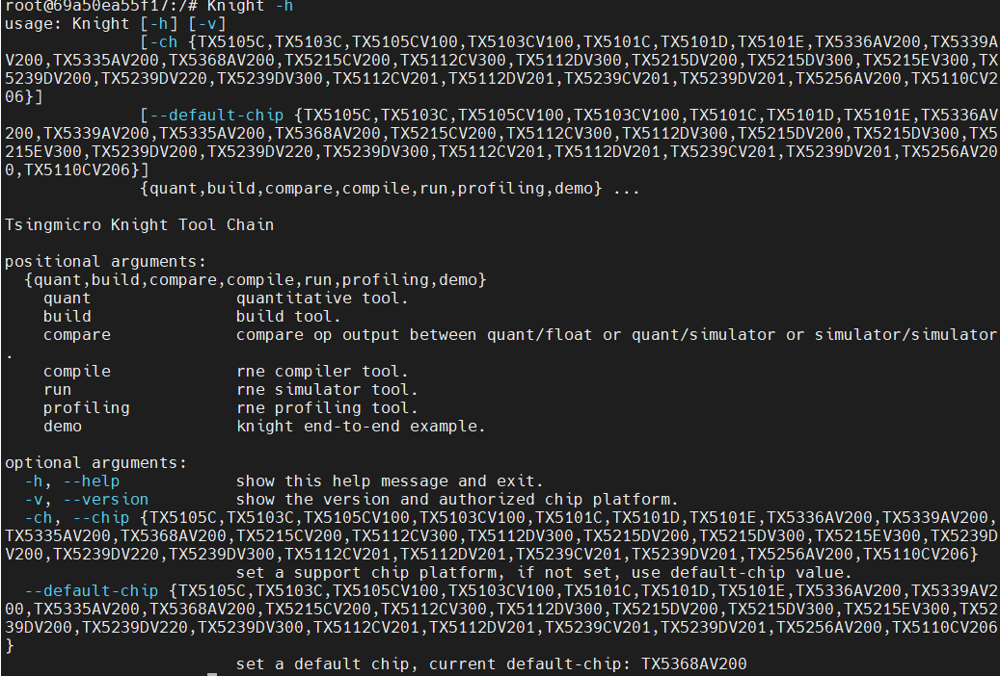

至于使用方法见 [**Knight 工具链**](https://knight-docs.readthedocs.io/zh-cn/latest/overview/overview.html#id8) 说明书

## 8. 工作流程图

工具使用流程流程

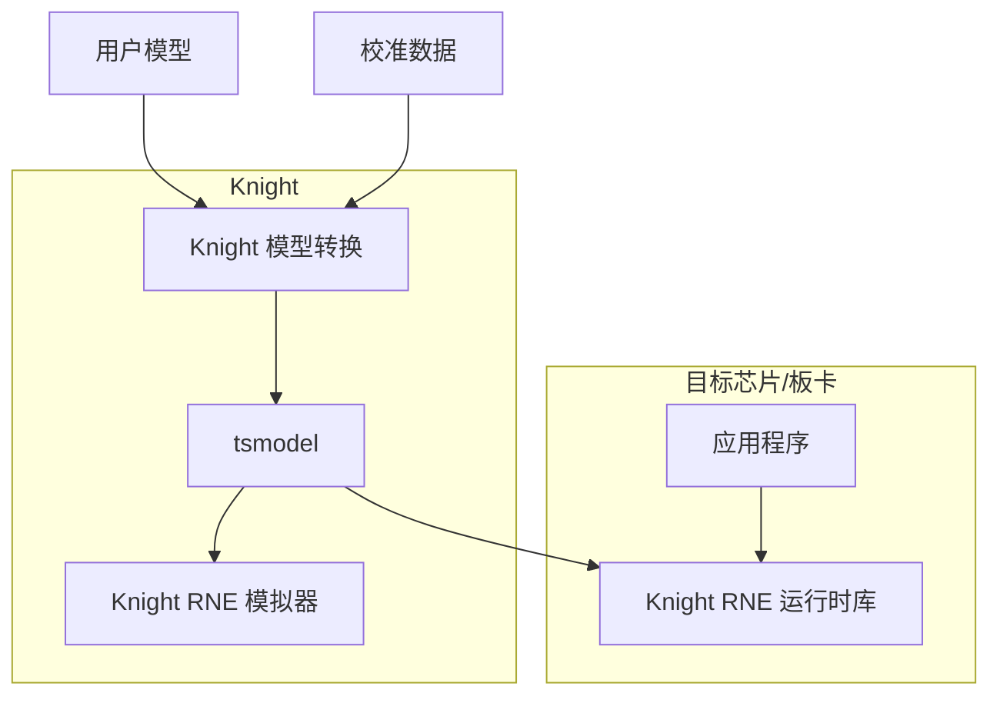

工作流程

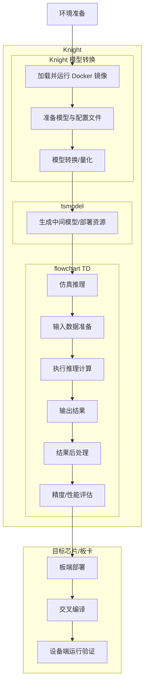

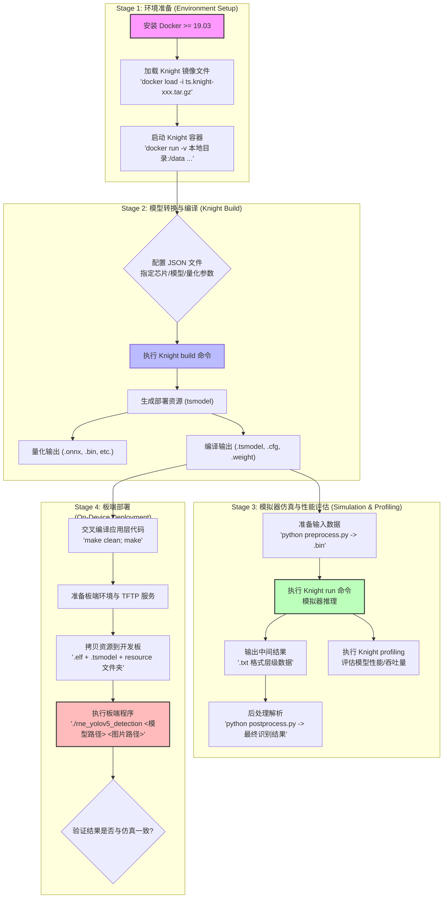