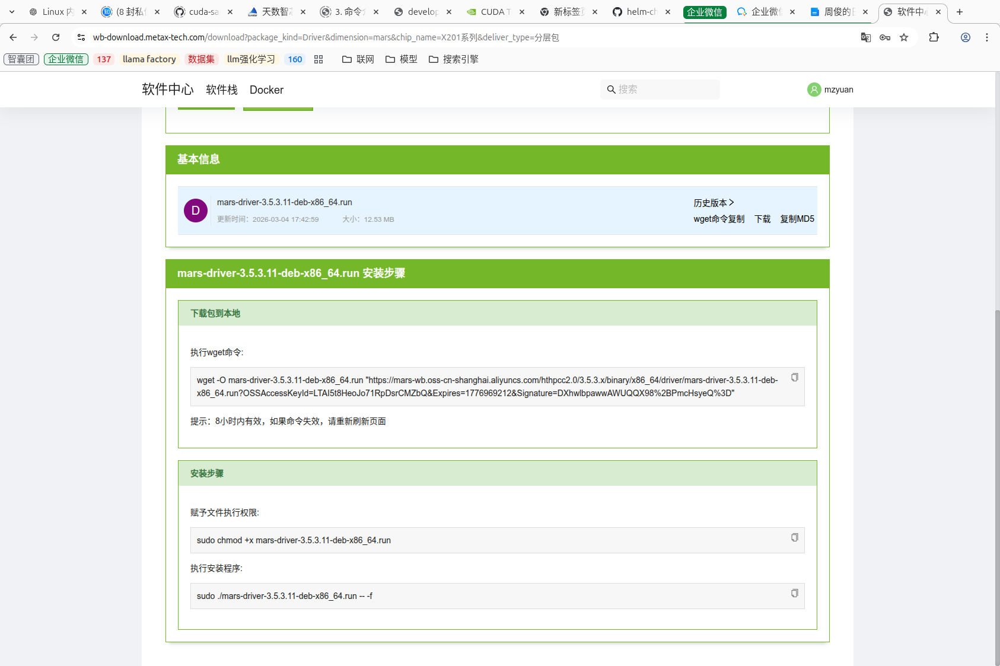
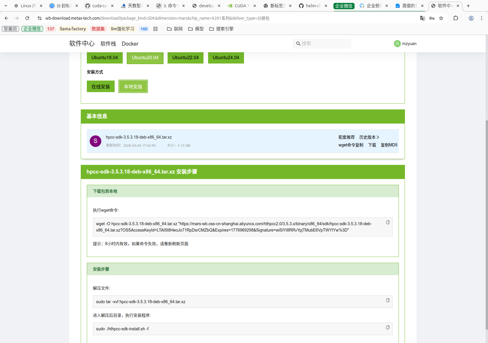

# 一. 环境信息
```bash
(base) sophgo@sophgo-SG6-06-A32:~$ cat /etc/os-release 
NAME="Ubuntu"
VERSION="20.04.6 LTS (Focal Fossa)"
ID=ubuntu
ID_LIKE=debian
PRETTY_NAME="Ubuntu 20.04.6 LTS"
VERSION_ID="20.04"
HOME_URL="https://www.ubuntu.com/"
SUPPORT_URL="https://help.ubuntu.com/"
BUG_REPORT_URL="https://bugs.launchpad.net/ubuntu/"
PRIVACY_POLICY_URL="https://www.ubuntu.com/legal/terms-and-policies/privacy-policy"
VERSION_CODENAME=focal
UBUNTU_CODENAME=focal
(base) sophgo@sophgo-SG6-06-A32:~/Documents$ uname -r # 查看内核版本
5.15.0-58-generic
```
**将要安装驱动:** hpcc-sdk-3.2.1.10-deb-x86_64.tar.xz
**将要安装的SDK:** mars-driver-3.2.1.12-deb-x86_64.run
**沐曦卡驱动安装地址:**  [http://wb-download.metax-tech.com/download]([https://wb-download.metax-tech.com/download?package_kind=SDK&dimension=mars&chip_name=X201%E7%B3%BB%E5%88%97&deliver_type=%E5%88%86%E5%B1%82%E5%8C%85](https://wb-download.metax-tech.com/download?package_kind=Driver&dimension=mars&chip_name=X201%E7%B3%BB%E5%88%97&deliver_type=%E5%88%86%E5%B1%82%E5%8C%85))

**沐曦卡开发安装地址:** [https://wb-download.metax-tech.com/download](https://wb-download.metax-tech.com/download?package_kind=SDK&dimension=mars&chip_name=X201%E7%B3%BB%E5%88%97&deliver_type=%E5%88%86%E5%B1%82%E5%8C%85)


# 二. 检查内核版本
### 1. 驱动安装依赖内核版本,检查内核版本
```bash
# 检查内核
$ uname -r
5.15.0-88-generic
```

### 2. 检查 GPU 设备
```bash
# 检查 GPU 设备是否在位
(base) sophgo@sophgo-SG6-06-A32:~/Documents$ lspci |grep 2020
98:00.0 Display controller: Device 2020:7801 (rev 01)
```

### 3. 安装驱动
```bash
# 进入 Driver 目录执行，如图所示代表安装成功
$ chmod +x mars-driver-3.2.1.12-deb-x86_64.run
$ ./mars-driver-3.2.1.12-deb-x86_64.run -- -f
```

### 4. 安装 SDK
```bash
# 进入 SDK 目录执行，先进行解压，再执行安装，如图所示代表安装完成
$ tar -xvf hpcc-sdk-3.2.1.10-deb-x86_64.tar.xz
$ cd hpcc-sdk-3.2.1.10
$ ./hthpcc-sdk-install.sh
```

### 5. 固件升级
```bash
# 执行下面命令进行固件升级
# X201 升级使用 x201
$ ht-smi -U /lib/firmware/mars/htx201/htvbios-1.29.1.0-1-X201.bin -t 600 -i all
# 升级完后重启
$ reboot
或进行 reset 操作
$ ht-smi -r -i all
```

### 6. 查看设备
```bash
# 重启后执行，看 bios 版本和固件版本是否一致，sdk 版本是否一致
(base) sophgo@sophgo-SG6-06-A32:~/Documents$ ht-smi 
ht-smi  version: 2.2.12
=================== Mars System Management Interface Log ===================
Timestamp                                         : Wed May 27 14:47:39 2026
Attached GPUs                                     : 1
+---------------------------------------------------------------------------------+
| HT-SMI 2.2.12                      Kernel Mode Driver Version: 3.6.11           |
| HPCC Version: unknown              BIOS Version: 1.31.1.0                       |
|------------------+-----------------+---------------------+----------------------|
| Board       Name | GPU   Persist-M | Bus-id              | GPU-Util      sGPU-M |
| Pwr:Usage/Cap    | Temp       Perf | Memory-Usage        | GPU-State            |
|==================+=================+=====================+======================|
| 0      Mars X201 | 0           Off | 0000:98:00.0        | 0%          Disabled |
| 30W / 350W       | 40C          P0 | 858/65536 MiB       | Available            |
+------------------+-----------------+---------------------+----------------------+
+---------------------------------------------------------------------------------+
| Process:                                                                        |
|  GPU                    PID         Process Name                 GPU Memory     |
|                                                                  Usage(MiB)     |
|=================================================================================|
|  no process found                                                               |
+---------------------------------------------------------------------------------+
End of Log
```

### 7. 卸载驱动和SDK
```bash
# 进入 opt 目录
$ cd 
# 卸载 sdk
$ sudo ./hpcc/bin/hthpcc-sdk-install.sh -U
# 卸载 driver
$ sudo chmod +x ./htdriver/htdriver-install.sh
$ sudo ./htdriver/htdriver-install.sh
$ sudo reboot
```