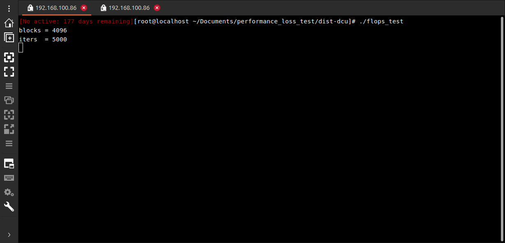
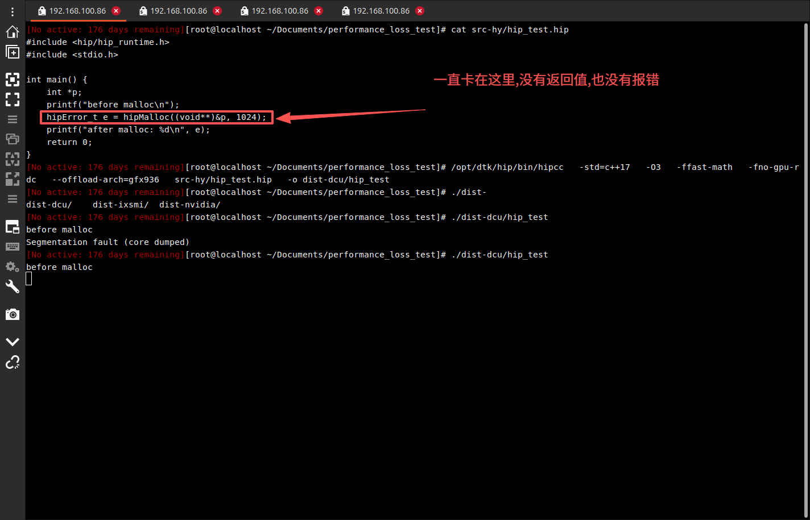

[[海光]]
海光开发者地址: https://developer.sourcefind.cn/tool
# 一. BW101 网上调研信息
网上没有找到 BW101 的信息, 最相近的是 BW100, 网上信息如下:

| 信息         | 参数                             |
| ---------- | ------------------------------ |
| 形态         | 刀片式（非PCIe）,宏剑说是 BW100 是 PCIE式的 |
| 工艺         | 7nm                            |
| 算力（峰值）FP8  | 1.88 PFLOPS                    |
| 算力（峰值）INT8 | 256 TOPS                       |
| 算力（峰值）FP32 | 400 TFLOPS                     |
| 显存         | 64GB HBM2e                     |
| 带宽         | 1.6 TB/s                       |
| 互联         | 400Gbps 自研ScaleFabric          |
| 功耗         | 350W                           |
| 生态         | 类CUDA，曙光UPTK，高度兼容CUDA          |
数据来源: https://caifuhao.eastmoney.com/news/1692163221
# 二. 海光 DCU / GPU 管理与性能工具

| 工具             | 类型   | 作用            | 类比                 |
| -------------- | ---- | ------------- | ------------------ |
| hy-smi         | 监控工具 | GPU状态查看       | nvidia-smi         |
| hy-smi-wrapper | 管理工具 | hy-smi封装      | 管理层工具              |
| hybandwidth    | 性能工具 | 内存带宽测试        | bandwidth test     |
| hycoredump     | 调试工具 | GPU崩溃dump分析   | core dump analyzer |
| hyckptd        | 守护进程 | checkpoint/恢复 | HPC训练用             |
| hymgr          | 管理工具 | DCU资源管理       | cluster manager    |
| hyfatbinary    | 构建工具 | fatbinary打包   | 多架构kernel          |
| hyptxas        | 汇编工具 | kernel汇编/优化   | 底层编译               |

# 三. 海光提供cpp开发工具链
| 工具                        | 类型       | 作用                  | 备注          |
| ------------------------- | -------- | ------------------- | ----------- |
| hipcc                     | 编译器      | HIP源码编译（类似 nvcc）    | 最核心编译工具     |
| hipconfig                 | 环境工具     | 查看HIP/设备/路径信息       | 用于排查环境      |
| **hipify-perl**           | **转换工具** | **CUDA → HIP（文本级）** | **简单但不够智能** |
| hipify-clang              | 转换工具     | CUDA → HIP（AST级）    | 当前缺失        |
| hipify                    | 工具入口     | hipify相关统一入口        | 可能是wrapper  |
| hipconvertinplace-perl.sh | 转换脚本     | 原地批量CUDA转HIP        | 直接改源码       |
| hipcc_cmake_linker_helper | 构建工具     | CMake链接辅助           | 工程构建        |
| hip_embed_pch.sh          | 编译优化     | 预编译头处理              | 加速编译        |
| hipgdb                    | 调试器      | HIP GPU调试           | 类 gdb       |
| hipvars.pm                | 环境模块     | Perl构建变量            | 构建系统依赖      |

# 四. 编译器 / 构建工具（系统级）
| 工具                 | 类型    | 作用               |
| ------------------ | ----- | ---------------- |
| hycc               | 编译器   | 海光C/C++编译器封装     |
| clang / amdclang++ | 编译器   | HIP后端编译（如存在）     |
| hipcc（本质调用）        | 编译器封装 | HIP → LLVM → DCU |
# 五. 实验环境信息(ARM)
### 1. Base Hardware Environment Information
```bash
[root@localhost ~/Documents/performance_loss_test/dist-dcu]# lscpu
Architecture:                    aarch64
CPU op-mode(s):                  64-bit
Byte Order:                      Little Endian
CPU(s):                          128
On-line CPU(s) list:             0-127
Thread(s) per core:              1
Core(s) per socket:              64
Socket(s):                       2
NUMA node(s):                    4
Vendor ID:                       HiSilicon
Model:                           0
Model name:                      HUAWEI Kunpeng 920 7260
Stepping:                        0x1
CPU max MHz:                     2600.0000
CPU min MHz:                     200.0000
BogoMIPS:                        200.00
L1d cache:                       8 MiB
L1i cache:                       8 MiB
L2 cache:                        64 MiB
L3 cache:                        128 MiB
NUMA node0 CPU(s):               0-31
NUMA node1 CPU(s):               32-63
NUMA node2 CPU(s):               64-95
NUMA node3 CPU(s):               96-127
Vulnerability Itlb multihit:     Not affected
Vulnerability L1tf:              Not affected
Vulnerability Mds:               Not affected
Vulnerability Meltdown:          Not affected
Vulnerability Mmio stale data:   Not affected
Vulnerability Spec store bypass: Mitigation; Speculative Store Bypass disabled via prctl
Vulnerability Spectre v1:        Mitigation; __user pointer sanitization
Vulnerability Spectre v2:        Not affected
Vulnerability Srbds:             Not affected
Vulnerability Tsx async abort:   Not affected
Flags:                           fp asimd evtstrm aes pmull sha1 sha2 crc32 atomics fphp asimdhp cpuid asimdrdm jscvt fcma dcpop asimddp asimdfhm ssbs
```
**可以看到 BW101基于的环境是:**
- 厂商：**Huawei**
- CPU：**Kunpeng 920**
- 架构：**ARMv8-A（aarch64，64位 ARM）**
- 主要用途：服务器 / 数据中心 / 国产化替代 x86
- 指令集：ARMv8.2-A

**与 x86 的区别（关键点）**

| 项目   | Kunpeng 920 (ARM) | Intel / AMD (x86) |
| ---- | ----------------- | ----------------- |
| 架构   | ARM64             | x86_64            |
| 指令集  | 精简 RISC           | 复杂 CISC           |
| 生态   | 国产/ARM服务器生态       | 通用服务器生态           |
| 软件兼容 | 需 ARM 编译版本        | 通常直接可用            |

### 2. Base Systemt info
```bash
[root@localhost ~/Documents/performance_loss_test/dist-dcu]# cat /etc/os-release 
NAME="Kylin Linux Advanced Server"
VERSION="V10 (GFB)"
ID="kylin"
VERSION_ID="V10"
PRETTY_NAME="Kylin Linux Advanced Server V10 (GFB)"
ANSI_COLOR="0;31"
```
**操作系统是：**
- 操作系统：**Kylin Linux Advanced Server**
- 版本：**V10（GFB 版本）**
- 类型：企业级服务器 Linux（**国产操作系统环境**）

### 3. System Management Interface Info
```bash
[root@localhost ~/Documents/performance_loss_test/dist-dcu]# hy-smi -a

================================= System Management Interface ==================================
================================================================================================
Driver Version: 6.3.29-V1.4.0
================================================================================================
================================================================================================
HCU[0]		: Device ID: 0x6370
HCU[1]		: Device ID: 0x6370
HCU[2]		: Device ID: 0x6370
HCU[3]		: Device ID: 0x6370
HCU[4]		: Device ID: 0x6370
HCU[5]		: Device ID: 0x6370
================================================================================================
================================================================================================
HCU[0]		: Temperature (Sensor edge) (C): 44.0
HCU[0]		: Temperature (Sensor junction) (C): 46.0
HCU[0]		: Temperature (Sensor mem) (C): 43.0
HCU[0]		: Temperature (Sensor core) (C): 42.0
...
================================================================================================
================================================================================================
HCU[0]		: fclk clock level: 0 (1390Mhz)
HCU[0]		: mclk clock level: 0 (1800Mhz)
HCU[0]		: sclk clock level: 4 (1150Mhz)
HCU[0]		: socclk clock level: 0 (1079Mhz)
HCU[0]		: pcie clock level: 1 (16.0GT/s, x16 800Mhz)
...
================================================================================================
================================================================================================
HCU[0]		: Performance Level: auto
HCU[1]		: Performance Level: auto
HCU[2]		: Performance Level: auto
HCU[3]		: Performance Level: auto
HCU[4]		: Performance Level: auto
HCU[5]		: Performance Level: auto
================================================================================================
================================================================================================
HCU[0]		: Max Graphics Package Power (W): 400.0
HCU[1]		: Max Graphics Package Power (W): 400.0
HCU[2]		: Max Graphics Package Power (W): 400.0
HCU[3]		: Max Graphics Package Power (W): 400.0
HCU[4]		: Max Graphics Package Power (W): 400.0
HCU[5]		: Max Graphics Package Power (W): 400.0
================================================================================================
================================================================================================
HCU[0]		: Average Graphics Package Power (W): 53.0
HCU[0]		: Average GFX Core Power (W): 6.0
HCU[0]		: Average Memory Power (W): 9.0
...
================================================================================================
================================================================================================
HCU[0]		: Supported fclk frequencies on HCU 0
HCU[0]		: 0: 1390Mhz *
HCU[0]		:  
HCU[0]		: Supported mclk frequencies on HCU 0
HCU[0]		: 0: 1800Mhz *
HCU[0]		:  
HCU[0]		: Supported sclk frequencies on HCU 0
HCU[0]		: 0: 300Mhz
HCU[0]		: 1: 600Mhz
HCU[0]		: 2: 800Mhz
HCU[0]		: 3: 1000Mhz
HCU[0]		: 4: 1150Mhz *
HCU[0]		: 5: 1220Mhz
HCU[0]		: 6: 1300Mhz
HCU[0]		: 7: 1350Mhz
HCU[0]		: *: 1600Mhz
HCU[0]		:  
HCU[0]		: Supported socclk frequencies on HCU 0
HCU[0]		: 0: 1079Mhz *
HCU[0]		:  
HCU[0]		: Supported pcie frequencies on HCU 0
HCU[0]		: 0: 2.5GT/s, x16 300Mhz
HCU[0]		: 1: 16.0GT/s, x16 800Mhz *
HCU[0]		: 2: 32.0GT/s, x16 1100Mhz
HCU[0]		:  
...
================================================================================================
================================================================================================
HCU[0]		: HCU use (%): 0.0
HCU[1]		: HCU use (%): 0.0
HCU[2]		: HCU use (%): 0.0
HCU[3]		: HCU use (%): 0.0
HCU[4]		: HCU use (%): 0.0
HCU[5]		: HCU use (%): 0.0
================================================================================================
================================================================================================
HCU[0]		: HCU memory use (%): 0
HCU[1]		: HCU memory use (%): 0
HCU[2]		: HCU memory use (%): 0
HCU[3]		: HCU memory use (%): 0
HCU[4]		: HCU memory use (%): 0
HCU[5]		: HCU memory use (%): 0
================================================================================================
================================================================================================
HCU[0]		: HCU Memory Vendor: samsung
HCU[1]		: HCU Memory Vendor: samsung
HCU[2]		: HCU Memory Vendor: samsung
HCU[3]		: HCU Memory Vendor: samsung
HCU[4]		: HCU Memory Vendor: samsung
HCU[5]		: HCU Memory Vendor: samsung
================================================================================================
================================================================================================
HCU[0]		: PCIe Replay Count: 0
HCU[1]		: PCIe Replay Count: 0
HCU[2]		: PCIe Replay Count: 0
HCU[3]		: PCIe Replay Count: 0
HCU[4]		: PCIe Replay Count: 0
HCU[5]		: PCIe Replay Count: 0
================================================================================================
================================================================================================
HCU[0]		: Serial Number: 2400464760000151
HCU[1]		: Serial Number: 2400464760000198
HCU[2]		: Serial Number: 2400464760000176
HCU[3]		: Serial Number: 2400464760000102
HCU[4]		: Serial Number: 2400464760000152
HCU[5]		: Serial Number: 2400464760000117
================================================================================================
================================================================================================
PIDs for KFD processes:

PID: 520394
	PASID: 32768
	HCU Node(Include CPU sort): ['4'] 
	HCU Index: ['0'] 
	GPUID: ['5824'] 
	PCI BUS: ['0000:0d:00.0'] 
	VRAM USED(MiB): 206
	VRAM USED(%): 0
	SDMA USED: 0

================================================================================================
================================================================================================
HCU[0]		: Voltage (mV): 743
HCU[1]		: Voltage (mV): 743
HCU[2]		: Voltage (mV): 743
HCU[3]		: Voltage (mV): 743
HCU[4]		: Voltage (mV): 743
HCU[5]		: Voltage (mV): 743
================================================================================================
================================================================================================
HCU[0]		: PCI Bus: 0000:0d:00.0 --> SN: 2400464760000151
HCU[1]		: PCI Bus: 0000:10:00.0 --> SN: 2400464760000198
HCU[2]		: PCI Bus: 0000:15:00.0 --> SN: 2400464760000176
HCU[3]		: PCI Bus: 0000:8e:00.0 --> SN: 2400464760000102
HCU[4]		: PCI Bus: 0000:93:00.0 --> SN: 2400464760000152
HCU[5]		: PCI Bus: 0000:96:00.0 --> SN: 2400464760000117
================================================================================================
================================================================================================
HCU[0]		: MEC	Firmware Version:	 49
HCU[0]		: MEC2	Firmware Version:	 49
HCU[0]		: RLC	Firmware Version:	 2
HCU[0]		: SDMA	Firmware Version:	 12
HCU[0]		: SDMA2	Firmware Version:	 12
HCU[0]		: SMC	Firmware Version:	 00.05.01.00
...
================================================================================================
================================================================================================
HCU[0]		: Card Series:		 BW101
HCU[0]		: Card Vendor:		 C-3000 IC Design Co., Ltd.
...
================================================================================================
================================================================================================
HCU[0]		: No Bad Page! 
HCU[1]		: No Bad Page! 
HCU[2]		: No Bad Page! 
HCU[3]		: No Bad Page! 
HCU[4]		: No Bad Page! 
HCU[5]		: No Bad Page! 
================================================================================================
Warning: [2026-05-21 15:48:49.485] One or more commands failed
======================================== End of SMI Log =============================================
[root@localhost ~/Documents/performance_loss_test/dist-dcu]# hy-smi --showmemavailable
================================= System Management Interface ==================================
================================================================================================
HCU[0]		: Available memory size (MiB): 64452
HCU[1]		: Available memory size (MiB): 64452
HCU[2]		: Available memory size (MiB): 64452
HCU[3]		: Available memory size (MiB): 64452
HCU[4]		: Available memory size (MiB): 64452
HCU[5]		: Available memory size (MiB): 64452
================================================================================================
======================================== End of SMI Log ========================================
```

| 信息                     | 参数              |
| ---------------------- | --------------- |
| 设备型号                   | BW101           |
| 卡数                     | 6               |
| 驱动版本信息                 | 6.3.29-V1.4.0   |
| 温度                     | 44              |
| CPU ↔ DCU / GPU 内部数据通路 | 1390 MHz        |
| 显存频率                   | 1800 MHz        |
| 核心计算单元频率               | 1150 MHz        |
| SoC 级别控制器时钟            | 1079 MHz        |
| PCIe 链路状态              | 32 GB/s 单向（理论值） |
| 功耗模式                   | auto            |
| 最大功耗上限(单卡)             | 400W            |
| 显存大小                   | 64G             |
`Dec%` 和 `Enc%` 是 **视频硬件解码器（Decoder）和编码器（Encoder）的利用率**，它们是 DCU 上独立的固定功能媒体处理单元，主要用于视频流的 H.264/H.265 等格式的硬件加速编解码。
# 六. 测试流程(ARM)测试失败
### 1. 使用海光提供cpp开发工具链 **hipify-perl** 将 .cu 源码转换成为 .hip源码
```bash
hipify-perl src/flops_test.cu > src-hy/flops_test.hip
hipify-perl src/test_fp32_fp64_multiple_times.cu > src-hy/flops_testtest_fp32_fp64_multiple_times.hip
hipify-perl src/test_fp32_fp64_single_time.cu > src-hy/test_fp32_fp64_single_time.hip
```

### 2. 编写 Makefile-hy-smi
```makefile
# === Configuration ===
HIP_PATH ?= /opt/dtk-26.04

CXX = $(HIP_PATH)/bin/hipcc

CXXFLAGS = -std=c++17 \
           -O3 \
           -ffast-math \
           -g

# ROCm/DCU 架构（按你的 gfx906 / gfx928 调整）
# GPU_ARCH ?= gfx906
GPU_ARCH ?= $(shell /opt/dtk/llvm/bin/amdgpu-arch | head -1)

CXXFLAGS += --offload-arch=$(GPU_ARCH)

LDFLAGS = -L$(HIP_PATH)/lib -Wl,-rpath,$(HIP_PATH)/lib

LIBS =

# === Sources ===
SRCDIR = src-hy
OUTDIR = dist-hy

# 自动发现所有 hip 文件
SRCS 		= $(wildcard $(SRCDIR)/*.hip)
TARGETS 	= $(patsubst $(SRCDIR)/%.hip, $(OUTDIR)/%, $(SRCS))

# === Rules ===
all: $(TARGETS)

$(OUTDIR):
	mkdir -p $@

$(OUTDIR)/%: $(SRCDIR)/%.hip | $(OUTDIR)
	$(CXX) $(CXXFLAGS) $< -o $@ $(LDFLAGS) $(LIBS)

run: all
	@for test in $(TARGETS); do
		echo "===== Running $$test ====="; \
		$$test;
	done

clean:
	rm -rf $(OUTDIR)

.PHONY: all run clean
```

### 3. 编译 .hip 源码
```bash
make -f Makefile-hy-smi
```

### 4. 执行 dist-dcu
```bash
./dist-dcu/test_precision2
```

### 5. 然后卡死


### 6. 然后编写了一个最简单的显存分配程序如下:


# 七. 实验环境信息(x86)
### 1. Base Hardware Environment Information
```bash
(base) sophgo@sophgo-SG6-06-A32:~/Documents/performance_loss_test/src-hy$ lscpu
Architecture:                    x86_64
CPU op-mode(s):                  32-bit, 64-bit
Byte Order:                      Little Endian
Address sizes:                   46 bits physical, 57 bits virtual
CPU(s):                          80
On-line CPU(s) list:             0-79
Thread(s) per core:              2
Core(s) per socket:              20
Socket(s):                       2
NUMA node(s):                    2
Vendor ID:                       GenuineIntel
CPU family:                      6
Model:                           106
Model name:                      Intel(R) Xeon(R) Silver 4316 CPU @ 2.30GHz
Stepping:                        6
CPU MHz:                         800.785
CPU max MHz:                     3400.0000
CPU min MHz:                     800.0000
BogoMIPS:                        4600.00
Virtualization:                  VT-x
L1d cache:                       1.9 MiB
L1i cache:                       1.3 MiB
L2 cache:                        50 MiB
L3 cache:                        60 MiB
NUMA node0 CPU(s):               0-19,40-59
NUMA node1 CPU(s):               20-39,60-79
Vulnerability Itlb multihit:     Not affected
Vulnerability L1tf:              Not affected
Vulnerability Mds:               Not affected
Vulnerability Meltdown:          Not affected
Vulnerability Spec store bypass: Mitigation; Speculative Store Bypass disabled via prctl and seccomp
Vulnerability Spectre v1:        Mitigation; usercopy/swapgs barriers and __user pointer sanitization
Vulnerability Spectre v2:        Mitigation; Enhanced IBRS, IBPB conditional, RSB filling
Vulnerability Srbds:             Not affected
Vulnerability Tsx async abort:   Not affected
Flags:                           fpu vme de pse tsc msr pae mce cx8 apic sep mtrr pge mca cmov pat pse36 clflush dts acpi mmx fxsr s
                                 se sse2 ss ht tm pbe syscall nx pdpe1gb rdtscp lm constant_tsc art arch_perfmon pebs bts rep_good n
                                 opl xtopology nonstop_tsc cpuid aperfmperf pni pclmulqdq dtes64 monitor ds_cpl vmx smx est tm2 ssse
                                 3 sdbg fma cx16 xtpr pdcm pcid dca sse4_1 sse4_2 x2apic movbe popcnt tsc_deadline_timer aes xsave a
                                 vx f16c rdrand lahf_lm abm 3dnowprefetch cpuid_fault epb cat_l3 invpcid_single ssbd mba ibrs ibpb s
                                 tibp ibrs_enhanced tpr_shadow vnmi flexpriority ept vpid ept_ad fsgsbase tsc_adjust bmi1 avx2 smep 
                                 bmi2 erms invpcid cqm rdt_a avx512f avx512dq rdseed adx smap avx512ifma clflushopt clwb intel_pt av
                                 x512cd sha_ni avx512bw avx512vl xsaveopt xsavec xgetbv1 xsaves cqm_llc cqm_occup_llc cqm_mbm_total 
                                 cqm_mbm_local wbnoinvd dtherm ida arat pln pts hwp hwp_act_window hwp_epp hwp_pkg_req avx512vbmi um
                                 ip pku ospke avx512_vbmi2 gfni vaes vpclmulqdq avx512_vnni avx512_bitalg tme avx512_vpopcntdq rdpid
                                  md_clear pconfig flush_l1d arch_capabilities
```
**可以看到 BW101基于的环境是:**

|特性|数据|
|---|---|
|CPU|2 × Intel Xeon Silver 4316（Ice Lake-SP）|
|基础频率|2.30 GHz|
|最大睿频|3.40 GHz|
|物理核心数|20 核/节点，共 40 物理核|
|逻辑 CPU 数|80（超线程开启）|
|L3 缓存|30 MB 每 die（总 60 MB，每 socket 30 MB）|
|NUMA 结构|2 个节点，node0: 0-19,40-59；node1: 20-39,60-79|
|内存通道|Ice Lake-SP 每 CPU 支持 8 通道 DDR4-2667（但取决于实际配置）|
|指令集亮点|AVX-512（F, CD, BW, DQ, VL, VBMI, VNNI 等）|

### 2. Base Systemt info
```bash
(base) sophgo@sophgo-SG6-06-A32:~/Documents/performance_loss_test$ cat /etc/os-release 
NAME="Ubuntu"
VERSION="20.04.6 LTS (Focal Fossa)"
ID=ubuntu
ID_LIKE=debian
PRETTY_NAME="Ubuntu 20.04.6 LTS"
VERSION_ID="20.04"
HOME_URL="https://www.ubuntu.com/"
SUPPORT_URL="https://help.ubuntu.com/"
BUG_REPORT_URL="https://bugs.launchpad.net/ubuntu/"
PRIVACY_POLICY_URL="https://www.ubuntu.com/legal/terms-and-policies/privacy-policy"
VERSION_CODENAME=focal
UBUNTU_CODENAME=focal
```
**操作系统是:**
- 操作系统: **Ubuntu**
- 版本: **20.04.6 LTS**
- 类型: 服务器

### 3. System Management Interface Info
```bash
(base) sophgo@sophgo-SG6-06-A32:~/Documents/performance_loss_test$ hy-smi -a

================================= System Management Interface ==================================
================================================================================================
Driver Version: 6.3.28-V1.3.0b
================================================================================================
================================================================================================
HCU[0]          : Device ID: 0x6370
================================================================================================
================================================================================================
HCU[0]          : VBIOS version: 6.312.002400Q.984889
================================================================================================
================================================================================================
HCU[0]          : Temperature (Sensor edge) (C): 46.0
HCU[0]          : Temperature (Sensor junction) (C): 49.0
HCU[0]          : Temperature (Sensor mem) (C): 47.0
HCU[0]          : Temperature (Sensor core) (C): 46.0
================================================================================================
================================================================================================
HCU[0]          : fclk clock level: 0 (1390Mhz)
HCU[0]          : mclk clock level: 0 (1800Mhz)
HCU[0]          : sclk clock level: 1 (600Mhz)
HCU[0]          : socclk clock level: 0 (1079Mhz)
HCU[0]          : pcie clock level: 1 (16.0GT/s, x16 800Mhz)
================================================================================================
================================================================================================
HCU[0]          : Performance Level: auto
================================================================================================
================================================================================================
HCU[0]          : Max Graphics Package Power (W): 400.0
================================================================================================
================================================================================================
HCU[0]          : Average Graphics Package Power (W): 51.0
HCU[0]          : Average GFX Core Power (W): 6.0
HCU[0]          : Average Memory Power (W): 8.0
================================================================================================
================================================================================================
HCU[0]          : Supported fclk frequencies on HCU 0
HCU[0]          : 0: 1390Mhz *
HCU[0]          :  
HCU[0]          : Supported mclk frequencies on HCU 0
HCU[0]          : 0: 1800Mhz *
HCU[0]          :  
HCU[0]          : Supported sclk frequencies on HCU 0
HCU[0]          : 0: 300Mhz
HCU[0]          : 1: 600Mhz *
HCU[0]          : 2: 800Mhz
HCU[0]          : 3: 1000Mhz
HCU[0]          : 4: 1150Mhz
HCU[0]          : 5: 1220Mhz
HCU[0]          : 6: 1300Mhz
HCU[0]          : 7: 1350Mhz
HCU[0]          : *: 1600Mhz
HCU[0]          :  
HCU[0]          : Supported socclk frequencies on HCU 0
HCU[0]          : 0: 1079Mhz *
HCU[0]          :  
HCU[0]          : Supported pcie frequencies on HCU 0
HCU[0]          : 0: 2.5GT/s, x16 300Mhz
HCU[0]          : 1: 16.0GT/s, x16 800Mhz *
HCU[0]          : 2: 32.0GT/s, x16 1100Mhz
HCU[0]          :  
================================================================================================
================================================================================================
HCU[0]          : HCU use (%): 0.0
================================================================================================
================================================================================================
HCU[0]          : HCU memory use (%): 0
================================================================================================
================================================================================================
HCU[0]          : HCU Memory Vendor: samsung
================================================================================================
================================================================================================
HCU[0]          : PCIe Replay Count: 0
================================================================================================
================================================================================================
HCU[0]          : Serial Number: 2400464760000151
================================================================================================
================================================================================================
No KFD PIDs currently running!
================================================================================================
================================================================================================
HCU[0]          : Voltage (mV): 743
================================================================================================
================================================================================================
HCU[0]          : PCI Bus: 0000:9a:00.0 --> OAM ID: 0
================================================================================================
================================================================================================
HCU[0]          : MEC   Firmware Version:        48
HCU[0]          : MEC2  Firmware Version:        48
HCU[0]          : RLC   Firmware Version:        2
HCU[0]          : SDMA  Firmware Version:        12
HCU[0]          : SDMA2 Firmware Version:        12
HCU[0]          : SMC   Firmware Version:        00.04.06.00
================================================================================================
================================================================================================
HCU[0]          : Card Series:           BW101
HCU[0]          : Card Vendor:           C-3000 IC Design Co., Ltd.
================================================================================================
================================================================================================
HCU[0]          : No Bad Page! 
================================================================================================
======================================== End of SMI Log ========================================
```

| 信息                     | 参数              |
| ---------------------- | --------------- |
| 设备型号                   | BW101           |
| 卡数                     | 6               |
| 驱动版本信息                 | 6.3.29-V1.4.0   |
| 温度                     | 44              |
| CPU ↔ DCU / GPU 内部数据通路 | 1390 MHz        |
| 显存频率                   | 1800 MHz        |
| 核心计算单元频率               | 1150 MHz        |
| SoC 级别控制器时钟            | 1079 MHz        |
| PCIe 链路状态              | 32 GB/s 单向（理论值） |
| 功耗模式                   | auto            |
| 最大功耗上限(单卡)             | 400W            |
| 显存大小                   | 64G             |
# 八. 测试流程(x86)
### 1.将之前的测试代码编译
```bash
(base) sophgo@sophgo-SG6-06-A32:~/Documents/performance_loss_test$ make -f Makefile-hy-smi
mkdir -p dist-hy
/opt/dtk/hip/bin/hipcc -std=c++17 -O3 -ffast-math -g --offload-arch=gfx936 src-hy/test_precision2.hip -o dist-hy/test_precision2 -L/opt/dtk/hip/lib -Wl,-rpath,/opt/dtk/hip/lib 
src-hy/test_precision2.hip:37:1: warning: void function is missing a return statement [-Wreturn-type]
}
^
src-hy/test_precision2.hip:55:1: warning: void function is missing a return statement [-Wreturn-type]
}
^
src-hy/test_precision2.hip:77:5: warning: ignoring return value of function declared with 'nodiscard' attribute [-Wunused-result]
    hipGetDeviceCount(&deviceCount);
    ^~~~~~~~~~~~~~~~~ ~~~~~~~~~~~~
3 warnings generated when compiling for gfx936.
src-hy/test_precision2.hip:37:1: warning: void function is missing a return statement [-Wreturn-type]
}
^
src-hy/test_precision2.hip:55:1: warning: void function is missing a return statement [-Wreturn-type]
}
^
src-hy/test_precision2.hip:77:5: warning: ignoring return value of function declared with 'nodiscard' attribute [-Wunused-result]
    hipGetDeviceCount(&deviceCount);
    ^~~~~~~~~~~~~~~~~ ~~~~~~~~~~~~
3 warnings generated when compiling for host.
/opt/dtk/hip/bin/hipcc -std=c++17 -O3 -ffast-math -g --offload-arch=gfx936 src-hy/test_fp32_fp64_single_time.hip -o dist-hy/test_fp32_fp64_single_time -L/opt/dtk/hip/lib -Wl,-rpath,/opt/dtk/hip/lib 
src-hy/test_fp32_fp64_single_time.hip:24:1: warning: void function is missing a return statement [-Wreturn-type]
}
^
src-hy/test_fp32_fp64_single_time.hip:41:1: warning: void function is missing a return statement [-Wreturn-type]
}
^
src-hy/test_fp32_fp64_single_time.hip:68:5: warning: ignoring return value of function declared with 'nodiscard' attribute [-Wunused-result]
    hipMalloc(&d_a_f, size_f);
    ^~~~~~~~~ ~~~~~~~~~~~~~~
src-hy/test_fp32_fp64_single_time.hip:69:5: warning: ignoring return value of function declared with 'nodiscard' attribute [-Wunused-result]
    hipMalloc(&d_b_f, size_f);
    ^~~~~~~~~ ~~~~~~~~~~~~~~
src-hy/test_fp32_fp64_single_time.hip:70:5: warning: ignoring return value of function declared with 'nodiscard' attribute [-Wunused-result]
    hipMalloc(&d_c_f, size_f);
    ^~~~~~~~~ ~~~~~~~~~~~~~~
src-hy/test_fp32_fp64_single_time.hip:72:5: warning: ignoring return value of function declared with 'nodiscard' attribute [-Wunused-result]
    hipMalloc(&d_a_d, size_d);
    ^~~~~~~~~ ~~~~~~~~~~~~~~
src-hy/test_fp32_fp64_single_time.hip:73:5: warning: ignoring return value of function declared with 'nodiscard' attribute [-Wunused-result]
    hipMalloc(&d_b_d, size_d);
    ^~~~~~~~~ ~~~~~~~~~~~~~~
src-hy/test_fp32_fp64_single_time.hip:74:5: warning: ignoring return value of function declared with 'nodiscard' attribute [-Wunused-result]
    hipMalloc(&d_c_d, size_d);
    ^~~~~~~~~ ~~~~~~~~~~~~~~
src-hy/test_fp32_fp64_single_time.hip:76:5: warning: ignoring return value of function declared with 'nodiscard' attribute [-Wunused-result]
    hipMemcpy(d_a_f, h_a_f, size_f, hipMemcpyHostToDevice);
    ^~~~~~~~~ ~~~~~~~~~~~~~~~~~~~~~~~~~~~~~~~~~~~~~~~~~~~
src-hy/test_fp32_fp64_single_time.hip:77:5: warning: ignoring return value of function declared with 'nodiscard' attribute [-Wunused-result]
    hipMemcpy(d_b_f, h_b_f, size_f, hipMemcpyHostToDevice);
    ^~~~~~~~~ ~~~~~~~~~~~~~~~~~~~~~~~~~~~~~~~~~~~~~~~~~~~
src-hy/test_fp32_fp64_single_time.hip:79:5: warning: ignoring return value of function declared with 'nodiscard' attribute [-Wunused-result]
    hipMemcpy(d_a_d, h_a_d, size_d, hipMemcpyHostToDevice);
    ^~~~~~~~~ ~~~~~~~~~~~~~~~~~~~~~~~~~~~~~~~~~~~~~~~~~~~
src-hy/test_fp32_fp64_single_time.hip:80:5: warning: ignoring return value of function declared with 'nodiscard' attribute [-Wunused-result]
    hipMemcpy(d_b_d, h_b_d, size_d, hipMemcpyHostToDevice);
    ^~~~~~~~~ ~~~~~~~~~~~~~~~~~~~~~~~~~~~~~~~~~~~~~~~~~~~
src-hy/test_fp32_fp64_single_time.hip:85:5: warning: ignoring return value of function declared with 'nodiscard' attribute [-Wunused-result]
    hipEventCreate(&start);
    ^~~~~~~~~~~~~~ ~~~~~~
src-hy/test_fp32_fp64_single_time.hip:86:5: warning: ignoring return value of function declared with 'nodiscard' attribute [-Wunused-result]
    hipEventCreate(&stop);
    ^~~~~~~~~~~~~~ ~~~~~
src-hy/test_fp32_fp64_single_time.hip:89:5: warning: ignoring return value of function declared with 'nodiscard' attribute [-Wunused-result]
    hipEventRecord(start);
    ^~~~~~~~~~~~~~
src-hy/test_fp32_fp64_single_time.hip:91:5: warning: ignoring return value of function declared with 'nodiscard' attribute [-Wunused-result]
    hipEventRecord(stop);
    ^~~~~~~~~~~~~~
src-hy/test_fp32_fp64_single_time.hip:92:5: warning: ignoring return value of function declared with 'nodiscard' attribute [-Wunused-result]
    hipEventSynchronize(stop);
    ^~~~~~~~~~~~~~~~~~~ ~~~~
src-hy/test_fp32_fp64_single_time.hip:95:5: warning: ignoring return value of function declared with 'nodiscard' attribute [-Wunused-result]
    hipEventElapsedTime(&time_fp32, start, stop);
    ^~~~~~~~~~~~~~~~~~~ ~~~~~~~~~~~~~~~~~~~~~~~
src-hy/test_fp32_fp64_single_time.hip:98:5: warning: ignoring return value of function declared with 'nodiscard' attribute [-Wunused-result]
    hipEventRecord(start);
    ^~~~~~~~~~~~~~
src-hy/test_fp32_fp64_single_time.hip:100:5: warning: ignoring return value of function declared with 'nodiscard' attribute [-Wunused-result]
    hipEventRecord(stop);
    ^~~~~~~~~~~~~~
src-hy/test_fp32_fp64_single_time.hip:101:5: warning: ignoring return value of function declared with 'nodiscard' attribute [-Wunused-result]
    hipEventSynchronize(stop);
    ^~~~~~~~~~~~~~~~~~~ ~~~~
src-hy/test_fp32_fp64_single_time.hip:104:5: warning: ignoring return value of function declared with 'nodiscard' attribute [-Wunused-result]
    hipEventElapsedTime(&time_fp64, start, stop);
    ^~~~~~~~~~~~~~~~~~~ ~~~~~~~~~~~~~~~~~~~~~~~
src-hy/test_fp32_fp64_single_time.hip:110:5: warning: ignoring return value of function declared with 'nodiscard' attribute [-Wunused-result]
    hipFree(d_a_f);
    ^~~~~~~ ~~~~~
src-hy/test_fp32_fp64_single_time.hip:111:5: warning: ignoring return value of function declared with 'nodiscard' attribute [-Wunused-result]
    hipFree(d_b_f);
    ^~~~~~~ ~~~~~
src-hy/test_fp32_fp64_single_time.hip:112:5: warning: ignoring return value of function declared with 'nodiscard' attribute [-Wunused-result]
    hipFree(d_c_f);
    ^~~~~~~ ~~~~~
src-hy/test_fp32_fp64_single_time.hip:113:5: warning: ignoring return value of function declared with 'nodiscard' attribute [-Wunused-result]
    hipFree(d_a_d);
    ^~~~~~~ ~~~~~
src-hy/test_fp32_fp64_single_time.hip:114:5: warning: ignoring return value of function declared with 'nodiscard' attribute [-Wunused-result]
    hipFree(d_b_d);
    ^~~~~~~ ~~~~~
src-hy/test_fp32_fp64_single_time.hip:115:5: warning: ignoring return value of function declared with 'nodiscard' attribute [-Wunused-result]
    hipFree(d_c_d);
    ^~~~~~~ ~~~~~
28 warnings generated when compiling for gfx936.
src-hy/test_fp32_fp64_single_time.hip:24:1: warning: void function is missing a return statement [-Wreturn-type]
}
^
src-hy/test_fp32_fp64_single_time.hip:41:1: warning: void function is missing a return statement [-Wreturn-type]
}
^
src-hy/test_fp32_fp64_single_time.hip:68:5: warning: ignoring return value of function declared with 'nodiscard' attribute [-Wunused-result]
    hipMalloc(&d_a_f, size_f);
    ^~~~~~~~~ ~~~~~~~~~~~~~~
src-hy/test_fp32_fp64_single_time.hip:69:5: warning: ignoring return value of function declared with 'nodiscard' attribute [-Wunused-result]
    hipMalloc(&d_b_f, size_f);
    ^~~~~~~~~ ~~~~~~~~~~~~~~
src-hy/test_fp32_fp64_single_time.hip:70:5: warning: ignoring return value of function declared with 'nodiscard' attribute [-Wunused-result]
    hipMalloc(&d_c_f, size_f);
    ^~~~~~~~~ ~~~~~~~~~~~~~~
src-hy/test_fp32_fp64_single_time.hip:72:5: warning: ignoring return value of function declared with 'nodiscard' attribute [-Wunused-result]
    hipMalloc(&d_a_d, size_d);
    ^~~~~~~~~ ~~~~~~~~~~~~~~
src-hy/test_fp32_fp64_single_time.hip:73:5: warning: ignoring return value of function declared with 'nodiscard' attribute [-Wunused-result]
    hipMalloc(&d_b_d, size_d);
    ^~~~~~~~~ ~~~~~~~~~~~~~~
src-hy/test_fp32_fp64_single_time.hip:74:5: warning: ignoring return value of function declared with 'nodiscard' attribute [-Wunused-result]
    hipMalloc(&d_c_d, size_d);
    ^~~~~~~~~ ~~~~~~~~~~~~~~
src-hy/test_fp32_fp64_single_time.hip:76:5: warning: ignoring return value of function declared with 'nodiscard' attribute [-Wunused-result]
    hipMemcpy(d_a_f, h_a_f, size_f, hipMemcpyHostToDevice);
    ^~~~~~~~~ ~~~~~~~~~~~~~~~~~~~~~~~~~~~~~~~~~~~~~~~~~~~
src-hy/test_fp32_fp64_single_time.hip:77:5: warning: ignoring return value of function declared with 'nodiscard' attribute [-Wunused-result]
    hipMemcpy(d_b_f, h_b_f, size_f, hipMemcpyHostToDevice);
    ^~~~~~~~~ ~~~~~~~~~~~~~~~~~~~~~~~~~~~~~~~~~~~~~~~~~~~
src-hy/test_fp32_fp64_single_time.hip:79:5: warning: ignoring return value of function declared with 'nodiscard' attribute [-Wunused-result]
    hipMemcpy(d_a_d, h_a_d, size_d, hipMemcpyHostToDevice);
    ^~~~~~~~~ ~~~~~~~~~~~~~~~~~~~~~~~~~~~~~~~~~~~~~~~~~~~
src-hy/test_fp32_fp64_single_time.hip:80:5: warning: ignoring return value of function declared with 'nodiscard' attribute [-Wunused-result]
    hipMemcpy(d_b_d, h_b_d, size_d, hipMemcpyHostToDevice);
    ^~~~~~~~~ ~~~~~~~~~~~~~~~~~~~~~~~~~~~~~~~~~~~~~~~~~~~
src-hy/test_fp32_fp64_single_time.hip:85:5: warning: ignoring return value of function declared with 'nodiscard' attribute [-Wunused-result]
    hipEventCreate(&start);
    ^~~~~~~~~~~~~~ ~~~~~~
src-hy/test_fp32_fp64_single_time.hip:86:5: warning: ignoring return value of function declared with 'nodiscard' attribute [-Wunused-result]
    hipEventCreate(&stop);
    ^~~~~~~~~~~~~~ ~~~~~
src-hy/test_fp32_fp64_single_time.hip:89:5: warning: ignoring return value of function declared with 'nodiscard' attribute [-Wunused-result]
    hipEventRecord(start);
    ^~~~~~~~~~~~~~
src-hy/test_fp32_fp64_single_time.hip:91:5: warning: ignoring return value of function declared with 'nodiscard' attribute [-Wunused-result]
    hipEventRecord(stop);
    ^~~~~~~~~~~~~~
src-hy/test_fp32_fp64_single_time.hip:92:5: warning: ignoring return value of function declared with 'nodiscard' attribute [-Wunused-result]
    hipEventSynchronize(stop);
    ^~~~~~~~~~~~~~~~~~~ ~~~~
src-hy/test_fp32_fp64_single_time.hip:95:5: warning: ignoring return value of function declared with 'nodiscard' attribute [-Wunused-result]
    hipEventElapsedTime(&time_fp32, start, stop);
    ^~~~~~~~~~~~~~~~~~~ ~~~~~~~~~~~~~~~~~~~~~~~
src-hy/test_fp32_fp64_single_time.hip:98:5: warning: ignoring return value of function declared with 'nodiscard' attribute [-Wunused-result]
    hipEventRecord(start);
    ^~~~~~~~~~~~~~
src-hy/test_fp32_fp64_single_time.hip:100:5: warning: ignoring return value of function declared with 'nodiscard' attribute [-Wunused-result]
    hipEventRecord(stop);
    ^~~~~~~~~~~~~~
src-hy/test_fp32_fp64_single_time.hip:101:5: warning: ignoring return value of function declared with 'nodiscard' attribute [-Wunused-result]
    hipEventSynchronize(stop);
    ^~~~~~~~~~~~~~~~~~~ ~~~~
src-hy/test_fp32_fp64_single_time.hip:104:5: warning: ignoring return value of function declared with 'nodiscard' attribute [-Wunused-result]
    hipEventElapsedTime(&time_fp64, start, stop);
    ^~~~~~~~~~~~~~~~~~~ ~~~~~~~~~~~~~~~~~~~~~~~
src-hy/test_fp32_fp64_single_time.hip:110:5: warning: ignoring return value of function declared with 'nodiscard' attribute [-Wunused-result]
    hipFree(d_a_f);
    ^~~~~~~ ~~~~~
src-hy/test_fp32_fp64_single_time.hip:111:5: warning: ignoring return value of function declared with 'nodiscard' attribute [-Wunused-result]
    hipFree(d_b_f);
    ^~~~~~~ ~~~~~
src-hy/test_fp32_fp64_single_time.hip:112:5: warning: ignoring return value of function declared with 'nodiscard' attribute [-Wunused-result]
    hipFree(d_c_f);
    ^~~~~~~ ~~~~~
src-hy/test_fp32_fp64_single_time.hip:113:5: warning: ignoring return value of function declared with 'nodiscard' attribute [-Wunused-result]
    hipFree(d_a_d);
    ^~~~~~~ ~~~~~
src-hy/test_fp32_fp64_single_time.hip:114:5: warning: ignoring return value of function declared with 'nodiscard' attribute [-Wunused-result]
    hipFree(d_b_d);
    ^~~~~~~ ~~~~~
src-hy/test_fp32_fp64_single_time.hip:115:5: warning: ignoring return value of function declared with 'nodiscard' attribute [-Wunused-result]
    hipFree(d_c_d);
    ^~~~~~~ ~~~~~
28 warnings generated when compiling for host.
/opt/dtk/hip/bin/hipcc -std=c++17 -O3 -ffast-math -g --offload-arch=gfx936 src-hy/test_fp32_fp64_multiple_times.hip -o dist-hy/test_fp32_fp64_multiple_times -L/opt/dtk/hip/lib -Wl,-rpath,/opt/dtk/hip/lib 
src-hy/test_fp32_fp64_multiple_times.hip:24:1: warning: void function is missing a return statement [-Wreturn-type]
}
^
src-hy/test_fp32_fp64_multiple_times.hip:42:1: warning: void function is missing a return statement [-Wreturn-type]
}
^
src-hy/test_fp32_fp64_multiple_times.hip:47:5: warning: ignoring return value of function declared with 'nodiscard' attribute [-Wunused-result]
    hipEventCreate(&start);
    ^~~~~~~~~~~~~~ ~~~~~~
src-hy/test_fp32_fp64_multiple_times.hip:48:5: warning: ignoring return value of function declared with 'nodiscard' attribute [-Wunused-result]
    hipEventCreate(&stop);
    ^~~~~~~~~~~~~~ ~~~~~
src-hy/test_fp32_fp64_multiple_times.hip:54:5: warning: ignoring return value of function declared with 'nodiscard' attribute [-Wunused-result]
    hipDeviceSynchronize();
    ^~~~~~~~~~~~~~~~~~~~
src-hy/test_fp32_fp64_multiple_times.hip:56:5: warning: ignoring return value of function declared with 'nodiscard' attribute [-Wunused-result]
    hipEventRecord(start);
    ^~~~~~~~~~~~~~
src-hy/test_fp32_fp64_multiple_times.hip:65:9: warning: ignoring return value of function declared with 'nodiscard' attribute [-Wunused-result]
        hipEventRecord(stop);
        ^~~~~~~~~~~~~~
src-hy/test_fp32_fp64_multiple_times.hip:66:9: warning: ignoring return value of function declared with 'nodiscard' attribute [-Wunused-result]
        hipEventSynchronize(stop);
        ^~~~~~~~~~~~~~~~~~~ ~~~~
src-hy/test_fp32_fp64_multiple_times.hip:67:9: warning: ignoring return value of function declared with 'nodiscard' attribute [-Wunused-result]
        hipEventElapsedTime(&elapsed, start, stop);
        ^~~~~~~~~~~~~~~~~~~ ~~~~~~~~~~~~~~~~~~~~~
src-hy/test_fp32_fp64_multiple_times.hip:70:5: warning: ignoring return value of function declared with 'nodiscard' attribute [-Wunused-result]
    hipDeviceSynchronize();
    ^~~~~~~~~~~~~~~~~~~~
src-hy/test_fp32_fp64_multiple_times.hip:74:5: warning: ignoring return value of function declared with 'nodiscard' attribute [-Wunused-result]
    hipEventDestroy(start);
    ^~~~~~~~~~~~~~~ ~~~~~
src-hy/test_fp32_fp64_multiple_times.hip:75:5: warning: ignoring return value of function declared with 'nodiscard' attribute [-Wunused-result]
    hipEventDestroy(stop);
    ^~~~~~~~~~~~~~~ ~~~~
src-hy/test_fp32_fp64_multiple_times.hip:82:5: warning: ignoring return value of function declared with 'nodiscard' attribute [-Wunused-result]
    hipEventCreate(&start);
    ^~~~~~~~~~~~~~ ~~~~~~
src-hy/test_fp32_fp64_multiple_times.hip:83:5: warning: ignoring return value of function declared with 'nodiscard' attribute [-Wunused-result]
    hipEventCreate(&stop);
    ^~~~~~~~~~~~~~ ~~~~~
src-hy/test_fp32_fp64_multiple_times.hip:89:5: warning: ignoring return value of function declared with 'nodiscard' attribute [-Wunused-result]
    hipDeviceSynchronize();
    ^~~~~~~~~~~~~~~~~~~~
src-hy/test_fp32_fp64_multiple_times.hip:91:5: warning: ignoring return value of function declared with 'nodiscard' attribute [-Wunused-result]
    hipEventRecord(start);
    ^~~~~~~~~~~~~~
src-hy/test_fp32_fp64_multiple_times.hip:100:9: warning: ignoring return value of function declared with 'nodiscard' attribute [-Wunused-result]
        hipEventRecord(stop);
        ^~~~~~~~~~~~~~
src-hy/test_fp32_fp64_multiple_times.hip:101:9: warning: ignoring return value of function declared with 'nodiscard' attribute [-Wunused-result]
        hipEventSynchronize(stop);
        ^~~~~~~~~~~~~~~~~~~ ~~~~
src-hy/test_fp32_fp64_multiple_times.hip:102:9: warning: ignoring return value of function declared with 'nodiscard' attribute [-Wunused-result]
        hipEventElapsedTime(&elapsed, start, stop);
        ^~~~~~~~~~~~~~~~~~~ ~~~~~~~~~~~~~~~~~~~~~
src-hy/test_fp32_fp64_multiple_times.hip:105:5: warning: ignoring return value of function declared with 'nodiscard' attribute [-Wunused-result]
    hipDeviceSynchronize();
    ^~~~~~~~~~~~~~~~~~~~
src-hy/test_fp32_fp64_multiple_times.hip:109:5: warning: ignoring return value of function declared with 'nodiscard' attribute [-Wunused-result]
    hipEventDestroy(start);
    ^~~~~~~~~~~~~~~ ~~~~~
src-hy/test_fp32_fp64_multiple_times.hip:110:5: warning: ignoring return value of function declared with 'nodiscard' attribute [-Wunused-result]
    hipEventDestroy(stop);
    ^~~~~~~~~~~~~~~ ~~~~
src-hy/test_fp32_fp64_multiple_times.hip:118:5: warning: ignoring return value of function declared with 'nodiscard' attribute [-Wunused-result]
    hipSetDevice(device);
    ^~~~~~~~~~~~ ~~~~~~
src-hy/test_fp32_fp64_multiple_times.hip:121:5: warning: ignoring return value of function declared with 'nodiscard' attribute [-Wunused-result]
    hipDeviceGetAttribute(&sm_count, hipDeviceAttributeMultiprocessorCount, device);
    ^~~~~~~~~~~~~~~~~~~~~ ~~~~~~~~~~~~~~~~~~~~~~~~~~~~~~~~~~~~~~~~~~~~~~~~~~~~~~~~
src-hy/test_fp32_fp64_multiple_times.hip:151:5: warning: ignoring return value of function declared with 'nodiscard' attribute [-Wunused-result]
    hipMalloc(&d_a_f, size_f);
    ^~~~~~~~~ ~~~~~~~~~~~~~~
src-hy/test_fp32_fp64_multiple_times.hip:152:5: warning: ignoring return value of function declared with 'nodiscard' attribute [-Wunused-result]
    hipMalloc(&d_b_f, size_f);
    ^~~~~~~~~ ~~~~~~~~~~~~~~
src-hy/test_fp32_fp64_multiple_times.hip:153:5: warning: ignoring return value of function declared with 'nodiscard' attribute [-Wunused-result]
    hipMalloc(&d_c_f, size_f);
    ^~~~~~~~~ ~~~~~~~~~~~~~~
src-hy/test_fp32_fp64_multiple_times.hip:155:5: warning: ignoring return value of function declared with 'nodiscard' attribute [-Wunused-result]
    hipMalloc(&d_a_d, size_d);
    ^~~~~~~~~ ~~~~~~~~~~~~~~
src-hy/test_fp32_fp64_multiple_times.hip:156:5: warning: ignoring return value of function declared with 'nodiscard' attribute [-Wunused-result]
    hipMalloc(&d_b_d, size_d);
    ^~~~~~~~~ ~~~~~~~~~~~~~~
src-hy/test_fp32_fp64_multiple_times.hip:157:5: warning: ignoring return value of function declared with 'nodiscard' attribute [-Wunused-result]
    hipMalloc(&d_c_d, size_d);
    ^~~~~~~~~ ~~~~~~~~~~~~~~
src-hy/test_fp32_fp64_multiple_times.hip:159:5: warning: ignoring return value of function declared with 'nodiscard' attribute [-Wunused-result]
    hipMemcpy(d_a_f, h_a_f, size_f, hipMemcpyHostToDevice);
    ^~~~~~~~~ ~~~~~~~~~~~~~~~~~~~~~~~~~~~~~~~~~~~~~~~~~~~
src-hy/test_fp32_fp64_multiple_times.hip:160:5: warning: ignoring return value of function declared with 'nodiscard' attribute [-Wunused-result]
    hipMemcpy(d_b_f, h_b_f, size_f, hipMemcpyHostToDevice);
    ^~~~~~~~~ ~~~~~~~~~~~~~~~~~~~~~~~~~~~~~~~~~~~~~~~~~~~
src-hy/test_fp32_fp64_multiple_times.hip:162:5: warning: ignoring return value of function declared with 'nodiscard' attribute [-Wunused-result]
    hipMemcpy(d_a_d, h_a_d, size_d, hipMemcpyHostToDevice);
    ^~~~~~~~~ ~~~~~~~~~~~~~~~~~~~~~~~~~~~~~~~~~~~~~~~~~~~
src-hy/test_fp32_fp64_multiple_times.hip:163:5: warning: ignoring return value of function declared with 'nodiscard' attribute [-Wunused-result]
    hipMemcpy(d_b_d, h_b_d, size_d, hipMemcpyHostToDevice);
    ^~~~~~~~~ ~~~~~~~~~~~~~~~~~~~~~~~~~~~~~~~~~~~~~~~~~~~
src-hy/test_fp32_fp64_multiple_times.hip:175:5: warning: ignoring return value of function declared with 'nodiscard' attribute [-Wunused-result]
    hipFree(d_a_f);
    ^~~~~~~ ~~~~~
src-hy/test_fp32_fp64_multiple_times.hip:176:5: warning: ignoring return value of function declared with 'nodiscard' attribute [-Wunused-result]
    hipFree(d_b_f);
    ^~~~~~~ ~~~~~
src-hy/test_fp32_fp64_multiple_times.hip:177:5: warning: ignoring return value of function declared with 'nodiscard' attribute [-Wunused-result]
    hipFree(d_c_f);
    ^~~~~~~ ~~~~~
src-hy/test_fp32_fp64_multiple_times.hip:179:5: warning: ignoring return value of function declared with 'nodiscard' attribute [-Wunused-result]
    hipFree(d_a_d);
    ^~~~~~~ ~~~~~
src-hy/test_fp32_fp64_multiple_times.hip:180:5: warning: ignoring return value of function declared with 'nodiscard' attribute [-Wunused-result]
    hipFree(d_b_d);
    ^~~~~~~ ~~~~~
src-hy/test_fp32_fp64_multiple_times.hip:181:5: warning: ignoring return value of function declared with 'nodiscard' attribute [-Wunused-result]
    hipFree(d_c_d);
    ^~~~~~~ ~~~~~
40 warnings generated when compiling for gfx936.
src-hy/test_fp32_fp64_multiple_times.hip:24:1: warning: void function is missing a return statement [-Wreturn-type]
}
^
src-hy/test_fp32_fp64_multiple_times.hip:42:1: warning: void function is missing a return statement [-Wreturn-type]
}
^
src-hy/test_fp32_fp64_multiple_times.hip:47:5: warning: ignoring return value of function declared with 'nodiscard' attribute [-Wunused-result]
    hipEventCreate(&start);
    ^~~~~~~~~~~~~~ ~~~~~~
src-hy/test_fp32_fp64_multiple_times.hip:48:5: warning: ignoring return value of function declared with 'nodiscard' attribute [-Wunused-result]
    hipEventCreate(&stop);
    ^~~~~~~~~~~~~~ ~~~~~
src-hy/test_fp32_fp64_multiple_times.hip:54:5: warning: ignoring return value of function declared with 'nodiscard' attribute [-Wunused-result]
    hipDeviceSynchronize();
    ^~~~~~~~~~~~~~~~~~~~
src-hy/test_fp32_fp64_multiple_times.hip:56:5: warning: ignoring return value of function declared with 'nodiscard' attribute [-Wunused-result]
    hipEventRecord(start);
    ^~~~~~~~~~~~~~
src-hy/test_fp32_fp64_multiple_times.hip:65:9: warning: ignoring return value of function declared with 'nodiscard' attribute [-Wunused-result]
        hipEventRecord(stop);
        ^~~~~~~~~~~~~~
src-hy/test_fp32_fp64_multiple_times.hip:66:9: warning: ignoring return value of function declared with 'nodiscard' attribute [-Wunused-result]
        hipEventSynchronize(stop);
        ^~~~~~~~~~~~~~~~~~~ ~~~~
src-hy/test_fp32_fp64_multiple_times.hip:67:9: warning: ignoring return value of function declared with 'nodiscard' attribute [-Wunused-result]
        hipEventElapsedTime(&elapsed, start, stop);
        ^~~~~~~~~~~~~~~~~~~ ~~~~~~~~~~~~~~~~~~~~~
src-hy/test_fp32_fp64_multiple_times.hip:70:5: warning: ignoring return value of function declared with 'nodiscard' attribute [-Wunused-result]
    hipDeviceSynchronize();
    ^~~~~~~~~~~~~~~~~~~~
src-hy/test_fp32_fp64_multiple_times.hip:74:5: warning: ignoring return value of function declared with 'nodiscard' attribute [-Wunused-result]
    hipEventDestroy(start);
    ^~~~~~~~~~~~~~~ ~~~~~
src-hy/test_fp32_fp64_multiple_times.hip:75:5: warning: ignoring return value of function declared with 'nodiscard' attribute [-Wunused-result]
    hipEventDestroy(stop);
    ^~~~~~~~~~~~~~~ ~~~~
src-hy/test_fp32_fp64_multiple_times.hip:82:5: warning: ignoring return value of function declared with 'nodiscard' attribute [-Wunused-result]
    hipEventCreate(&start);
    ^~~~~~~~~~~~~~ ~~~~~~
src-hy/test_fp32_fp64_multiple_times.hip:83:5: warning: ignoring return value of function declared with 'nodiscard' attribute [-Wunused-result]
    hipEventCreate(&stop);
    ^~~~~~~~~~~~~~ ~~~~~
src-hy/test_fp32_fp64_multiple_times.hip:89:5: warning: ignoring return value of function declared with 'nodiscard' attribute [-Wunused-result]
    hipDeviceSynchronize();
    ^~~~~~~~~~~~~~~~~~~~
src-hy/test_fp32_fp64_multiple_times.hip:91:5: warning: ignoring return value of function declared with 'nodiscard' attribute [-Wunused-result]
    hipEventRecord(start);
    ^~~~~~~~~~~~~~
src-hy/test_fp32_fp64_multiple_times.hip:100:9: warning: ignoring return value of function declared with 'nodiscard' attribute [-Wunused-result]
        hipEventRecord(stop);
        ^~~~~~~~~~~~~~
src-hy/test_fp32_fp64_multiple_times.hip:101:9: warning: ignoring return value of function declared with 'nodiscard' attribute [-Wunused-result]
        hipEventSynchronize(stop);
        ^~~~~~~~~~~~~~~~~~~ ~~~~
src-hy/test_fp32_fp64_multiple_times.hip:102:9: warning: ignoring return value of function declared with 'nodiscard' attribute [-Wunused-result]
        hipEventElapsedTime(&elapsed, start, stop);
        ^~~~~~~~~~~~~~~~~~~ ~~~~~~~~~~~~~~~~~~~~~
src-hy/test_fp32_fp64_multiple_times.hip:105:5: warning: ignoring return value of function declared with 'nodiscard' attribute [-Wunused-result]
    hipDeviceSynchronize();
    ^~~~~~~~~~~~~~~~~~~~
src-hy/test_fp32_fp64_multiple_times.hip:109:5: warning: ignoring return value of function declared with 'nodiscard' attribute [-Wunused-result]
    hipEventDestroy(start);
    ^~~~~~~~~~~~~~~ ~~~~~
src-hy/test_fp32_fp64_multiple_times.hip:110:5: warning: ignoring return value of function declared with 'nodiscard' attribute [-Wunused-result]
    hipEventDestroy(stop);
    ^~~~~~~~~~~~~~~ ~~~~
src-hy/test_fp32_fp64_multiple_times.hip:118:5: warning: ignoring return value of function declared with 'nodiscard' attribute [-Wunused-result]
    hipSetDevice(device);
    ^~~~~~~~~~~~ ~~~~~~
src-hy/test_fp32_fp64_multiple_times.hip:121:5: warning: ignoring return value of function declared with 'nodiscard' attribute [-Wunused-result]
    hipDeviceGetAttribute(&sm_count, hipDeviceAttributeMultiprocessorCount, device);
    ^~~~~~~~~~~~~~~~~~~~~ ~~~~~~~~~~~~~~~~~~~~~~~~~~~~~~~~~~~~~~~~~~~~~~~~~~~~~~~~
src-hy/test_fp32_fp64_multiple_times.hip:151:5: warning: ignoring return value of function declared with 'nodiscard' attribute [-Wunused-result]
    hipMalloc(&d_a_f, size_f);
    ^~~~~~~~~ ~~~~~~~~~~~~~~
src-hy/test_fp32_fp64_multiple_times.hip:152:5: warning: ignoring return value of function declared with 'nodiscard' attribute [-Wunused-result]
    hipMalloc(&d_b_f, size_f);
    ^~~~~~~~~ ~~~~~~~~~~~~~~
src-hy/test_fp32_fp64_multiple_times.hip:153:5: warning: ignoring return value of function declared with 'nodiscard' attribute [-Wunused-result]
    hipMalloc(&d_c_f, size_f);
    ^~~~~~~~~ ~~~~~~~~~~~~~~
src-hy/test_fp32_fp64_multiple_times.hip:155:5: warning: ignoring return value of function declared with 'nodiscard' attribute [-Wunused-result]
    hipMalloc(&d_a_d, size_d);
    ^~~~~~~~~ ~~~~~~~~~~~~~~
src-hy/test_fp32_fp64_multiple_times.hip:156:5: warning: ignoring return value of function declared with 'nodiscard' attribute [-Wunused-result]
    hipMalloc(&d_b_d, size_d);
    ^~~~~~~~~ ~~~~~~~~~~~~~~
src-hy/test_fp32_fp64_multiple_times.hip:157:5: warning: ignoring return value of function declared with 'nodiscard' attribute [-Wunused-result]
    hipMalloc(&d_c_d, size_d);
    ^~~~~~~~~ ~~~~~~~~~~~~~~
src-hy/test_fp32_fp64_multiple_times.hip:159:5: warning: ignoring return value of function declared with 'nodiscard' attribute [-Wunused-result]
    hipMemcpy(d_a_f, h_a_f, size_f, hipMemcpyHostToDevice);
    ^~~~~~~~~ ~~~~~~~~~~~~~~~~~~~~~~~~~~~~~~~~~~~~~~~~~~~
src-hy/test_fp32_fp64_multiple_times.hip:160:5: warning: ignoring return value of function declared with 'nodiscard' attribute [-Wunused-result]
    hipMemcpy(d_b_f, h_b_f, size_f, hipMemcpyHostToDevice);
    ^~~~~~~~~ ~~~~~~~~~~~~~~~~~~~~~~~~~~~~~~~~~~~~~~~~~~~
src-hy/test_fp32_fp64_multiple_times.hip:162:5: warning: ignoring return value of function declared with 'nodiscard' attribute [-Wunused-result]
    hipMemcpy(d_a_d, h_a_d, size_d, hipMemcpyHostToDevice);
    ^~~~~~~~~ ~~~~~~~~~~~~~~~~~~~~~~~~~~~~~~~~~~~~~~~~~~~
src-hy/test_fp32_fp64_multiple_times.hip:163:5: warning: ignoring return value of function declared with 'nodiscard' attribute [-Wunused-result]
    hipMemcpy(d_b_d, h_b_d, size_d, hipMemcpyHostToDevice);
    ^~~~~~~~~ ~~~~~~~~~~~~~~~~~~~~~~~~~~~~~~~~~~~~~~~~~~~
src-hy/test_fp32_fp64_multiple_times.hip:175:5: warning: ignoring return value of function declared with 'nodiscard' attribute [-Wunused-result]
    hipFree(d_a_f);
    ^~~~~~~ ~~~~~
src-hy/test_fp32_fp64_multiple_times.hip:176:5: warning: ignoring return value of function declared with 'nodiscard' attribute [-Wunused-result]
    hipFree(d_b_f);
    ^~~~~~~ ~~~~~
src-hy/test_fp32_fp64_multiple_times.hip:177:5: warning: ignoring return value of function declared with 'nodiscard' attribute [-Wunused-result]
    hipFree(d_c_f);
    ^~~~~~~ ~~~~~
src-hy/test_fp32_fp64_multiple_times.hip:179:5: warning: ignoring return value of function declared with 'nodiscard' attribute [-Wunused-result]
    hipFree(d_a_d);
    ^~~~~~~ ~~~~~
src-hy/test_fp32_fp64_multiple_times.hip:180:5: warning: ignoring return value of function declared with 'nodiscard' attribute [-Wunused-result]
    hipFree(d_b_d);
    ^~~~~~~ ~~~~~
src-hy/test_fp32_fp64_multiple_times.hip:181:5: warning: ignoring return value of function declared with 'nodiscard' attribute [-Wunused-result]
    hipFree(d_c_d);
    ^~~~~~~ ~~~~~
40 warnings generated when compiling for host.
/opt/dtk/hip/bin/hipcc -std=c++17 -O3 -ffast-math -g --offload-arch=gfx936 src-hy/flops_test.hip -o dist-hy/flops_test -L/opt/dtk/hip/lib -Wl,-rpath,/opt/dtk/hip/lib 
/opt/dtk/hip/bin/hipcc -std=c++17 -O3 -ffast-math -g --offload-arch=gfx936 src-hy/test_precision.hip -o dist-hy/test_precision -L/opt/dtk/hip/lib -Wl,-rpath,/opt/dtk/hip/lib 
src-hy/test_precision.hip:22:1: warning: void function is missing a return statement [-Wreturn-type]
}
^
src-hy/test_precision.hip:27:1: warning: void function is missing a return statement [-Wreturn-type]
}
^
src-hy/test_precision.hip:34:5: warning: ignoring return value of function declared with 'nodiscard' attribute [-Wunused-result]
    hipGetDeviceCount(&deviceCount);
    ^~~~~~~~~~~~~~~~~ ~~~~~~~~~~~~
src-hy/test_precision.hip:84:5: warning: ignoring return value of function declared with 'nodiscard' attribute [-Wunused-result]
    hipFree(d_input64);
    ^~~~~~~ ~~~~~~~~~
src-hy/test_precision.hip:85:5: warning: ignoring return value of function declared with 'nodiscard' attribute [-Wunused-result]
    hipFree(d_output64);
    ^~~~~~~ ~~~~~~~~~~
src-hy/test_precision.hip:86:5: warning: ignoring return value of function declared with 'nodiscard' attribute [-Wunused-result]
    hipFree(d_input32);
    ^~~~~~~ ~~~~~~~~~
src-hy/test_precision.hip:87:5: warning: ignoring return value of function declared with 'nodiscard' attribute [-Wunused-result]
    hipFree(d_output32);
    ^~~~~~~ ~~~~~~~~~~
7 warnings generated when compiling for gfx936.
src-hy/test_precision.hip:22:1: warning: void function is missing a return statement [-Wreturn-type]
}
^
src-hy/test_precision.hip:27:1: warning: void function is missing a return statement [-Wreturn-type]
}
^
src-hy/test_precision.hip:34:5: warning: ignoring return value of function declared with 'nodiscard' attribute [-Wunused-result]
    hipGetDeviceCount(&deviceCount);
    ^~~~~~~~~~~~~~~~~ ~~~~~~~~~~~~
src-hy/test_precision.hip:84:5: warning: ignoring return value of function declared with 'nodiscard' attribute [-Wunused-result]
    hipFree(d_input64);
    ^~~~~~~ ~~~~~~~~~
src-hy/test_precision.hip:85:5: warning: ignoring return value of function declared with 'nodiscard' attribute [-Wunused-result]
    hipFree(d_output64);
    ^~~~~~~ ~~~~~~~~~~
src-hy/test_precision.hip:86:5: warning: ignoring return value of function declared with 'nodiscard' attribute [-Wunused-result]
    hipFree(d_input32);
    ^~~~~~~ ~~~~~~~~~
src-hy/test_precision.hip:87:5: warning: ignoring return value of function declared with 'nodiscard' attribute [-Wunused-result]
    hipFree(d_output32);
    ^~~~~~~ ~~~~~~~~~~
7 warnings generated when compiling for host.
```

### 2. 运行测试代码
```bash
(base) sophgo@sophgo-SG6-06-A32:~/Documents/performance_loss_test$ ./dist-hy/test_precision2
....
Iter 997 | x=0.95654236460425345889
  CPU fp64: 408.48670131560811569216
  GPU fp64: 408.48670131560760410139  diff=0.00000000000051159077
  GPU fp32: 408.48675537109375000000  diff=0.00005405548563430784
Iter 998 | x=1.41747982198239474982
  CPU fp64: 558.73265916137495423754
  GPU fp64: 558.73265916137484055071  diff=0.00000000000011368684
  GPU fp32: 558.73260498046875000000  diff=0.00005418090620423754
Iter 999 | x=4.25239812893576552000
  CPU fp64: 1519.56635464710552696488
  GPU fp64: 1519.56635464710552696488  diff=0.00000000000000000000
  GPU fp32: 1519.56628417968750000000  diff=0.00007046741802696488

===== Summary precision =====
fp64 max diff: 0.00000000000454747351  avg diff: 0.00000000000032122216
fp32 max diff: 0.00068613997200372978  avg diff: 0.00007430767745154299

===== Final performance summary =====
GPU fp64 avg per launch: 0.07234820723533630371 ms
GPU fp32 avg per launch: 0.04852161556482315063 ms
fp64 / fp32 time ratio: 1.49105107784271240234x
```
完成测试