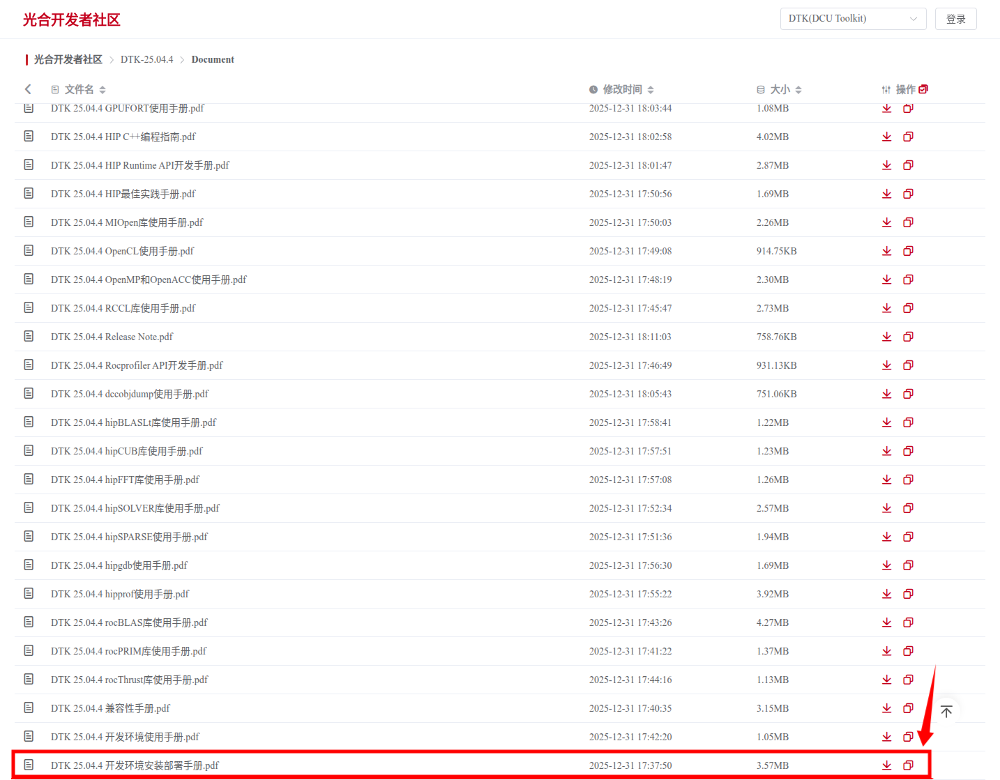
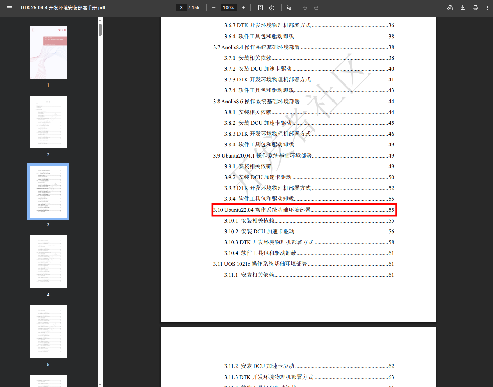
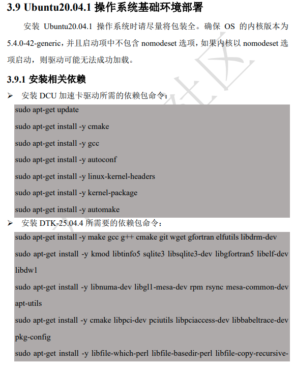
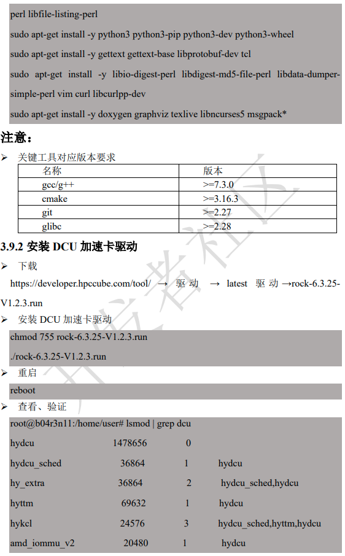
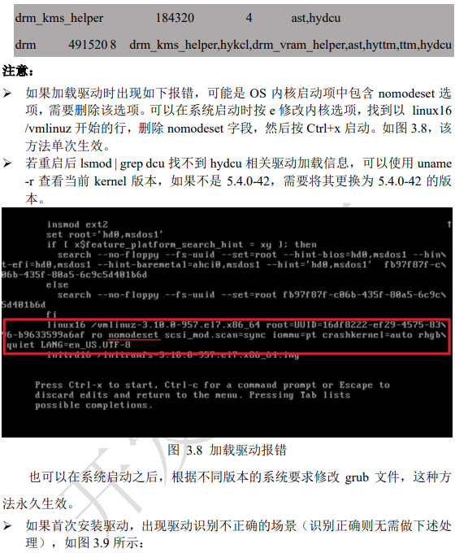
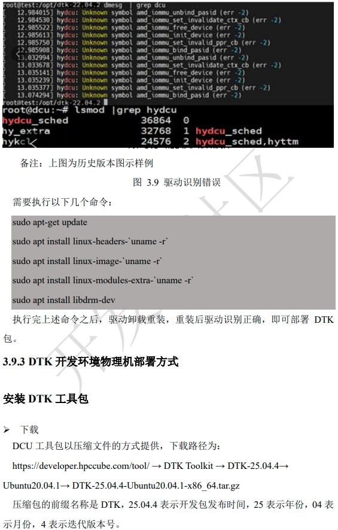
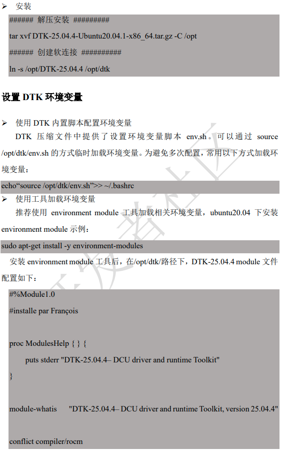
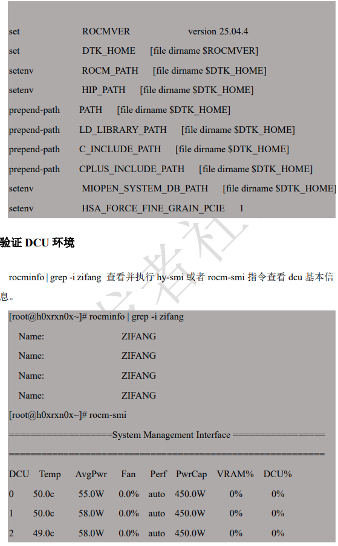
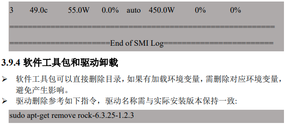

[[海光]]
# 要注意的事情
在安装驱动部署使用之前,请注意:
***BIOS 要开启 IOMMUI***
***BIOS 要开启 IOMMUI***
***BIOS 要开启 IOMMUI***
**重要的事情说三遍**, 否则就会出现 BW101 无法分配显存的问题

# 1. 下载开发环境安装部署手册
```bash
# 下载地址
https://download.sourcefind.cn:65024/1/main/DTK-25.04.4/Document
```


# 2. 查看ubuntu20.04部署方案



# 3. ubuntu20.04部署方案内容








# 4. 下载驱动地址
```bash
# 下载地址
https://download.sourcefind.cn:65024/6/main/latest%E9%A9%B1%E5%8A%A8/dtk-25.04.4
```

