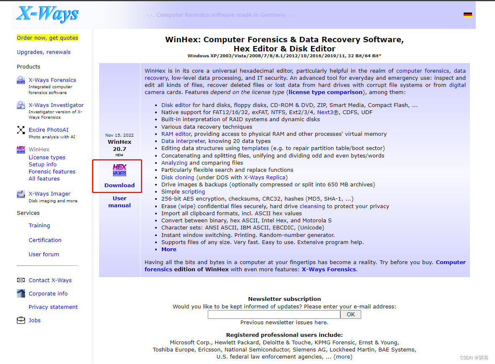
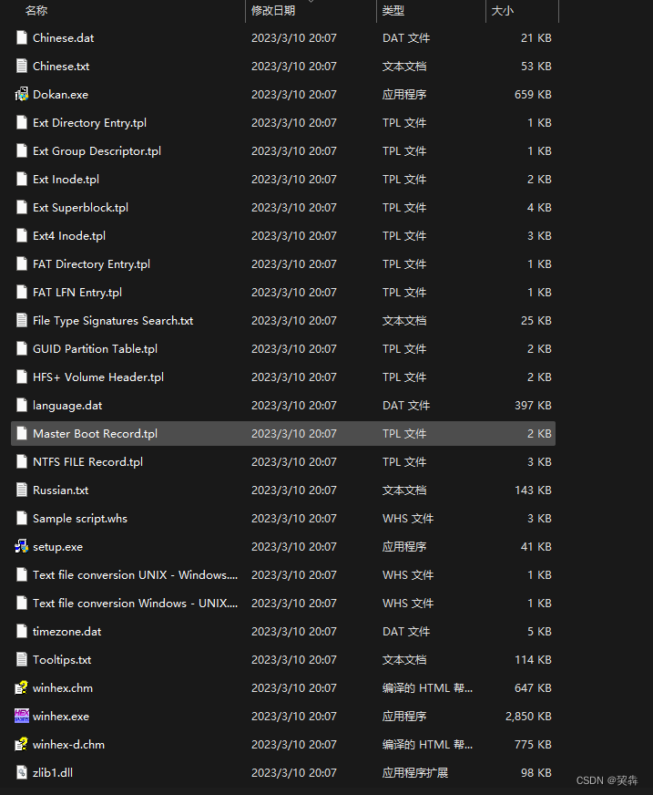
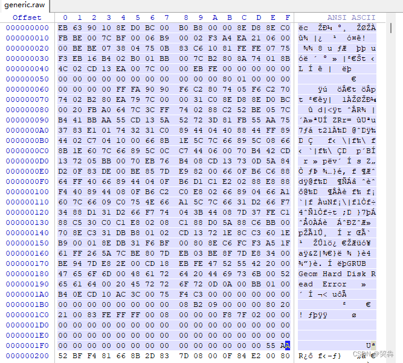
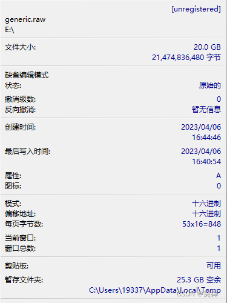
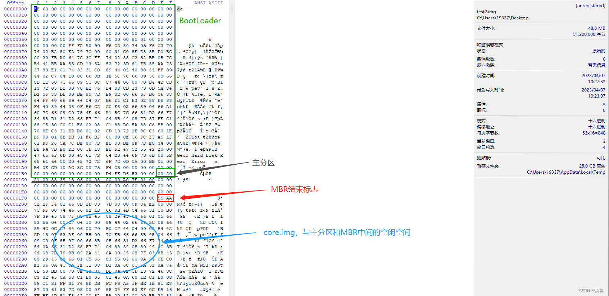

[[windows]]

# WinHex：十六进制编辑器与磁盘工具

## 简介

WinHex 是一款以通用十六进制编辑器为核心的专业工具，广泛应用于以下领域：

- **计算机取证**：磁盘镜像分析、文件恢复、隐藏数据查找
- **数据恢复**：恢复删除文件、修复损坏硬盘/存储卡
- **低级数据处理**：直接编辑磁盘扇区、RAM、文件原始字节
- **IT 安全分析**：漏洞分析、文件结构逆向、加密数据检测

**主要功能**：
- 查看/编辑磁盘、分区、RAM、文件（支持超过 4GB 的大文件）
- 支持 FAT12/16/32、exFAT、NTFS、Ext2/3/4、CDFS 等多种文件系统
- 驱动器克隆与镜像解释
- 智能搜索替换、数据格式转换（二进制/十六进制/ASCII）
- Hash 计算（CRC32、MD5、SHA-1）、数据加密/解密
- 文件粉碎（不可恢复）
- 连接/分割/合并/分析/比较文件

## 安装

### 1. 下载
- 官网：[WinHex: Hex Editor & Disk Editor](https://www.x-ways.net/winhex/)
- 下载完成后得到 `winhex.zip`



### 2. 安装
解压 zip 文件，以管理员身份直接运行 `winhex.exe` 即可（绿色软件，免安装）。




## 常见用途

### 查看磁盘文件
WinHex 可以直接打开 raw 格式的磁盘镜像文件（如 `generic.raw`），查看其十六进制内容及分区结构。

> **提示**：VMware/VirtualBox/KVM 创建的 vmdk、qcow2 等格式需先转换为 raw 格式，再用 WinHex 查看。





### 手动创建磁盘文件并编辑
结合 `dd`、`fdisk`、`grub2-install` 等 Linux 工具，可以手动构建磁盘镜像并通过 WinHex 查看其结构。

```sh
# 1. 创建空磁盘文件
dd if=/dev/zero of=/tmp/test.img bs=512 count=100000

# 2. 创建分区
fdisk test.img

# 3. 安装引导程序
grub2-install test.img

# 4. 用 WinHex 打开 test.img 查看 MBR、分区表、引导代码等
```



## 关联笔记

- **[[实现多用户同时远程,修改文件termsrv.dll]]** — 使用 WinHex 修改 `termsrv.dll` 的十六进制内容，解除 Windows 远程桌面会话数限制
- **[[操作系统和系统内核的关系]]** — 操作系统底层结构知识，与 WinHex 的磁盘/内核分析场景相关
- **[[nfs挂载,映射linux权限]]** — Windows 与 Linux 存储互通场景
- **Docker 存储驱动**（DevOps 笔记）— 文件系统底层原理，磁盘管理与 WinHex 的磁盘编辑能力可形成互补知识体系
